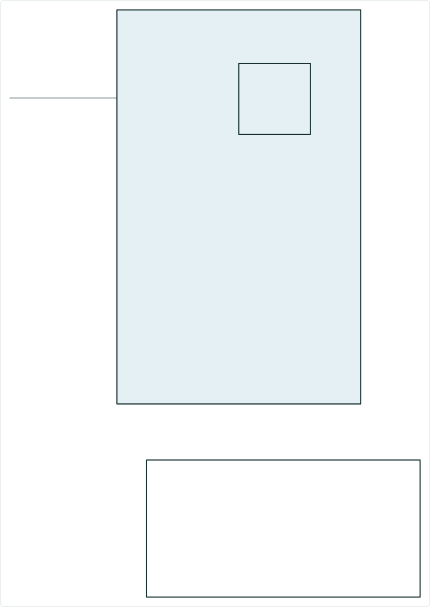
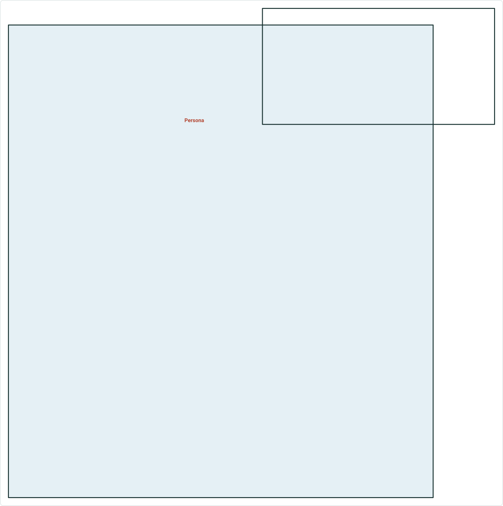
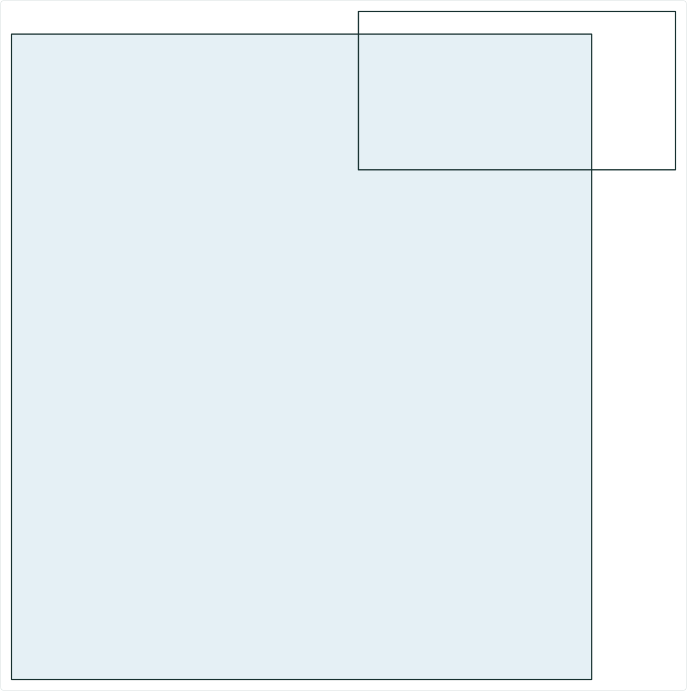
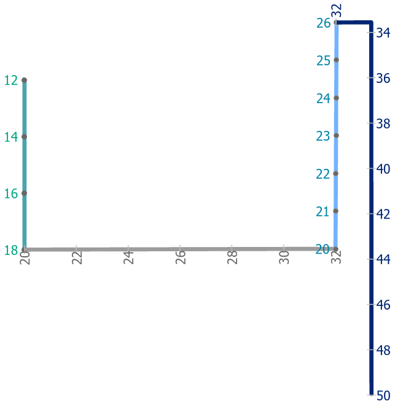
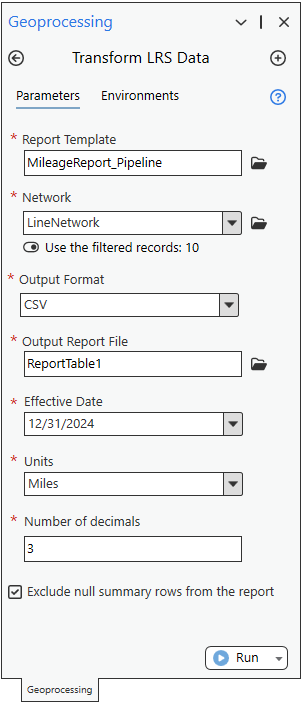

# Reporting Location Referencing Mileage for Line Network

|   |   |
| --- | --- |
| **Kind** | User Story · Pro |
| **Release** | — |
| **Product** | Pipeline Referencing · Utility Network |
| **Source** | [Reporting_GP_NoSummaryLineSupport.pptx](<https://esriis.sharepoint.com/sites/LocationReferencing/Shared%20Documents/General/Reporting_GP_NoSummaryLineSupport.pptx>) |
| **Edited** | 2024-05-22 15:39 by Rahul Rakshit |
| **Extracted** | 2026-09-04 · lane `xmlstrip` |

<!-- metadata
```yaml
title: "Reporting Location Referencing Mileage for Line Network"
source_file: "Reporting_GP_NoSummaryLineSupport.pptx"
source_url: "https://esriis.sharepoint.com/sites/LocationReferencing/Shared%20Documents/General/Reporting_GP_NoSummaryLineSupport.pptx"
doc_id: 368
doc_kind: "User Story"
surface: "Pro"
doc_revision: ""
target_release: ""
pe: ""
dev: ""
author: "Rahul Rakshit"
last_edited_by: "Rahul Rakshit"
last_edited: "2024-05-22T15:39:54Z"
extracted: 2026-09-04
extraction_lane: xmlstrip
prompt_version: "v2.0.2"
keywords: ["line network", "mileage report", "route mileage", "line mileage", "transform lrs data", "geoprocessing tool"]
tools: ["Transform LRS Data"]
products: ["Pipeline Referencing", "Utility Network"]
issues: []
related: [{"doc":338,"file":"generate-lrs-data-product-create-mileage-report-for-line-networks__doc338.md","s":4.135},{"doc":374,"file":"lr-reporting-create-a-template-tool-user-story__doc374.md","s":3.398},{"doc":162,"file":"date-comparison-data-product-user-story-and-design__doc162.md","s":3.117},{"doc":372,"file":"transform-lrs-data-gp-tool-test-plan__doc372.md","s":2.782},{"doc":267,"file":"generate-intersections-at-route-endpoints__doc267.md","s":2.63}]
```
-->

## Summary

User story to enable the Transform LRS Data geoprocessing tool to calculate mileage for Line Networks. The tool will output mileage tables showing line and route mileage based on user inputs including routes, date filters, units, and decimal precision. Testing and automation plans are included for various data sources and route types.

## Related documents

<!-- related:begin -->
- [Generate LRS Data Product: Create Mileage Report for Line Networks](<https://esriis.sharepoint.com/sites/lrsworkspace/LRS Doc Index/Test Plans/generate-lrs-data-product-create-mileage-report-for-line-networks__doc338.md>) — similar text 0.13 · 2 title words · 1 filename word · same surface <!-- rel:338 -->
- [LR Reporting: Create a template tool User Story](<https://esriis.sharepoint.com/sites/lrsworkspace/LRS Doc Index/User Stories/lr-reporting-create-a-template-tool-user-story__doc374.md>) — similar text 0.23 · 1 title word · same kind/surface/folder <!-- rel:374 -->
- [Date Comparison Data Product User Story and Design](<https://esriis.sharepoint.com/sites/lrsworkspace/LRS Doc Index/User Stories/date-comparison-data-product-user-story-and-design__doc162.md>) — similar text 0.25 · 1 filename word · same kind/surface/folder <!-- rel:162 -->
- [Transform LRS Data GP tool – Test Plan](<https://esriis.sharepoint.com/sites/lrsworkspace/LRS Doc Index/Test Plans/transform-lrs-data-gp-tool-test-plan__doc372.md>) — similar text 0.22 · 1 filename word · same surface <!-- rel:372 -->
- [Generate Intersections at Route Endpoints](<https://esriis.sharepoint.com/sites/lrsworkspace/LRS Doc Index/User Stories/generate-intersections-at-route-endpoints__doc267.md>) — similar text 0.03 · same kind/surface/folder <!-- rel:267 -->
<!-- related:end -->

<!-- docs:begin -->
## Esri documentation

_No page matched:_ [Transform LRS Data](https://www.google.com/search?q=%22Transform%20LRS%20Data%22+site%3Adoc.esri.com)
<!-- docs:end -->

---

## Slide 1




REPORTING
LOCATION REFERENCING
Create a mileage report for Line Network

 

## Slide 2



User Story
Enable the Transform LRS data geoprocessing tool to support calculating mileages for Line Networks.

- LRS Editor
- Web User/Manager

Persona
Workflow
The user provides the following:

- A list of routes
- Date for filtering the routes
- Units for mileage
- No. of decimals for mileage

The output is a table of mileage calculated for each line and each route in the line.


## Slide 3



| Route Attributes |  |  |  |
| --- | --- | --- | --- |
| Route Name | Line Name | From Date | To Date |
| R1 | L1 | 1/1/2000 | Null |
| R2 | L1 | 1/1/2000 | Null |
| R3 | L1 | 1/1/2000 | Null |
| R4 | L1 | 1/1/2000 | Null |

| Input |  |
| --- | --- |
| Network | LineNetwork |
| Routes |  |
| Date | 12/31/2023 |
| Units | Miles |
| Decimals | 3 |

| Output |  |  |  |
| --- | --- | --- | --- |
| Line Name | Line Mileage | Route Name | Route Mileage |
| L1 | 42.000 | R1 | 6.000 |
|  |  | R2 | 12.000 |
|  |  | R3 | 6.000 |
|  |  | R4 | 18.000 |

style.visibilitystyle.visibility

 

## Slide 4

Mileage Report supporting line networks

- Add support for calculating mileages for Line Networks in the existing Transform LRS Data GP tool.
- The route mileage is calculated as (To Measure – From Measure)
- The line mileage is calculated as the Σ of mileages of all the routes in that line.
- Do this only when the Network type is a line Network
- The route identifier field will be ‘Route Name’
- Add two more fields in the output: Line Name and Line Mileage
- Change the name of the original Mileage field to Route Mileage
- Calculate the mileage for all the routes in a line even when a single route in that line is selected.
- No support for route concurrency in this user story.


| Output |  |  |  |
| --- | --- | --- | --- |
| Line Name | Line Mileage | Route Name | Route Mileage |
| L1 | 42.000 | R1 | 6.000 |
|  |  | R2 | 12.000 |
|  |  | R3 | 6.000 |
|  |  | R4 | 18.000 |

style.visibility
  

## Slide 5

Testing

- Test with Line Network
- Test will all supported route types
- Test with a large number (>2000) routes
- Test with time slices
- Test with different units (m, km, ft and mi) and number of decimals
- Test with data in FGDB, EGDB and FS
- Test with data in Oracle and SQL Server Databases
- Test with APR and UN APR Data

 

## Slide 6

Automation

- Automate using PY.

 

## Slide 7

Documentation

- GP doc by PE.

 

## Slide 8

Estimation

  
