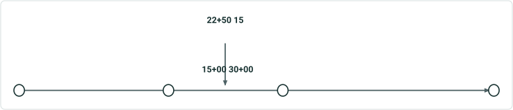

# REST: Geometry to Station User Story

|   |   |
| --- | --- |
| **Kind** | User Story · Server |
| **Release** | — |
| **Product** | Roads & Highways · Pipeline Referencing |
| **Source** | [REST Geometry to Station.pptx](<https://esriis.sharepoint.com/sites/LocationReferencing/Shared%20Documents/General/REST%20Geometry%20to%20Station.pptx>) |
| **Edited** | 2021-11-17 01:33 by Nathan Easley |
| **Extracted** | 2026-09-04 · lane `xmlstrip` |

<!-- metadata
```yaml
title: "REST: Geometry to Station User Story"
source_file: "REST Geometry to Station.pptx"
source_url: "https://esriis.sharepoint.com/sites/LocationReferencing/Shared%20Documents/General/REST%20Geometry%20to%20Station.pptx"
doc_id: 692
doc_kind: "User Story"
surface: "Server"
doc_revision: ""
target_release: ""
pe: ""
dev: ""
author: "William Isley"
last_edited_by: "Nathan Easley"
last_edited: "2021-11-17T01:33:17Z"
extracted: 2026-09-04
extraction_lane: xmlstrip
prompt_version: "v2.0.2"
keywords: ["rest endpoint", "route", "station measure", "coordinate conversion", "stationing event", "lrs developer", "geometry to station"]
tools: []
products: ["Roads & Highways", "Pipeline Referencing"]
issues: []
related: [{"doc":691,"file":"rest-station-to-geometry-user-story__doc691.md","s":8.339},{"doc":608,"file":"rest-geometry-to-referent-user-story__doc608.md","s":6.652},{"doc":614,"file":"rest-referent-to-geometry__doc614.md","s":5.463},{"doc":740,"file":"sort-results-by-distance-in-geometrytomeasure-rest-endpoint__doc740.md","s":4.034},{"doc":594,"file":"reassign-to-a-new-or-existing-line-with-original-route-id-name-maintained-on__doc594.md","s":3.29}]
```
-->

## Summary

User story for creating a REST endpoint that converts XYZ coordinates into routeID and stationing measures for use in custom applications. The endpoint supports multiple coordinates, optional parameters like tolerance and spatial references, and returns all matching route/station measures at a location. It must handle error conditions such as missing stationing event types in the LRS network.

## Related documents

<!-- related:begin -->
- [REST: Station to Geometry User Story](<https://esriis.sharepoint.com/sites/lrsworkspace/LRS%20Doc%20Index/User%20Stories/rest-station-to-geometry-user-story__doc691.md>) — similar text 0.84 · 3 title words · 3 filename words · same kind/surface/folder <!-- rel:691 -->
- [REST: Geometry to Referent User Story](<https://esriis.sharepoint.com/sites/lrsworkspace/LRS Doc Index/User Stories/rest-geometry-to-referent-user-story__doc608.md>) — similar text 0.67 · 2 title words · 2 filename words · same kind/surface/folder <!-- rel:608 -->
- [REST: Referent to Geometry](<https://esriis.sharepoint.com/sites/lrsworkspace/LRS%20Doc%20Index/User%20Stories/rest-referent-to-geometry__doc614.md>) — similar text 0.61 · 2 title words · 2 filename words · same kind/surface/folder <!-- rel:614 -->
- [Sort results by distance in geometryToMeasure REST endpoint](<https://esriis.sharepoint.com/sites/lrsworkspace/LRS Doc Index/User Stories/sort-results-by-distance-in-geometrytomeasure-rest-endpoint__doc740.md>) — similar text 0.21 · 1 title word · 1 filename word · same kind/surface/folder <!-- rel:740 -->
- [Reassign to a New or Existing Line with Original Route ID/Name Maintained on the Target Line - REST](<https://esriis.sharepoint.com/sites/lrsworkspace/LRS%20Doc%20Index/User%20Stories/reassign-to-a-new-or-existing-line-with-original-route-id-name-maintained-on__doc594.md>) — similar text 0.13 · 1 title word · 1 filename word · same kind/surface/folder <!-- rel:594 -->
<!-- related:end -->

<!-- docs:begin -->
## Esri documentation

_No page matched:_ [geometry to station](https://www.google.com/search?q=%22geometry%20to%20station%22+site%3Adoc.esri.com)
<!-- docs:end -->

---

## Slide 1 — REST: Geometry to Station

User Story

## Slide 2 — User Story

As a LRS Developer, I want to be able to convert a coordinate into a route and stationing measure, so I can utilize this operation in custom applications my organization creates that involve going back and forth between stationing measures and coordinates.
Persona
LRS Developer: This user is responsible for extending Roads and Highways/Pipeline Referencing utilizing the LRS REST endpoints and other SDKs provided within ArcGIS.  For organizations that utilize our stationing event type, they need to be ability to convert between a coordinate and a route and station measure in a similar manner to how our geometryToMeasure endpoint works.

## Slide 3 — Geometry to Station

Create a REST endpoint that will take an XYZ coordinate as the input and provide a routeID and station measure as the output
Users should be able to provide one or more coordinates that will be converted into routeID/station measures
For coordinate, the endpoint should find the routeID (s) and stationing measure(s) at that location to be returned (note if there is more than one route/measure at the location, we should return all matching route/station measures at that location)
Software Engineer that is assigned the story will create the signature and review with the team
This endpoint exists in the 10.x version of the LRS endpoints, so try to follow the same format of that existing endpoint if possible (https://roadsandhighwayssample.esri.com/roads/api/index.html)
Input parameters for the tool include: Locations (required, one or more coordinate combinations), Tolerance (optional), the Temporal View Date (optional), Input Spatial Reference (optional), Output Spatial Reference (optional), and gdb Version (optional)
If the tolerance is empty, use the XY and Z tolerance of the service for the search area.  If the tolerance is populated, it should be in the units of the service spatial reference.
If temporal view date is empty, return all the coordinate locations across time for the RouteID/Station Measure
If the Output Spatial Reference is empty, return using the coordinates of the spatial reference the service was published with
If the gdb Version is empty, use the version the service was published with
If the LRS the Network is a part of doesn’t have a stationing event type configured, the operation should fail, and we should return an error message letting the user know that no stationing event type exists for that Network
Add any other error conditions that exist for the endpoint in the 10.x version of the endpoints

## Slide 4 — Geometry to Station conversions



Note that stationing units of measure can be different from the LRS Network units of measure.  We need to consider this conversion factor when determining the station measure to return.
For example, a user clicks directly between the nearest upstream and downstream station.  The upstream station has a measure of 130+00 and the downstream station has a measure of 140+00.  The route measure at the upstream station location is 139 and the measure at the downstream station is 140.  Before doing any conversions, the difference in measure range between the stationing measures and the route measures needs to be reconciled so that we don’t provide a stationing value that would be incorrect when considering the upstream or downstream stationing point..  This will ensure the measure that is returned in 135+00 instead of 139+99.50.

    0		        10                         20			    40
15+00                    30+00
22+50
15

## Slide 5 — Testing

Test on both RH and APR data
Test on data with and without a stationing event type configured
Test on a variety of route geometries (gapped, loop, lollipop, alpha, branch, vertical)
Utilize locations where there are downstream stations with and without a back station value

## Slide 6 — Automation

Automate the endpoint in a similar manner to the other REST endpoints we support

## Slide 7 — Documentation

Create a new topic in our REST API documentation
Software Engineer should work with Jim on this documentation topic
Use the existing 10.x endpoint topic as a guide for the description and example usage

## Slide 8 — Assignment

Story Points:
Dev:
PE:
