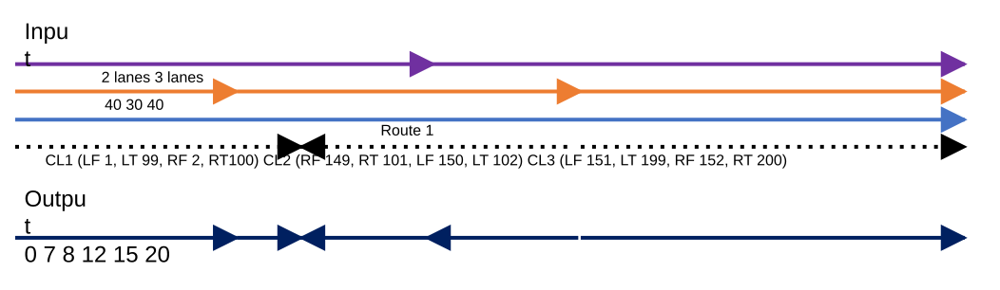

# REST/GP: Consider Centerline Direction in Query Attribute Set/Overlay Events

| Field | Value |
| --- | --- |
| **Doc** | 436 · User Story · Pro |
| **Product** | — |
| **Release** | — |
| **Issues** | — |
| **Source** | [RESTGPCenterlineDirectioninQueryAttributeSetOverlayEvents.pptx](<https://esriis.sharepoint.com/sites/LocationReferencing/Shared%20Documents/General/RESTGPCenterlineDirectioninQueryAttributeSetOverlayEvents.pptx>) |
| **People** | author William Isley · PE — · dev — |
| **Edited** | 2024-01-19 01:44 by Nathan Easley |
| **Extracted** | 2026-09-04 · lane xmlstrip · format 3.0 · prompt v2.0.2 |
| **Keywords** | centerline direction · query attribute set · overlay events · addressing · route calibration · dynamic segmentation · lrs editor |
| **Tools** | Query Attribute Set · Overlay Events |

## Summary

This document describes a user story for LRS data editors to ensure centerline direction is considered in the Query Attribute Set REST endpoint and Overlay Events GP tool outputs. It covers the need to maintain correct addressing information by honoring centerline direction, including requirements, testing scenarios, automation additions, and documentation updates.

## Related documents

<!-- related:begin -->
- [REST/GP: Support the centerline feature class like an event in Query Attribute Set/Overlay Events](<https://esriis.sharepoint.com/sites/lrsworkspace/LRS Doc Index/User Stories/rest-gp-support-the-centerline-feature-class-like-an-event.md>) — similar text 0.40 · 6 title words · 5 filename words · same kind/surface/folder <!-- rel:475 s=8.302 -->
- [Consider Point Events in Query Attribute Set and Overlay Events](<https://esriis.sharepoint.com/sites/lrsworkspace/LRS Doc Index/User Stories/consider-point-events-in-query-attribute-set-and-overlay.md>) — similar text 0.45 · 6 title words · 4 filename words · same kind/surface/folder <!-- rel:392 s=7.647 -->
- [Update Address Range Information in Overlay Events and Query Attribute Sets](<https://esriis.sharepoint.com/sites/lrsworkspace/LRS Doc Index/User Stories/5537-update-address-range-information-in-overlay-events-and-query.md>) — similar text 0.20 · 4 title words · 2 filename words · same kind/surface/folder <!-- rel:344 s=5.358 -->
- [Support Overlapping Events in Query Attribute Set and Overlay Events GP Tool](<https://esriis.sharepoint.com/sites/lrsworkspace/LRS Doc Index/User Stories/support-overlapping-events-in-query-attribute-set.md>) — similar text 0.20 · 5 title words · 1 filename word · same kind/surface/folder <!-- rel:290 s=5.173 -->
- [Update Address Range via Address Points in Overlay Events and Query Attribute Sets](<https://esriis.sharepoint.com/sites/lrsworkspace/LRS%20Doc%20Index/User%20Stories/update-address-range-via-address-points-in-overlay-events.md>) — similar text 0.21 · 4 title words · 2 filename words · same kind/surface/folder <!-- rel:294 s=5.118 -->
<!-- related:end -->

<!-- docs:begin -->
## Esri documentation

[View site address point properties](https://doc.esri.com/en/arcgis-pro/latest/help/production/roads-highways/view-site-address-point-properties.html) · [Apply dynamic segmentation](https://doc.esri.com/en/arcgis-pro/latest/help/production/location-referencing-pipelines/apply-dynamic-segmentation.html)

_No page matched:_ [Query Attribute Set](https://www.google.com/search?q=%22Query%20Attribute%20Set%22+site%3Adoc.esri.com) · [Overlay Events](https://www.google.com/search?q=%22Overlay%20Events%22+site%3Adoc.esri.com)
<!-- docs:end -->

---

## Story
### REST/GP: Consider centerline direction in Query Attribute Set/Overlay Events <!-- slide 1 -->
User Story
ArcGIS Pro

### User Story <!-- slide 2 -->
As an LRS data editor in local government, I need the direction of each centerline considered in Query Attribute Set/Overlay Events, so that the addressing information doesn’t reverse direction incorrectly in the output.
Persona
LRS Editor: This user is responsible for making edits to the LRS.  The edits they need to make come in from field crews/contractors in a variety of formats (shapefiles, engineering drawing, fgdbs).  The LRS Editor is responsible for making the route edits based on these documents.  This user will also dynamically segment data as needed for analysis.  At local governments that also manage address data, the centerline will need to be included so this address data can be included in the dynseg.  Although the centerline direction should be consistent between centerlines that make up a single route in the LRS, there are exception cases when the route passes through multiple jurisdictions, each with different business rules.  We need to be able to maintain the centerline direction in the Overlay Output to ensure the addressing information doesn’t get reversed.

## Acceptance Criteria
### Example <!-- slide 3 -->
CL1 (LF 1, LT 99, RF 2, RT100)		    CL2 (RF 149, RT 101, LF 150, LT 102)	          CL3 (LF 151, LT 199, RF 152, RT 200)
2 lanes						        3 lanes
0                                     7           8                      12                        15				   20

| From Measure | To Measure | Route | Speed | Lanes | CL | LF | LT | RF | RT |
| --- | --- | --- | --- | --- | --- | --- | --- | --- | --- |
| 0 | 7 | Rte1 | 40 | 2 | CL1 | 1 | 99 | 2 | 100 |
| 7 | 8 | Rte1 | 30 | 2 | CL1 | 1 | 99 | 2 | 100 |
| 12 | 8 | Rte1 | 30 | 2 | CL2 | 150 | 102 | 149 | 101 |
| 15 | 12 | Rte1 | 30 | 3 | CL2 | 150 | 102 | 149 | 101 |
| 15 | 20 | Rte1 | 40 | 3 | CL3 | 151 | 199 | 152 | 200 |

[figure: 40 30 40 · Route 1 · Input · Output]

### Requirements <!-- slide 4 -->
- In the Query Attribute Set REST endpoint and Overlay Events GP tool, when the centerline that is part of an addressing configuration is an input layer, we need to consider the direction of the centerline in the output generated for the tool (note this is only for this configuration that we’ll apply this to the output)
- If all centerlines that are part of a route are in the same direction as the route's direction of calibration, do what the tool does today
- If one or more of the centerlines that are part of a route are in the opposite direction of calibration, then each of the output records that include those opposite direction centerlines will need to honor the direction of the centerline
  - This means that the from and to measures of the output record would be reversed
  - This also means if a geometry is included in the output, it would be in the opposite direction as the calibration direction of the input route

## Testing
<!-- slide 5 -->
- Test with services with the VMS enabled, fgdb, and direct connect egdb
- Test on a variety of centerline/route configurations
  - Both in same direction
  - All centerlines in opposite direction
  - Some centerlines in opposite direction
  - One centerline per route
  - Multiple centerlines per route
- Test a few cases with complex routes

## Automation
<!-- slide 6 -->
- Add to the existing automation cases for the endpoint and gp tool.

## Documentation
<!-- slide 7 -->
- Add language to the existing REST API and GP topic that mentions that when configured with addressing, the centerline direction will be considered in these tools.
- Providing a diagram to show the example input/output would be good.

## Assignment
### Story Points <!-- slide 8 -->
Story Points:
Dev:
PE:
