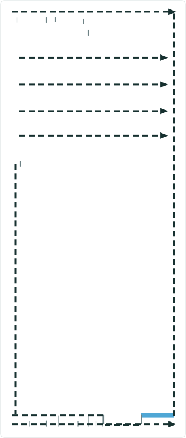
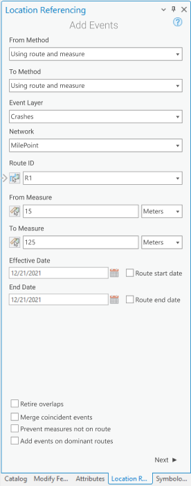

# Retire Overlaps Option in Add Events tools in Pro

|   |   |
| --- | --- |
| **Kind** | User Story · Pro |
| **Release** | — |
| **Product** | Roads & Highways · Pipeline Referencing |
| **Source** | [RetireOverlapsOptionEventEditingPro.pptx](<https://esriis.sharepoint.com/sites/LocationReferencing/Shared%20Documents/General/RetireOverlapsOptionEventEditingPro.pptx>) |
| **Edited** | 2022-06-01 16:31 by Nathan Easley |
| **Extracted** | 2026-09-04 · lane `xmlstrip` |

<!-- metadata
```yaml
title: "Retire Overlaps Option in Add Events tools in Pro"
source_file: "RetireOverlapsOptionEventEditingPro.pptx"
source_url: "https://esriis.sharepoint.com/sites/LocationReferencing/Shared%20Documents/General/RetireOverlapsOptionEventEditingPro.pptx"
doc_id: 664
doc_kind: "User Story"
surface: "Pro"
doc_revision: ""
target_release: ""
pe: ""
dev: ""
author: "William Isley"
last_edited_by: "Nathan Easley"
last_edited: "2022-06-01T16:31:03Z"
extracted: 2026-09-04
extraction_lane: xmlstrip
prompt_version: "v2.0.2"
keywords: ["retire overlaps", "add events", "event editing", "overlapping events", "route shapes", "retireMeasureOverlap"]
tools: ["Add Line", "Add Multiple Line"]
products: ["Roads & Highways", "Pipeline Referencing"]
issues: []
related: [{"doc":663,"file":"merge-coincident-option-in-add-events-tools-in-pro__doc663.md","s":7.904},{"doc":621,"file":"add-line-event-tools-retire-overlaps-option-test-plan__doc621.md","s":5.443},{"doc":683,"file":"conflict-prevention-for-event-editing-in-pro__doc683.md","s":4.302},{"doc":686,"file":"add-multiple-line-events-tool-in-arcgis-pro__doc686.md","s":4.213},{"doc":685,"file":"add-multiple-point-events-tool-in-arcgis-pro__doc685.md","s":4.073}]
```
-->

## Summary

Describes a user story for LRS Editors needing an option in the Add Events tools in ArcGIS Pro to automatically retire overlapping events when adding new events. The document outlines the feature, testing scenarios, and documentation updates required.

## Related documents

<!-- related:begin -->
- [Merge Coincident Option in Add Events tools in Pro](<https://esriis.sharepoint.com/sites/lrsworkspace/LRS Doc Index/User Stories/merge-coincident-option-in-add-events-tools-in-pro__doc663.md>) — similar text 0.47 · 5 title words · 4 filename words · same kind/surface/folder <!-- rel:663 -->
- [Add Line Event Tools: Retire Overlaps Option Test Plan](<https://esriis.sharepoint.com/sites/lrsworkspace/LRS Doc Index/Test Plans/add-line-event-tools-retire-overlaps-option-test-plan__doc621.md>) — similar text 0.16 · 5 title words · 3 filename words · same surface <!-- rel:621 -->
- [Conflict Prevention for Event Editing in Pro](<https://esriis.sharepoint.com/sites/lrsworkspace/LRS Doc Index/User Stories/conflict-prevention-for-event-editing-in-pro__doc683.md>) — similar text 0.23 · 1 title word · 3 filename words · same kind/surface/folder <!-- rel:683 -->
- [Add Multiple Line Events tool in ArcGIS Pro](<https://esriis.sharepoint.com/sites/lrsworkspace/LRS Doc Index/User Stories/add-multiple-line-events-tool-in-arcgis-pro__doc686.md>) — similar text 0.27 · 3 title words · 1 filename word · same kind/surface/folder <!-- rel:686 -->
- [Add Multiple Point Events tool in ArcGIS Pro](<https://esriis.sharepoint.com/sites/lrsworkspace/LRS Doc Index/User Stories/add-multiple-point-events-tool-in-arcgis-pro__doc685.md>) — similar text 0.27 · 3 title words · 1 filename word · same kind/surface/folder <!-- rel:685 -->
<!-- related:end -->

<!-- docs:begin -->
## Esri documentation

[Event editing using the attribute table](https://doc.esri.com/en/arcgis-pro/latest/help/production/roads-highways/event-editing-using-the-attribute-table.html) · [Retire routes](https://doc.esri.com/en/arcgis-pro/latest/help/production/roads-highways/retire-routes.html)

_No page matched:_ [Add Line](https://www.google.com/search?q=%22Add%20Line%22+site%3Adoc.esri.com) · [Add Multiple Line](https://www.google.com/search?q=%22Add%20Multiple%20Line%22+site%3Adoc.esri.com)
<!-- docs:end -->

---

## Slide 1 — Retire Overlaps Option in Add Events tools in Pro

User Story

## Slide 2 — User Story

As an LRS Editor, I need the capability for overlapping events to be retired in the Add Events tools in Pro, so that I can easily add new events without having to manually retire existing events.

Persona
LRS Editor: This user is responsible for making edits to the LRS.  The edits they need to make come in from field crews/contractors in a variety of formats (shapefiles, engineering drawing, fgdbs).  The LRS Editor is responsible for making the route and event edits based on these documents. For many users, they need the ability to create new events but have any overlapping events be automatically retired so they don’t have to go manually retire any overlaps created.

## Slide 3 — Retire Overlaps Option



In the Add Line and Add Multiple Line tools, add an option to “Retire Overlaps”
If the option is selected, for any new event(s) added via the tools, the “retireMeasureOverlap” parameter in LRS Apply Edits should be marked as true



## Slide 4 — Testing

Test with a mix or RH and APR data
Test with and without events that span routes
Test with measure overlaps in the same time range as well as measure overlaps in different time ranges
No need to test via REST, but do verify the REST request from the Pro UI has the parameter checked as true
Test on a variety of route shapes to verify the existing events are retired correctly:

  - Normal
  - Gapped
  - Loop
  - Lollipops
  - Alpha
  - Branch
  - Vertical

## Slide 5 — Automation

No new automation

## Slide 6 — Documentation

Add steps related to this option in the topics for Add Line and Add Multiple Line
Make sure to discuss what checking the option would do in related to existing events at the same location as the newly created event (feel free to use the Event Editor doc as a guide)

## Slide 7 — Assignment

Story Points:
Dev:
PE:
