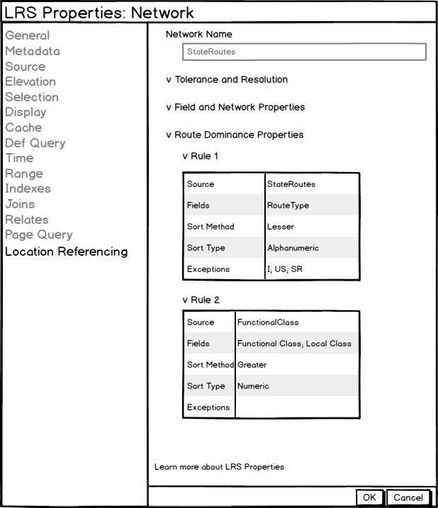

# Route Dominance Properties User Story

|   |   |
| --- | --- |
| **Kind** | User Story · Pro |
| **Release** | — |
| **Product** | Roads & Highways · Pipeline Referencing |
| **Source** | [RouteDominanceProperties.pptx](<https://esriis.sharepoint.com/sites/LocationReferencing/Shared%20Documents/General/RouteDominanceProperties.pptx>) |
| **Edited** | 2021-08-13 19:41 by Nathan Easley |
| **Extracted** | 2026-09-04 · lane `xmlstrip` |

<!-- metadata
```yaml
title: "Route Dominance Properties User Story"
source_file: "RouteDominanceProperties.pptx"
source_url: "https://esriis.sharepoint.com/sites/LocationReferencing/Shared%20Documents/General/RouteDominanceProperties.pptx"
doc_id: 699
doc_kind: "User Story"
surface: "Pro"
doc_revision: ""
target_release: ""
pe: ""
dev: ""
author: "William Isley"
last_edited_by: "Nathan Easley"
last_edited: "2021-08-13T19:41:43Z"
extracted: 2026-09-04
extraction_lane: xmlstrip
prompt_version: "v2.0.2"
keywords: ["route dominance", "lrs network", "location referencing", "route dominance properties", "lrs controller dataset", "user story"]
tools: []
products: ["Roads & Highways", "Pipeline Referencing"]
issues: []
related: [{"doc":843,"file":"lrs-intersection-properties-user-story__doc843.md","s":6.536},{"doc":842,"file":"lrs-and-gap-calibration-properties-user-story__doc842.md","s":4.479},{"doc":190,"file":"lrs-addressing-and-utility-network-properties-user-story__doc190.md","s":4.465},{"doc":109,"file":"pro-ai-assistant-reverse-route-user-story__doc109.md","s":3.382},{"doc":790,"file":"multiple-measures-ui-picker-user-story__doc790.md","s":2.907}]
```
-->

## Summary

Describes the user story for viewing route dominance properties in LRS Networks to verify configured rules and understand dominant routes in various scenarios. Specifies access methods, data sources, UI requirements including accessibility and internationalization, and testing considerations across different data sources and licenses. Includes documentation update instructions for related help topics.

## Related documents

<!-- related:begin -->
- [LRS Intersection Properties User Story](<https://esriis.sharepoint.com/sites/lrsworkspace/LRS Doc Index/User Stories/lrs-intersection-properties-user-story__doc843.md>) — similar text 0.66 · 1 title word · 1 filename word · same kind/surface/folder <!-- rel:843 -->
- [LRS and Gap Calibration Properties User Story](<https://esriis.sharepoint.com/sites/lrsworkspace/LRS Doc Index/User Stories/lrs-and-gap-calibration-properties-user-story__doc842.md>) — similar text 0.58 · 1 title word · 1 filename word · same kind/surface/folder <!-- rel:842 -->
- [LRS Addressing and Utility Network Properties User Story](<https://esriis.sharepoint.com/sites/lrsworkspace/LRS Doc Index/User Stories/lrs-addressing-and-utility-network-properties-user-story__doc190.md>) — similar text 0.36 · 1 title word · 1 filename word · same kind/surface/folder <!-- rel:190 -->
- [Pro AI Assistant Reverse Route User Story](<https://esriis.sharepoint.com/sites/lrsworkspace/LRS%20Doc%20Index/User%20Stories/pro-ai-assistant-reverse-route-user-story__doc109.md>) — similar text 0.08 · 1 title word · 1 filename word · same kind/surface/folder <!-- rel:109 -->
- [Multiple Measures UI Picker User Story](<https://esriis.sharepoint.com/sites/lrsworkspace/LRS Doc Index/User Stories/multiple-measures-ui-picker-user-story__doc790.md>) — similar text 0.21 · same kind/surface/folder <!-- rel:790 -->
<!-- related:end -->

<!-- docs:begin -->
## Esri documentation

[LRS network](https://doc.esri.com/en/arcgis-pro/latest/help/production/location-referencing-pipelines/what-is-an-lrs-network.html) · [Set Location Referencing options](https://doc.esri.com/en/arcgis-pro/latest/help/production/roads-highways/set-location-referencing-options.html)
<!-- docs:end -->

---

## Slide 1 — Route Dominance Properties

User Story

## Slide 2 — User Story

As a Location Referencing user, I need to be able to see the route dominance properties for each LRS Network, so I can verify the rules  configured and understand which route should be dominant in different scenarios.

Persona: Location Referencing users includes any administrator, data loader, LRS editors, or other user of the software.  For administrators and data loaders that do the initial configuration of the software, being able to see the route dominance properties will allow them to confirm they’re configured correctly before editors begin to use the software.  For LRS editors, they want to be able to see the properties so they can validate what they see when events snap to routes and when determining which route is dominant in different editing scenarios.

## Slide 3 — Route Dominance Properties

Should apply to all LRS Networks
Should be able to be accessed in these three ways:

  - In the Catalog window, navigate to the FC/table, right click, select properties, and navigate to LocationReferencing tab.
  - In the LRS Hierarchy, right click the FC, select properties, and navigate to LocationReferencing tab.
  - In the map, navigate to the contents window, right click the FC/table, select properties, and navigate to LocationReferencing tab.
Should be available via fgdb (catalog and layer), egdb (catalog and layer), and feature service (layer)
Should appear if Location Referencing (RH or APR) is not licensed (Pro pattern)
Information should be pulled from the LRS Controller Dataset (not the LRS Metadata table)
Accordion should be closed by default like other Pro accordions
Needs to be 508 compliant – A11y, Dark Mode, Tabbing
Should be I18n ready
Green text at bottom should link to page that describes the property window

## Slide 4 — Route Dominance (LRS Networks)

Add a new section called Route Dominance Properties
When expanded we should have a subsection for each rule (the rules should be in order that they were created to reflect the order we would process them to determine the dominant route)
Field should not be editable, but should be selectable and copiable
If the value or field name is very long, size it according to the window and provide hover content
In both Fields and Exceptions, use either a comma or semicolon to delineate each value (if there is more than one)



## Slide 5 — Testing

Test with and without Location Referencing license
FGDB, EGDB (traditional and branch), Services
Layers and Feature Classes/Tables
No Metadata table present
Change version
Make change in Configure Route Dominance tool
Long values
Tab, scroll, resize, hover
Select and copy

  - Dark and light theme
  - L18N
  - Switch maps
  - Click properties link

## Slide 6 — Documentation

Add information related to route dominance properties in View LRS Network properties topic.  Follow the pattern used for the other sections in the topic.
https://pro.arcgis.com/en/pro-app/latest/help/production/location-referencing-pipelines/view-lrs-network-properties.htm and https://pro.arcgis.com/en/pro-app/latest/help/production/roads-highways/view-lrs-network-properties.htm

## Slide 7 — Assignment

Story Points:
Dev:
