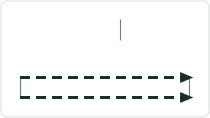

# Search by Coordinate Experience Builder widget

|   |   |
| --- | --- |
| **Kind** | User Story · Experience Builder |
| **Release** | — |
| **Product** | Roads & Highways · Pipeline Referencing |
| **Source** | [ExpBld SearchbyCoordinate.pptx](<https://esriis.sharepoint.com/sites/LocationReferencing/Shared%20Documents/General/ExpBld%20SearchbyCoordinate.pptx>) |
| **Edited** | 2023-10-19 23:20 by Nathan Easley |
| **Extracted** | 2026-09-04 · lane `xmlstrip` |

<!-- metadata
```yaml
title: "Search by Coordinate Experience Builder widget"
source_file: "ExpBld SearchbyCoordinate.pptx"
source_url: "https://esriis.sharepoint.com/sites/LocationReferencing/Shared%20Documents/General/ExpBld%20SearchbyCoordinate.pptx"
doc_id: 487
doc_kind: "User Story"
surface: "Experience Builder"
doc_revision: ""
target_release: ""
pe: ""
dev: ""
author: "William Isley"
last_edited_by: "Nathan Easley"
last_edited: "2023-10-19T23:20:11Z"
extracted: 2026-09-04
extraction_lane: xmlstrip
prompt_version: "v2.0.2"
keywords: ["search by coordinate", "route search", "experience builder widget", "event editor", "spatial reference", "coordinate search"]
tools: ["Route Search"]
products: ["Roads & Highways", "Pipeline Referencing"]
issues: []
related: [{"doc":490,"file":"search-by-station-experience-builder-widget-user-story__doc490.md","s":7.377},{"doc":476,"file":"search-by-referent-experience-builder-widget__doc476.md","s":7.138},{"doc":464,"file":"search-by-line-experience-builder-widget__doc464.md","s":6.967},{"doc":529,"file":"search-by-route-and-measure-experience-builder-widget__doc529.md","s":6.495},{"doc":362,"file":"experience-builder-dynamic-segmentation-widget__doc362.md","s":4.996}]
```
-->

## Summary

User story for adding a coordinate-based search method to the Route Search widget in Experience Builder. It enables event editors to locate routes by providing XY coordinates with optional Z, supporting multiple spatial references and returning routes or closest matches with distance information. The document includes configuration details, testing scenarios, automation plans, and documentation updates.

## Related documents

<!-- related:begin -->
- [Search by Station Experience Builder widget User Story](<https://esriis.sharepoint.com/sites/lrsworkspace/LRS%20Doc%20Index/User%20Stories/search-by-station-experience-builder-widget-user-story__doc490.md>) — similar text 0.60 · 4 title words · 3 filename words · same kind/surface/folder <!-- rel:490 -->
- [Search by Referent Experience Builder widget](<https://esriis.sharepoint.com/sites/lrsworkspace/LRS Doc Index/User Stories/search-by-referent-experience-builder-widget__doc476.md>) — similar text 0.70 · 4 title words · 3 filename words · same kind/surface/folder <!-- rel:476 -->
- [Search by Line Experience Builder widget](<https://esriis.sharepoint.com/sites/lrsworkspace/LRS Doc Index/User Stories/search-by-line-experience-builder-widget__doc464.md>) — similar text 0.60 · 4 title words · 3 filename words · same kind/surface/folder <!-- rel:464 -->
- [Search by Route and Measure Experience Builder widget](<https://esriis.sharepoint.com/sites/lrsworkspace/LRS Doc Index/User Stories/search-by-route-and-measure-experience-builder-widget__doc529.md>) — similar text 0.44 · 4 title words · 3 filename words · same kind/surface/folder <!-- rel:529 -->
- [Experience Builder Dynamic Segmentation widget](<https://esriis.sharepoint.com/sites/lrsworkspace/LRS Doc Index/User Stories/experience-builder-dynamic-segmentation-widget__doc362.md>) — similar text 0.24 · 3 title words · 2 filename words · same kind/surface/folder <!-- rel:362 -->
<!-- related:end -->

<!-- docs:begin -->
## Esri documentation

_No page matched:_ [Route Search](https://www.google.com/search?q=%22Route%20Search%22+site%3Adoc.esri.com)
<!-- docs:end -->

---

## Slide 1 — Search by Coordinate Experience Builder widget

User Story

## Slide 2 — User Story

As an Event Editor, I need the ability to search for a route via coordinates, so that I can properly locate and orient myself for LRS editing and analysis.

Persona
Event Editor: These users are responsible for making edits to route characteristics and assets.  Typically located in different business units/departments than the LRS route editors, these users have varied GIS experience, but a high level of knowledge about the characteristics they maintain (safety, pavement, crashes, etc.)  These users need to be able to search for a route via coordinates to orient themselves on the map in preparation for event editing.

## Slide 3 — Search by Coordinates


Create another method in the Route Search widget called “Coordinates”
Network should be whatever network was configured in the backstage configuration
User can change the network in the UI to any valid LRS networks in the map
User must provide the XY coordinates, the Z is optional
Coordinate spatial reference is based on whatever is configured in the backstage of the widget (see slide 5)
All mockups can be found at https://www.figma.com/file/dIN1OfZDxhT7i9pbefdoTj/LRS?type=design&node-id=506-130104&mode=design&t=gS2mLbqfZq6Pwoqa-0


## Slide 4 — Search by Coordinates



If the coordinates are invalid, provide a message that the coordinates provided aren’t valid

When the user clicks search do the following:

  - Find all the routes/measures that are present at that coordinate and return them in the results
  - Transition the widget to a results pane that shows the route(s)/measure(s) that are returned by the search
  - If no route/measure is present at those exact coordinates, then return the closest route/measure to the coordinates and mention how far it is from the coordinates provided


## Slide 5 — Search by Coordinates


Experience Builder widgets provide a backstage to configure options on a given widget
Since this is an existing widget, additional options need to be exposed in the widget

  - Add coordinates as one the methods (default is route and measure)
  - Allow the user to define the spatial reference being used (default is the map, but we should also expose the SR of the actual feature class in the db)


## Slide 6 — Testing

Test with APR and RH data
Test on a variety of route shapes
Test on projected and unprojected data
Test with a variety of spatial references
Test coordinate locations exactly on a route as well as close but not on a route
Also test coordinates where multiple routes exist (intersections and concurrencies)
Verify the tool aligns with any other Experience Builder specifications/requirements
508/l18n testing
Test with different themes

## Slide 7 — Automation

Add automation to the existing Route and Measure automation for this tool

## Slide 8 — Documentation

Add to the existing Route and Measure widget documentation that covers this new method

## Slide 9 — Assignment

Story Points:
Dev:
PE:
