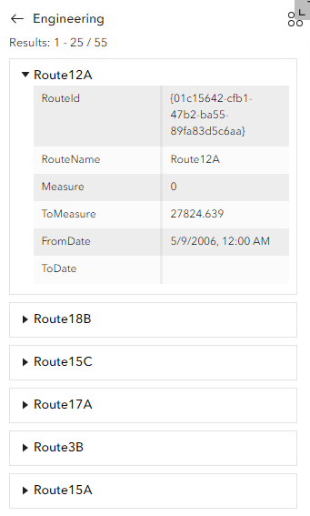
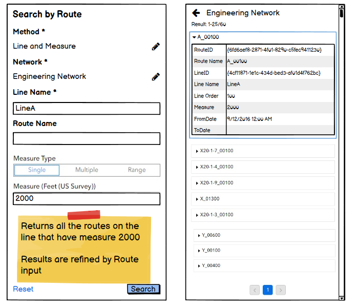
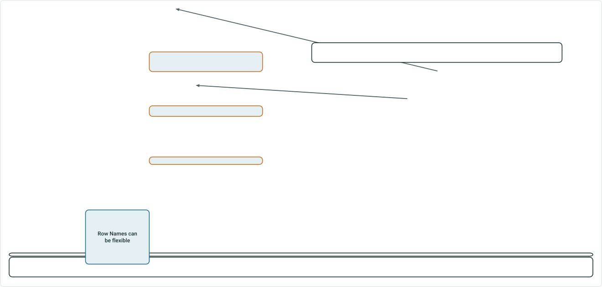
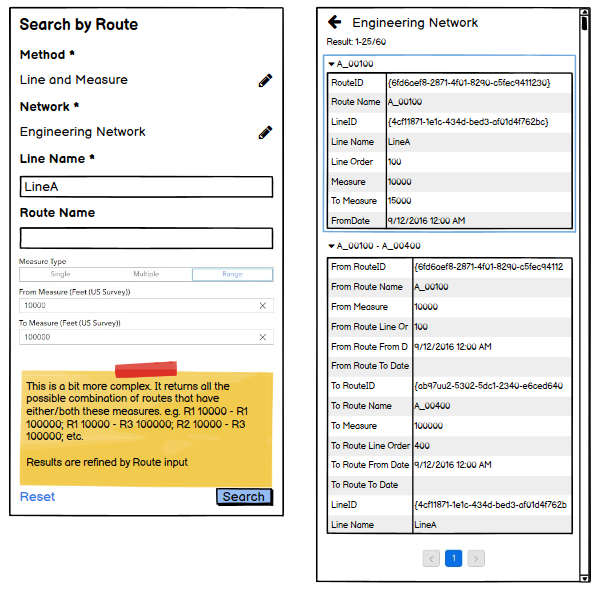
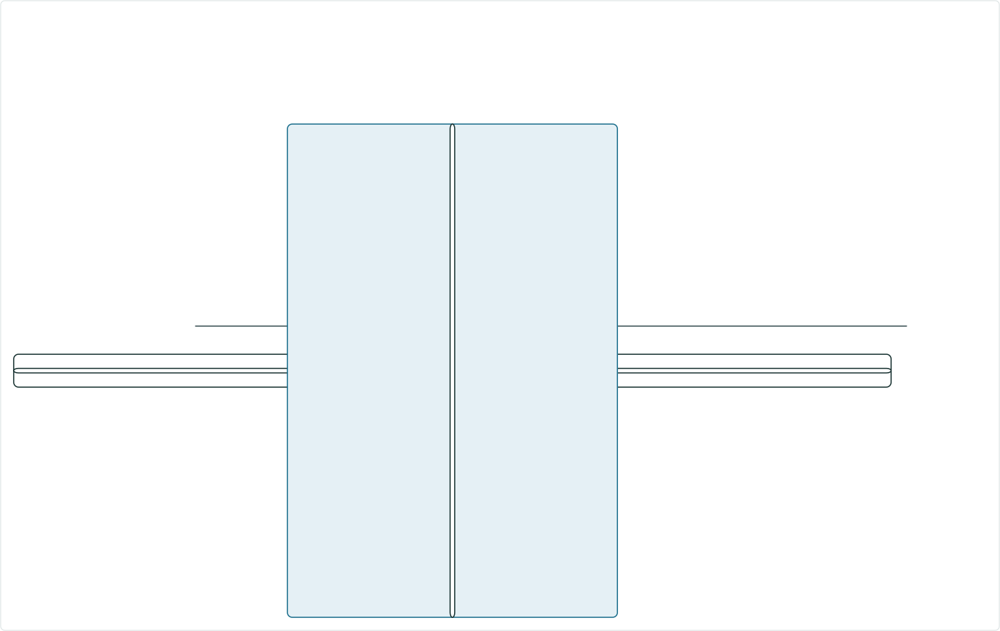

# Search by Line and Measure User Story

|   |   |
| --- | --- |
| **Kind** | User Story · Experience Builder |
| **Release** | — |
| **Product** | Roads & Highways · Pipeline Referencing |
| **Source** | [ExB_SearchbyLineandMeasure 1.pptx](<https://esriis.sharepoint.com/sites/LocationReferencing/Shared%20Documents/General/ExB_SearchbyLineandMeasure%201.pptx>) |
| **Edited** | 2024-05-01 19:46 by Claire Wang |
| **Extracted** | 2026-09-04 · lane `xmlstrip` |

<!-- metadata
```yaml
title: "Search by Line and Measure User Story"
source_file: "ExB_SearchbyLineandMeasure 1.pptx"
source_url: "https://esriis.sharepoint.com/sites/LocationReferencing/Shared%20Documents/General/ExB_SearchbyLineandMeasure%201.pptx"
doc_id: 380
doc_kind: "User Story"
surface: "Experience Builder"
doc_revision: ""
target_release: ""
pe: ""
dev: ""
author: "Praveen Kumar"
last_edited_by: "Claire Wang"
last_edited: "2024-05-01T19:46:18Z"
extracted: 2026-09-04
extraction_lane: xmlstrip
prompt_version: "v2.0.2"
keywords: ["event editor", "line network", "route", "measure", "search", "intellisense", "pane transitions", "time filter", "version filter"]
tools: ["Search by Route", "Search by Line and Measure"]
products: ["Roads & Highways", "Pipeline Referencing"]
issues: []
related: [{"doc":363,"file":"search-by-line-test-plan__doc363.md","s":5.789},{"doc":529,"file":"search-by-route-and-measure-experience-builder-widget__doc529.md","s":5.333},{"doc":464,"file":"search-by-line-experience-builder-widget__doc464.md","s":5.111},{"doc":438,"file":"search-by-route-user-story-and-configuration__doc438.md","s":4.924},{"doc":379,"file":"search-by-route-widget-configure-network-attribute-fields__doc379.md","s":4.851}]
```
-->

## Summary

This document describes a user story for an Event Editor to search by line and optionally by route and measures within a linear referencing system. It covers configuration, user interface behavior, search result handling, testing scenarios, and automation documentation for the Search by Line and Measure functionality in Experience Builder. The document also outlines testing requirements including UI, configuration, and browser compatibility.

## Related documents

<!-- related:begin -->
- [Search by Line Test Plan](<https://esriis.sharepoint.com/sites/lrsworkspace/LRS Doc Index/Test Plans/search-by-line-test-plan__doc363.md>) — similar text 0.35 · 2 title words · 1 filename word · same surface <!-- rel:363 -->
- [Search by Route and Measure Experience Builder widget](<https://esriis.sharepoint.com/sites/lrsworkspace/LRS Doc Index/User Stories/search-by-route-and-measure-experience-builder-widget__doc529.md>) — similar text 0.28 · 2 title words · 1 filename word · same kind/surface/folder <!-- rel:529 -->
- [Search by Line Experience Builder widget](<https://esriis.sharepoint.com/sites/lrsworkspace/LRS Doc Index/User Stories/search-by-line-experience-builder-widget__doc464.md>) — similar text 0.29 · 2 title words · 1 filename word · same kind/surface/folder <!-- rel:464 -->
- [Search by Route User Story and Configuration](<https://esriis.sharepoint.com/sites/lrsworkspace/LRS Doc Index/User Stories/search-by-route-user-story-and-configuration__doc438.md>) — similar text 0.46 · 1 title word · same kind/surface/folder <!-- rel:438 -->
- [Search by Route widget – configure network attribute fields](<https://esriis.sharepoint.com/sites/lrsworkspace/LRS Doc Index/User Stories/search-by-route-widget-configure-network-attribute-fields__doc379.md>) — similar text 0.42 · 1 title word · 1 filename word · same kind/surface/folder <!-- rel:379 -->
<!-- related:end -->

<!-- docs:begin -->
## Esri documentation

[Split a centerline by measure](https://doc.esri.com/en/arcgis-pro/latest/help/production/roads-highways/split-a-centerline-by-measure.html) · [Set a time filter](https://doc.esri.com/en/arcgis-pro/latest/help/production/roads-highways/set-a-time-filter.html)

_No page matched:_ [Search by Route](https://www.google.com/search?q=%22Search%20by%20Route%22+site%3Adoc.esri.com) · [Search by Line and Measure](https://www.google.com/search?q=%22Search%20by%20Line%20and%20Measure%22+site%3Adoc.esri.com)
<!-- docs:end -->

---

## Slide 1 — Search by Line and Measure

User Story

## Slide 2 — User Story

As an Event Editor, I need the ability to search for a specific line and optionally, route and measures, so that I can properly location and orient myself for LRS editing and analysis.

Persona
Event Editor: These users are responsible for making edits to route characteristics and assets.  Typically located in different business units/departments than the LRS route editors, these users have varied GIS experience, but a high level of knowledge about the characteristics they maintain (safety, pavement, crashes, etc.)  These users need to be able to search for line and sometimes route/measure on the line to orient themselves on the map in preparation for event editing.
Target user: PoM, APR, and RH (who plans to adopt line concept) editor

## Slide 3 — Configuration


If Sort Field is set to LineID/Name/Order, make sure results are ranked by this line field.

- Verify if the network is line network, “Line and Measure” is added to Search methods; and Line Default dropdown is added to Identifier. If the network is non-Line network, these options are not added
  - Verify the Line and Measure toggle works as expected
  - Verify Line Default shows Line ID and Line Name as options (if network is PoM, there is only Line ID)
- Verify when using Line and Measure to search, result table has line information (Line ID/Name/ID)
  - When Sort Field is set to LineID/Name/ID, verify results are ranked by these fields.
New
New
If network is a line network, add “Line and Measure” and a toggle button
If network is a line network, add another set (title: Line Default; dropdown: Line ID/Line Name; tooltip)

- In published view, when method is search by line and measure, use this Line Default (and/or Default as Route is optional).
- Provide option to turn off Route search, so Route box is hidden
- If method is not line, use Default as it does today.
Currently, LineID/LineName can be added as a Sort Field. But searched result does not contain Line information.

 

## Slide 4 — Search by Line


- If no line network exists or line network has Line and Measure turned off in configuration, Line and Measure does not appear in Method
- If there is only 1 line network configured with Line and Measure option, after choosing Line and Measure for the method, pencil button does not show for Network
- Line Identifier is required. Route Identifier and Measure are optional.
  - Verify when Hide route search is turned on, there is no Route Name/ID box in UI
  - If nothing is populated, search returns all routes – just like what Search by Route does
  - If only Line Identifier field is populated, return all routes on the line
- Implement intellisense and wildcard options in Line Identifier field
- Verify the hidden elements (e.g. hide method; hide network) and alias are honored
- Searched result should contain line information (Line ID; Line Name; Line Order)

Option to turn off route search is checked, so Route box is hidden

 

## Slide 5 — Search by Line


- If Route is searched along with Line, use Route identifier to refine searched results.
- Implement intellisense and wildcard options in Route Identifier field
- Do pane transitions and results labeling and honor time and version as what we do today
    - When the user clicks search, do the following:
      - Find the route(s)
      - Transition the widget to a results pane that shows the route(s) that are returned by the search.
      - Show results in expanded form if the option is set in the configuration.
    - When a record is selected from the results:
      - Zoom to that route on the map
      - Highlight the route
      - Display route label (as per cartographic standards, for example do not place overlapping labels)
    - Search results should honor the time filter
    - Search results should honor the version


## Slide 6 — Search by Line and Single Measure


- Return all the routes on the line(s) that have this measure
- If Route is searched along with Line, use Route identifier to refine searched results
- Do pane transitions and results labeling and honor time and version as what we do today



## Slide 7 — Search by Line and Multiple Measure


- Return all the Route-Measure combos on the line
- If Route is searched along with Line, use Route identifier to refine searched results
- Do pane transitions and results labeling and honor time and version as what we do today


## Slide 8 — Search by Line and Measure Range




- Return all the possible combination of routes that have either/both these measures (example next slide)
  - For a single route that has the range, return everything like in Search by Route plus Line information. The title is the route
  - For a range that involves 2 routes, return From Route, To Route, and Line information. The title is “FromR – ToR”
- If only From or To is populated, treat as searching a single measure
- If Route is searched along with Line, use Route identifier to refine searched results
- Do pane transitions and results labeling and honor time and version as what we do today. When there are too many results, labels can overlap.
- Do we want to filter out results involving 2 routes but routes have non-overlapping time?

Row Names can be flexible



## Slide 9 — Search by Line and Measure Range - Example

Search Range: 10000 to 20000
Return all routes that have 10000 to their end measure or 20000, and to later routes (higher line order) that have 20000

Search Results:
From A 10000 To A 15000
From A 10000 To B 20000
From A 10000 To D 20000
From B 10000 To B 20000
From B 10000 To D 20000
From C 10000 To C 12000
From C 10000 To D 20000
Search Range: 10000 to null
Treat as searching a single measure 10000 (what we do today)

Search Results:
A 10000
B 10000
C 10000
Search Range: null to 20000
Treat as searching a single measure 20000 (what we do today)

Search Results:
B 20000
D 20000

[figure: A · 0 · 15000 · B · 10000 · 40000 · C · 12000 · D · 20000 · 25000 · Line1]

## Slide 10 — Search by Line Testing



- Focus testing with Line network. Sanity test non-line network that Line options do not appear in configuration or widget UI
- Test on projected (may use PoM) and unprojected data (may use APRGCS)
  - All functionalities should be able to apply to PoM with no issue
- Verify the tool aligns with any other Experience Builder specifications/requirements
- Test both configuration and UI
  - Focus testing the new method and associated parameters. But also make sure that existing parameters that can be used in the new method, such as Set Default Method/Hide Network/Hide Method/etc, still work fine
- Test searching with various Line/Route/Measure(s) combinations
- Test on a variety of route shapes. Focus with simple route and gapped/multi-gapped route
- Test time slices
- Test both with Numeric and Station measure values
- 508/l18n testing
- Test with different themes
- Test in Chrome and Firefox
- Test in different sizes (web, tab and mobile)

## Slide 11 — Search by Line Automation Documentation


Automate the tool following the process outlined by Lakshmi in her spike earlier this year
Add the method to existing Search by Route widget topic

Include graphic examples in the doc.

## Slide 12 — Search by Line Assignment


Story Points:
Dev:
PE:
