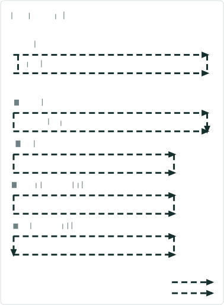
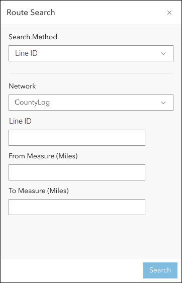
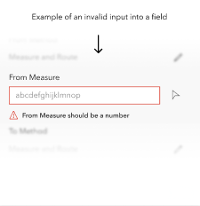

# Search by Line Experience Builder widget

|   |   |
| --- | --- |
| **Kind** | User Story · Experience Builder |
| **Release** | — |
| **Product** | Roads & Highways · Pipeline Referencing |
| **Source** | [ExpBld SearchbyLine.pptx](<https://esriis.sharepoint.com/sites/LocationReferencing/Shared%20Documents/General/ExpBld%20SearchbyLine.pptx>) |
| **Edited** | 2023-11-13 16:26 by Nathan Easley |
| **Extracted** | 2026-09-04 · lane `xmlstrip` |

<!-- metadata
```yaml
title: "Search by Line Experience Builder widget"
source_file: "ExpBld SearchbyLine.pptx"
source_url: "https://esriis.sharepoint.com/sites/LocationReferencing/Shared%20Documents/General/ExpBld%20SearchbyLine.pptx"
doc_id: 464
doc_kind: "User Story"
surface: "Experience Builder"
doc_revision: ""
target_release: ""
pe: ""
dev: ""
author: "William Isley"
last_edited_by: "Nathan Easley"
last_edited: "2023-11-13T16:26:48Z"
extracted: 2026-09-04
extraction_lane: xmlstrip
prompt_version: "v2.0.2"
keywords: ["search by line", "route search", "line network", "line id", "line name", "measure", "event editor", "experience builder widget"]
tools: ["Route Search"]
products: ["Roads & Highways", "Pipeline Referencing"]
issues: []
related: [{"doc":490,"file":"search-by-station-experience-builder-widget-user-story__doc490.md","s":6.99},{"doc":529,"file":"search-by-route-and-measure-experience-builder-widget__doc529.md","s":6.972},{"doc":487,"file":"search-by-coordinate-experience-builder-widget__doc487.md","s":6.967},{"doc":476,"file":"search-by-referent-experience-builder-widget__doc476.md","s":6.937},{"doc":345,"file":"experience-builder-straight-line-diagram-event-attributes-editing-on-click__doc345.md","s":5.178}]
```
-->

## Summary

User story for adding a Search by Line method to the Route Search widget in Experience Builder. It enables Event Editors to search for routes by line ID or name with optional measures, providing map zoom, highlighting, and results display. The widget includes configuration options for default line network and display preferences.

## Related documents

<!-- related:begin -->
- [Search by Station Experience Builder widget User Story](<https://esriis.sharepoint.com/sites/lrsworkspace/LRS%20Doc%20Index/User%20Stories/search-by-station-experience-builder-widget-user-story__doc490.md>) — similar text 0.60 · 4 title words · 3 filename words · same kind/surface/folder <!-- rel:490 -->
- [Search by Route and Measure Experience Builder widget](<https://esriis.sharepoint.com/sites/lrsworkspace/LRS Doc Index/User Stories/search-by-route-and-measure-experience-builder-widget__doc529.md>) — similar text 0.56 · 4 title words · 3 filename words · same kind/surface/folder <!-- rel:529 -->
- [Search by Coordinate Experience Builder widget](<https://esriis.sharepoint.com/sites/lrsworkspace/LRS Doc Index/User Stories/search-by-coordinate-experience-builder-widget__doc487.md>) — similar text 0.60 · 4 title words · 3 filename words · same kind/surface/folder <!-- rel:487 -->
- [Search by Referent Experience Builder widget](<https://esriis.sharepoint.com/sites/lrsworkspace/LRS Doc Index/User Stories/search-by-referent-experience-builder-widget__doc476.md>) — similar text 0.63 · 4 title words · 3 filename words · same kind/surface/folder <!-- rel:476 -->
- [Experience Builder Straight Line Diagram Event Attributes/Editing on Click](<https://esriis.sharepoint.com/sites/lrsworkspace/LRS Doc Index/User Stories/experience-builder-straight-line-diagram-event-attributes-editing-on-click__doc345.md>) — similar text 0.29 · 3 title words · 3 filename words · same kind/surface/folder <!-- rel:345 -->
<!-- related:end -->

<!-- docs:begin -->
## Esri documentation

[Lines](https://doc.esri.com/en/arcgis-pro/latest/help/production/location-referencing-pipelines/what-is-a-line.html) · [Split a centerline by measure](https://doc.esri.com/en/arcgis-pro/latest/help/production/roads-highways/split-a-centerline-by-measure.html)

_No page matched:_ [Route Search](https://www.google.com/search?q=%22Route%20Search%22+site%3Adoc.esri.com)
<!-- docs:end -->

---

## Slide 1 — Search by Line Experience Builder widget

User Story

## Slide 2 — User Story

As an Event Editor, I need the ability to search for a route via line, so that I can properly locate and orient myself for LRS editing and analysis.

Persona
Event Editor: These users are responsible for making edits to route characteristics and assets.  Typically located in different business units/departments than the LRS route editors, these users have varied GIS experience, but a high level of knowledge about the characteristics they maintain (safety, pavement, crashes, etc.)  These users need to be able to search for a specific measure via line name to orient themselves on the map in preparation for event editing.

## Slide 3 — Search by Line



Create another method in the Route Search widget called “Line ID”
Network should be whatever line network was configured in the backstage configuration
User can change the network in the UI to any valid LRS line network in the map
The LineID/Name is required, the measures are optional (user can search for a single measure or two measures)
Provide an intellisense experience for the LineID/Name
Measures should be whatever unit of configured for the LRS Network
Measures can be in stationing format (0+00 and 0+000)
All mockups can be found at https://www.figma.com/file/dIN1OfZDxhT7i9pbefdoTj/LRS?type=design&node-id=506-130104&mode=design&t=gS2mLbqfZq6Pwoqa-0



## Slide 4 — Search by Line


If the line is invalid, provide a message that the line could not be found
If the measure(s) are invalid on all the routes on the line, provide a message that the measures could not be found on the line
When the user clicks search do the following:

  - Find all the routes and measures (or measure range) on the line
  - Zoom to that route(s) and measure(s) on the map
  - Highlight the route(s) (or the single measure location or the measure range)
  - Transition the widget to a results pane that shows the route(s)/measure(s) that are returned by the search
  - If no route(s)/measure(s) are present on the line, let the user know that no route/measure was found



## Slide 5 — Search by Line


Experience Builder widgets provide a backstage to configure options on a given widget
Since this is an existing widget, additional options need to be exposed in the widget

  - Add Line as one the methods (default is route and measure)
  - Allow the user choose the default line network
  - Allow the user to choose between LineID and Line Name displaying and being used to search (default is Line Name)


## Slide 6 — Testing

Test with APR and RH data
Test with a mix of LineID and Line Name
Test with different units of measure
Test where a single route will be returned as well as multiple routes
Verify the tool aligns with any other Experience Builder specifications/requirements
508/l18n testing
Test with different themes
Identify at least 2 sanity test cases

## Slide 7 — Automation

Add automation to the existing Route and Measure automation for this tool

## Slide 8 — Documentation

Add to the existing Route and Measure widget documentation that covers this new method

## Slide 9 — Assignment

Story Points:
Dev:
PE:
