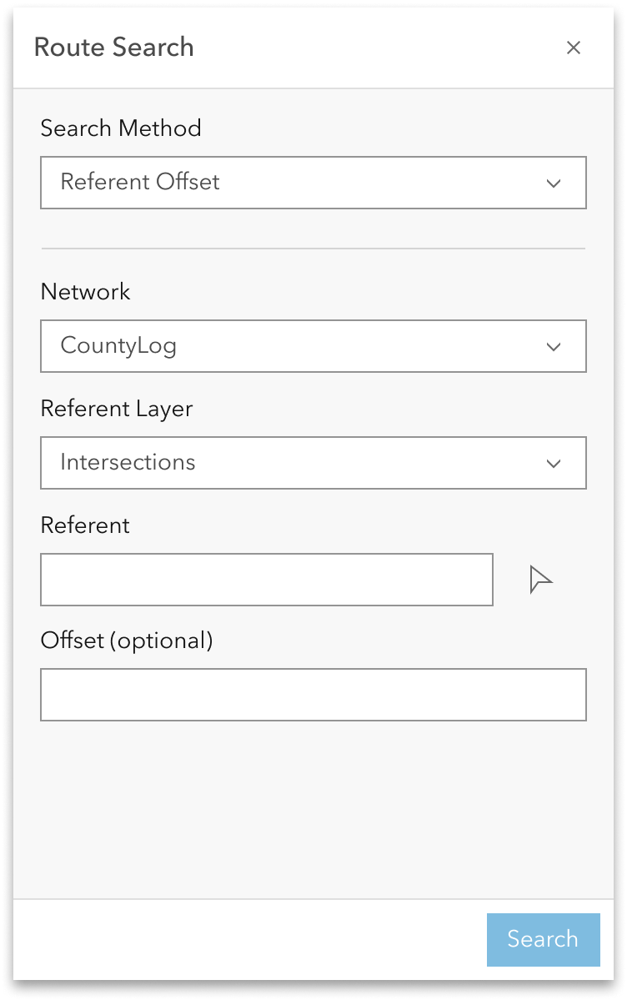

# Search by Referent Experience Builder widget

| Field | Value |
| --- | --- |
| **Doc** | 476 · User Story · Experience Builder |
| **Product** | Roads & Highways · Pipeline Referencing |
| **Release** | — |
| **Issues** | — |
| **Source** | [ExpBld SearchbyReferent.pptx](<https://esriis.sharepoint.com/sites/LocationReferencing/Shared%20Documents/General/ExpBld%20SearchbyReferent.pptx>) |
| **People** | author William Isley · PE — · dev — |
| **Edited** | 2023-10-27 00:19 by Nathan Easley |
| **Extracted** | 2026-09-04 · lane xmlstrip · format 3.0 · prompt v2.0.2 |
| **Keywords** | referent · route search · offset · event editor · experience builder widget · lrs editing |
| **Tools** | Route Search |

## Summary

This document describes a user story for an Experience Builder widget that enables Event Editors to search for routes using referent and offset values. It outlines the widget's functionality, configuration options, testing requirements, automation integration, and documentation updates. The widget supports multiple networks, referent layers, and handles valid and invalid input scenarios.

## Related documents

<!-- related:begin -->
- [Search by Coordinate Experience Builder widget](<https://esriis.sharepoint.com/sites/lrsworkspace/LRS Doc Index/User Stories/search-by-coordinate-exb-widget.md>) — similar text 0.70 · 4 title words · 3 filename words · same kind/surface/folder <!-- rel:487 s=7.138 -->
- [Search by Station Experience Builder widget User Story](<https://esriis.sharepoint.com/sites/lrsworkspace/LRS%20Doc%20Index/User%20Stories/search-by-station-exb-widget.md>) — similar text 0.63 · 4 title words · 3 filename words · same kind/surface/folder <!-- rel:490 s=7.017 -->
- [Search by Line Experience Builder widget](<https://esriis.sharepoint.com/sites/lrsworkspace/LRS Doc Index/User Stories/search-by-line-exb-widget.md>) — similar text 0.63 · 4 title words · 3 filename words · same kind/surface/folder <!-- rel:464 s=6.937 -->
- [Search by Route and Measure Experience Builder widget](<https://esriis.sharepoint.com/sites/lrsworkspace/LRS Doc Index/User Stories/search-by-route-and-measure-exb-widget.md>) — similar text 0.46 · 4 title words · 3 filename words · same kind/surface/folder <!-- rel:529 s=6.41 -->
- [Experience Builder Dynamic Segmentation widget](<https://esriis.sharepoint.com/sites/lrsworkspace/LRS Doc Index/User Stories/exb-dynseg-widget.md>) — similar text 0.26 · 3 title words · 2 filename words · same kind/surface/folder <!-- rel:362 s=5.003 -->
<!-- related:end -->

<!-- docs:begin -->
## Esri documentation

[Storing referent and offset information for event location](https://doc.esri.com/en/arcgis-pro/latest/help/production/roads-highways/storing-referent-and-offset-information-for-event-location.html)

_No page matched:_ [Route Search](https://www.google.com/search?q=%22Route%20Search%22+site%3Adoc.esri.com)
<!-- docs:end -->

---

## Story
### Search by Referent Experience Builder widget <!-- slide 1 -->
User Story

### User Story <!-- slide 2 -->
As an Event Editor, I need the ability to search for a route via referent and offset, so that I can properly locate and orient myself for LRS editing and analysis.

Persona
Event Editor: These users are responsible for making edits to route characteristics and assets.  Typically located in different business units/departments than the LRS route editors, these users have varied GIS experience, but a high level of knowledge about the characteristics they maintain (safety, pavement, crashes, etc.)  These users need to be able to search for a route via referent and offset to orient themselves on the map in preparation for event editing.

## Acceptance Criteria
### Search by Referent <!-- slide 3 -->
- Create another method in the Route Search widget called “Referents”
- Network should be whatever network was configured in the backstage configuration
- User can change the network in the UI to any valid LRS networks in the map
- The referent layer should include any point layer in the map
- The user can configure the Referent display field (see slide 5)
- The offset is optional; if it’s left empty treat it as 0
- (Should we include the map selection button for the referent?)
- All mockups can be found at https://www.figma.com/file/dIN1OfZDxhT7i9pbefdoTj/LRS?type=design&node-id=506-130104&mode=design&t=gS2mLbqfZq6Pwoqa-0

### Search by Referent <!-- slide 4 -->
- If the referent and/or offset value are invalid, provide a message that the coordinates provided aren’t valid
- When the user clicks search do the following:
  - Find all the routes/measures that are present at that referent/offset and return them in the results
  - Transition the widget to a results pane that shows the route(s)/measure(s) that are returned by the search
  - If no route/measure is present at the referent/offset, let the user know that no route/measure was found

### Search by Coordinates <!-- slide 5 -->
- Experience Builder widgets provide a backstage to configure options on a given widget
- Since this is an existing widget, additional options need to be exposed in the widget
  - Add referent as one the methods (default is route and measure)
  - Allow the user choose the default network
  - Allow the user to choose the default referent layer
  - Allow the user to choose the display field for the referent layer
  - Allow the user to choose the unit of measure for the offset

## Testing
<!-- slide 6 -->
- Test with APR and RH data
- Test on a variety of route shapes
- Test on projected and unprojected data
- Test with referent layers that are and are not LRS events
- Test with positive and negative offset values
- Test where a single result will be returned as well as multiple results
- Verify the tool aligns with any other Experience Builder specifications/requirements
- 508/l18n testing
- Test with different themes

## Automation
<!-- slide 7 -->
- Add automation to the existing Route and Measure automation for this tool

## Documentation
<!-- slide 8 -->
- Add to the existing Route and Measure widget documentation that covers this new method

## Assignment
<!-- slide 9 -->
Story Points:
Dev:
PE:
