# Search by Route User Story and Configuration

| Field | Value |
| --- | --- |
| **Doc** | 438 · User Story · Experience Builder |
| **Product** | Roads & Highways · Pipeline Referencing |
| **Release** | — |
| **Issues** | — |
| **Source** | [ExB_Searchbymeasure_station.pptx](<https://esriis.sharepoint.com/sites/LocationReferencing/Shared%20Documents/General/ExB_Searchbymeasure_station.pptx>) |
| **People** | author Praveen Kumar · PE — · dev — |
| **Edited** | 2024-01-10 22:29 by Praveen Kumar |
| **Extracted** | 2026-09-04 · lane xmlstrip · format 3.0 · prompt v2.0.2 |
| **Keywords** | search by route · route · measure · experience builder widget · network configuration · event editor |
| **Tools** | Search by Route |

## Summary

This document describes the user story and configuration details for the Search by Route Experience Builder widget. It covers the needs of event editors to search routes by route ID or name and measures, configuration options for networks and layers, UI behavior for single, multiple, and range measure searches, and testing and documentation plans.

## Related documents

<!-- related:begin -->
- [Search by Line and Measure User Story](<https://esriis.sharepoint.com/sites/lrsworkspace/LRS Doc Index/User Stories/search-by-line-and-measure.md>) — similar text 0.46 · 1 title word · same kind/surface/folder <!-- rel:380 s=4.924 -->
- [Search by Route and Measure Experience Builder widget](<https://esriis.sharepoint.com/sites/lrsworkspace/LRS Doc Index/User Stories/search-by-route-and-measure-exb-widget.md>) — similar text 0.38 · 2 title words · same kind/surface/folder <!-- rel:529 s=4.771 -->
- [Search by Station Experience Builder widget](<https://esriis.sharepoint.com/sites/lrsworkspace/LRS Doc Index/User Stories/search-by-station-experience-builder-widget__doc490.md>) — similar text 0.45 · 1 title word · 1 filename word · same kind/surface/folder <!-- rel:490 s=4.751 -->
- [Search by Route widget – configure network attribute fields](<https://esriis.sharepoint.com/sites/lrsworkspace/LRS Doc Index/User Stories/search-by-route-widget-configure-network-attribute-fields.md>) — similar text 0.36 · 2 title words · same kind/surface/folder <!-- rel:379 s=4.121 -->
- [Show Derived Network Information in Search by Route Widget](<https://esriis.sharepoint.com/sites/lrsworkspace/LRS Doc Index/User Stories/show-derived-network-information-in-search-by-route-widget.md>) — similar text 0.28 · 2 title words · same kind/surface/folder <!-- rel:377 s=3.996 -->
<!-- related:end -->

<!-- docs:begin -->
## Esri documentation

[Split a centerline by measure](https://doc.esri.com/en/arcgis-pro/latest/help/production/roads-highways/split-a-centerline-by-measure.html)

_No page matched:_ [Search by Route](https://www.google.com/search?q=%22Search%20by%20Route%22+site%3Adoc.esri.com)
<!-- docs:end -->

---

## Story
### Search by Route <!-- slide 1 -->
User Story

### User Story <!-- slide 2 -->
As an Event Editor, I need the ability to search for a specific route and measure combination or station(s), so that I can properly location and orient myself for LRS editing and analysis.

Persona
Event Editor: These users are responsible for making edits to route characteristics and assets.  Typically located in different business units/departments than the LRS route editors, these users have varied GIS experience, but a high level of knowledge about the characteristics they maintain (safety, pavement, crashes, etc.)  These users need to be able to search for routes and measures or station(s) to orient themselves on the map in preparation for event editing.

## Acceptance Criteria
### Configuration <!-- slide 3 -->
Clicking on the import all button should load all networks from the map.
Initial state of the configuration tool
Choose the map from the 'Select a map' dropdown.
Should be able to change the Label
When a layer is selected show the Layer configuration
Should be able to enable or disable the methods to show in dropdown
Should be able to sort the results by the selected field
default is RouteId  and RouteName for the line network
Should be able to set the search identifier default is RouteId
and  RouteName for the line network
Should be able to set the default method
Should be able to set sort for ascending or descending
Should be able to set the highlight color and width for the feature
Should be able to set the number of records to display in the search results page
Should be able to control the display of method in the UI
Should be able to control the display of Netrwork parameter in the UI
Set the default network if there are more than one network in the map
New
New

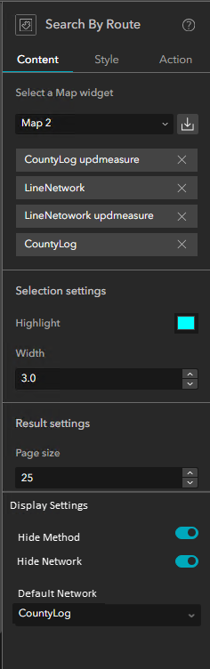

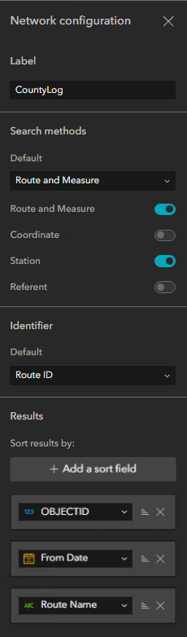

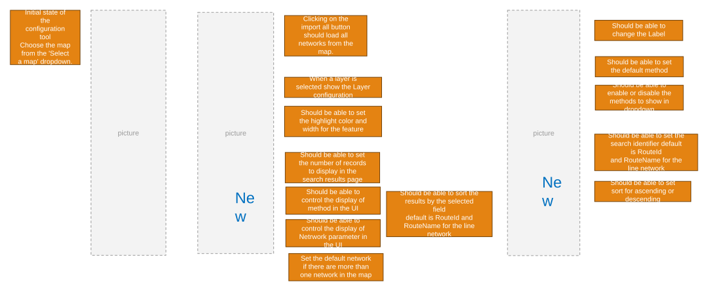

### Configuration <!-- slide 4 -->
Should be able to set the desired style settings
Should be able to enable or disable data actions
Should be able to set the symbols for the feature to display on map
Should be able select or deselect the data actions

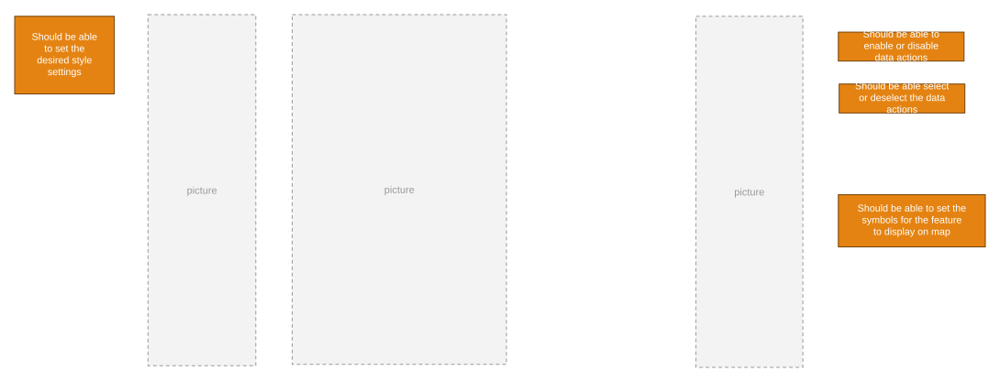

### Configuration <!-- slide 5 -->
- Should be able to import all the Network layers from the map using the Import all button.
- Provide a message when user clicks on Import all without selecting the map.
- If there is no LRS enabled service in the webmap, provide a message that no LRS enabled service is present.
- Should be able to reorder the imported layers.
- Allow only importing from a single map (if another map is chosen then clear the present layers before importing layers from different map).
- Provide an error message if there are no Network layers in map.
- Provide a message if the map has layers from more than one service.
- If there are more than one web map, list all those in the ‘Select a map’ dropdown.
- Should be able to remove any layer using x button next to the layer.
- Should be able to set the Highlight color and width for the selected feature.
- Should be able to set the number of records to display in the results page (page size).
- Should be able to control the display of Method parameter.New
- Should be able to set the default Network (if only one network available choose it by default). New
- Should be able to control the display of Network parameter. New

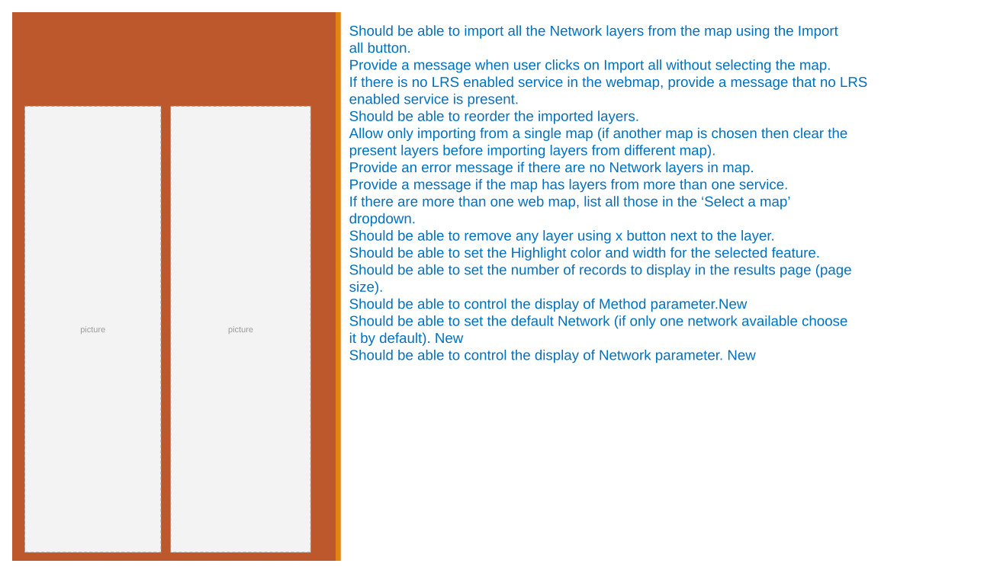

### Network Configuration <!-- slide 6 -->
- Layer configuration should be displayed when a layer is selected.
- Should be able to change the label for the layer.
- ‘Route and Measure’ should be default for the search methods.
- Should be able to show / hide different Search methods.
- Should be able to set the search identifier for the Network (RouteID/ RouteName).
- RouteID should be default identifier for nonline network.
- RouteName should be default identifier for line network.
- Multifield  route ID should be default identifier for multifield routeid network.
- Should be able to set the sort field for the Network(RouteID/ RouteName).
- Should be able add the sort by single or multiple fields. New
- Multiple sort fields should be able to add using the ‘Add a sort field’ button. New
- Should be able to set the sort to ascending or descending for each sort field. New
- Allow the user to choose whether the routeID, route name, or the multi fields that make up the concatenated routeID appear when the widget it launched

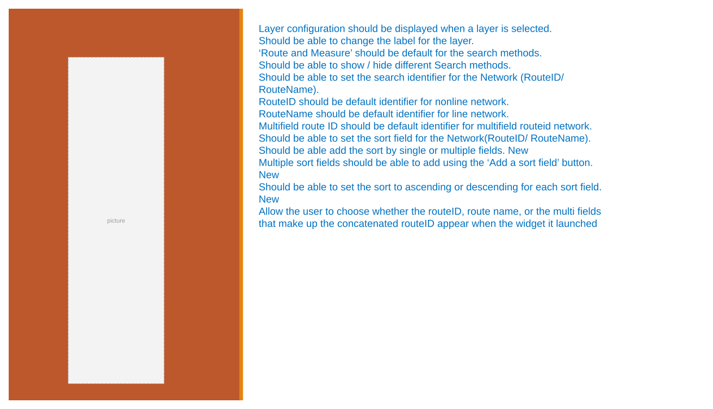

### Network Configuration <!-- slide 7 -->
- When the identifier is set for Multi field route ID, allow the fields to select / deselect to show in the UI.
- Allow reordering the identifier fields.
- Provide option to set the label color (route and measure) New

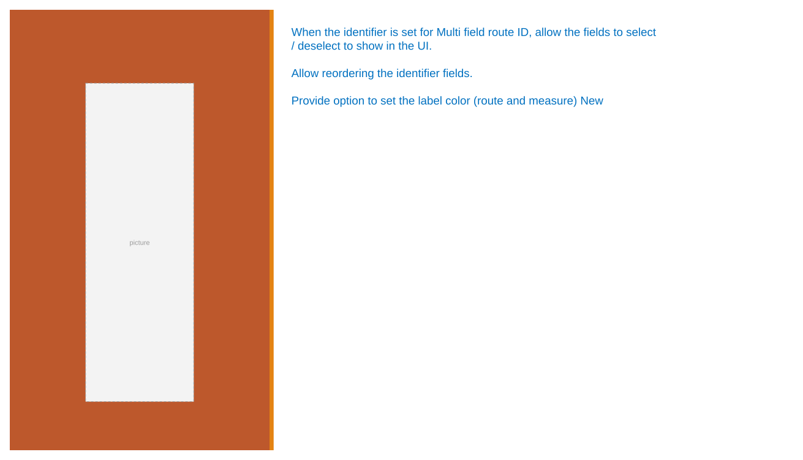

### Search by Route <!-- slide 8 -->
- Create an Experience Builder widget called Search by Route that will allow the user to search for an entire route or a portion of a route.
- Allow the user to populate the RouteID or Route Name (either a single field or the composite fields depending on the configuration) as well as the From and To Measure in the UI.
- The RouteID/Route Name is required, the measures are optional.
- The user can search for a single measure, multiple measures on the route or a range. New
- Provide an intellisense experience for the RouteID/RouteName.
- Allow wild card search (please use pro standard wildcards) New
- Measures should be in whatever unit is configured for the LRS Network.
- Measures can be in stationing format (0+00).
- If the route is invalid, provide a message that the route could not be found.
- If the measure(s) are invalid, provide a message that the measures could not be found on the route.
- Mark the required parameters with an *. New
- If there are multiple networks allow the user to change the network using the pencil button.
- If there are multiple methods allow the user to change the method using the pencil button.

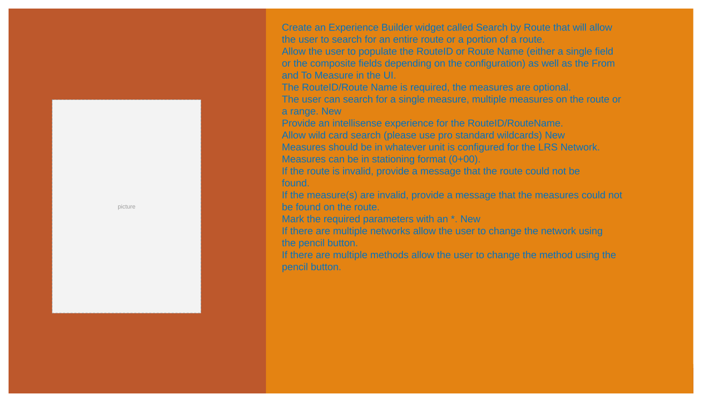

### Search by Route <!-- slide 9 -->
- If the Method is configured to hide, then do not show the method parameter in the UI and use the default method set for the Network.New
- If the Network is configured to hide, then do not show the Network parameter in the UI and use the default Network for search.New
- If there are multiple networks allow the user to change the network using the pencil button.
- If the Method and Network are configured to hide, then do not show the Method or Network parameter in the UI and use the default method set for the Network and default network.New
- Use field alias in the configuration and widget.New

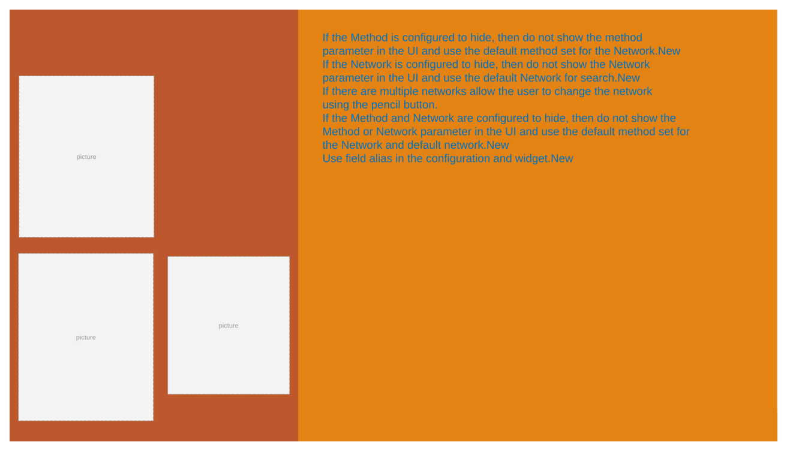

### Search by Route <!-- slide 10 -->
- Search button should be disabled until required parameters are provided.
- With Single option, When the user enter routeid and clicks search do the following:
  - Find the route(s)
  - Transition the widget to a results pane that shows the route(s) that are returned by the search.
- When a record is selected from the results:
  - Zoom to that route on the map
  - Highlight the route
  - Display route label (as per cartographic standards, for example do not place overlapping labels) New

549095

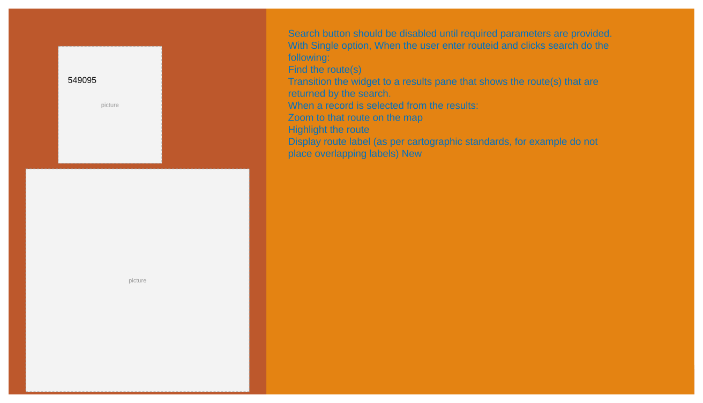

### Search by Route <!-- slide 11 -->
- If Multiple is chosen, then show two measure boxes.New
- If the user wants to locate more than two measures / stations on the route, they can use the ‘Add Another Measure’ button and another box will appear in the UI.New
- The additional measures can be removed using the x button which is visible on hover.New
- When the user enters routeid and measure(s), clicks search do the following:
  - Find the route and measure(s)
  - Transition the widget to a results pane that shows the route(s) that are returned by the search.
- When a record is selected from the results:
  - Zoom to that route and measure on the map
  - Highlight the route and the single measure location
  - Display route and measure label (as per cartographic standards, for example do not place overlapping labels) New
- Measures can be in either US (0+00.00) or Metric (0+000.00) stationing format

0.05

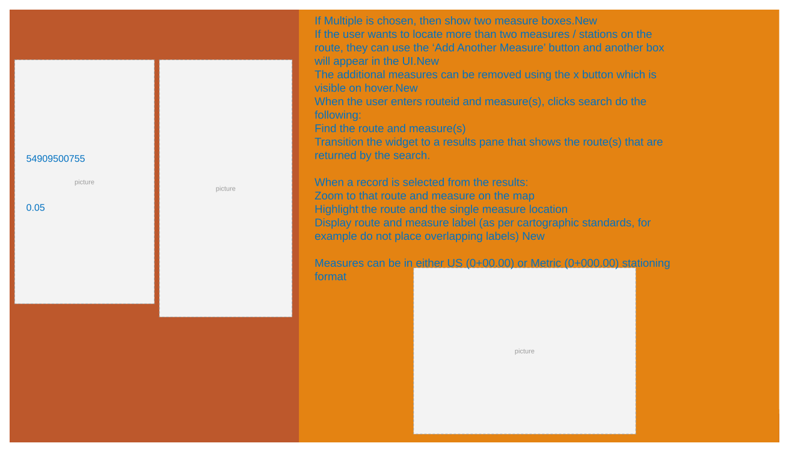

### Search by Route <!-- slide 12 -->
- If Range is chosen, then show From measure and To Measure
- When the user provides route and range information and clicks search do the following:
  - Find the route and measure range
  - Transition the widget to a results pane that shows the route(s) that are returned by the search.
- When a record is selected from the results:
  - Zoom to that route and measure range on the map
  - Highlight the route and measure range
  - Display route and measures label (as per cartographic standards, for example do not place overlapping labels) New
  - Display an arrow at the end to denote the direction. New

0.05
0

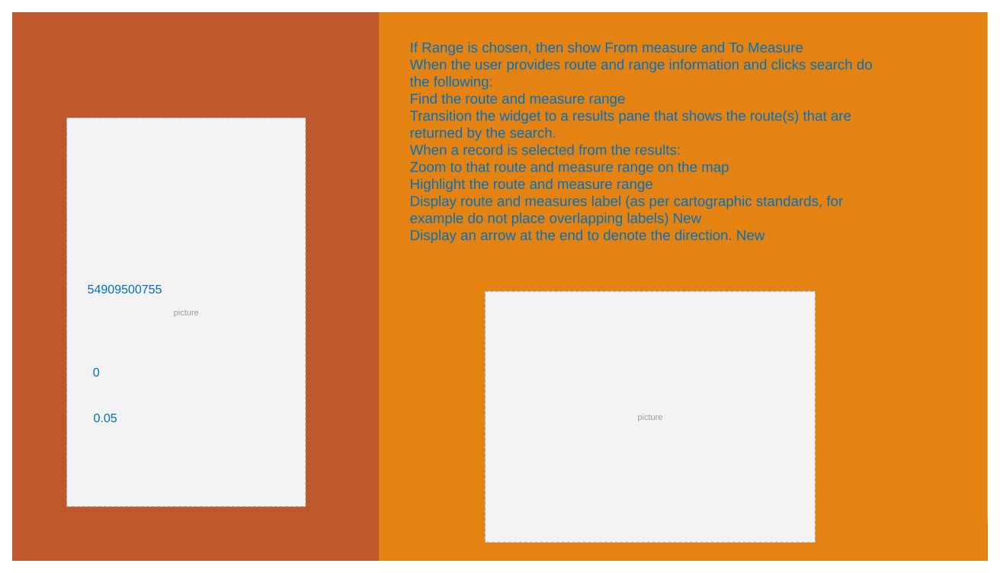

### Search by Route <!-- slide 13 -->
- If the network is configured for Multifield RouteId, show the fields (selected in the configuration) in the UI.
- If the user provides values in one or more fields and clicks search, then find the matching routes and display in the results pane.

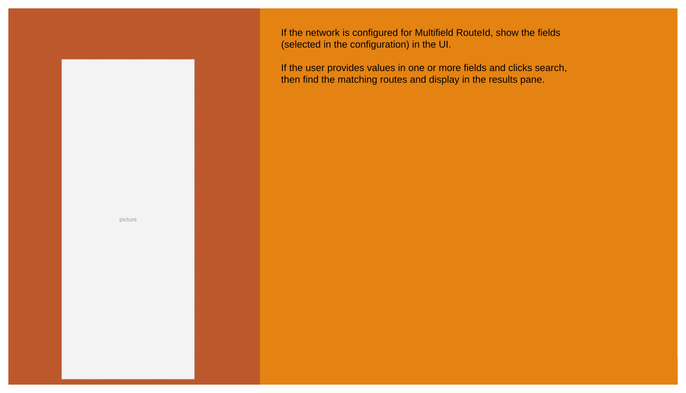

### Search by Route <!-- slide 14 -->
- Test with a mix of APR and RH data
- Test on projected and unprojected data
- Test with both networks with RouteID and RouteName configured
- Test with network with different units of measure configured
- Verify the tool aligns with any other Experience Builder specifications/requirements
- 508/l18n testing
- Test with different themes
- Test on a variety of route shapes to ensure the stations are found at the correct location on the route
- Test in Chrome, Edge, Firefox.
- Test in different sizes (web, tab and mobile).
- Test the config and UI holistically (including existing and new functionalities)

Testing

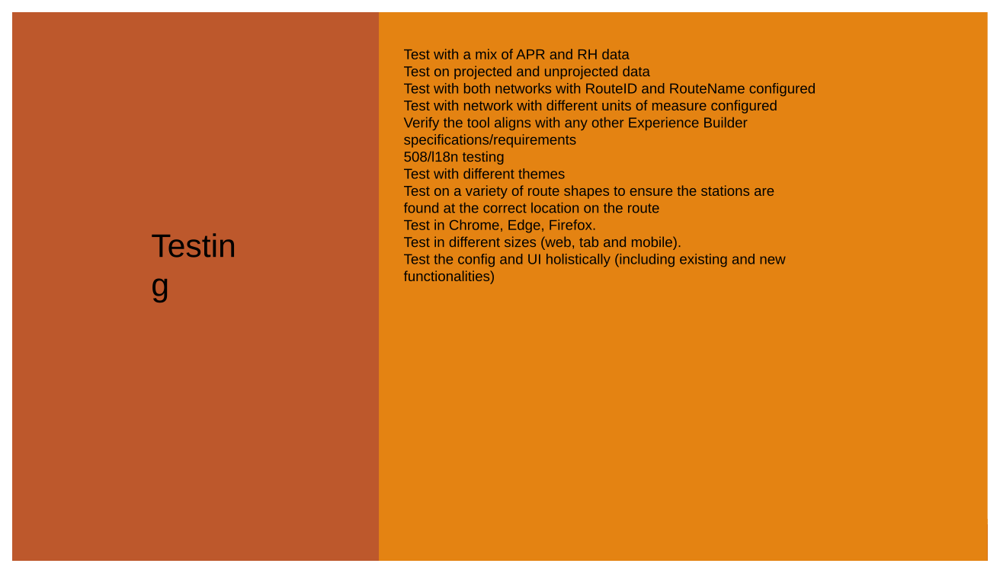

### Search by Route <!-- slide 15 -->
Automate the tool following the process outlined by Lakshmi in her spike earlier this year
Automation

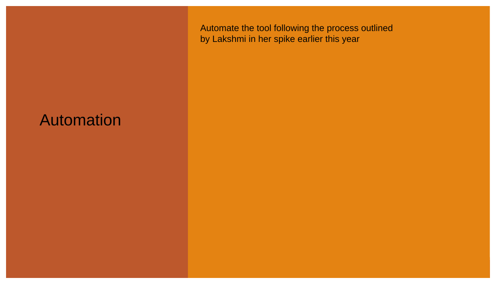

### Search by Route <!-- slide 16 -->
- Create a documentation topic for this widget that follows the same format used in https://doc.arcgis.com/en/experience-builder/11.1/configure-widgets/widgets-overview.htm
- Create a separate topic for search by route in the identified location
- Make sure to include graphic examples in the doc.
Documentation

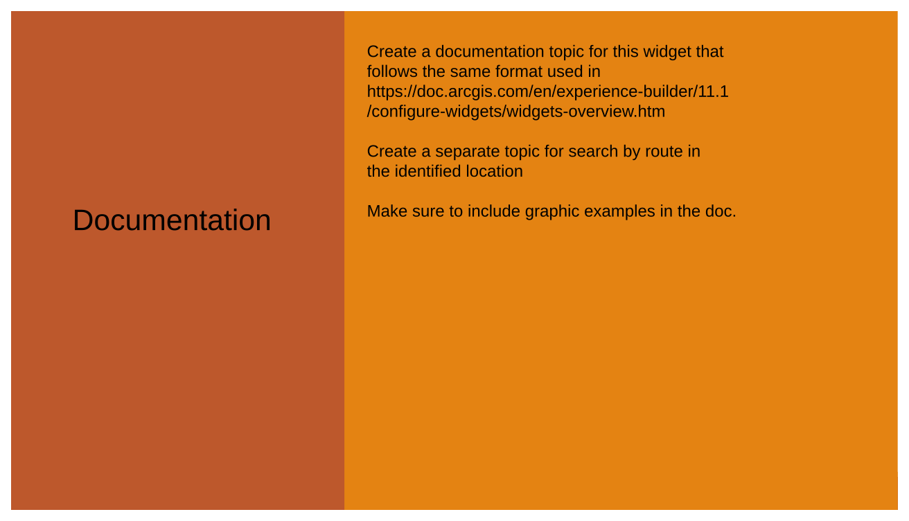

### Search by Route <!-- slide 17 -->
Story Points:
Dev:
PE:
Assignment

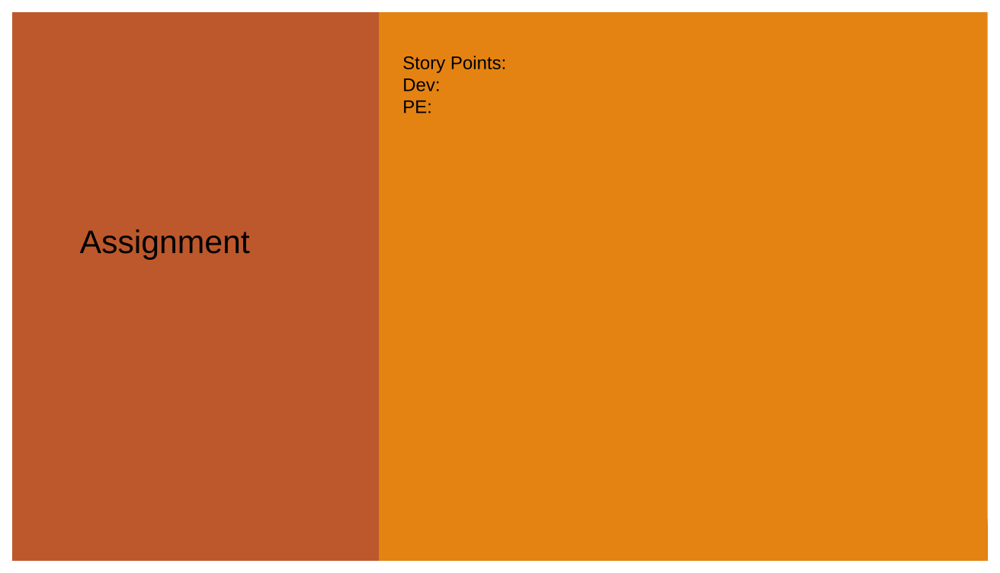
