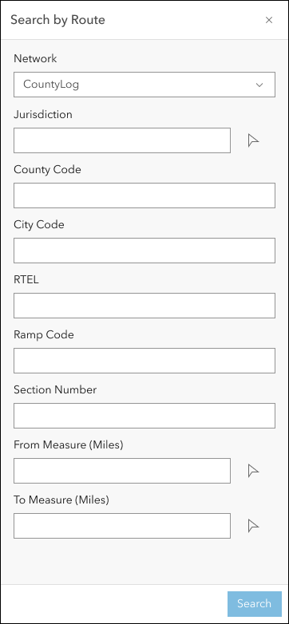
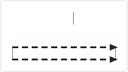

# Search by Route and Measure Experience Builder widget

|   |   |
| --- | --- |
| **Kind** | User Story · Experience Builder |
| **Release** | — |
| **Product** | Roads & Highways · Pipeline Referencing |
| **Source** | [ExpBld SearchbyRouteMeas.pptx](<https://esriis.sharepoint.com/sites/LocationReferencing/Shared%20Documents/General/ExpBld%20SearchbyRouteMeas.pptx>) |
| **Edited** | 2023-08-04 15:48 by Nathan Easley |
| **Extracted** | 2026-09-04 · lane `xmlstrip` |

<!-- metadata
```yaml
title: "Search by Route and Measure Experience Builder widget"
source_file: "ExpBld SearchbyRouteMeas.pptx"
source_url: "https://esriis.sharepoint.com/sites/LocationReferencing/Shared%20Documents/General/ExpBld%20SearchbyRouteMeas.pptx"
doc_id: 529
doc_kind: "User Story"
surface: "Experience Builder"
doc_revision: ""
target_release: ""
pe: ""
dev: ""
author: "William Isley"
last_edited_by: "Nathan Easley"
last_edited: "2023-08-04T15:48:31Z"
extracted: 2026-09-04
extraction_lane: xmlstrip
prompt_version: "v2.0.2"
keywords: ["route", "measure", "search", "experience builder widget", "event editor", "lrs network", "intellisense"]
tools: ["Search by Route"]
products: ["Roads & Highways", "Pipeline Referencing"]
issues: []
related: [{"doc":464,"file":"search-by-line-experience-builder-widget__doc464.md","s":6.972},{"doc":490,"file":"search-by-station-experience-builder-widget-user-story__doc490.md","s":6.801},{"doc":487,"file":"search-by-coordinate-experience-builder-widget__doc487.md","s":6.495},{"doc":476,"file":"search-by-referent-experience-builder-widget__doc476.md","s":6.41},{"doc":362,"file":"experience-builder-dynamic-segmentation-widget__doc362.md","s":5.809}]
```
-->

## Summary

User story describing the creation of a Search by Route and Measure widget for Experience Builder. The widget allows users to search for routes and measures to assist in LRS event editing and analysis, with configurable options and validation messages. Testing, automation, and documentation plans are included.

## Related documents

<!-- related:begin -->
- [Search by Line Experience Builder widget](<https://esriis.sharepoint.com/sites/lrsworkspace/LRS Doc Index/User Stories/search-by-line-experience-builder-widget__doc464.md>) — similar text 0.56 · 4 title words · 3 filename words · same kind/surface/folder <!-- rel:464 -->
- [Search by Station Experience Builder widget User Story](<https://esriis.sharepoint.com/sites/lrsworkspace/LRS%20Doc%20Index/User%20Stories/search-by-station-experience-builder-widget-user-story__doc490.md>) — similar text 0.50 · 4 title words · 3 filename words · same kind/surface/folder <!-- rel:490 -->
- [Search by Coordinate Experience Builder widget](<https://esriis.sharepoint.com/sites/lrsworkspace/LRS Doc Index/User Stories/search-by-coordinate-experience-builder-widget__doc487.md>) — similar text 0.44 · 4 title words · 3 filename words · same kind/surface/folder <!-- rel:487 -->
- [Search by Referent Experience Builder widget](<https://esriis.sharepoint.com/sites/lrsworkspace/LRS Doc Index/User Stories/search-by-referent-experience-builder-widget__doc476.md>) — similar text 0.46 · 4 title words · 3 filename words · same kind/surface/folder <!-- rel:476 -->
- [Experience Builder Dynamic Segmentation widget](<https://esriis.sharepoint.com/sites/lrsworkspace/LRS Doc Index/User Stories/experience-builder-dynamic-segmentation-widget__doc362.md>) — similar text 0.28 · 3 title words · 2 filename words · same kind/surface/folder <!-- rel:362 -->
<!-- related:end -->

<!-- docs:begin -->
## Esri documentation

[Split a centerline by measure](https://doc.esri.com/en/arcgis-pro/latest/help/production/roads-highways/split-a-centerline-by-measure.html) · [LRS network](https://doc.esri.com/en/arcgis-pro/latest/help/production/location-referencing-pipelines/what-is-an-lrs-network.html)

_No page matched:_ [Search by Route](https://www.google.com/search?q=%22Search%20by%20Route%22+site%3Adoc.esri.com)
<!-- docs:end -->

---

## Slide 1 — Search by Route and Measure Experience Builder widget

User Story

## Slide 2 — User Story

As an Event Editor, I need the ability to search for a specific route and measure combination, so that I can properly location and orient myself for LRS editing and analysis.

Persona
Event Editor: These users are responsible for making edits to route characteristics and assets.  Typically located in different business units/departments than the LRS route editors, these users have varied GIS experience, but a high level of knowledge about the characteristics they maintain (safety, pavement, crashes, etc.)  These users need to be able to search for routes and measures to orient themselves on the map in preparation for event editing.

## Slide 3 — Search by Route and Measure widget

Create an Experience Builder widget called Search by Route that will allow the user to search for an entire route or a portion of a route
Allow the user to populate the RouteID or Route Name (either a single field or the composite fields depending on the configuration) as well as the From and To Measure in the UI
The RouteID/Route Name is required, the measures are optional (the user can search for a single measure on the route or a range)
Provide an intellisense experience for the RouteID/RouteName
Measures should be in whatever unit is configured for the LRS Network
If the route is invalid, provide a message that the route could not be found
If the measure(s) are invalid, provide a message that the measures could not be found on the route
All mockups can be found at https://www.figma.com/file/dIN1OfZDxhT7i9pbefdoTj/LRS?type=design&node-id=506-130104&mode=design&t=gS2mLbqfZq6Pwoqa-0



## Slide 4 — Search by Route and Measure widget

Experience Builder widgets provide a backstage to configure options on a given widget; expose the following options to be configured for this widget

  - Require the user to configure a map/feature service that is LRS enabled
  - Allow the user to choose the LRS Network that will appear when the widget is launched (if only one LRS Network exists in the service, choose that one and don’t allow the user to choose).  Default is the first LRS Network in the service.
  - Allow the user to choose whether the routeID, route name, or the composite fields that make up the concatenated routeID appear when the widget it launched (default to align with the LRS Network selected above; route name if it’s a network with line support or routeID if it doesn’t have line support)
  - Allow the user to configure the highlight color for the route on the map


## Slide 5 — Search by Route and Measure widget



If the route is invalid, provide a message that the route could not be found
If the measure(s) are invalid, provide a message that the measures could not be found on the route

When the user clicks search do the following:

  - Find the route and measure (or measure range)
  - Zoom to that route and measure on the map
  - Highlight the route (or the single measure location or the measure range)
  - Provide a popup that shows the routeID (and routename if configured) with the option to launch the Add Point widget (if a single measure was searched) or the Add Line widget (if no measures or both from/to measure were searched) (Note this might need to wait until those widgets are created to properly implement)


## Slide 6 — Testing

Test with a mix of APR and RH data
Test with both network with RouteID and RouteName configured
Test with network with different units of measure configured
Verify the tool aligns with any other Experience Builder specifications/requirements

## Slide 7 — Automation

Automate the tool following the process outlined by Lakshmi in her spike earlier this year (she’ll be leading the configuration and upkeep of this area of automation for the team)

## Slide 8 — Documentation

Create a documentation topic for this widget that follows the same format used in https://doc.arcgis.com/en/experience-builder/11.1/configure-widgets/widgets-overview.htm
We’re not sure where this widget will live within that topic at this time (need to confirm with the Experience Builder team), but the topic can at least follow the same format as others

## Slide 9 — Assignment

Story Points:
Dev:
PE:
