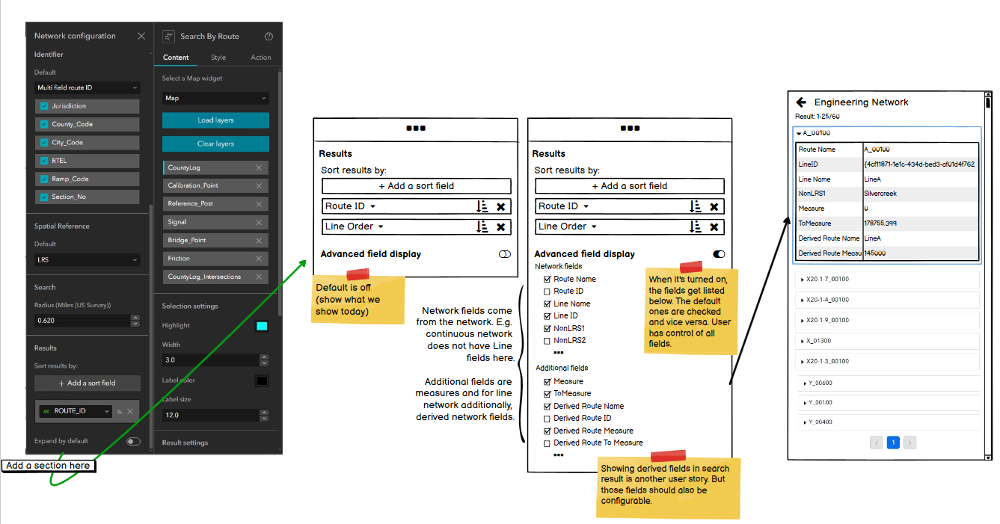
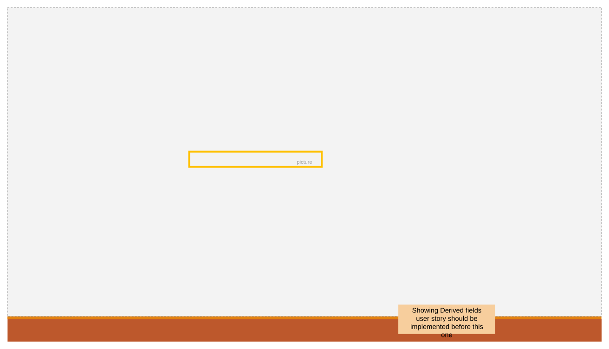
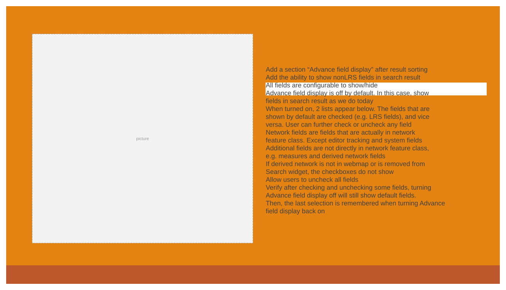
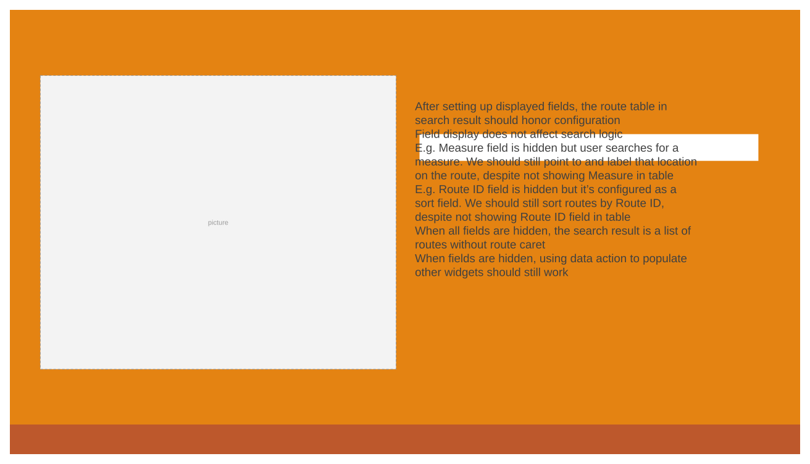
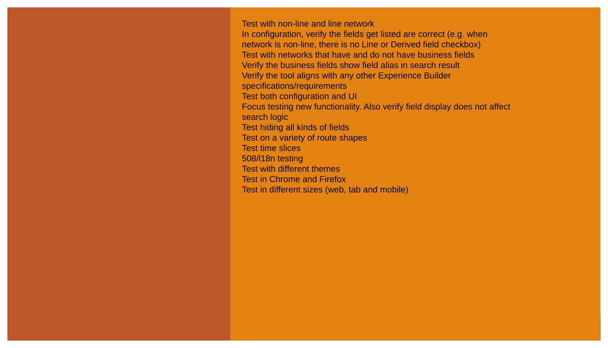
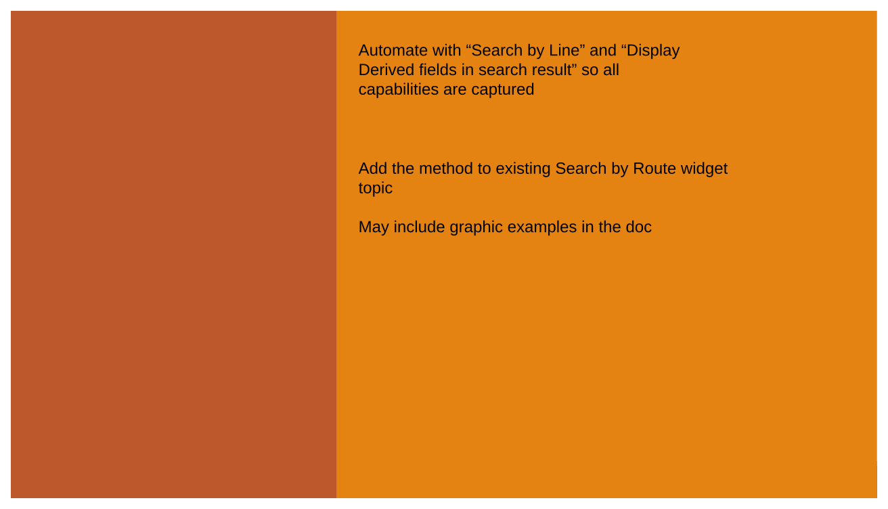

# Search by Route widget – configure network attribute fields

| Field | Value |
| --- | --- |
| **Doc** | 379 · User Story · Experience Builder |
| **Product** | — |
| **Release** | — |
| **Issues** | — |
| **Source** | [SearchbyRoute_ConfigFields.pptx](<https://esriis.sharepoint.com/sites/LocationReferencing/Shared%20Documents/General/SearchbyRoute_ConfigFields.pptx>) |
| **People** | author Praveen Kumar · PE — · dev — |
| **Edited** | 2024-05-08 16:11 by Claire Wang |
| **Extracted** | 2026-09-04 · lane xmlstrip · format 3.0 · prompt v2.0.2 |
| **Keywords** | search by route · network attribute fields · nonLRS attributes · event editor · field display · experience builder |
| **Tools** | Search by Route |

## Summary

This document describes a user story for the Search by Route widget focusing on configuring network attribute fields to show or hide nonLRS and LRS fields in search results. It details configuration options, user needs, testing scenarios, and automation documentation for the widget. The goal is to enhance event editors' ability to efficiently retrieve and display route information relevant to their analysis and editing tasks.

## Related documents

<!-- related:begin -->
- [Search by Route widget – results flow into table](<https://esriis.sharepoint.com/sites/lrsworkspace/LRS Doc Index/User Stories/search-by-route-widget-results-flow-into-table.md>) — similar text 0.37 · 3 title words · 2 filename words · same kind/surface/folder <!-- rel:378 s=5.689 -->
- [Show Derived Network Information in Search by Route Widget](<https://esriis.sharepoint.com/sites/lrsworkspace/LRS Doc Index/User Stories/show-derived-network-information-in-search-by-route-widget.md>) — similar text 0.36 · 4 title words · 2 filename words · same kind/surface/folder <!-- rel:377 s=5.647 -->
- [Search by Line and Measure User Story](<https://esriis.sharepoint.com/sites/lrsworkspace/LRS%20Doc%20Index/User%20Stories/search-by-line-and-measure.md>) — similar text 0.42 · 1 title word · 1 filename word · same kind/surface/folder <!-- rel:380 s=4.562 -->
- [Search by Station Experience Builder widget User Story](<https://esriis.sharepoint.com/sites/lrsworkspace/LRS%20Doc%20Index/User%20Stories/search-by-station-exb-widget.md>) — similar text 0.33 · 2 title words · 1 filename word · same kind/surface/folder <!-- rel:490 s=4.093 -->
- [Search by Referent Experience Builder widget](<https://esriis.sharepoint.com/sites/lrsworkspace/LRS Doc Index/User Stories/search-by-referent-exb-widget.md>) — similar text 0.35 · 2 title words · 1 filename word · same kind/surface/folder <!-- rel:476 s=4.035 -->
<!-- related:end -->

<!-- docs:begin -->
## Esri documentation

_No page matched:_ [Search by Route](https://www.google.com/search?q=%22Search%20by%20Route%22+site%3Adoc.esri.com)
<!-- docs:end -->

---

## Story
### Search by Route widget – configure network attribute fields <!-- slide 1 -->
User Story

### User Story <!-- slide 2 -->
As an Event Editor, I need the ability to show nonLRS attribute fields in search result. I also need the experience of configuring show/hide for all attribute fields, so that I can efficiently retrieve route information that is needed.

Persona
Event Editor: These users are responsible for analyzing route characteristics and assets.  Typically located in different business units/departments than the LRS route editors, these users have varied GIS experience, but a high level of knowledge about the characteristics they maintain (safety, pavement, crashes, etc.)  These users need the configuration of what network attribute fields are displayed or not, to orient themselves on the map in preparation for event editing.

## Acceptance Criteria
<!-- slide 3 -->
Showing Derived fields user story should be implemented before this one

### Configuration <!-- slide 4 -->
- Add a section “Advance field display” after result sorting
- Add the ability to show nonLRS fields in search result
- All fields are configurable to show/hide
- Advance field display is off by default. In this case, show fields in search result as we do today
- When turned on, 2 lists appear below. The fields that are shown by default are checked (e.g. LRS fields), and vice versa. User can further check or uncheck any field
  - Network fields are fields that are actually in network feature class. Except editor tracking and system fields
  - Additional fields are not directly in network feature class, e.g. measures and derived network fields
  - If derived network is not in webmap or is removed from Search widget, the checkboxes do not show
- Allow users to uncheck all fields
- Verify after checking and unchecking some fields, turning Advance field display off will still show default fields. Then, the last selection is remembered when turning Advance field display back on

### Search result <!-- slide 5 -->
- After setting up displayed fields, the route table in search result should honor configuration
- Field display does not affect search logic
  - E.g. Measure field is hidden but user searches for a measure. We should still point to and label that location on the route, despite not showing Measure in table
  - E.g. Route ID field is hidden but it’s configured as a sort field. We should still sort routes by Route ID, despite not showing Route ID field in table
- When all fields are hidden, the search result is a list of routes without route caret
- When fields are hidden, using data action to populate other widgets should still work

### Configure network attribute fields Testing <!-- slide 6 -->
- Test with non-line and line network
  - In configuration, verify the fields get listed are correct (e.g. when network is non-line, there is no Line or Derived field checkbox)
- Test with networks that have and do not have business fields
- Verify the business fields show field alias in search result
- Verify the tool aligns with any other Experience Builder specifications/requirements
- Test both configuration and UI
  - Focus testing new functionality. Also verify field display does not affect search logic
- Test hiding all kinds of fields
- Test on a variety of route shapes
- Test time slices
- 508/l18n testing
- Test with different themes
- Test in Chrome and Firefox
- Test in different sizes (web, tab and mobile)

### Configure network attribute fields Automation Documentation <!-- slide 7 -->
Automate with “Search by Line” and “Display Derived fields in search result” so all capabilities are captured
Add the method to existing Search by Route widget topic

May include graphic examples in the doc

### Configure network attribute fields Assignment <!-- slide 8 -->
Story Points:
Dev:
PE:

