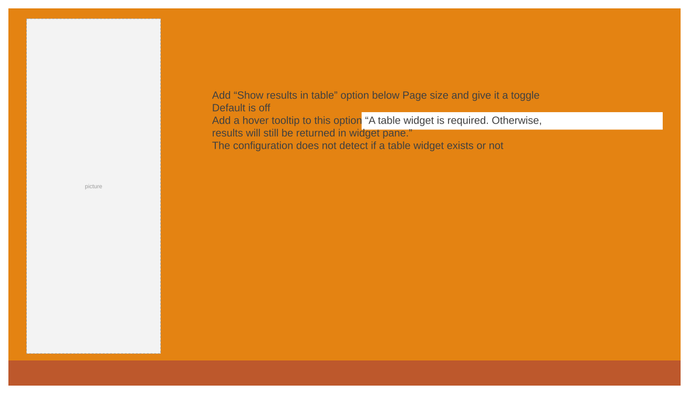
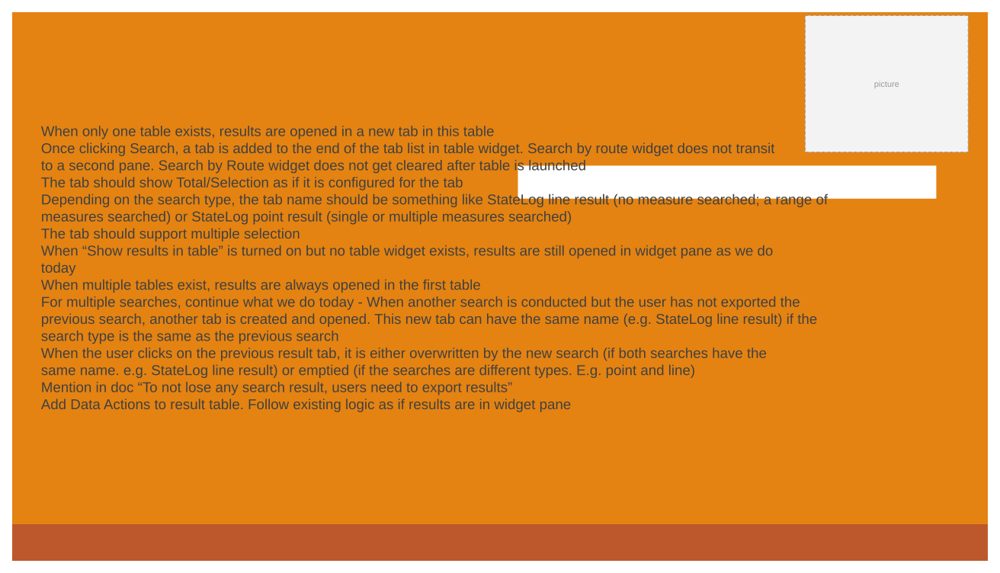
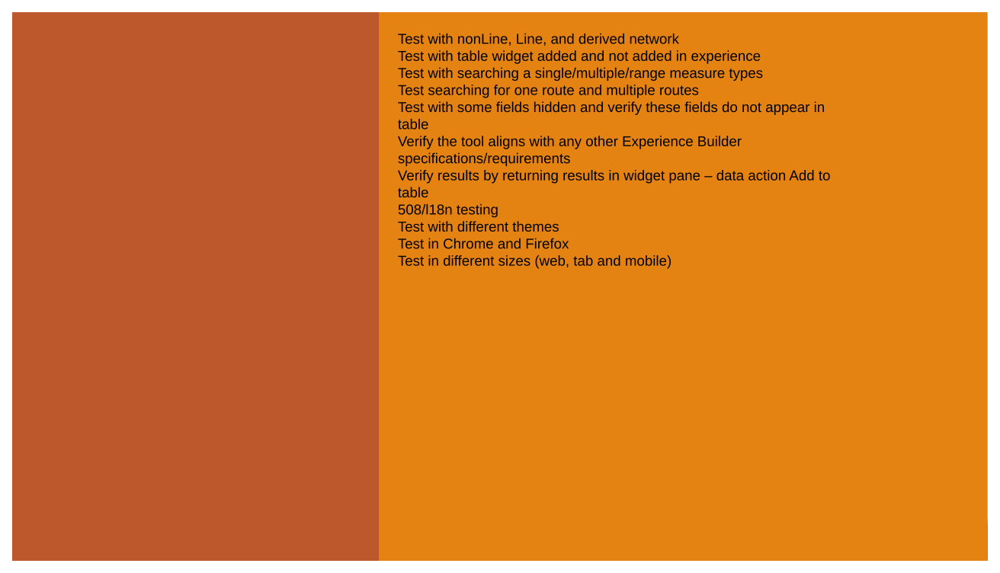
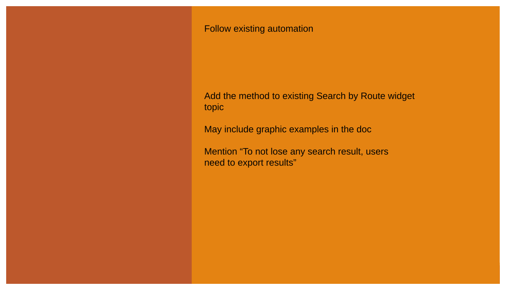

# Search by Route widget – results flow into table

| Field | Value |
| --- | --- |
| **Doc** | 378 · User Story · Experience Builder |
| **Product** | — |
| **Release** | — |
| **Issues** | — |
| **Source** | [SearchbyRoute_ResultsInTable.pptx](<https://esriis.sharepoint.com/sites/LocationReferencing/Shared%20Documents/General/SearchbyRoute_ResultsInTable.pptx>) |
| **People** | author Praveen Kumar · PE — · dev — |
| **Edited** | 2024-05-06 22:30 by Claire Wang |
| **Extracted** | 2026-09-04 · lane xmlstrip · format 3.0 · prompt v2.0.2 |
| **Keywords** | search by route · event editor · search results · table widget · experience builder · route information |
| **Tools** | Search by Route |

## Summary

Describes a user story for the Search by Route widget to configure search results to open in a table instead of the widget pane. Covers configuration options, expected behavior with single or multiple tables, and testing requirements including accessibility and browser compatibility. Includes notes on automation documentation and assignment details.

## Related documents

<!-- related:begin -->
- [Search by Route widget – configure network attribute fields](<https://esriis.sharepoint.com/sites/lrsworkspace/LRS Doc Index/User Stories/search-by-route-widget-configure-network-attribute-fields.md>) — similar text 0.37 · 3 title words · 2 filename words · same kind/surface/folder <!-- rel:379 s=5.689 -->
- [Search by Route Results Table Test Plan](<https://esriis.sharepoint.com/sites/lrsworkspace/LRS%20Doc%20Index/Test%20Plans/search-by-route-results-table.md>) — similar text 0.37 · 4 title words · 2 filename words · same surface <!-- rel:350 s=5.411 -->
- [Show Derived Network Information in Search by Route Widget](<https://esriis.sharepoint.com/sites/lrsworkspace/LRS Doc Index/User Stories/show-derived-network-information-in-search-by-route-widget.md>) — similar text 0.37 · 3 title words · 2 filename words · same kind/surface/folder <!-- rel:377 s=5.277 -->
- [Search by Route and Measure Experience Builder widget](<https://esriis.sharepoint.com/sites/lrsworkspace/LRS Doc Index/User Stories/search-by-route-and-measure-exb-widget.md>) — similar text 0.28 · 3 title words · 2 filename words · same kind/surface/folder <!-- rel:529 s=4.9 -->
- [Search by Line and Measure User Story](<https://esriis.sharepoint.com/sites/lrsworkspace/LRS%20Doc%20Index/User%20Stories/search-by-line-and-measure.md>) — similar text 0.32 · 1 title word · 1 filename word · same kind/surface/folder <!-- rel:380 s=4.256 -->
<!-- related:end -->

<!-- docs:begin -->
## Esri documentation

_No page matched:_ [Search by Route](https://www.google.com/search?q=%22Search%20by%20Route%22+site%3Adoc.esri.com)
<!-- docs:end -->

---

## Story
### Search by Route widget – results flow into table <!-- slide 1 -->
User Story

### User Story <!-- slide 2 -->
As an Event Editor, I need the ability to configure how search result is opened because I want the results to open in a table instead of in the widget pane. This way, I can efficiently retrieve and view route information that is needed.

Persona
Event Editor: These users are responsible for analyzing route characteristics and assets.  Typically located in different business units/departments than the LRS route editors, these users have varied GIS experience, but a high level of knowledge about the characteristics they maintain (safety, pavement, crashes, etc.)  These users need the configuration to open the search results in a table instead of the widget pane to orient themselves in preparation for event editing.

## Acceptance Criteria
### Configuration <!-- slide 3 -->
- Add “Show results in table” option below Page size and give it a toggle
- Default is off
- Add a hover tooltip to this option “A table widget is required. Otherwise, results will still be returned in widget pane.”
- The configuration does not detect if a table widget exists or not

### Search result <!-- slide 4 -->
- When only one table exists, results are opened in a new tab in this table
  - Once clicking Search, a tab is added to the end of the tab list in table widget. Search by route widget does not transit to a second pane. Search by Route widget does not get cleared after table is launched
  - The tab should show Total/Selection as if it is configured for the tab
  - Depending on the search type, the tab name should be something like StateLog line result (no measure searched; a range of measures searched) or StateLog point result (single or multiple measures searched)
  - The tab should support multiple selection
- When “Show results in table” is turned on but no table widget exists, results are still opened in widget pane as we do today
- When multiple tables exist, results are always opened in the first table
- For multiple searches, continue what we do today - When another search is conducted but the user has not exported the previous search, another tab is created and opened. This new tab can have the same name (e.g. StateLog line result) if the search type is the same as the previous search
  - When the user clicks on the previous result tab, it is either overwritten by the new search (if both searches have the same name. e.g. StateLog line result) or emptied (if the searches are different types. E.g. point and line)
  - Mention in doc “To not lose any search result, users need to export results”
- Add Data Actions to result table. Follow existing logic as if results are in widget pane

### Search results flow into table Testing <!-- slide 5 -->
- Test with nonLine, Line, and derived network
- Test with table widget added and not added in experience
- Test with searching a single/multiple/range measure types
- Test searching for one route and multiple routes
- Test with some fields hidden and verify these fields do not appear in table
- Verify the tool aligns with any other Experience Builder specifications/requirements
- Verify results by returning results in widget pane – data action Add to table
- 508/l18n testing
- Test with different themes
- Test in Chrome and Firefox
- Test in different sizes (web, tab and mobile)

### Search results flow into table Automation Documentation <!-- slide 6 -->
Follow existing automation
Add the method to existing Search by Route widget topic

May include graphic examples in the doc

Mention “To not lose any search result, users need to export results”

### Search results flow into table Assignment <!-- slide 7 -->
Story Points:
Dev:
PE:

