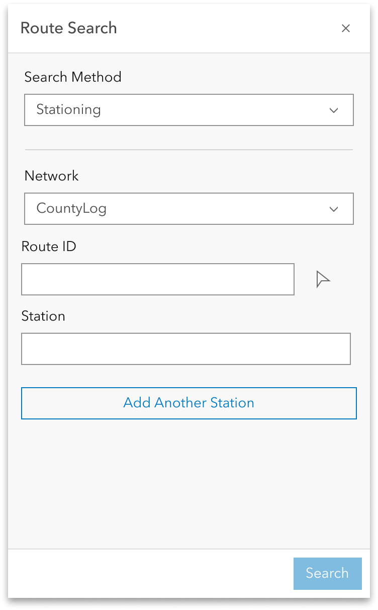

# Search by Station Experience Builder widget User Story

| Field | Value |
| --- | --- |
| **Doc** | 490 · User Story · Experience Builder |
| **Product** | Pipeline Referencing |
| **Release** | — |
| **Issues** | — |
| **Source** | [ExpBld SearchbyStation.pptx](<https://esriis.sharepoint.com/sites/LocationReferencing/Shared%20Documents/General/ExpBld%20SearchbyStation.pptx>) |
| **People** | author William Isley · PE — · dev — |
| **Edited** | 2023-09-29 17:43 by unknown |
| **Extracted** | 2026-09-04 · lane xmlstrip · format 3.0 · prompt v2.0.2 |
| **Keywords** | search by station · event editor · route search · stationing · experience builder widget · route · measure |
| **Tools** | Route Search · Experience Builder |

## Summary

User story for adding a Search by Station method to the Route Search widget in Experience Builder. It enables Event Editors to locate stations on routes for LRS editing and analysis, supporting multiple stations, intellisense for route identification, and unit flexibility. The document includes testing requirements, automation plans, and documentation updates.

## Related documents

<!-- related:begin -->
- [Search by Coordinate Experience Builder widget](<https://esriis.sharepoint.com/sites/lrsworkspace/LRS Doc Index/User Stories/search-by-coordinate-exb-widget.md>) — similar text 0.60 · 4 title words · 3 filename words · same kind/surface/folder <!-- rel:487 s=8.035 -->
- [Search by Referent Experience Builder widget](<https://esriis.sharepoint.com/sites/lrsworkspace/LRS Doc Index/User Stories/search-by-referent-exb-widget.md>) — similar text 0.63 · 4 title words · 3 filename words · same kind/surface/folder <!-- rel:476 s=7.431 -->
- [Search by Line Experience Builder widget](<https://esriis.sharepoint.com/sites/lrsworkspace/LRS Doc Index/User Stories/search-by-line-exb-widget.md>) — similar text 0.60 · 4 title words · 3 filename words · same kind/surface/folder <!-- rel:464 s=7.401 -->
- [Search by Route and Measure Experience Builder widget](<https://esriis.sharepoint.com/sites/lrsworkspace/LRS Doc Index/User Stories/search-by-route-and-measure-exb-widget.md>) — similar text 0.49 · 4 title words · 3 filename words · same kind/surface/folder <!-- rel:529 s=7.043 -->
- [Experience Builder Dynamic Segmentation widget](<https://esriis.sharepoint.com/sites/lrsworkspace/LRS Doc Index/User Stories/exb-dynseg-widget.md>) — similar text 0.25 · 3 title words · 2 filename words · same kind/surface/folder <!-- rel:362 s=5.667 -->
<!-- related:end -->

<!-- docs:begin -->
## Esri documentation

[Split a centerline by measure](https://doc.esri.com/en/arcgis-pro/latest/help/production/location-referencing-pipelines/split-a-centerline-by-measure.html)

_No page matched:_ [Route Search](https://www.google.com/search?q=%22Route%20Search%22+site%3Adoc.esri.com) · [Experience Builder](https://www.google.com/search?q=%22Experience%20Builder%22+site%3Adoc.esri.com)
<!-- docs:end -->

---

## Story
### Search by Station Experience Builder widget <!-- slide 1 -->
User Story

### User Story <!-- slide 2 -->
As an Event Editor, I need the ability to search for a station(s), so that I can properly locate and orient myself for LRS editing and analysis.

Persona
Event Editor: These users are responsible for making edits to route characteristics and assets.  Typically located in different business units/departments than the LRS route editors, these users have varied GIS experience, but a high level of knowledge about the characteristics they maintain (safety, pavement, crashes, etc.)  These users need to be able to search for a station(s) to orient themselves on the map in preparation for event editing.

## Acceptance Criteria
### Search by Station <!-- slide 3 -->
- Create another method in the Route Search widget called “Stationing”
- Allow the user to populate the RouteID or Route Name and station measure in the UI (don’t include the map selector like in the mockup)
- If the user wants to locate more than one station location on the route, they can use the Add Another Station button and another station value will appear in the UI
- Provide an intellisense experience for the Route ID/Route Name
- Measures should be in whatever unit is configured for the LRS Network
- Measures can be in either US (0+00.00) or Metric (0+000.00) stationing format
- All mockups can be found at https://www.figma.com/file/dIN1OfZDxhT7i9pbefdoTj/LRS?type=design&node-id=506-130104&mode=design&t=gS2mLbqfZq6Pwoqa-0

### Search by Station <!-- slide 4 -->
- If the route is invalid, provide a message that the route could not be found
- If the measure(s) are invalid, provide a message that the measures could not be found on the route
- When the user clicks search do the following:
  - Find the route and station (or stations)
  - Zoom to that route and station(s) on the map
  - Highlight the station(s) on the map
  - Transition the widget to a results pane that shows the route(s) that are returned by the search.  Follow the pattern the Query widget uses and allow the user to transition the results to the table widget (if it’s present in the app) and give them the option to Add Point (if there are events present and they searched for no measure or a single measure) and/or Add Line (if there are events present and they searched for no measure or a measure range)

## Testing
<!-- slide 5 -->
- Test with APR data
- Test on a variety of route shapes to ensure the stations are found at the correct location on the route
- Test on projected and unprojected data
- Test with both networks with RouteID and RouteName configured
- Test with network with different units of measure configured
- Verify the tool aligns with any other Experience Builder specifications/requirements
- 508/l18n testing
- Test with different themes

## Automation
<!-- slide 7 -->
- Add automation to the existing Route and Measure automation for this tool

## Documentation
<!-- slide 8 -->
- Add to the existing Route and Measure widget documentation that covers this new method

## Assignment
<!-- slide 9 -->
Story Points:
Dev:
PE:

## Other content
### Search by Station <!-- slide 6 -->
- Experience Builder widgets provide a backstage to configure options on a given widget.
- Since this is an existing widget, only one additional option needs to be exposed in the widget
  - Add stationing as one the methods (default is route and measure)

