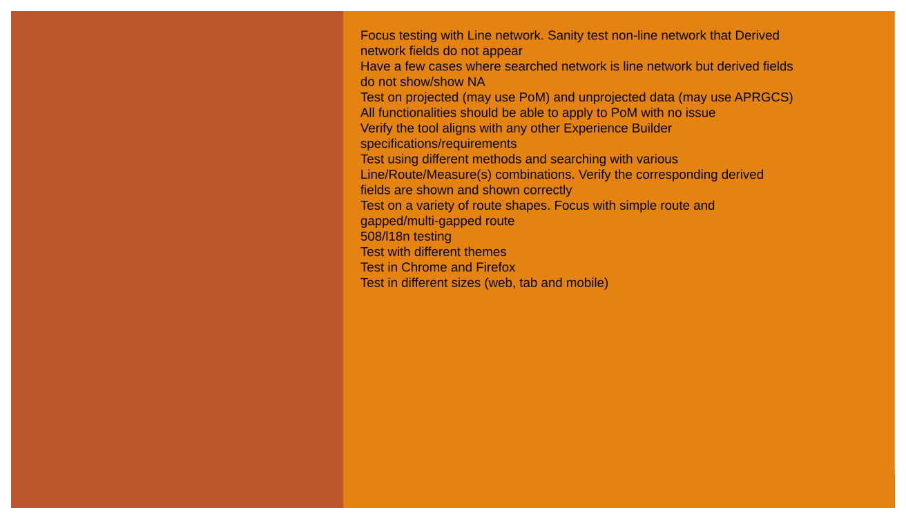
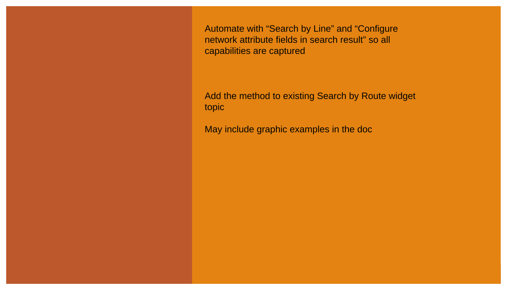
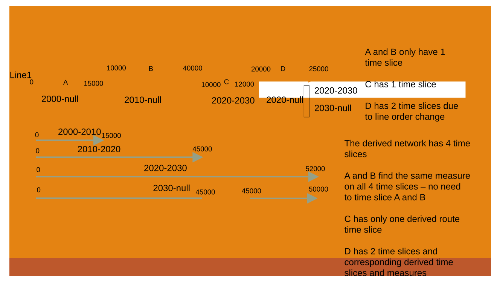
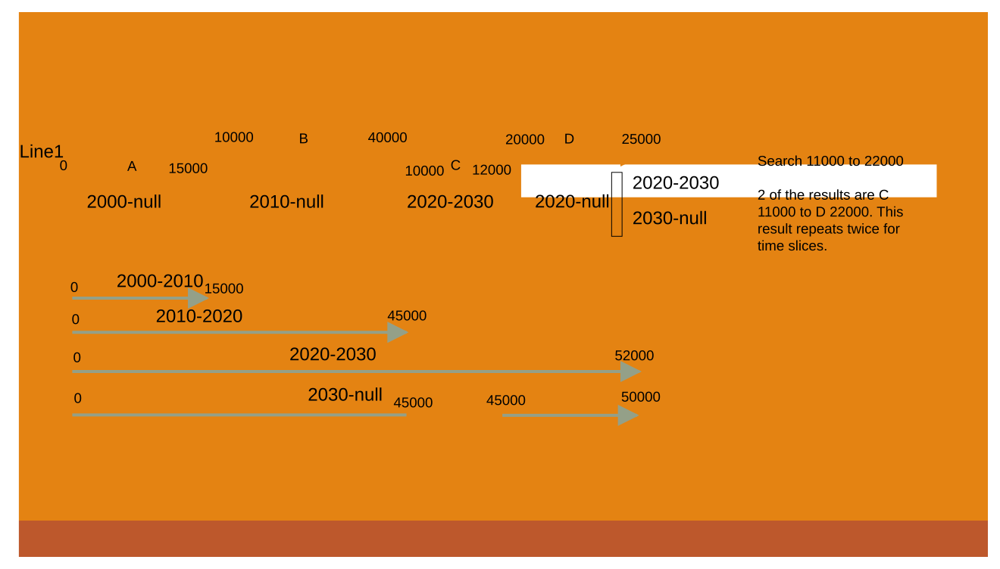

# Show Derived Network Information in Search by Route Widget

| Field | Value |
| --- | --- |
| **Doc** | 377 · User Story · Experience Builder |
| **Product** | Roads & Highways · Pipeline Referencing |
| **Release** | — |
| **Issues** | — |
| **Source** | [SearchbyRoute_DerivedNetworkInfo.pptx](<https://esriis.sharepoint.com/sites/LocationReferencing/Shared%20Documents/General/SearchbyRoute_DerivedNetworkInfo.pptx>) |
| **People** | author Praveen Kumar · PE — · dev — |
| **Edited** | 2024-05-08 17:51 by Claire Wang |
| **Extracted** | 2026-09-04 · lane xmlstrip · format 3.0 · prompt v2.0.2 |
| **Keywords** | derived network · line network · search by route · route attributes · measure · experience builder · event editor |
| **Tools** | Search by Route |

## Summary

This document describes a user story for enabling the display of derived network information in the Search by Route widget when searching routes in a line network. It details the expected behavior for showing derived route ID, route name, and measures in search results across different search methods and scenarios, including handling of missing or non-overlapping derived data. Testing and automation documentation plans are also outlined.

## Related documents

<!-- related:begin -->
- [Search by Route widget – configure network attribute fields](<https://esriis.sharepoint.com/sites/lrsworkspace/LRS Doc Index/User Stories/search-by-route-widget-configure-network-attribute-fields.md>) — similar text 0.36 · 4 title words · 2 filename words · same kind/surface/folder <!-- rel:379 s=5.647 -->
- [Search by Route widget – results flow into table](<https://esriis.sharepoint.com/sites/lrsworkspace/LRS Doc Index/User Stories/search-by-route-widget-results-flow-into-table.md>) — similar text 0.37 · 3 title words · 2 filename words · same kind/surface/folder <!-- rel:378 s=5.277 -->
- [Search by Route and Measure Experience Builder widget](<https://esriis.sharepoint.com/sites/lrsworkspace/LRS Doc Index/User Stories/search-by-route-and-measure-exb-widget.md>) — similar text 0.29 · 3 title words · 2 filename words · same kind/surface/folder <!-- rel:529 s=5.215 -->
- [Search by Line and Measure User Story](<https://esriis.sharepoint.com/sites/lrsworkspace/LRS%20Doc%20Index/User%20Stories/search-by-line-and-measure.md>) — similar text 0.40 · 1 title word · 1 filename word · same kind/surface/folder <!-- rel:380 s=4.35 -->
- [Search by Line Experience Builder widget](<https://esriis.sharepoint.com/sites/lrsworkspace/LRS Doc Index/User Stories/search-by-line-exb-widget.md>) — similar text 0.29 · 2 title words · 1 filename word · same kind/surface/folder <!-- rel:464 s=4.327 -->
<!-- related:end -->

<!-- docs:begin -->
## Esri documentation

[Split a centerline by measure](https://doc.esri.com/en/arcgis-pro/latest/help/production/roads-highways/split-a-centerline-by-measure.html)

_No page matched:_ [Search by Route](https://www.google.com/search?q=%22Search%20by%20Route%22+site%3Adoc.esri.com)
<!-- docs:end -->

---

## Slide 1 — Show Derived network information in Search by Route widget

User Story

## Slide 2 — User Story

As an Event Editor, I need the ability to show Derived network information in search result when I search a route in a line network, so that I can properly location and orient myself for LRS editing and analysis.
Persona
Event Editor: These users are responsible for making edits to route characteristics and assets.  Typically located in different business units/departments than the LRS route editors, these users have varied GIS experience, but a high level of knowledge about the characteristics they maintain (safety, pavement, crashes, etc.)  These users need to be able to retrieve derived network information when line network routes are searched to orient themselves on the map in preparation for event editing.
Target user: PoM, APR, and RH (who plans to adopt line concept) editor and viewer who needs the information for further use

## Slide 3 — Show Derived network information

- No configuration needed. When network is a line network in Search by Route widget, the search result show Derived network Route ID, Route Name, Measure, and/or ToMeasure
- Implement in all 4 methods (by route, by line, coordinate, and referent)
- The ability to hide any Derived network field is implemented in another user story “Search by Route widget – configure network attribute fields” which should be implemented after this user story
- When searched network is line network, derived network is also in the map and is not removed from Search widget, show derived network fields in result table
  - When no measure or a range of measures is searched, show Derived Route ID, Route Name, Measure, and ToMeasure
  - When a single or multiple measures are searched, show Derived Route ID, Route Name, and Measure
- When derived network is not added into webmap, not added into ExB, or removed from Search widget, there is no derived fields to show
- When searched network is not a line network, there is no derived fields to show
- When searched routes belong to a line network but they do not have derived routes generated yet, show derived network fields with N/A
  - When searched routes are updated but the derived routes are not, show the current (incorrect) values in derived network fields because it’s data issue anyways
- In Search by Line method with range measures, if From Route and To Route do not have overlapping time, show derived network fields with NA

## Slide 4 — Show Derived network information Testing

- Focus testing with Line network. Sanity test non-line network that Derived network fields do not appear
- Have a few cases where searched network is line network but derived fields do not show/show NA
- Test on projected (may use PoM) and unprojected data (may use APRGCS)
  - All functionalities should be able to apply to PoM with no issue
- Verify the tool aligns with any other Experience Builder specifications/requirements
- Test using different methods and searching with various Line/Route/Measure(s) combinations. Verify the corresponding derived fields are shown and shown correctly
- Test on a variety of route shapes. Focus with simple route and gapped/multi-gapped route
- 508/l18n testing
- Test with different themes
- Test in Chrome and Firefox
- Test in different sizes (web, tab and mobile)

## Slide 5 — Show Derived network information Automation Documentation

Automate with “Search by Line” and “Configure network attribute fields in search result” so all capabilities are captured
Add the method to existing Search by Route widget topic

May include graphic examples in the doc

## Slide 6 — Show Derived network information Assignment

Story Points:
Dev:
PE:

## Slide 7 — There is no need to show Derived route time, and no need to time slice route based on derived route time slices

A and B only have 1 time slice

C has 1 time slice

D has 2 time slices due to line order change
The derived network has 4 time slices

A and B find the same measure on all 4 time slices – no need to time slice A and B

C has only one derived route time slice

D has 2 time slices and corresponding derived time slices and measures

[figure: A · 0 · 15000 · B · 10000 · 40000 · C · 12000 · D · 20000 · 25000 · Line1 · 2000-null · 2010-null · 2020-2030 · 2020-null · 2000-2010 · 2010-2020 · 2030-null · 45000 · 52000 · 50000]

## Slide 8 — In Search by Line method with range measures, if From Route and To Route do not overlap in time, show derived network

Search 11000 to 22000

2 of the results are C 11000 to D 22000. This result repeats twice for time slices.

| From R | C |
| --- | --- |
| From M | 11000 |
| From R from date | 2020 |
| From R to date | 2030 |
| To R | D |
| To M | 22000 |
| To R from date | 2020 |
| To R to date | 2030 |
| Derived R | Line1 |
| Derived From M | 46000 |
| Derived To M | 49000 |

| From R | C |
| --- | --- |
| From M | 11000 |
| From R from date | 2020 |
| From R to date | 2030 |
| To R | D |
| To M | 22000 |
| To R from date | 2030 |
| To R to date | null |
| Derived R | NA |
| Derived From M | NA |
| Derived To M | NA |

[figure: A · 0 · 15000 · B · 10000 · 40000 · C · 12000 · D · 20000 · 25000 · Line1 · 2000-null · 2010-null · 2020-2030 · 2020-null · 2000-2010 · 2010-2020 · 2030-null · 45000 · 52000 · 50000]

