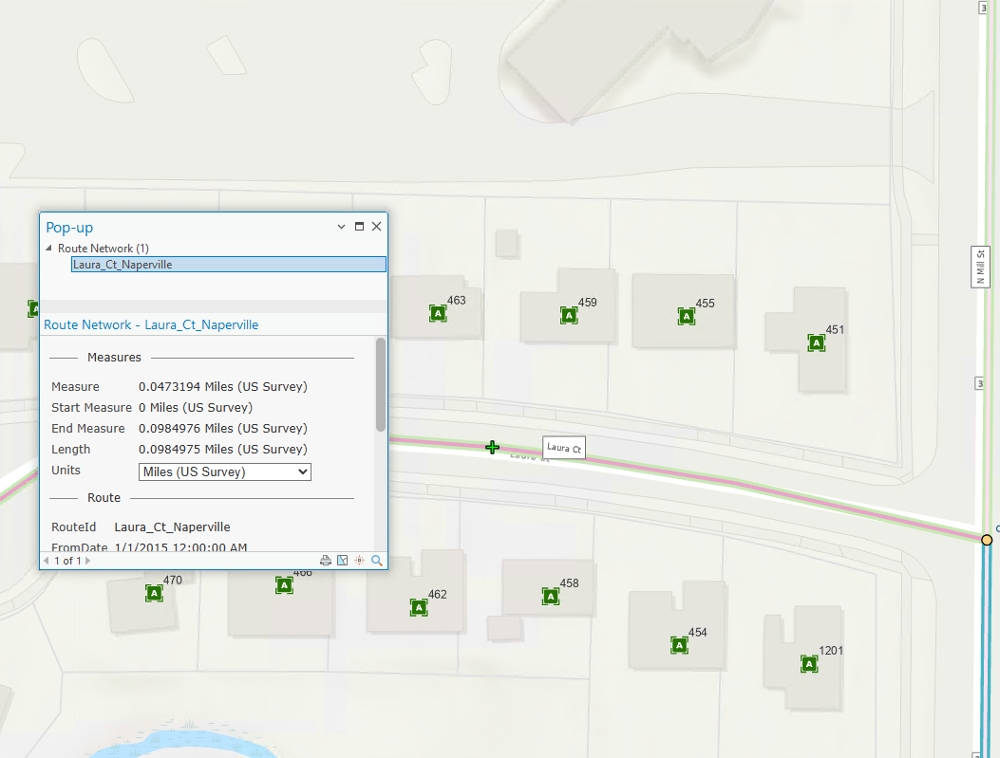

# Show left and right addresses in LRS Identify

|   |   |
| --- | --- |
| **Kind** | User Story · Experience Builder |
| **Release** | — |
| **Source** | [ExB - Show left and right addresses in LRS Identify.pptx](<https://esriis.sharepoint.com/sites/LocationReferencing/Shared%20Documents/General/ExB%20-%20Show%20left%20and%20right%20addresses%20in%20LRS%20Identify.pptx>) |
| **Edited** | 2025-08-13 15:58 by Nathan Easley |
| **Extracted** | 2026-09-04 · lane `xmlstrip` |

<!-- metadata
```yaml
title: "Show left and right addresses in LRS Identify"
source_file: "ExB - Show left and right addresses in LRS Identify.pptx"
source_url: "https://esriis.sharepoint.com/sites/LocationReferencing/Shared%20Documents/General/ExB%20-%20Show%20left%20and%20right%20addresses%20in%20LRS%20Identify.pptx"
doc_id: 141
doc_kind: "User Story"
surface: "Experience Builder"
doc_revision: ""
target_release: ""
pe: ""
dev: ""
author: "William Isley"
last_edited_by: "Nathan Easley"
last_edited: "2025-08-13T15:58:12Z"
extracted: 2026-09-04
extraction_lane: xmlstrip
prompt_version: "v2.0.2"
keywords: ["address", "route hover", "proportional logic", "left address", "right address", "location", "event editing"]
tools: ["LRS Identify", "Overlay Events", "ADM"]
products: []
issues: []
related: [{"doc":144,"file":"show-left-and-right-addresses-in-lrs-identify__doc144.md","s":12.893},{"doc":166,"file":"show-left-and-right-addresses-on-route-hover__doc166.md","s":11.391},{"doc":181,"file":"include-site-addresses-layer-in-straight-line-diagram__doc181.md","s":3.442},{"doc":348,"file":"experience-builder-straight-line-diagram-event-attributes-on-hover-click__doc348.md","s":2.803},{"doc":679,"file":"add-event-intersection-offset-method__doc679.md","s":2.557}]
```
-->

## Summary

This user story describes the need for LRS Editors to see left and right addresses alongside the measure at a location in the LRS Identify widget. It explains the use of proportional logic from Overlay Events and ADM to determine addresses and outlines testing and documentation updates required for this feature.

## Related documents

<!-- related:begin -->
- [Show left and right addresses in LRS Identify](<https://esriis.sharepoint.com/sites/lrsworkspace/LRS Doc Index/User Stories/show-left-and-right-addresses-in-lrs-identify__doc144.md>) — similar text 0.90 · 5 title words · 5 filename words · same kind/surface/folder <!-- rel:144 -->
- [Show left and right addresses on route hover](<https://esriis.sharepoint.com/sites/lrsworkspace/LRS Doc Index/User Stories/show-left-and-right-addresses-on-route-hover__doc166.md>) — similar text 0.83 · 4 title words · 4 filename words · same kind/folder <!-- rel:166 -->
- [Include Site Addresses Layer in Straight Line Diagram](<https://esriis.sharepoint.com/sites/lrsworkspace/LRS Doc Index/User Stories/include-site-addresses-layer-in-straight-line-diagram__doc181.md>) — similar text 0.27 · 1 title word · 1 filename word · same kind/surface/folder <!-- rel:181 -->
- [Experience Builder Straight Line Diagram Event Attributes on Hover/Click](<https://esriis.sharepoint.com/sites/lrsworkspace/LRS Doc Index/User Stories/experience-builder-straight-line-diagram-event-attributes-on-hover-click__doc348.md>) — similar text 0.12 · 1 filename word · same kind/surface/folder <!-- rel:348 -->
- [Add Event Intersection Offset Method](<https://esriis.sharepoint.com/sites/lrsworkspace/LRS Doc Index/User Stories/add-event-intersection-offset-method__doc679.md>) — similar text 0.23 · same kind/folder <!-- rel:679 -->
<!-- related:end -->

<!-- docs:begin -->
## Esri documentation

[View site address point properties](https://doc.esri.com/en/arcgis-pro/latest/help/production/roads-highways/view-site-address-point-properties.html) · [Location errors](https://doc.esri.com/en/arcgis-pro/latest/help/production/location-referencing-pipelines/location-errors.html) · [Event editing using the attribute table](https://doc.esri.com/en/arcgis-pro/latest/help/production/location-referencing-pipelines/event-editing-using-the-attribute-table.html)

_No page matched:_ [LRS Identify](https://www.google.com/search?q=%22LRS%20Identify%22+site%3Adoc.esri.com) · [Overlay Events](https://www.google.com/search?q=%22Overlay%20Events%22+site%3Adoc.esri.com) · [ADM](https://www.google.com/search?q=%22ADM%22+site%3Adoc.esri.com)
<!-- docs:end -->

---

## Slide 1 — ExB : Show left and right addresses in LRS Identify

User Story

## Slide 2 — User Story

As an LRS Editor, I need the ability to see not just the measure at a location but also the left and right address at that location, so that I can locate new events from the field that come in via this collection method.

Persona
LRS Editor: This user is responsible for making edits to the LRS.  The edits they need to make come in from field crews/contractors in a variety of formats (shapefiles, engineering drawing, fgdbs).  The LRS Editor is responsible for making the route and event edits based on these documents. For editors at local governments, the location may be based on addresses instead of coordinates/route+measure.  The ADM tools place address points based on the route location so providing the left and right address alongside the measure at a location along the route will allow them to locate the address correctly along with route characteristics (events) in subsequent steps in the workflow.

## Slide 3 — Show left and right addresses in LRS Identify


Show the nearest left and right addresses on the route hover popup in LRS Identify
This option would only be shown if addressing is configured with the LRS
Utilize the same proportional logic that is used in Overlay Events (and ADM) to determine the left and right addresses at the location

  - Consider utilizing the ADM attribute rule that does this
  - Also remember that we can use the nearest upstream/downstream site address points as well instead of considering the entire block range on the centerline
In the example to the right, the Right Address would be somewhere between 459 and 463 (most likely 461) the Left Address would be somewhere between 458 and 462 (most likely 460)
Don’t show the information if the centerline (or event) that has the addressing range information isn’t in the map



## Slide 4 — Testing

Utilize the test plan for the Overlay Events nearest upstream/downstream user story as this scenario should produce the same results
Utilize the Nashville and New Albany datasets for testing
Verify results match the LRS Identify and route hover within ArcGIS Pro

## Slide 5 — Automation

No new automation

## Slide 6 — Documentation

Update documentation around addressing to mention this capability in support of editing workflows
Also update the LRS Identify widget topic to mention this as a result/update screenshot if needed

## Slide 7 — Assignment

Story Points:
Dev:  days
PE:  days
