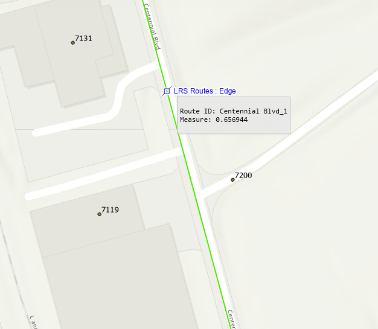

# Show left and right addresses on route hover

| Field | Value |
| --- | --- |
| **Doc** | 166 · User Story · Pro |
| **Product** | — |
| **Release** | — |
| **Issues** | — |
| **Source** | [Show left and right addresses on route hover.pptx](<https://esriis.sharepoint.com/sites/LocationReferencing/Shared%20Documents/General/Show%20left%20and%20right%20addresses%20on%20route%20hover.pptx>) |
| **People** | author William Isley · PE — · dev — |
| **Edited** | 2025-05-25 20:02 by Nathan Easley |
| **Extracted** | 2026-09-04 · lane xmlstrip · format 3.0 · prompt v2.0.2 |
| **Keywords** | address · route hover · proportional logic · left address · right address · route picker · editing workflow |
| **Tools** | LRS Identify · Overlay Events · ADM |

## Summary

This user story describes the need for LRS Editors to see left and right addresses alongside the measure at a location on a route hover popup in LRS Identify and the route picker. It supports locating new events from field data using proportional logic similar to Overlay Events and ADM. Testing references existing Overlay Events test plans and specific datasets, with no new automation planned and documentation updates required.

## Related documents

<!-- related:begin -->
- [Show left and right addresses in LRS Identify](<https://esriis.sharepoint.com/sites/lrsworkspace/LRS Doc Index/User Stories/show-left-and-right-addresses-in-lrs-identify-2025-08-2.md>) — similar text 0.82 · 4 title words · 4 filename words · same kind/folder <!-- rel:144 s=11.592 -->
- [Show left and right addresses in LRS Identify](<https://esriis.sharepoint.com/sites/lrsworkspace/LRS Doc Index/User Stories/show-left-and-right-addresses-in-lrs-identify-2025-08.md>) — similar text 0.83 · 4 title words · 4 filename words · same kind/folder <!-- rel:141 s=11.391 -->
- [Find Concurrent Route Sections Tool](<https://esriis.sharepoint.com/sites/lrsworkspace/LRS Doc Index/User Stories/find-concurrent-route-sections-tool.md>) — similar text 0.10 · 1 title word · 1 filename word · same kind/surface/folder <!-- rel:716 s=3.13 -->
- [Reassign Method Hovers User Story](<https://esriis.sharepoint.com/sites/lrsworkspace/LRS%20Doc%20Index/User%20Stories/reassign-method-hovers.md>) — similar text 0.10 · 1 filename word · same kind/surface/folder <!-- rel:584 s=2.782 -->
- [Include Site Addresses Layer in Straight Line Diagram](<https://esriis.sharepoint.com/sites/lrsworkspace/LRS Doc Index/User Stories/include-site-addresses-layer-in-sld.md>) — similar text 0.24 · 1 title word · 1 filename word · same kind/folder <!-- rel:181 s=2.775 -->
<!-- related:end -->

<!-- docs:begin -->
## Esri documentation

[View site address point properties](https://doc.esri.com/en/arcgis-pro/latest/help/production/roads-highways/view-site-address-point-properties.html)

_No page matched:_ [LRS Identify](https://www.google.com/search?q=%22LRS%20Identify%22+site%3Adoc.esri.com) · [Overlay Events](https://www.google.com/search?q=%22Overlay%20Events%22+site%3Adoc.esri.com) · [ADM](https://www.google.com/search?q=%22ADM%22+site%3Adoc.esri.com)
<!-- docs:end -->

---

## Story
### Show left and right addresses on route hover <!-- slide 1 -->
User Story

### User Story <!-- slide 2 -->
As an LRS Editor, I need the ability to see not just the measure at a location but also the left and right address at that location, so that I can locate new events from the field that come in via this collection method.

Persona
LRS Editor: This user is responsible for making edits to the LRS.  The edits they need to make come in from field crews/contractors in a variety of formats (shapefiles, engineering drawing, fgdbs).  The LRS Editor is responsible for making the route and event edits based on these documents. For editors at local governments, the location may be based on addresses instead of coordinates/route+measure.  The ADM tools place address points based on the route location so providing the left and right address alongside the measure at a location along the route will allow them to locate the address correctly along with route characteristics (events) in subsequent steps in the workflow.

## Acceptance Criteria
### Show left and right addresses on route hover <!-- slide 3 -->
- Show the nearest left and right addresses on the route hover popup in LRS Identify and the route picker in the LRS editing tool
- This option would only be shown if addressing is configured with the LRS
- Utilize the same proportional logic that is used in Overlay Events (and ADM) to determine the left and right addresses at the location
  - Consider utilizing the ADM attribute rule that does this
  - Also remember that we can use the nearest upstream/downstream site address points as well instead of considering the entire block range on the centerline
- In the example to the right, the Left Address would be somewhere between 7119 and 7131 and the Right Address would be greater than 7200 but less than the other right-side address further down the route

## Testing
<!-- slide 4 -->
- Utilize the test plan for the Overlay Events nearest upstream/downstream user story as this scenario should produce the same results
- Utilize the Nashville and New Albany datasets for testing

## Automation
<!-- slide 5 -->
- No new automation

## Documentation
<!-- slide 6 -->
- Update documentation around addressing to mention this capability in support of editing workflows

## Assignment
<!-- slide 7 -->
Story Points:
Dev:  days
PE:  days
