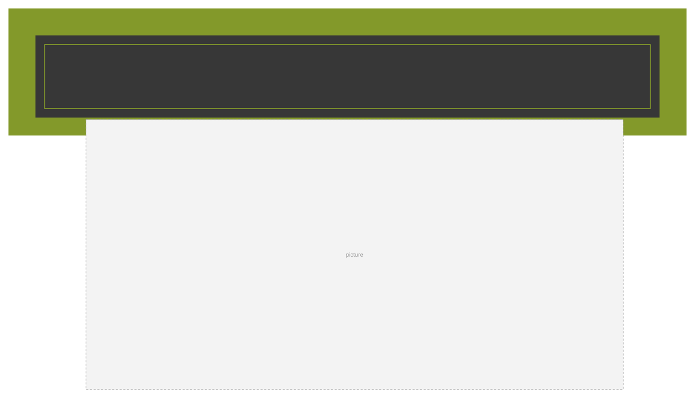
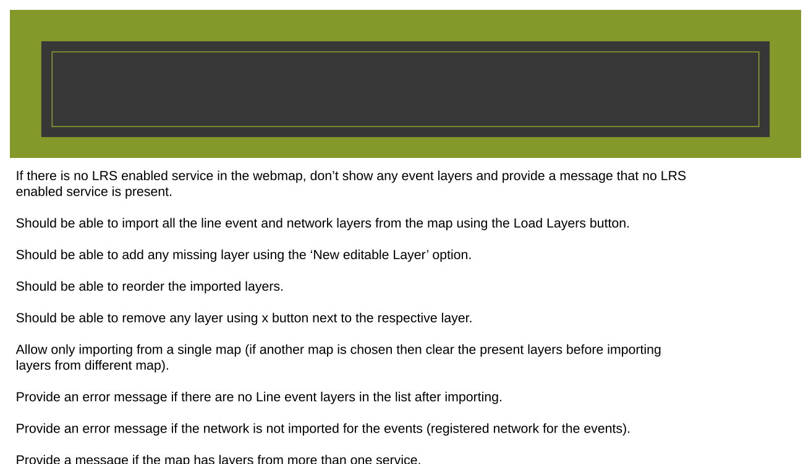
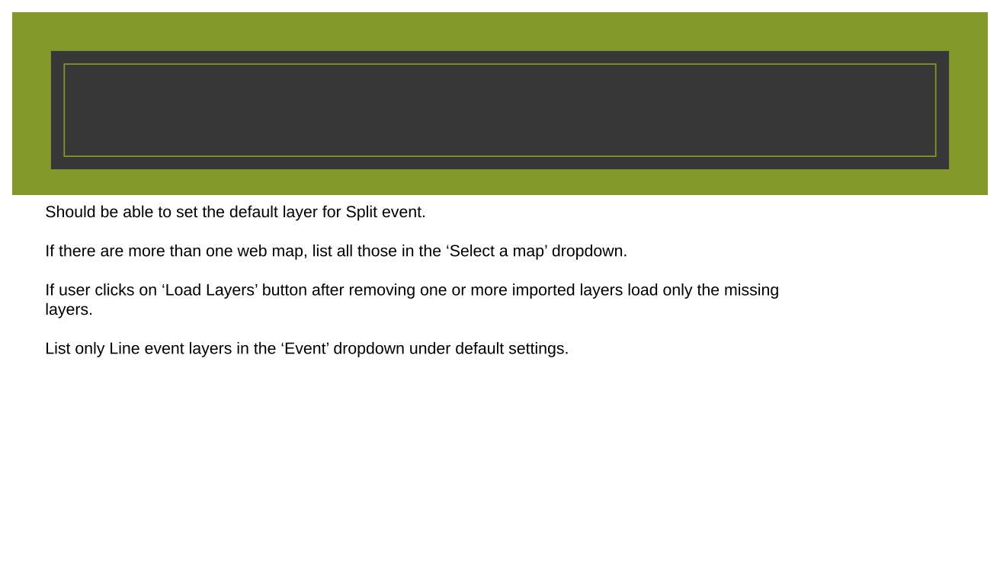
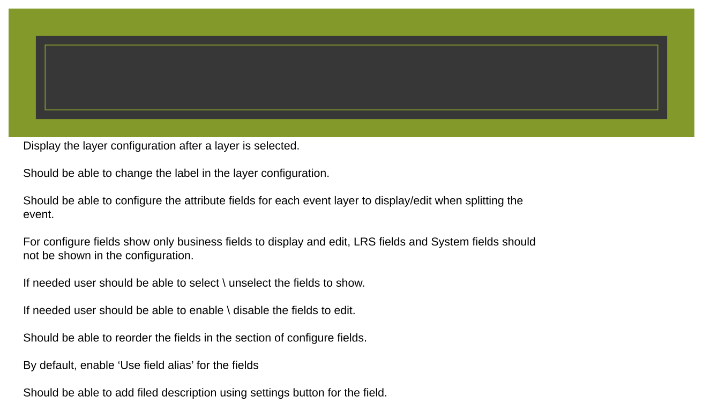
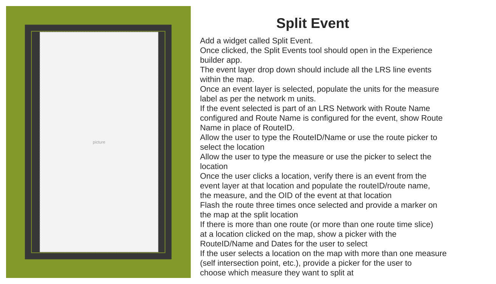
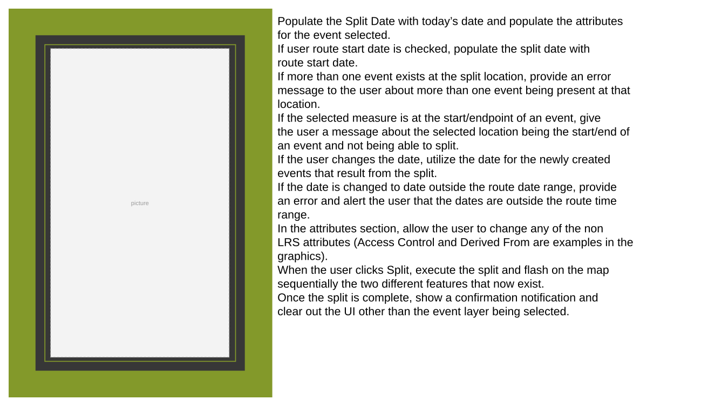
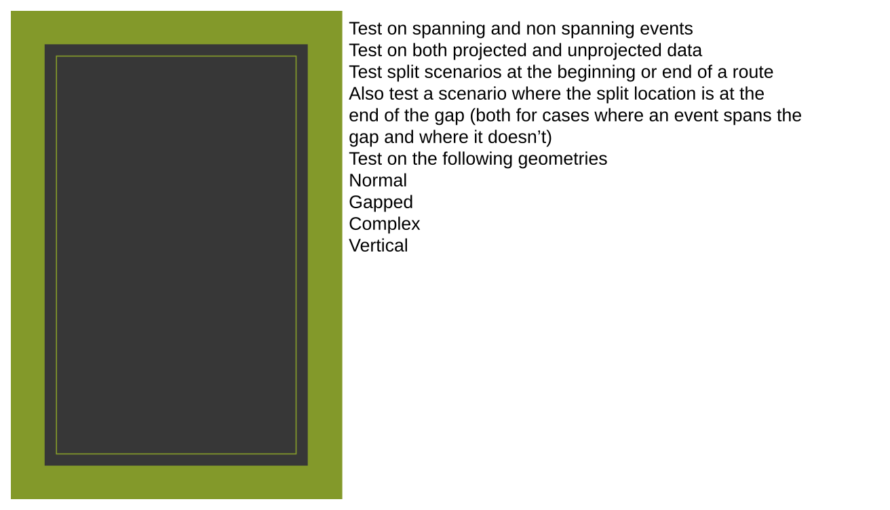
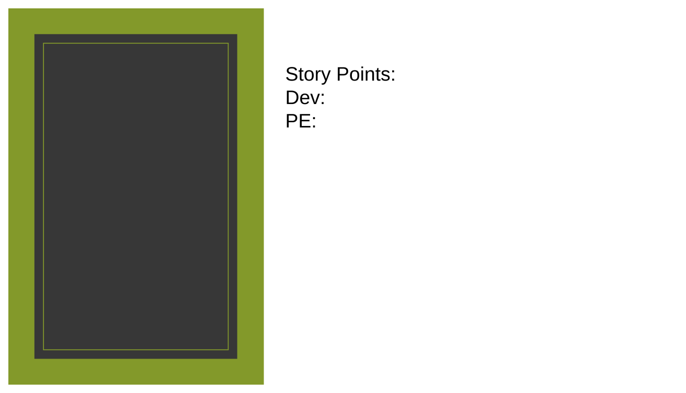

# Split Event in Experience Builder

| Field | Value |
| --- | --- |
| **Doc** | 472 · User Story · Experience Builder |
| **Product** | — |
| **Release** | — |
| **Issues** | — |
| **Source** | [ExB_SplitEvents.pptx](<https://esriis.sharepoint.com/sites/LocationReferencing/Shared%20Documents/General/ExB_SplitEvents.pptx>) |
| **People** | author William Isley · PE — · dev — |
| **Edited** | 2023-10-31 18:33 by Praveen Kumar |
| **Extracted** | 2026-09-04 · lane xmlstrip · format 3.0 · prompt v2.0.2 |
| **Keywords** | split event · event editing · line event · route name · measure · experience builder · lrs editor |
| **Tools** | Split Event |

## Summary

Describes a user story for enabling LRS Editors to split events within the Experience Builder app. Covers configuration options for event layers, user interface behavior for selecting split locations, validation rules, and expected user interactions during the split event workflow.

## Related documents

<!-- related:begin -->
- [Add Point Event Experience Builder Widget](<https://esriis.sharepoint.com/sites/lrsworkspace/LRS Doc Index/User Stories/add-point-event-exb-widget.md>) — similar text 0.51 · 3 title words · 1 filename word · same kind/surface/folder <!-- rel:497 s=5.091 -->
- [Add Line Events User Story for Experience Builder](<https://esriis.sharepoint.com/sites/lrsworkspace/LRS Doc Index/User Stories/add-line-events-for-exb.md>) — similar text 0.56 · 2 title words · 1 filename word · same kind/surface/folder <!-- rel:484 s=4.808 -->
- [Merge Events in Experience Builder](<https://esriis.sharepoint.com/sites/lrsworkspace/LRS Doc Index/User Stories/merge-events-in-exb.md>) — similar text 0.52 · 2 title words · 1 filename word · same kind/surface/folder <!-- rel:466 s=4.806 -->
- [Split Events in ArcGIS Pro](<https://esriis.sharepoint.com/sites/lrsworkspace/LRS Doc Index/User Stories/split-events-in-pro.md>) — similar text 0.49 · 1 title word · 2 filename words · same kind/folder <!-- rel:677 s=4.558 -->
- [Add Point Events in Experience Builder](<https://esriis.sharepoint.com/sites/lrsworkspace/LRS Doc Index/User Stories/add-point-events-in-exb-2023-09-2.md>) — similar text 0.52 · 2 title words · 1 filename word · same kind/surface/folder <!-- rel:496 s=4.527 -->
<!-- related:end -->

<!-- docs:begin -->
## Esri documentation

[Event editing using the attribute table](https://doc.esri.com/en/arcgis-pro/latest/help/production/location-referencing-pipelines/event-editing-using-the-attribute-table.html) · [Split a centerline by measure](https://doc.esri.com/en/arcgis-pro/latest/help/production/location-referencing-pipelines/split-a-centerline-by-measure.html)

_No page matched:_ [Split Event](https://www.google.com/search?q=%22Split%20Event%22+site%3Adoc.esri.com)
<!-- docs:end -->

---

## Story
### Split Event in ExB <!-- slide 1 -->
User Story

### User Story <!-- slide 2 -->
As an LRS Editor, I want to be able to split events, so that I can complete my event editing workflows.

Persona
LRS Editor: This user is responsible for making edits to the LRS.  The edits they need to make come in from field crews/contractors in a variety of formats (shapefiles, engineering drawing, fgdbs).  The LRS Editor is responsible for making the route and event edits based on these documents. One workflow users will utilize is to split events at specific locations.  We supported this workflow in Event Editor and now want to support it within ExB.

## Acceptance Criteria
### Configuration <!-- slide 3 -->

### Configuration <!-- slide 4 -->
- If there is no LRS enabled service in the webmap, don’t show any event layers and provide a message that no LRS enabled service is present.
- Should be able to import all the line event and network layers from the map using the Load Layers button.
- Should be able to add any missing layer using the  ‘New editable Layer’ option.
- Should be able to reorder the imported layers.
- Should be able to remove any layer using x button next to the respective layer.
- Allow only importing from a single map (if another map is chosen then clear the present layers before importing layers from different map).
- Provide an error message if there are no Line event layers in the list after importing.
- Provide an error message if the network is not imported for the events (registered network for the events).
- Provide a message if the map has layers from more than one service.

### Configuration <!-- slide 5 -->
- Should be able to set the default layer for Split event.
- If there are more than one web map, list all those in the ‘Select a map’ dropdown.
- If user clicks on ‘Load Layers’ button after removing one or more imported layers load only the missing layers.
- List only Line event layers in the ‘Event’ dropdown under default settings.

### Configuration <!-- slide 6 -->
- Display the layer configuration after a layer is selected.
- Should be able to change the label in the layer configuration.
- Should be able to configure the attribute fields for each event layer to display/edit when splitting the event.
- For configure fields show only business fields to display and edit, LRS fields and System fields should not be shown in the configuration.
- If needed user should be able to select \ unselect the fields to show.
- If needed user should be able to enable \ disable the fields to edit.
- Should be able to reorder the fields in the section of configure fields.
- By default, enable ‘Use field alias’ for the fields
- Should be able to add filed description using settings button for the field.

### Split Event <!-- slide 7 -->
Split Event

- Add a widget called Split Event.
- Once clicked, the Split Events tool should open in the Experience builder app.
- The event layer drop down should include all the LRS line events within the map.
- Once an event layer is selected, populate the units for the measure label as per the network m units.
- If the event selected is part of an LRS Network with Route Name configured and Route Name is configured for the event, show Route Name in place of RouteID.
- Allow the user to type the RouteID/Name or use the route picker to select the location
- Allow the user to type the measure or use the picker to select the location
- Once the user clicks a location, verify there is an event from the event layer at that location and populate the routeID/route name, the measure, and the OID of the event at that location
- Flash the route three times once selected and provide a marker on the map at the split location
- If there is more than one route (or more than one route time slice) at a location clicked on the map, show a picker with the RouteID/Name and Dates for the user to select
- If the user selects a location on the map with more than one measure (self intersection point, etc.), provide a picker for the user to choose which measure they want to split at

### Split Event <!-- slide 8 -->
Populate the Split Date with today’s date and populate the attributes for the event selected.
If user route start date is checked, populate the split date with route start date.
If more than one event exists at the split location, provide an error message to the user about more than one event being present at that location.
If the selected measure is at the start/endpoint of an event, give the user a message about the selected location being the start/end of an event and not being able to split.
If the user changes the date, utilize the date for the newly created events that result from the split.
If the date is changed to date outside the route date range, provide an error and alert the user that the dates are outside the route time range.
In the attributes section, allow the user to change any of the non LRS attributes (Access Control and Derived From are examples in the graphics).
When the user clicks Split, execute the split and flash on the map sequentially the two different features that now exist.
Once the split is complete, show a confirmation notification and clear out the UI other than the event layer being selected.

## Testing
<!-- slide 9 -->
Test on spanning and non spanning events
Test on both projected and unprojected data
Test split scenarios at the beginning or end of a route
Also test a scenario where the split location is at the end of the gap (both for cases where an event spans the gap and where it doesn’t)
Test on the following geometries

  - Normal
  - Gapped
  - Complex
  - Vertical

## Automation
<!-- slide 10 -->

<!-- slide 11 -->

## Assignment
<!-- slide 12 -->
Story Points:
Dev:
PE:

<!-- slide 13 -->
Story Points: 13
Dev:
PE:
