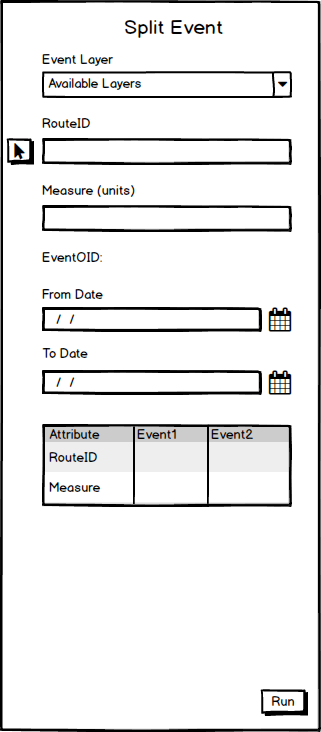
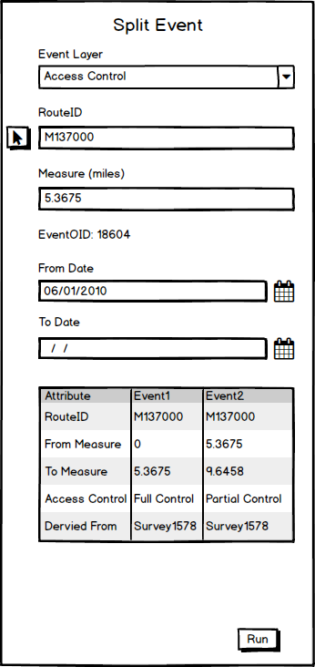

# Split Events in ArcGIS Pro

| Field | Value |
| --- | --- |
| **Doc** | 677 · User Story · Pro |
| **Product** | Roads & Highways · Pipeline Referencing |
| **Release** | — |
| **Issues** | — |
| **Source** | [SplitEventsPro.pptx](<https://esriis.sharepoint.com/sites/LocationReferencing/Shared%20Documents/General/SplitEventsPro.pptx>) |
| **People** | author William Isley · PE — · dev — |
| **Edited** | 2022-03-10 00:50 by Nathan Easley |
| **Extracted** | 2026-09-04 · lane xmlstrip · format 3.0 · prompt v2.0.2 |
| **Keywords** | split events · event editing · route · measure · location referencing · arcgis pro · lrs editor |
| **Tools** | Split Events |

## Summary

User story describing the addition of a Split Events tool within ArcGIS Pro's Location Referencing ribbon to enable LRS Editors to split events without switching applications. The tool includes UI elements for selecting event layers, routes, and split locations, with validations for event overlaps and date ranges. Testing scenarios cover various event geometries and data projections. Automation and documentation tasks are also outlined.

## Related documents

<!-- related:begin -->
- [Split Event in Experience Builder](<https://esriis.sharepoint.com/sites/lrsworkspace/LRS Doc Index/User Stories/split-event-in-exb.md>) — similar text 0.49 · 1 title word · 2 filename words · same kind/folder <!-- rel:472 s=4.558 -->
- [Split Centerlines in Local Scenes in Pro](<https://esriis.sharepoint.com/sites/lrsworkspace/LRS Doc Index/User Stories/split-centerlines-in-local-scenes-in-pro.md>) — similar text 0.23 · 2 title words · 1 filename word · same kind/surface/folder <!-- rel:766 s=4.09 -->
- [Add Multiple Line Events tool in ArcGIS Pro](<https://esriis.sharepoint.com/sites/lrsworkspace/LRS Doc Index/User Stories/add-multiple-line-events-tool-in-pro.md>) — similar text 0.35 · 2 title words · same kind/surface/folder <!-- rel:686 s=4.047 -->
- [Add Multiple Point Events tool in ArcGIS Pro](<https://esriis.sharepoint.com/sites/lrsworkspace/LRS Doc Index/User Stories/add-multiple-point-events-tool-in-pro.md>) — similar text 0.34 · 2 title words · same kind/surface/folder <!-- rel:685 s=4.011 -->
- [Add Line Event tool in ArcGIS Pro](<https://esriis.sharepoint.com/sites/lrsworkspace/LRS Doc Index/User Stories/add-line-event-tool-in-pro.md>) — similar text 0.35 · 1 title word · same kind/surface/folder <!-- rel:687 s=3.561 -->
<!-- related:end -->

<!-- docs:begin -->
## Esri documentation

[Event editing using the attribute table](https://doc.esri.com/en/arcgis-pro/latest/help/production/roads-highways/event-editing-using-the-attribute-table.html) · [Split a centerline by measure](https://doc.esri.com/en/arcgis-pro/latest/help/production/roads-highways/split-a-centerline-by-measure.html) · [Set Location Referencing options](https://doc.esri.com/en/arcgis-pro/latest/help/production/roads-highways/set-location-referencing-options.html)

_No page matched:_ [Split Events](https://www.google.com/search?q=%22Split%20Events%22+site%3Adoc.esri.com)
<!-- docs:end -->

---

## Story
### Split Events in Pro <!-- slide 1 -->
User Story

### User Story <!-- slide 2 -->
As an LRS Editor, I want to be able to split events within ArcGIS Pro, so that I can complete my event editing workflows without having to jump to another application.
Persona
LRS Editor: This user is responsible for making edits to the LRS.  The edits they need to make come in from field crews/contractors in a variety of formats (shapefiles, engineering drawing, fgdbs).  The LRS Editor is responsible for making the route and event edits based on these documents. One workflow users will utilize is to split events at specific locations.  We supported this workflow in Event Editor and now want to support it within ArcGIS Pro for users that will do their route and event editing within a single application.

## Acceptance Criteria
### Split Events in Pro <!-- slide 3 -->
- Add a button to the Location Referencing ribbon in the events section called Split (work with graphics to get the design for the button, feel free to use the Event Editor button as a guide)
- Once clicked, the Split Events tool should open on the Location Referencing pane in a similar fashion to our other tools
- The event layer drop down should include all the LRS line events within the LRS enabled service in the map
- Once an event layer is selected, populate the units for the measure label and add the attributes from the LRS event
- If the event selected is part of an LRS Network with Route Name configured and Route Name is configured for the event, show Route Name in place of RouteID (and in the Attributes at the bottom as well)
- Allow the user to type the RouteID/Name or use the route picker to select the location
- Flash the route three times once selected
- If there is more than one route (or more than one route time slice) at a location clicked on the map, show a picker with the RouteID/Name and Dates for the user to select

### Split Events in Pro <!-- slide 4 -->
- If the user selects the picker tool next to the RouteID, provide text above the cursor once it moves onto the map that says “Select an event to split”
- Once the user clicks a location, verify there is an event from the event layer at that location and populate the routeID
- Change the text above the cursor to “Select a location to split”
- When the user clicks, populate the split measure
- If the user selects a location on the map with more than one measure (self intersection point, etc.), provide a picker for the user to choose which measure they want to split at
- Once a split measure is selected, determine the event that will be split and populate the EventOID label, the From and To Date, and the Attributes for the split events
- If more than one event exists at the split location, provide an error message to the user about more than one event being present at that location
- If the selected measure is at the endpoint of an event, give the user a message about the selected location being on the end of an event and not being able to split
- If the user changes the From/To Dates, utilize those dates for the newly created events that result from the split
- If the From/To Date is changed to dates outside the route date range, provide an error and alert the user that the dates are outside the route time range

### Split Events in Pro <!-- slide 5 -->
- In the attributes section, allow the user to change any of the non LRS attributes (Access Control and Derived From are examples in the graphics).  Don’t allow the user to change the RouteID/Name or Measure(s) as those should be read only
- When the user clicks run, execute the split.  Once the split is complete, show a confirmation notification and clear out the UI other than the event layer being selected.
- Also part of this user story is to prevent the core split tool from being executed against an LRS event layer.
- If a user tries to use the core split in Pro, provide an error letting them know they can’t split events using the core split tool and should use the split events tool on the Location Referencing ribbon

## Testing
<!-- slide 6 -->
- Test on spanning and non spanning events
- Test on both projected and unprojected data
- Test split scenarios at the beginning or end of a route
- Also test a scenario where the split location is at the end of the gap (both for cases where an event spans the gap and where it doesn’t)
- Test a scenario where the From/To Dates are changed
- Test on the following geometries
  - Normal
  - Gapped
  - Loop
  - Lollipop
  - Alpha
  - Branch
  - Vertical
- Verify core split doesn’t work (in both Pro and REST)

## Automation
<!-- slide 7 -->
Automate the REST portion of the operation
Automate 2-3 UI cases

## Documentation
<!-- slide 8 -->
- Create a new topic in the events section of the Pro documentation called Splitting Events.  Utilize the existing split events topic from Event Editor as a guide (https://enterprise.arcgis.com/en/roads-highways/latest/event-editor/splitting-events.htm).
- Make sure to include a graphic/example to show how the split would work.
- Create a separate version of the topic for Roads and Highways and Pipeline Referencing with the appropriate example events (speed limit vs operating pressure for example)

## Assignment
<!-- slide 9 -->
Story Points:
Dev:
PE:
