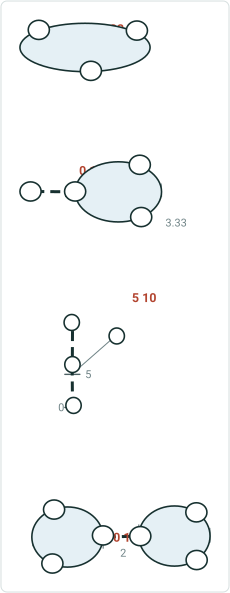
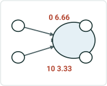
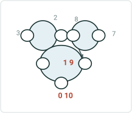
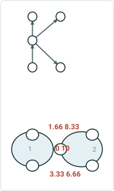
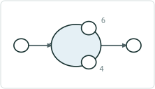

# Support Complex Route Shapes in Calibrate Route

|   |   |
| --- | --- |
| **Kind** | User Story · Pro |
| **Release** | — |
| **Product** | Roads & Highways |
| **Source** | [ComplexRouteShapesCalibrateRoute.pptx](<https://esriis.sharepoint.com/sites/LocationReferencing/Shared%20Documents/General/ComplexRouteShapesCalibrateRoute.pptx>) |
| **Edited** | 2019-11-20 22:49 by Praveen Kumar |
| **Extracted** | 2026-09-04 · lane `xmlstrip` |

<!-- metadata
```yaml
title: "Support Complex Route Shapes in Calibrate Route"
source_file: "ComplexRouteShapesCalibrateRoute.pptx"
source_url: "https://esriis.sharepoint.com/sites/LocationReferencing/Shared%20Documents/General/ComplexRouteShapesCalibrateRoute.pptx"
doc_id: 853
doc_kind: "User Story"
surface: "Pro"
doc_revision: ""
target_release: ""
pe: ""
dev: ""
author: "P_Kumar@esri.com"
last_edited_by: "Praveen Kumar"
last_edited: "2019-11-20T22:49:39Z"
extracted: 2026-09-04
extraction_lane: xmlstrip
prompt_version: "v2.0.2"
keywords: ["complex shape", "calibrate route", "euler algorithm", "route calibration", "self intersection", "z values", "line network", "non line network"]
tools: ["Calibrate Route", "Generate Calibration Points", "Generate Routes"]
products: ["Roads & Highways"]
issues: []
related: [{"doc":855,"file":"support-complex-route-shapes-in-reassign-route__doc855.md","s":9.263},{"doc":872,"file":"support-complex-route-shapes-in-retire-route__doc872.md","s":9.216},{"doc":854,"file":"support-complex-route-shapes-in-realign-route__doc854.md","s":9.168},{"doc":873,"file":"support-complex-route-shapes-in-extend-route__doc873.md","s":8.961},{"doc":868,"file":"support-complex-route-shapes-in-cartographic-realignment__doc868.md","s":8.718}]
```
-->

## Summary

Describes the need for Roads and Highways users to calibrate complex route shapes such as loops, lollipops, alpha, branched, and barbell routes. Specifies use of the Euler algorithm for calibration, support for Z values to detect self intersections, and requirements for both REST and Pro UI support. Includes positive and negative testing scenarios and automation plans.

## Related documents

<!-- related:begin -->
- [Support Complex Route Shapes in Reassign Route](<https://esriis.sharepoint.com/sites/lrsworkspace/LRS Doc Index/User Stories/support-complex-route-shapes-in-reassign-route__doc855.md>) — similar text 0.60 · 4 title words · 3 filename words · same kind/surface/folder <!-- rel:855 -->
- [Support Complex Route Shapes in Retire Route](<https://esriis.sharepoint.com/sites/lrsworkspace/LRS Doc Index/User Stories/support-complex-route-shapes-in-retire-route__doc872.md>) — similar text 0.60 · 4 title words · 3 filename words · same kind/surface/folder <!-- rel:872 -->
- [Support Complex Route Shapes in Realign Route](<https://esriis.sharepoint.com/sites/lrsworkspace/LRS Doc Index/User Stories/support-complex-route-shapes-in-realign-route__doc854.md>) — similar text 0.59 · 4 title words · 3 filename words · same kind/surface/folder <!-- rel:854 -->
- [Support Complex Route Shapes in Extend Route](<https://esriis.sharepoint.com/sites/lrsworkspace/LRS Doc Index/User Stories/support-complex-route-shapes-in-extend-route__doc873.md>) — similar text 0.54 · 4 title words · 3 filename words · same kind/surface/folder <!-- rel:873 -->
- [Support Complex Route Shapes in Cartographic Realignment](<https://esriis.sharepoint.com/sites/lrsworkspace/LRS Doc Index/User Stories/support-complex-route-shapes-in-cartographic-realignment__doc868.md>) — similar text 0.50 · 4 title words · 3 filename words · same kind/surface/folder <!-- rel:868 -->
<!-- related:end -->

<!-- docs:begin -->
## Esri documentation

[Complex shapes](https://doc.esri.com/en/arcgis-pro/latest/help/production/roads-highways/complex-shapes.html)

_No page matched:_ [Calibrate Route](https://www.google.com/search?q=%22Calibrate%20Route%22+site%3Adoc.esri.com) · [Generate Calibration Points](https://www.google.com/search?q=%22Generate%20Calibration%20Points%22+site%3Adoc.esri.com) · [Generate Routes](https://www.google.com/search?q=%22Generate%20Routes%22+site%3Adoc.esri.com)
<!-- docs:end -->

---

## Slide 1 — Support Complex Route Shapes in Calibrate Route

User Story

## Slide 2 — User Story


As a Roads and Highways user, I need to be able to calibrate complex route shapes in Roads and Highways, such as loops, lollipops, alpha, and branched routes, so these routes calibrate and can have events located on them for reporting and other use cases.

## Slide 3 — Calibrate Route

Utilize the Euler algorithm used in Generate Calibration Points/Generate Routes to Calibrate a complex route.
Should work for any complex route shape (see the sample shapes used in Generate Calibration Points story)
Consider Z values on the centerline/route to determine if there is a self intersection/closing
Support in both non line and line networks
Needs to be supported in both REST and Pro UI
Error out when the calibration activity is about to create non-monotonic route.
Do not allow to delete any of the minimum required no of calibration points for complex shapes (Points which we create while generate calibration points)

## Slide 4






## Slide 5 — Testing

Positive

  - Loop
  - Lollipop
  - Alpha
  - Branch
  - Barbell
  - Complex shape with gap
  - Non Line Network (focus on this)
  - Line Network/Caltrans
  - With/without Z values (only for considering self intersection)
  - REST and UI
  - Calibration points not in correct locations to calibrate complex shape

Negative

  - Calibrate to create non-monotonic route
Automation

  - REST (add a few cases to the existing automation)
  - UI (A new set of Calibrate Route tests in TestComplete; only automate one of each type of complex shape)

## Slide 6 — Documentation

Document support for being able to Calibrate complex route shapes in the Calibrate Route topic.

## Slide 7 — Assignment

Story Points:
Dev:
Test Plan PE:
