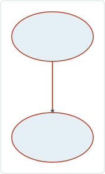

# Support Complex Route Shapes in Create Route

|   |   |
| --- | --- |
| **Kind** | User Story · Pro |
| **Release** | — |
| **Product** | Roads & Highways |
| **Source** | [ComplexRouteShapesCreateRoute.pptx](<https://esriis.sharepoint.com/sites/LocationReferencing/Shared%20Documents/General/ComplexRouteShapesCreateRoute.pptx>) |
| **Edited** | 2019-11-15 17:39 by Nathan Easley |
| **Extracted** | 2026-09-04 · lane `xmlstrip` |

<!-- metadata
```yaml
title: "Support Complex Route Shapes in Create Route"
source_file: "ComplexRouteShapesCreateRoute.pptx"
source_url: "https://esriis.sharepoint.com/sites/LocationReferencing/Shared%20Documents/General/ComplexRouteShapesCreateRoute.pptx"
doc_id: 874
doc_kind: "User Story"
surface: "Pro"
doc_revision: ""
target_release: ""
pe: ""
dev: ""
author: "William Isley"
last_edited_by: "Nathan Easley"
last_edited: "2019-11-15T17:39:37Z"
extracted: 2026-09-04
extraction_lane: xmlstrip
prompt_version: "v2.0.2"
keywords: ["complex route shape", "calibration points", "route calibration", "centerline", "loops", "lollipops", "alpha route", "branched route", "barbell route"]
tools: ["Create Route", "Generate Calibration Points", "Append Routes"]
products: ["Roads & Highways"]
issues: []
related: [{"doc":873,"file":"support-complex-route-shapes-in-extend-route__doc873.md","s":8.989},{"doc":855,"file":"support-complex-route-shapes-in-reassign-route__doc855.md","s":8.534},{"doc":854,"file":"support-complex-route-shapes-in-realign-route__doc854.md","s":8.435},{"doc":872,"file":"support-complex-route-shapes-in-retire-route__doc872.md","s":8.242},{"doc":853,"file":"support-complex-route-shapes-in-calibrate-route__doc853.md","s":8.084}]
```
-->

## Summary

This user story describes the need for Roads and Highways users to create complex route shapes such as loops, lollipops, alpha, branched, and barbell routes. It covers the use of the Euler algorithm in the Create Route function to build, calibrate, and place calibration points on complex route shapes without splitting centerlines. The story includes testing scenarios, automation plans, and documentation requirements for supporting these complex route shapes in both REST and Pro UI environments.

## Related documents

<!-- related:begin -->
- [Support Complex Route Shapes in Extend Route](<https://esriis.sharepoint.com/sites/lrsworkspace/LRS Doc Index/User Stories/support-complex-route-shapes-in-extend-route__doc873.md>) — similar text 0.76 · 4 title words · 3 filename words · same kind/surface/folder <!-- rel:873 -->
- [Support Complex Route Shapes in Reassign Route](<https://esriis.sharepoint.com/sites/lrsworkspace/LRS Doc Index/User Stories/support-complex-route-shapes-in-reassign-route__doc855.md>) — similar text 0.69 · 4 title words · 3 filename words · same kind/surface/folder <!-- rel:855 -->
- [Support Complex Route Shapes in Realign Route](<https://esriis.sharepoint.com/sites/lrsworkspace/LRS Doc Index/User Stories/support-complex-route-shapes-in-realign-route__doc854.md>) — similar text 0.71 · 4 title words · 3 filename words · same kind/surface/folder <!-- rel:854 -->
- [Support Complex Route Shapes in Retire Route](<https://esriis.sharepoint.com/sites/lrsworkspace/LRS Doc Index/User Stories/support-complex-route-shapes-in-retire-route__doc872.md>) — similar text 0.69 · 4 title words · 3 filename words · same kind/surface/folder <!-- rel:872 -->
- [Support Complex Route Shapes in Calibrate Route](<https://esriis.sharepoint.com/sites/lrsworkspace/LRS Doc Index/User Stories/support-complex-route-shapes-in-calibrate-route__doc853.md>) — similar text 0.54 · 4 title words · 3 filename words · same kind/surface/folder <!-- rel:853 -->
<!-- related:end -->

<!-- docs:begin -->
## Esri documentation

[Create a route](https://doc.esri.com/en/arcgis-pro/latest/help/production/roads-highways/create-a-new-route.html) · [Merge centerlines](https://doc.esri.com/en/arcgis-pro/latest/help/production/roads-highways/merge-centerlines.html)

_No page matched:_ [Generate Calibration Points](https://www.google.com/search?q=%22Generate%20Calibration%20Points%22+site%3Adoc.esri.com) · [Append Routes](https://www.google.com/search?q=%22Append%20Routes%22+site%3Adoc.esri.com)
<!-- docs:end -->

---

## Slide 1 — Support Complex Route Shapes in Create Route

User Story

## Slide 2 — User Story



As a Roads and Highways user, I need to be able to create complex route shapes in Roads and Highways, such as loops, lollipops, alpha, and branched routes, so these routes calibrate and can have events located on them for reporting and other use cases.

## Slide 3 — Create Route

Utilize the Euler algorithm used in Generate Calibration Points/Append Routes to do the following in Create Route when the centerline(s) make a complex shape:

  - Build the route shape
  - Place calibration points at the required locations
  - Calibrate the route
One or more centerlines can be used to create the complex shape
Create route should not split any centerlines used to create these complex shapes (Ok if they need to become multi part)
Should work for any complex route shape (see the sample shapes used in Generate Calibration Points story)
Consider Z values on the centerline to determine if there is a self intersection/closing
Works in both non line and line networks
Needs to be supported in both REST and Pro UI

## Slide 4 — Testing

Positive

  - Loop
  - Lollipop
  - Alpha
  - Branch
  - Barbell
  - Complex shape with gap
  - Single centerline (single part)
  - Single centerline (multi part)
  - Multiple centerlines
  - Non Line Network (focus on this)
  - Line Network
  - With Z values
  - Without Z values
  - REST and UI
Negative

  - Centerline with overlapping (not self intersecting/closing) segments
Automation

  - REST (add a few cases to the existing automation)
  - UI (A new set of Create Route tests in TestComplete)

## Slide 5 — Documentation

Document support for being able to create these complex route shapes in the Create Route editing topic.
Create a new topic called Complex Route shapes that discusses support for loading, calibrating, editing, and adding events to complex route shapes.

  - Mention the requirements for placing calibration points in specific locations (mention the Generate Calibration Points tool will automatically do this)
  - Discuss the various types of route shapes that are now supported (Loops, lollipops, alpha, branch, barbell, and any other type of self intersecting route)

## Slide 6 — Assignment

Story Points:
Dev:
PE:
