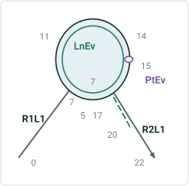
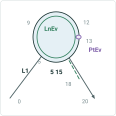

# Support Complex Route Shapes in Derive Event Measures GP tool

|   |   |
| --- | --- |
| **Kind** | User Story · Pro |
| **Release** | — |
| **Product** | Roads & Highways |
| **Source** | [DeriveEventMeasuresComplexRouteShapes.pptx](<https://esriis.sharepoint.com/sites/LocationReferencing/Shared%20Documents/General/DeriveEventMeasuresComplexRouteShapes.pptx>) |
| **Edited** | 2020-07-16 23:09 by Nathan Easley |
| **Extracted** | 2026-09-04 · lane `xmlstrip` |

<!-- metadata
```yaml
title: "Support Complex Route Shapes in Derive Event Measures GP tool"
source_file: "DeriveEventMeasuresComplexRouteShapes.pptx"
source_url: "https://esriis.sharepoint.com/sites/LocationReferencing/Shared%20Documents/General/DeriveEventMeasuresComplexRouteShapes.pptx"
doc_id: 780
doc_kind: "User Story"
surface: "Pro"
doc_revision: ""
target_release: ""
pe: ""
dev: ""
author: "William Isley"
last_edited_by: "Nathan Easley"
last_edited: "2020-07-16T23:09:05Z"
extracted: 2026-09-04
extraction_lane: xmlstrip
prompt_version: "v2.0.2"
keywords: ["complex route", "derive event measures", "event measures", "line network", "derived network", "route shapes", "geoprocessing"]
tools: ["Derive Event Measures"]
products: ["Roads & Highways"]
issues: []
related: [{"doc":837,"file":"support-event-behaviors-on-complex-route-shapes-in-reassign-route__doc837.md","s":6.945},{"doc":798,"file":"support-complex-route-shapes-in-translate-events-gp-tool__doc798.md","s":6.797},{"doc":799,"file":"support-complex-route-shapes-in-overlay-events-gp-tool__doc799.md","s":6.689},{"doc":838,"file":"support-event-behaviors-on-complex-route-shapes-in-cartographic-realignment__doc838.md","s":6.544},{"doc":779,"file":"support-complex-route-shapes-in-update-measures-from-lrs-gp-tool__doc779.md","s":6.537}]
```
-->

## Summary

This document describes a user story for supporting event measures on complex route shapes in the Derive Event Measures geoprocessing tool. It covers scenarios where events are located on complex routes in line or derived networks and specifies testing scenarios for various complex route types. It also mentions automation testing and notes no documentation updates are needed.

## Related documents

<!-- related:begin -->
- [Support Event Behaviors on Complex Route Shapes in Reassign Route](<https://esriis.sharepoint.com/sites/lrsworkspace/LRS Doc Index/User Stories/support-event-behaviors-on-complex-route-shapes-in-reassign-route__doc837.md>) — similar text 0.30 · 5 title words · 4 filename words · same kind/surface/folder <!-- rel:837 -->
- [Support Complex Route Shapes in Translate Events GP tool](<https://esriis.sharepoint.com/sites/lrsworkspace/LRS Doc Index/User Stories/support-complex-route-shapes-in-translate-events-gp-tool__doc798.md>) — similar text 0.33 · 5 title words · 3 filename words · same kind/surface/folder <!-- rel:798 -->
- [Support Complex Route Shapes in Overlay Events GP tool](<https://esriis.sharepoint.com/sites/lrsworkspace/LRS Doc Index/User Stories/support-complex-route-shapes-in-overlay-events-gp-tool__doc799.md>) — similar text 0.35 · 5 title words · 3 filename words · same kind/surface/folder <!-- rel:799 -->
- [Support Event Behaviors on Complex Route Shapes in Cartographic Realignment](<https://esriis.sharepoint.com/sites/lrsworkspace/LRS Doc Index/User Stories/support-event-behaviors-on-complex-route-shapes-in-cartographic-realignment__doc838.md>) — similar text 0.30 · 5 title words · 4 filename words · same kind/surface/folder <!-- rel:838 -->
- [Support Complex Route Shapes in Update Measures from LRS GP tool](<https://esriis.sharepoint.com/sites/lrsworkspace/LRS Doc Index/User Stories/support-complex-route-shapes-in-update-measures-from-lrs-gp-tool__doc779.md>) — similar text 0.42 · 6 title words · 2 filename words · same kind/surface/folder <!-- rel:779 -->
<!-- related:end -->

<!-- docs:begin -->
## Esri documentation

[Complex scenarios for route calibration](https://doc.esri.com/en/arcgis-pro/latest/help/production/roads-highways/complex-scenarios-for-route-calibration.html) · [Configure continuous measure networks and events to update with an engineering network](https://doc.esri.com/en/arcgis-pro/latest/help/production/location-referencing-pipelines/configure-continuous-measure-networks-and-events-to-update-with-an-engineering-network.html)

_No page matched:_ [Derive Event Measures](https://www.google.com/search?q=%22Derive%20Event%20Measures%22+site%3Adoc.esri.com)
<!-- docs:end -->

---

## Slide 1 — Support Complex Route Shapes in Derive Event Measures GP tool

User Story

## Slide 2 — User Story

As a Roads and Highways editor, I need to be able to get event measures from a continuous network route that are located on a complex route onto my line network events, so that their measures are stored correctly like events on non complex routes.

## Slide 3 — Derive Event Measures on Complex Shapes

In the Derive Event Measures GP tool, events that are located on complex routes in either the line or derived networks need to be supported.
When an event located on a complex route in the line or derived network, make sure the tool populated the correct RouteID, From Measure, and To Measure from the derived network
Will need to consider if the event itself is on a complex route shape as well as the case where the derived network route is on a complex shape
If the translation location is at a location on the route where there is more than one measure, choose the first result that is returned (this is consistent with what we do in Update Measures from LRS)
Event located on route in line network			Derived network route to get measures from



| Event | FM | TM |
| --- | --- | --- |
| LnEv | 7 | 20 |
| PtEv | 15 |  |



| Event | DRteID | DFM | DTM |
| --- | --- | --- | --- |
| LnEv | L1 | 5 | 18 |
| PtEv | L1 | 13 |  |

## Slide 4 — Testing

Test the following scenarios for events spanning and not spanning routes:

  - Loop
  - Lollipop
  - Alpha
  - Branch
  - Barbell
  - Complex shape with gap
  - Events that go from begin-end, begin-middle, middle-middle, and middle-end
  - Events that begin/end at the self-intersection point
  - Different combinations of route types on different network types (i.e. line network route is not complex, derived is complex; both network routes are complex)
  - No postmile as they don’t support events
Try to use the data that was used for other complex shapes event user stories

## Slide 5 — Automation

Python – Add a set of tests for complex route shapes to the existing automation for the tool in place today

## Slide 6 — Documentation

No doc updates to the tool

## Slide 7 — Assignment

Story Points:
Dev:
PE:
