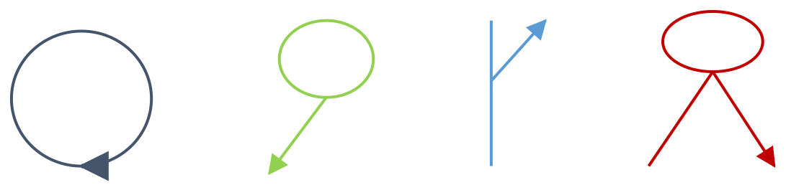

# Support Complex Route Shapes in Generate Routes

| Field | Value |
| --- | --- |
| **Doc** | 849 · User Story · Pro |
| **Product** | Roads & Highways |
| **Release** | — |
| **Issues** | — |
| **Source** | [ComplexRouteShapesGenerateRoutes.pptx](<https://esriis.sharepoint.com/sites/LocationReferencing/Shared%20Documents/General/ComplexRouteShapesGenerateRoutes.pptx>) |
| **People** | author William Isley · PE — · dev — |
| **Edited** | 2019-12-04 00:27 by Nathan Easley |
| **Extracted** | 2026-09-04 · lane xmlstrip · format 3.0 · prompt v2.0.2 |
| **Keywords** | complex route shape · generate routes · calibration points · euler algorithm · loops · lollipops · alpha routes · branched routes · line network · non line network |
| **Tools** | Generate Routes |

## Summary

This user story describes the need for Roads and Highways users to generate and regenerate complex route shapes such as loops, lollipops, alpha, and branched routes. The Generate Routes geoprocessing tool uses the Euler algorithm to ensure correct shape and calibration based on existing calibration points, supporting both line and non-line networks and considering Z values for self intersections. Testing includes positive and negative cases with automation via Python and feature services input.

## Related documents

<!-- related:begin -->
- [Support Complex Route Shapes in Generate Events](<https://esriis.sharepoint.com/sites/lrsworkspace/LRS Doc Index/User Stories/support-complex-route-shapes-in-generate-events.md>) — similar text 0.86 · 5 title words · 4 filename words · same kind/surface/folder <!-- rel:848 s=10.147 -->
- [Support Complex Route Shapes in Retire Route](<https://esriis.sharepoint.com/sites/lrsworkspace/LRS Doc Index/User Stories/support-complex-route-shapes-in-retire-route.md>) — similar text 0.65 · 4 title words · 3 filename words · same kind/surface/folder <!-- rel:872 s=8.754 -->
- [Support Complex Route Shapes in Reassign Route](<https://esriis.sharepoint.com/sites/lrsworkspace/LRS Doc Index/User Stories/support-complex-route-shapes-in-reassign-route.md>) — similar text 0.66 · 4 title words · 3 filename words · same kind/surface/folder <!-- rel:855 s=8.585 -->
- [Support Complex Route Shapes in Realign Route](<https://esriis.sharepoint.com/sites/lrsworkspace/LRS Doc Index/User Stories/support-complex-route-shapes-in-realign-route.md>) — similar text 0.64 · 4 title words · 3 filename words · same kind/surface/folder <!-- rel:854 s=8.543 -->
- [Support Complex Route Shapes in Extend Route](<https://esriis.sharepoint.com/sites/lrsworkspace/LRS Doc Index/User Stories/support-complex-route-shapes-in-extend-route.md>) — similar text 0.57 · 4 title words · 3 filename words · same kind/surface/folder <!-- rel:873 s=8.404 -->
<!-- related:end -->

<!-- docs:begin -->
## Esri documentation

_No page matched:_ [Generate Routes](https://www.google.com/search?q=%22Generate%20Routes%22+site%3Adoc.esri.com)
<!-- docs:end -->

---

## Story
### Support Complex Route Shapes in Generate Routes <!-- slide 1 -->
User Story

### User Story <!-- slide 2 -->
As a Roads and Highways user, I need to be able to generate/regenerate complex route shapes in Roads and Highways, such as loops, lollipops, alpha, and branched routes, so these routes calibrate and can have events located on them for reporting and other use cases.

## Acceptance Criteria
### Generate Routes <!-- slide 3 -->
- Works with inputs as fgdb, direct connect (traditional or branch), and services
- In the Generate Routes GP tool, utilize the Euler algorithm as needed to ensure a complex route gets the correct shape and correct calibration applied based on the existing calibration points associated with the route
- Should work for any complex route shape (see the sample shapes used in Generate Calibration Points story)
- Consider Z values on the centerline to determine if there is a self intersection/closing
- Works in both non line and line networks
- Add to the output text file if the following scenarios occur when running the tool:
  - The complex route the event will be located on doesn’t have the required calibration points in the required locations
  - The complex route doesn’t calibrate for some other reason

## Testing
<!-- slide 4 -->
Positive (Generating Events on a)

  - Loop
  - Lollipop
  - Alpha
  - Branch
  - Barbell
  - Complex shape with gap
  - Non Line Network (focus on this)
  - Line Network (events spanning routes)
  - Caltrans
  - With/without Z values (only for considering self intersection)

Negative

  - Calibration points not in correct locations to calibrate complex shape
Automation

  - Python (Add to the existing Generate Routes automated tests)
  - Feature Services as input

## Documentation
<!-- slide 5 -->
- Add a usage note to the existing GP tool topic about support for generating routes that are complex route shapes

## Assignment
<!-- slide 6 -->
Story Points:
Dev:
Test Plan PE:
