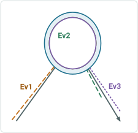
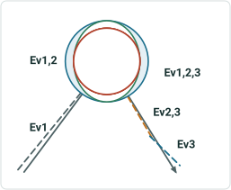

# Support Complex Route Shapes in Overlay Events GP tool

|   |   |
| --- | --- |
| **Kind** | User Story · Pro |
| **Release** | — |
| **Product** | Roads & Highways |
| **Source** | [OverlayEventsComplexRouteShapes.pptx](<https://esriis.sharepoint.com/sites/LocationReferencing/Shared%20Documents/General/OverlayEventsComplexRouteShapes.pptx>) |
| **Edited** | 2020-05-28 00:05 by Nathan Easley |
| **Extracted** | 2026-09-04 · lane `xmlstrip` |

<!-- metadata
```yaml
title: "Support Complex Route Shapes in Overlay Events GP tool"
source_file: "OverlayEventsComplexRouteShapes.pptx"
source_url: "https://esriis.sharepoint.com/sites/LocationReferencing/Shared%20Documents/General/OverlayEventsComplexRouteShapes.pptx"
doc_id: 799
doc_kind: "User Story"
surface: "Pro"
doc_revision: ""
target_release: ""
pe: ""
dev: ""
author: "William Isley"
last_edited_by: "Nathan Easley"
last_edited: "2020-05-28T00:05:21Z"
extracted: 2026-09-04
extraction_lane: xmlstrip
prompt_version: "v2.0.2"
keywords: ["complex route", "overlay events", "dynamic segmentation", "route shape", "line network", "non line network"]
tools: ["Overlay Events"]
products: ["Roads & Highways"]
issues: []
related: [{"doc":798,"file":"support-complex-route-shapes-in-translate-events-gp-tool__doc798.md","s":8.32},{"doc":848,"file":"support-complex-route-shapes-in-generate-events__doc848.md","s":7.029},{"doc":780,"file":"support-complex-route-shapes-in-derive-event-measures-gp-tool__doc780.md","s":6.689},{"doc":765,"file":"support-vertical-route-segments-in-overlay-events-gp-tool__doc765.md","s":6.483},{"doc":837,"file":"support-event-behaviors-on-complex-route-shapes-in-reassign-route__doc837.md","s":6.2}]
```
-->

## Summary

This document describes a user story for supporting overlay events located on complex routes in the Overlay Events geoprocessing tool. It specifies requirements for correct route and measure handling, shape building, and impacts on the Query Attribute Set REST endpoint. Testing scenarios include various complex route shapes and network types, with automation planned via Python tests.

## Related documents

<!-- related:begin -->
- [Support Complex Route Shapes in Translate Events GP tool](<https://esriis.sharepoint.com/sites/lrsworkspace/LRS Doc Index/User Stories/support-complex-route-shapes-in-translate-events-gp-tool__doc798.md>) — similar text 0.53 · 6 title words · 4 filename words · same kind/surface/folder <!-- rel:798 -->
- [Support Complex Route Shapes in Generate Events](<https://esriis.sharepoint.com/sites/lrsworkspace/LRS Doc Index/User Stories/support-complex-route-shapes-in-generate-events__doc848.md>) — similar text 0.24 · 5 title words · 4 filename words · same kind/surface/folder <!-- rel:848 -->
- [Support Complex Route Shapes in Derive Event Measures GP tool](<https://esriis.sharepoint.com/sites/lrsworkspace/LRS Doc Index/User Stories/support-complex-route-shapes-in-derive-event-measures-gp-tool__doc780.md>) — similar text 0.35 · 5 title words · 3 filename words · same kind/surface/folder <!-- rel:780 -->
- [Support Vertical Route Segments in Overlay Events GP tool](<https://esriis.sharepoint.com/sites/lrsworkspace/LRS Doc Index/User Stories/support-vertical-route-segments-in-overlay-events-gp-tool__doc765.md>) — similar text 0.54 · 5 title words · 2 filename words · same kind/surface/folder <!-- rel:765 -->
- [Support Event Behaviors on Complex Route Shapes in Reassign Route](<https://esriis.sharepoint.com/sites/lrsworkspace/LRS Doc Index/User Stories/support-event-behaviors-on-complex-route-shapes-in-reassign-route__doc837.md>) — similar text 0.34 · 4 title words · 3 filename words · same kind/surface/folder <!-- rel:837 -->
<!-- related:end -->

<!-- docs:begin -->
## Esri documentation

[Complex scenarios for route calibration](https://doc.esri.com/en/arcgis-pro/latest/help/production/roads-highways/complex-scenarios-for-route-calibration.html) · [Apply dynamic segmentation](https://doc.esri.com/en/arcgis-pro/latest/help/production/roads-highways/apply-dynamic-segmentation.html)

_No page matched:_ [Overlay Events](https://www.google.com/search?q=%22Overlay%20Events%22+site%3Adoc.esri.com)
<!-- docs:end -->

---

## Slide 1 — Support Complex Route Shapes in Overlay Events GP tool

User Story

## Slide 2 — User Story

As a Roads and Highways editor, I need to be able to overlay events that are located on a complex route, so that they dynamically segment correctly like events on non complex routes.

## Slide 3 — Route with Route in Overlay Events




In the overlay events GP tool, events that are located on complex routes need to be supported.
Complex routes themselves need to be supported as well since the network feature class is an input in the tool.
When an event from an complex route is overlaid, make sure the tool does the following:

  - The correct From RouteID, To RouteID (if line network), From Measure, To Measure, and From Date, To Date should be applied to the output record
  - The correct shape should be built (if the output format is a feature class), which begins/ends at the correct locations on the route
This will also impact the Query Attribute Set REST endpoint since the code is shared
Input events on complex route				Overlaid events on complex route

## Slide 4 — Testing

Test the following scenarios:

  - Loop
  - Lollipop
  - Alpha
  - Branch
  - Barbell
  - Complex shape with gap
  - Non Line Network (focus on this)
  - Line Network (events spanning routes)
  - Test events that go from begin-end, begin-middle, middle-middle, and middle-end
Will also need to verify the behavior in the Query Attribute Set REST endpoint

## Slide 5 — Automation

Python – Add a set of tests for complex route shapes in the same manner as the non-complex, gapped route, and postmile tests in place today

## Slide 6 — Assignment

Story Points:
Dev:
PE:
