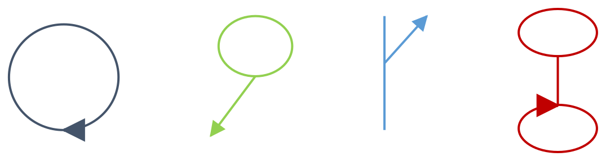

# Support Complex Route Shapes in Retire Route

| Field | Value |
| --- | --- |
| **Doc** | 872 · User Story · Pro |
| **Product** | Roads & Highways |
| **Release** | — |
| **Issues** | — |
| **Source** | [ComplexRouteShapesRetireRoute.pptx](<https://esriis.sharepoint.com/sites/LocationReferencing/Shared%20Documents/General/ComplexRouteShapesRetireRoute.pptx>) |
| **People** | author William Isley · PE — · dev — |
| **Edited** | 2019-11-18 21:58 by Nathan Easley |
| **Extracted** | 2026-09-04 · lane xmlstrip · format 3.0 · prompt v2.0.2 |
| **Keywords** | complex shape · retire route · calibration points · route shape · euler algorithm · roads and highways · line network · non line network |
| **Tools** | Retire Route · Generate Calibration Points · Generate Routes |

## Summary

This document describes the user story for supporting complex route shapes such as loops, lollipops, alpha, branched, and barbell routes in the Retire Route functionality within Roads and Highways. It outlines the use of the Euler algorithm to build route shapes, place calibration points, and calibrate routes when editing or extending complex routes. Testing includes positive and negative cases for various complex shapes in both REST and Pro UI environments.

## Related documents

<!-- related:begin -->
- [Support Complex Route Shapes in Realign Route](<https://esriis.sharepoint.com/sites/lrsworkspace/LRS Doc Index/User Stories/support-complex-route-shapes-in-realign-route.md>) — similar text 0.86 · 4 title words · 3 filename words · same kind/surface/folder <!-- rel:854 s=9.987 -->
- [Support Complex Route Shapes in Reassign Route](<https://esriis.sharepoint.com/sites/lrsworkspace/LRS Doc Index/User Stories/support-complex-route-shapes-in-reassign-route.md>) — similar text 0.87 · 4 title words · 3 filename words · same kind/surface/folder <!-- rel:855 s=9.775 -->
- [Support Complex Route Shapes in Extend Route](<https://esriis.sharepoint.com/sites/lrsworkspace/LRS Doc Index/User Stories/support-complex-route-shapes-in-extend-route.md>) — similar text 0.79 · 4 title words · 3 filename words · same kind/surface/folder <!-- rel:873 s=9.591 -->
- [Support Complex Route Shapes in Cartographic Realignment](<https://esriis.sharepoint.com/sites/lrsworkspace/LRS Doc Index/User Stories/support-complex-route-shapes-in-cartographic-realignment-rh-2019-11.md>) — similar text 0.72 · 4 title words · 3 filename words · same kind/surface/folder <!-- rel:868 s=9.571 -->
- [Support Complex Route Shapes in Calibrate Route](<https://esriis.sharepoint.com/sites/lrsworkspace/LRS Doc Index/User Stories/support-complex-route-shapes-in-calibrate-route.md>) — similar text 0.60 · 4 title words · 3 filename words · same kind/surface/folder <!-- rel:853 s=9.216 -->
<!-- related:end -->

<!-- docs:begin -->
## Esri documentation

[Retire routes](https://doc.esri.com/en/arcgis-pro/latest/help/production/roads-highways/retire-routes.html) · [Complex shapes](https://doc.esri.com/en/arcgis-pro/latest/help/production/roads-highways/complex-shapes.html) · [3D in Roads and Highways](https://doc.esri.com/en/arcgis-pro/latest/help/production/roads-highways/3d-in-roads-and-highways.html)

_No page matched:_ [Generate Calibration Points](https://www.google.com/search?q=%22Generate%20Calibration%20Points%22+site%3Adoc.esri.com) · [Generate Routes](https://www.google.com/search?q=%22Generate%20Routes%22+site%3Adoc.esri.com)
<!-- docs:end -->

---

## Story
### Support Complex Route Shapes in Retire Route <!-- slide 1 -->
User Story

### User Story <!-- slide 2 -->
As a Roads and Highways user, I need to be able to retire existing/retire to create new complex route shapes in Roads and Highways, such as loops, lollipops, alpha, and branched routes, so these routes calibrate and can have events located on them for reporting and other use cases.

[connections: (ellipse 19) — (ellipse 18)]

## Acceptance Criteria
### Retire Route <!-- slide 3 -->
- Utilize the Euler algorithm used in Generate Calibration Points/Generate Routes to do the following in Retire Route when a complex route is edited OR the extend will create a complex shape:
  - Build the route shape
  - Place new calibration points at the required locations
  - Calibrate the route
- Verify calibration points are placed correctly when extending; add all the necessary calibration points to work with the Euler algorithm if any are missing/not present
- Only split centerline(s) as needed (always split multipart centerlines into multiple single part centerlines)
- Should work for any complex route shape (see the sample shapes used in Generate Calibration Points story)
- Consider Z values on the route to determine if there is a self intersection/closing
- Works in both non line and line networks
- Needs to be supported in both REST and Pro UI

## Testing
<!-- slide 4 -->
Positive (for both existing and newly created complex shapes)

  - Loop
  - Lollipop
  - Alpha
  - Branch
  - Barbell
  - Complex shape with gap
  - Non Line Network (focus on this)
  - Line Network/Caltrans
  - With/without Z values (only for considering self intersection)
  - REST and UI
  - Calibration points not in correct locations to calibrate complex shape

Negative
Automation

  - REST (add a few cases to the existing automation)
  - UI (A new set of Extend Route tests in TestComplete; only automate one of each type of complex shape)

## Documentation
<!-- slide 5 -->
- Document support for being able to retire existing/create new complex route shapes in the Retire Route editing topic.

## Assignment
<!-- slide 6 -->
Story Points:
Dev:
Test Plan PE:
