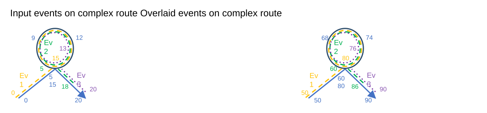

# Support Complex Route Shapes in Translate Events GP tool

| Field | Value |
| --- | --- |
| **Doc** | 798 · User Story · Pro |
| **Product** | Roads & Highways |
| **Release** | — |
| **Issues** | — |
| **Source** | [TranslateEventsComplexRouteShapes.pptx](<https://esriis.sharepoint.com/sites/LocationReferencing/Shared%20Documents/General/TranslateEventsComplexRouteShapes.pptx>) |
| **People** | author William Isley · PE — · dev — |
| **Edited** | 2020-05-28 00:29 by Nathan Easley |
| **Extracted** | 2026-09-04 · lane xmlstrip · format 3.0 · prompt v2.0.2 |
| **Keywords** | complex route · translate events · geoprocessing tool · route shape · event translation · line network · non line network |
| **Tools** | Translate Events |

## Summary

This user story describes the need for the Translate Events geoprocessing tool to support events located on complex routes, ensuring correct translation of measures and shapes. It outlines requirements for handling route IDs, measures, dates, and shape construction for complex routes, including scenarios like loops, lollipops, and branches. Testing scenarios and automation plans using Python tests are also included.

## Related documents

<!-- related:begin -->
- [Support Complex Route Shapes in Overlay Events GP tool](<https://esriis.sharepoint.com/sites/lrsworkspace/LRS Doc Index/User Stories/support-complex-route-shapes-in-overlay-events-gp.md>) — similar text 0.53 · 6 title words · 4 filename words · same kind/surface/folder <!-- rel:799 s=8.32 -->
- [Support Complex Route Shapes in Generate Events](<https://esriis.sharepoint.com/sites/lrsworkspace/LRS Doc Index/User Stories/support-complex-route-shapes-in-generate-events.md>) — similar text 0.26 · 5 title words · 4 filename words · same kind/surface/folder <!-- rel:848 s=7.101 -->
- [Support Complex Route Shapes in Derive Event Measures GP tool](<https://esriis.sharepoint.com/sites/lrsworkspace/LRS Doc Index/User Stories/support-complex-route-shapes-in-derive-event-measures-gp.md>) — similar text 0.33 · 5 title words · 3 filename words · same kind/surface/folder <!-- rel:780 s=6.797 -->
- [Support Vertical Route Segments in Translate Events GP Tool](<https://esriis.sharepoint.com/sites/lrsworkspace/LRS Doc Index/User Stories/support-vertical-route-segments-in-translate-events-gp.md>) — similar text 0.43 · 5 title words · 2 filename words · same kind/surface/folder <!-- rel:767 s=6.625 -->
- [Translate Events: Support translation of an event to a network with Postmile routes within routes](<https://esriis.sharepoint.com/sites/lrsworkspace/LRS Doc Index/User Stories/1958-translate-events-support-translation-of-an-event.md>) — similar text 0.29 · 3 title words · 2 filename words · same kind/surface/folder <!-- rel:831 s=6.256 -->
<!-- related:end -->

<!-- docs:begin -->
## Esri documentation

[Complex scenarios for route calibration](https://doc.esri.com/en/arcgis-pro/latest/help/production/roads-highways/complex-scenarios-for-route-calibration.html)

_No page matched:_ [Translate Events](https://www.google.com/search?q=%22Translate%20Events%22+site%3Adoc.esri.com)
<!-- docs:end -->

---

## Story
### Support Complex Route Shapes in Translate Events GP tool <!-- slide 1 -->
User Story

### User Story <!-- slide 2 -->
As a Roads and Highways editor, I need to be able to translate events that are located on a complex route, so that their measures translate correctly like events on non complex routes.

## Acceptance Criteria
### Route with Route in Overlay Events <!-- slide 3 -->
- In the translate events GP tool, events that are located on complex routes need to be supported.
- When an event from an complex route is translated, make sure the tool does the following:
  - The correct From RouteID, To RouteID (if line network), From Measure, To Measure, and From Date, To Date should be applied to the output record
  - The correct shape should be built, which begins/ends at the correct locations on the route with a shape that encompasses the entire length of the route between those two points
  - Should we split events at self closing/intersection points?
Input events on complex route					Overlaid events on complex route

| Event | FM | TM |
| --- | --- | --- |
| Ev1 | 0 | 15 |
| Ev2 | 5 | 18 |
| Ev3 | 13 | 20 |

| Event | FM | TM |
| --- | --- | --- |
| Ev1 | 50 | 80 |
| Ev2 | 60 | 86 |
| Ev3 | 76 | 90 |

[figure: Ev1 · Ev2 · Ev3 · 0 · 20 · 5 15 · 9 · 12 · 18 · 13 · 15 · 5 · 50 · 90 · 60 80 · 68 · 74 · 86 · 76 · 80 · 60]

## Testing
<!-- slide 4 -->
- Test the following scenarios:
  - Loop
  - Lollipop
  - Alpha
  - Branch
  - Barbell
  - Complex shape with gap
  - Non Line Network (focus on this)
  - Line Network (events spanning routes)
  - Test events that go from begin-end, begin-middle, middle-middle, and middle-end

## Automation
<!-- slide 5 -->
Python – Add a set of tests for complex route shapes in the same manner as the non-complex, gapped route, and postmile tests in place today

## Assignment
<!-- slide 6 -->
Story Points:
Dev:
PE:
