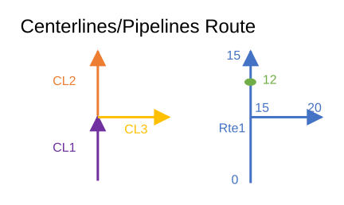

# Support Complex Route Shapes in Update Measures from LRS GP tool

| Field | Value |
| --- | --- |
| **Doc** | 779 · User Story · Pro |
| **Product** | Utility Network |
| **Release** | — |
| **Issues** | — |
| **Source** | [UpdateMeasuresfromLRSComplexRouteShapes.pptx](<https://esriis.sharepoint.com/sites/LocationReferencing/Shared%20Documents/General/UpdateMeasuresfromLRSComplexRouteShapes.pptx>) |
| **People** | author William Isley · PE — · dev — |
| **Edited** | 2020-07-17 00:19 by Nathan Easley |
| **Extracted** | 2026-09-04 · lane xmlstrip · format 3.0 · prompt v2.0.2 |
| **Keywords** | complex route · update measures · utility network · geoprocessing tool · route id · measure |
| **Tools** | Update Measures from LRS |

## Summary

This user story describes the need for the Update Measures from LRS geoprocessing tool to support features located on complex route shapes, ensuring correct route IDs and measures are assigned. It includes testing scenarios for various complex route shapes and mentions automation of tests using Python. No documentation updates are required.

## Related documents

<!-- related:begin -->
- [Support Complex Route Shapes in Derive Event Measures GP tool](<https://esriis.sharepoint.com/sites/lrsworkspace/LRS Doc Index/User Stories/support-complex-route-shapes-in-derive-event-measures-gp.md>) — similar text 0.42 · 6 title words · 2 filename words · same kind/surface/folder <!-- rel:780 s=6.537 -->
- [Support Complex Route Shapes in Translate Events GP tool](<https://esriis.sharepoint.com/sites/lrsworkspace/LRS Doc Index/User Stories/support-complex-route-shapes-in-translate-events-gp.md>) — similar text 0.40 · 5 title words · 2 filename words · same kind/surface/folder <!-- rel:798 s=6.118 -->
- [Support Complex Route Shapes in Overlay Events GP tool](<https://esriis.sharepoint.com/sites/lrsworkspace/LRS Doc Index/User Stories/support-complex-route-shapes-in-overlay-events-gp.md>) — similar text 0.42 · 5 title words · 2 filename words · same kind/surface/folder <!-- rel:799 s=6.011 -->
- [Support Event Behaviors on Complex Route Shapes in Reassign Route](<https://esriis.sharepoint.com/sites/lrsworkspace/LRS Doc Index/User Stories/support-eb-on-complex-route-shapes-in-reassign-route.md>) — similar text 0.38 · 4 title words · 2 filename words · same kind/surface/folder <!-- rel:837 s=5.838 -->
- [Support Event Behaviors on Complex Route Shapes in Realign Route](<https://esriis.sharepoint.com/sites/lrsworkspace/LRS Doc Index/User Stories/support-eb-on-complex-route-shapes-in-realign-route.md>) — similar text 0.36 · 4 title words · 2 filename words · same kind/surface/folder <!-- rel:836 s=5.655 -->
<!-- related:end -->

<!-- docs:begin -->
## Esri documentation

[Complex scenarios for route calibration](https://doc.esri.com/en/arcgis-pro/latest/help/production/location-referencing-pipelines/complex-scenarios-for-route-calibration.html) · [Configure continuous measure networks and events to update with an engineering network](https://doc.esri.com/en/arcgis-pro/latest/help/production/location-referencing-pipelines/configure-continuous-measure-networks-and-events-to-update-with-an-engineering-network.html) · [View utility network feature class properties](https://doc.esri.com/en/arcgis-pro/latest/help/production/location-referencing-pipelines/view-utility-network-feature-class-properties.html) · [Split a centerline by measure](https://doc.esri.com/en/arcgis-pro/latest/help/production/location-referencing-pipelines/split-a-centerline-by-measure.html)

_No page matched:_ [Update Measures from LRS](https://www.google.com/search?q=%22Update%20Measures%20from%20LRS%22+site%3Adoc.esri.com)
<!-- docs:end -->

---

## Story
### Support Complex Route Shapes in Update Measures from LRS GP tool <!-- slide 1 -->
User Story

### User Story <!-- slide 2 -->
As an LRS editor, I need to be get measures onto Utility Network features that are located on a complex route, so that the correct route and measure is added to those features.

## Acceptance Criteria
### Update Measures from LRS on Complex Shapes <!-- slide 3 -->
- In the Update Measures from LRS GP tool, features that are located on complex routes need to be supported.
- When an feature that is located on a complex route is input into the tool, make sure the tool places the correct From RouteID, To RouteID (if line network), From Measure, and To Measure (if line feature) on the output record
- If the RouteID(s) and Measure(s) can’t be found, report the same way we do today
Centerlines/Pipelines           Route

[figure: 0 · 15 · 20 · 12 · CL1 · CL2 · CL3 · Rte1]

## Testing
<!-- slide 4 -->
- Test the following scenarios:
  - Loop
  - Lollipop
  - Alpha
  - Branch
  - Barbell
  - Complex shape with gap
  - Non Line Network
  - Line Network
  - Derived Network
  - Features that go from begin-end, begin-middle, middle-middle, and middle-end
  - Features that begin/end at the self-intersection point
- Test with UN pipeline, device, and junction feature classes

## Automation
<!-- slide 5 -->
Python – Add a set of tests for complex route shapes to the existing test cases that are automated for the tool today

## Documentation
<!-- slide 6 -->
No documentation updates for the existing documentation for the tool

## Assignment
<!-- slide 7 -->
Story Points:
Dev:
PE:
