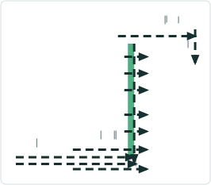

# Support Conflict Prevention on LRS Explode Operation

|   |   |
| --- | --- |
| **Kind** | User Story · Pro |
| **Release** | — |
| **Source** | [Support Conflict Prevention on LRS Explode.pptx](<https://esriis.sharepoint.com/sites/LocationReferencing/Shared%20Documents/General/Support%20Conflict%20Prevention%20on%20LRS%20Explode.pptx>) |
| **Edited** | 2020-04-30 22:54 by Nathan Easley |
| **Extracted** | 2026-09-04 · lane `xmlstrip` |

<!-- metadata
```yaml
title: "Support Conflict Prevention on LRS Explode Operation"
source_file: "Support Conflict Prevention on LRS Explode.pptx"
source_url: "https://esriis.sharepoint.com/sites/LocationReferencing/Shared%20Documents/General/Support%20Conflict%20Prevention%20on%20LRS%20Explode.pptx"
doc_id: 815
doc_kind: "User Story"
surface: "Pro"
doc_revision: ""
target_release: ""
pe: ""
dev: ""
author: "Nathan Easley"
last_edited_by: "Nathan Easley"
last_edited: "2020-04-30T22:54:57Z"
extracted: 2026-09-04
extraction_lane: xmlstrip
prompt_version: "v2.0.2"
keywords: ["conflict prevention", "explode operation", "centerlines", "locking", "lrs editing"]
tools: ["LRS Explode", "Realign Route"]
products: []
issues: []
related: [{"doc":829,"file":"support-updating-cl-cls-when-using-explode-operation__doc829.md","s":6.492},{"doc":813,"file":"support-lrs-explode-operation__doc813.md","s":6.388},{"doc":817,"file":"explode-multipart-centerlines-in-editing-activities-and-append-routes__doc817.md","s":6.196},{"doc":826,"file":"conflict-prevention-acquire-locks-when-creating-new-routes-in-create-extend__doc826.md","s":4.335},{"doc":559,"file":"conflict-prevention-reassign-route-user-story__doc559.md","s":4.286}]
```
-->

## Summary

This document describes a user story for supporting conflict prevention in the LRS Explode operation to avoid edit conflicts on exploded centerlines. It outlines locking behavior patterns, integration with LRS editing activities like Create, Extend, Realign, Reassign, and Retire, and testing scenarios for REST and ArcGIS Pro. It also includes documentation requirements for the tool and REST operation.

## Related documents

<!-- related:begin -->
- [Support updating CL/CLS when using explode operation](<https://esriis.sharepoint.com/sites/lrsworkspace/LRS Doc Index/User Stories/support-updating-cl-cls-when-using-explode-operation__doc829.md>) — similar text 0.35 · 3 title words · 2 filename words · same kind/surface/folder <!-- rel:829 -->
- [Support LRS Explode Operation](<https://esriis.sharepoint.com/sites/lrsworkspace/LRS Doc Index/User Stories/support-lrs-explode-operation__doc813.md>) — similar text 0.37 · 3 title words · 2 filename words · same kind/surface/folder <!-- rel:813 -->
- [Explode multipart centerlines in editing activities and Append Routes](<https://esriis.sharepoint.com/sites/lrsworkspace/LRS Doc Index/User Stories/explode-multipart-centerlines-in-editing-activities-and-append-routes__doc817.md>) — similar text 0.56 · 1 title word · 1 filename word · same kind/surface/folder <!-- rel:817 -->
- [Conflict Prevention: Acquire Locks when creating new routes in Create, Extend, Realign, and Reassign Route](<https://esriis.sharepoint.com/sites/lrsworkspace/LRS Doc Index/User Stories/conflict-prevention-acquire-locks-when-creating-new-routes-in-create-extend__doc826.md>) — similar text 0.23 · 2 title words · 2 filename words · same kind/surface/folder <!-- rel:826 -->
- [Conflict Prevention Reassign Route User Story](<https://esriis.sharepoint.com/sites/lrsworkspace/LRS Doc Index/User Stories/conflict-prevention-reassign-route-user-story__doc559.md>) — similar text 0.20 · 2 title words · 2 filename words · same kind/surface/folder <!-- rel:559 -->
<!-- related:end -->

<!-- docs:begin -->
## Esri documentation

[Realign routes](https://doc.esri.com/en/arcgis-pro/latest/help/production/location-referencing-pipelines/realign-routes.html) · [Conflict prevention](https://doc.esri.com/en/arcgis-pro/latest/help/production/location-referencing-pipelines/conflict-prevention.html) · [Release locks with the Release Locks tool](https://doc.esri.com/en/arcgis-pro/latest/help/production/location-referencing-pipelines/release-locks.html)

_No page matched:_ [LRS Explode](https://www.google.com/search?q=%22LRS%20Explode%22+site%3Adoc.esri.com)
<!-- docs:end -->

---

## Slide 1 — Support LRS explode operation

User Story

## Slide 2 — User Story

As a Location Referencing user, I need conflict prevention to work with the LRS explode operation, so that any centerlines that are exploded don’t cause conflicts with other users making edits in the system.

## Slide 3 — Conflict Prevention in LRS Explode



In the LRS Explode tool, support Conflict Prevention if enabled on the data in the service
If Conflict Prevention is enabled on the data in the service, follow the same pattern for locking as we do in Split Centerline (listed below)

- If C1 is split, then lock L_A and allow the edit to proceed
- If C2 is edited then lock L_A and L_B and allow the edit to proceed
- If C3 is edited, then lock L_B and allow the edit to proceed
- If C4 is edited then lock L_B and L_C and allow the edit to proceed
- If C5 is edited, then lock L_C and allow the edit to proceed
If C2 is split and a lock a cannot be acquired on either of L_A or L_B, then do not proceed with the edit and provide a message about the locks and revert the split

Split Locations
style.visibilitystyle.visibilitystyle.visibilitystyle.visibilitystyle.visibilitystyle.visibility


## Slide 4 — Exploding in LRS editing activities

Confirm that as part of the following LRS editing activities (Create, Extend, Realign, Reassign, Retire) that any multipart centerline is exploded as part of the operation

  - Realign Route already supports this; other network editing activities might as well
  - Follow the same pattern as in Realign Route for any editing activities that need this explode operation implemented
  - Document in the devtopia issue which tools already had this support and which had it implemented as part of this story

## Slide 5 — Testing

Verify in REST and Pro
Negative

  - Conflict Prevention not enabled (ensure no regression)
Positive

  - One centerline is exploded that isn’t locked
  - Multiple centerlines exploded that aren’t locked
See previous conflict prevention test plans for other scenarios to test

## Slide 6 — Doc

Create a help topic for the tool that discusses its usage
Document the new REST operation within the existing REST help for linear referencing operations

## Slide 7 — Assignment

Story Points:
Dev:
PE:
