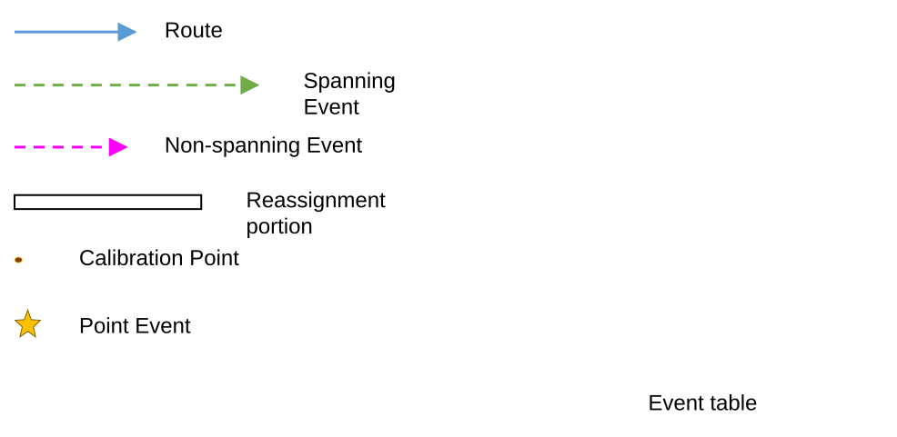
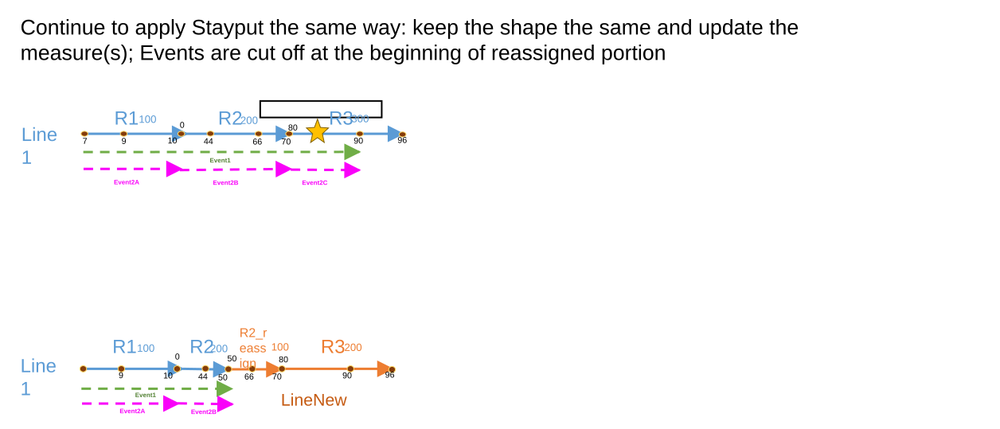
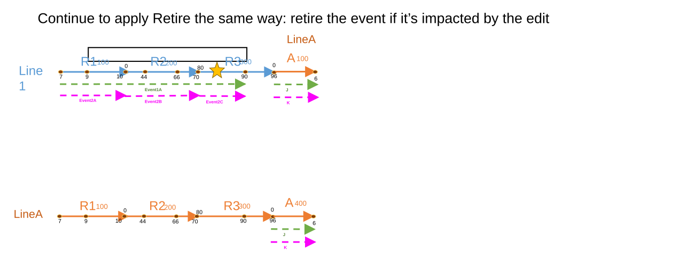
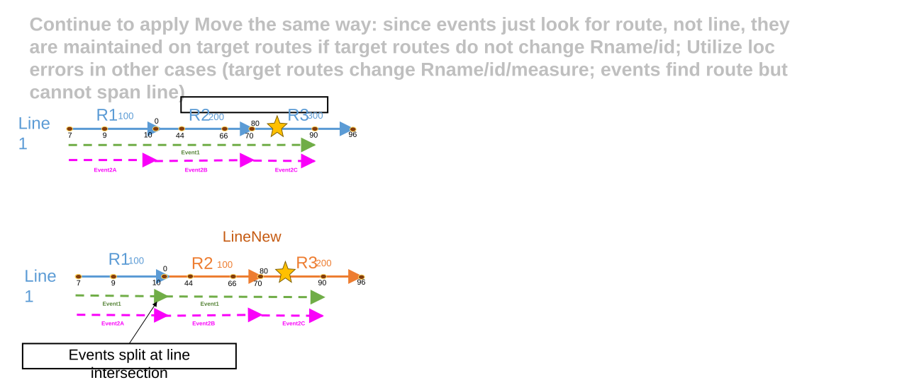
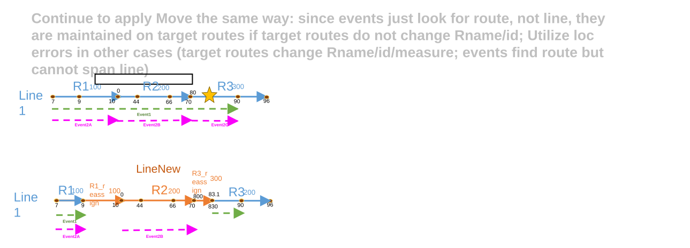
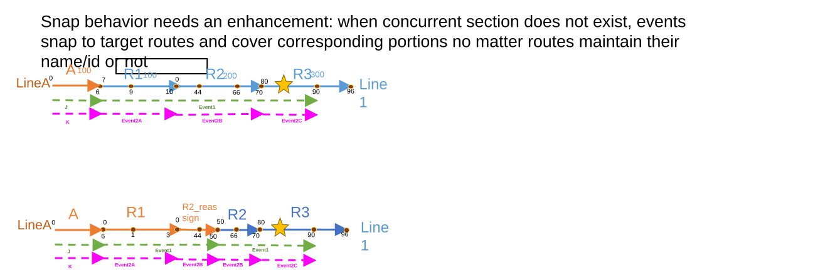
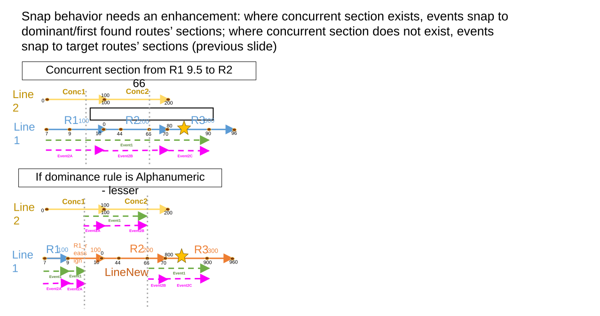
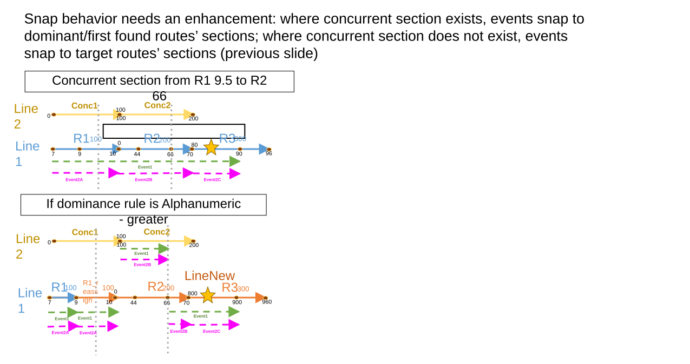
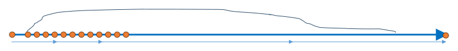

# Support Event Behaviors for New Reassign Method: Transfer to another line

| Field | Value |
| --- | --- |
| **Doc** | 572 · User Story · Experience Builder |
| **Product** | Roads & Highways · Pipeline Referencing |
| **Release** | — |
| **Issues** | — |
| **Source** | [ReassignNewMethodEB_0425.pptx](<https://esriis.sharepoint.com/sites/LocationReferencing/Shared%20Documents/General/ReassignNewMethodEB_0425.pptx>) |
| **People** | author William Isley · PE — · dev — |
| **Edited** | 2023-05-01 16:19 by Rahul Rakshit |
| **Extracted** | 2026-09-04 · lane xmlstrip · format 3.0 · prompt v2.0.2 |
| **Keywords** | event behavior · reassign method · transfer to another line · stayput · retire · move · snap · line network · concurrency · dominance rule |
| **Tools** | Apply Event Behavior |

## Summary

Describes the user story for supporting existing event behaviors after route edits using the new Transfer to another line reassign method in LRS. Covers event behavior requirements such as Stayput, Retire, Move, and Snap, including handling of complex shapes, line networks, and concurrency rules. Includes testing scenarios and automation considerations for these behaviors.

## Related documents

<!-- related:begin -->
- [Support Event Behaviors on Vertical Route Shapes in Reassign Route](<https://esriis.sharepoint.com/sites/lrsworkspace/LRS Doc Index/User Stories/support-eb-on-vertical-route-shapes-in-reassign-route.md>) — similar text 0.24 · 4 title words · 1 filename word · same kind/folder <!-- rel:758 s=5.274 -->
- [Support Reassign: Transfer to a New Line Method in ArcGIS Pro](<https://esriis.sharepoint.com/sites/lrsworkspace/LRS Doc Index/User Stories/support-reassign-transfer-to-a-new-line-method-in-pro.md>) — similar text 0.22 · 5 title words · 1 filename word · same kind/folder <!-- rel:585 s=5.032 -->
- [Support Reassign: Transfer as New Route(s) to Adjacent Line Method in ArcGIS Pro](<https://esriis.sharepoint.com/sites/lrsworkspace/LRS Doc Index/User Stories/support-reassign-transfer-as-new-route-s-to-adjacent-line.md>) — similar text 0.22 · 5 title words · 1 filename word · same kind/folder <!-- rel:583 s=4.958 -->
- [Transfer to Another Line – Support Snap Event Behavior Test Plan](<https://esriis.sharepoint.com/sites/lrsworkspace/LRS Doc Index/Test Plans/transfer-to-another-line-support-snap-eb-rh-apr-2023-08.md>) — similar text 0.27 · 5 title words · 1 filename word · same surface <!-- rel:526 s=4.952 -->
- [Support Event Behaviors on Complex Route Shapes in Reassign Route](<https://esriis.sharepoint.com/sites/lrsworkspace/LRS Doc Index/User Stories/support-eb-on-complex-route-shapes-in-reassign-route.md>) — similar text 0.27 · 4 title words · 1 filename word · same kind/folder <!-- rel:837 s=4.948 -->
<!-- related:end -->

<!-- docs:begin -->
## Esri documentation

[Event behavior](https://doc.esri.com/en/arcgis-pro/latest/help/production/roads-highways/what-is-event-behavior.html) · [Retire routes](https://doc.esri.com/en/arcgis-pro/latest/help/production/roads-highways/retire-routes.html)

_No page matched:_ [Apply Event Behavior](https://www.google.com/search?q=%22Apply%20Event%20Behavior%22+site%3Adoc.esri.com)
<!-- docs:end -->

---

## Story
### Support Event Behaviors for New Reassign Method: Transfer to another line <!-- slide 1 -->
User Story

### User Story <!-- slide 2 -->
As an LRS Editor, I need existing event behaviors to be supported after route edits are made via Transfer to another line, so that events can be maintained or managed the way I want.

Persona
LRS Editor: This user is responsible for making edits to the LRS. This type of LRS edit is required due to a variety of factors including ownership change, jurisdiction boundary change, other classification change, or more accurate analysis and management. After route reassignment, the LRS Editor needs to run Apply Event Behavior tool. The events located on the reassigned route(s) have their measures and shapes kept up to date. The challenge is to make sure event behaviors are applied as expected when routes change line-ship, regardless of whether routes keep original RouteID/Name intact or not.

## Acceptance Criteria
### Event Behaviors in Transfer to another line - General <!-- slide 3 -->
- When using this new Reassign method, continue to write to the edit log as we do today, preferably without changing any existing functionality. Developer needs to explore the feasibility while implementing this user story. If anything has to change, report to team and/or bring up discussion
- Works in line networks but not Postmile networks as they don’t have events
- Both non-complex and complex shapes should be supported
- Consider the recalibrate downstream and calibrate event behavior will apply to the downstream events if checked
- Ensure shape, measure, and LRS attributes for all time slices on events are correct after running AEB
- For requirement of each event behavior, see following slides
- Conflict Prevention will be covered in a separate user story as the new Reassign methods may require an enhancement to current logic

### Legend <!-- slide 4 -->
| Event ID | From Date | To Date | From Route ID | To Route ID | From M | To M | Location Error |
| --- | --- | --- | --- | --- | --- | --- | --- |
| Event1 | 1/1/2000 | <Null> | R1 | R3 | 7 | 90 | No Error |

[figure: Route · Spanning Event · Non-spanning Event · Reassignment portion · Calibration Point · Point Event · Event table]

### Event Behaviors in Transfer to another line - Stayput <!-- slide 5 -->
- Continue to apply Stayput the same way: keep the shape the same and update the measure(s); Events are cut off at the beginning of reassigned portion

| Event ID | From Date | To Date | From Route ID | To Route ID | From M | To M | Location Error |
| --- | --- | --- | --- | --- | --- | --- | --- |
| Event1 | 1/1/2000 | 1/1/2005 | R1 | R3 | 7 | 90 | No Error |
| Event1 | 1/1/2005 | <Null> | R1 | R2 | 7 | 50 | No Error |

| Event ID | From Date | To Date | From Route ID | To Route ID | From M | To M | Location Error |
| --- | --- | --- | --- | --- | --- | --- | --- |
| Event1 | 1/1/2000 | <Null> | R1 | R3 | 7 | 90 | No Error |

| Event ID | From Date | To Date | Route ID | From M | To M | Location Error |
| --- | --- | --- | --- | --- | --- | --- |
| Event2A | 1/1/2000 | <Null> | R1 | 7 | 10 | No Error |
| Event2B | 1/1/2000 | <Null> | R2 | 0 | 70 | No Error |
| Event2C | 1/1/2000 | <Null> | R3 | 80 | 90 | No Error |

| Event ID | From Date | To Date | Route ID | From M | To M | Location Error |
| --- | --- | --- | --- | --- | --- | --- |
| Event2A | 1/1/2000 | <Null> | R1 | 7 | 10 | No Error |
| Event2B | 1/1/2005 | <Null> | R2 | 0 | 50 | No Error |
| Event2B | 1/1/2000 | 1/1/2005 | R2 | 0 | 70 | No Error |
| Event2C | 1/1/2000 | 1/1/2005 | R3 | 80 | 90 | No Error |

| Event ID | From Date | To Date | Route ID | Measure | Location Error |
| --- | --- | --- | --- | --- | --- |
| star | 1/1/2000 | 1/1/2005 | R3 | 83 | No Error |

| Event ID | From Date | To Date | Route ID | Measure | Location Error |
| --- | --- | --- | --- | --- | --- |
| star | 1/1/2000 | <Null> | R3 | 83 | No Error |

[figure: R1 · R2 · R3 · 7 · 9 · 10 · 0 · 44 · 66 · 70 · 80 · 90 · 96 · Event1 · 100 · 200 · 300 · Line1 · 50 · R2_reassign · Event2A · LineNew · Event2B · Event2C]

### Event Behaviors in Transfer to another line - Retire <!-- slide 6 -->
- Continue to apply Retire the same way: retire the event if it’s impacted by the edit

| Event ID | From Date | To Date | From Route ID | To Route ID | From M | To M | Location Error |
| --- | --- | --- | --- | --- | --- | --- | --- |
| Event1A | 1/1/2000 | 1/1/2005 | R1 | R3 | 7 | 90 | No Error |
| J | 1/1/2000 | <Null> | A | A | 0 | 6 | No Error |

| Event ID | From Date | To Date | From Route ID | To Route ID | From M | To M | Location Error |
| --- | --- | --- | --- | --- | --- | --- | --- |
| Event1A | 1/1/2000 | <Null> | R1 | R3 | 7 | 90 | No Error |
| J | 1/1/2000 | <Null> | A | A | 0 | 6 | No Error |

| Event ID | From Date | To Date | Route ID | From M | To M | Location Error |
| --- | --- | --- | --- | --- | --- | --- |
| Event2A | 1/1/2000 | <Null> | R1 | 7 | 10 | No Error |
| Event2B | 1/1/2000 | <Null> | R2 | 0 | 70 | No Error |
| Event2C | 1/1/2000 | <Null> | R3 | 80 | 90 | No Error |
| K | 1/1/2000 | <Null> | A | 0 | 6 | No Error |

| Event ID | From Date | To Date | Route ID | From M | To M | Location Error |
| --- | --- | --- | --- | --- | --- | --- |
| Event2A | 1/1/2000 | 1/1/2005 | R1 | 7 | 10 | No Error |
| Event2B | 1/1/2000 | 1/1/2005 | R2 | 0 | 70 | No Error |
| Event2C | 1/1/2000 | 1/1/2005 | R3 | 80 | 90 | No Error |
| K | 1/1/2000 | <Null> | A | 0 | 6 | No Error |

| Event ID | From Date | To Date | Route ID | Measure | Location Error |
| --- | --- | --- | --- | --- | --- |
| star | 1/1/2000 | 1/1/2005 | R3 | 83 | No Error |

| Event ID | From Date | To Date | Route ID | Measure | Location Error |
| --- | --- | --- | --- | --- | --- |
| star | 1/1/2000 | <Null> | R3 | 83 | No Error |

[figure: R1 · R2 · R3 · 7 · 9 · 10 · 0 · 44 · 66 · 70 · 80 · 90 · 96 · Event1A · Event2A · 100 · 200 · 300 · Line1 · LineA · A · 6 · 400 · J · …]

### Event Behaviors in Transfer to another line - Move <!-- slide 7 -->
- Continue to apply Move the same way: since events just look for route, not line, they are maintained on target routes if target routes do not change Rname/id; Utilize loc errors in other cases (target routes change Rname/id/measure; events find route but cannot span line)

Events split at line intersection

| Event ID | From Date | To Date | From Route ID | To Route ID | From M | To M | Location Error |
| --- | --- | --- | --- | --- | --- | --- | --- |
| Event1 | 1/1/2000 | 1/1/2005 | R1 | R3 | 7 | 90 | No Error |
| Event1 | 1/1/2005 | <Null> | R1 | R3 | 7 | 90 | Different From Route And To Route Line IDs |
| Event1 | 1/1/2005 | <Null> | R1 | R3 | 7 | 90 | Different From Route And To Route Line IDs |

| Event ID | From Date | To Date | From Route ID | To Route ID | From M | To M | Location Error |
| --- | --- | --- | --- | --- | --- | --- | --- |
| Event1 | 1/1/2000 | <Null> | R1 | R3 | 7 | 90 | No Error |

| Event ID | From Date | To Date | Route ID | From M | To M | Location Error |
| --- | --- | --- | --- | --- | --- | --- |
| Event2A | 1/1/2000 | <Null> | R1 | 7 | 10 | No Error |
| Event2B | 1/1/2000 | <Null> | R2 | 0 | 70 | No Error |
| Event2C | 1/1/2000 | <Null> | R3 | 80 | 90 | No Error |

| Event ID | From Date | To Date | Route ID | From M | To M | Location Error |
| --- | --- | --- | --- | --- | --- | --- |
| Event2A | 1/1/2000 | <Null> | R1 | 7 | 10 | No Error |
| Event2B | 1/1/2005 | <Null> | R2 | 0 | 70 | No Error |
| Event2B | 1/1/2000 | 1/1/2005 | R2 | 0 | 70 | No Error |
| Event2C | 1/1/2005 | <Null> | R3 | 80 | 90 | No Error |
| Event2C | 1/1/2000 | 1/1/2005 | R3 | 80 | 90 | No Error |

| Event ID | From Date | To Date | Route ID | Measure | Location Error |
| --- | --- | --- | --- | --- | --- |
| star | 1/1/2000 | 1/1/2005 | R3 | 83 | No Error |
| star | 1/1/2005 | <Null> | R3 | 83 | No Error |

| Event ID | From Date | To Date | Route ID | Measure | Location Error |
| --- | --- | --- | --- | --- | --- |
| star | 1/1/2000 | <Null> | R3 | 83 | No Error |

[figure: R1 · R2 · R3 · 7 · 9 · 10 · 0 · 44 · 66 · 70 · 80 · 90 · 96 · Event1 · 100 · 200 · 300 · Line1 · LineNew · Event2B · Event2C · Event2A]

### Event Behaviors in Transfer to another line - Move <!-- slide 8 -->
- Continue to apply Move the same way: since events just look for route, not line, they are maintained on target routes if target routes do not change Rname/id; Utilize loc errors in other cases (target routes change Rname/id/measure; events find route but cannot span line)

| Event ID | From Date | To Date | From Route ID | To Route ID | From M | To M | Location Error |
| --- | --- | --- | --- | --- | --- | --- | --- |
| Event1 | 1/1/2000 | <Null> | R1 | R3 | 7 | 90 | No Error |

| Event ID | From Date | To Date | Route ID | From M | To M | Location Error |
| --- | --- | --- | --- | --- | --- | --- |
| Event2A | 1/1/2000 | <Null> | R1 | 7 | 10 | No Error |
| Event2B | 1/1/2000 | <Null> | R2 | 0 | 70 | No Error |
| Event2C | 1/1/2000 | <Null> | R3 | 80 | 90 | No Error |

| Event ID | From Date | To Date | Route ID | Measure | Location Error |
| --- | --- | --- | --- | --- | --- |
| star | 1/1/2000 | <Null> | R3 | 83 | No Error |

| Event ID | From Date | To Date | From Route ID | To Route ID | From M | To M | Location Error |
| --- | --- | --- | --- | --- | --- | --- | --- |
| Event1 | 1/1/2000 | 1/1/2005 | R1 | R3 | 7 | 90 | No Error |
| Event1 | 1/1/2005 | <Null> | R1 | R3 | 7 | 90 | No Error |

| Event ID | From Date | To Date | Route ID | From M | To M | Location Error |
| --- | --- | --- | --- | --- | --- | --- |
| Event2A | 1/1/2005 | <Null> | R1 | 7 | 10 | Partial Match for the To Measure |
| Event2A | 1/1/2000 | 1/1/2005 | R1 | 7 | 10 | No Error |
| Event2B | 1/1/2005 | <Null> | R2 | 0 | 70 | No Error |
| Event2B | 1/1/2000 | 1/1/2005 | R2 | 0 | 70 | No Error |
| Event2C | 1/1/2005 | <Null> | R3 | 80 | 90 | Route Location Not Found |
| Event2C | 1/1/2000 | 1/1/2005 | R3 | 80 | 90 | No Error |

| Event ID | From Date | To Date | Route ID | Measure | Location Error |
| --- | --- | --- | --- | --- | --- |
| star | 1/1/2005 | <Null> | R3 | 83 | Route Location Not Found |
| star | 1/1/2000 | 1/1/2005 | R3 | 83 | No Error |

[figure: R1 · R2 · R3 · 7 · 9 · 10 · 0 · 44 · 66 · 70 · 80 · 90 · 96 · Event1 · 100 · 200 · 300 · Event2A · 800 · R1_reassign · Event2B · Line1 · LineNew · R3_reassign · …]

### Event Behaviors in Transfer to another line – Snap (no concurrent section) <!-- slide 9 -->
- Snap behavior needs an enhancement: when concurrent section does not exist, events snap to target routes and cover corresponding portions no matter routes maintain their name/id or not

| Event ID | From Date | To Date | From Route ID | To Route ID | From M | To M | Location Error |
| --- | --- | --- | --- | --- | --- | --- | --- |
| Event1 | 1/1/2000 | <Null> | R1 | R3 | 7 | 90 | No Error |
| J | 1/1/2000 | <Null> | A | A | 0 | 6 | No Error |

| Event ID | From Date | To Date | Route ID | From M | To M | Location Error |
| --- | --- | --- | --- | --- | --- | --- |
| Event2A | 1/1/2000 | <Null> | R1 | 7 | 10 | No Error |
| Event2B | 1/1/2000 | <Null> | R2 | 0 | 70 | No Error |
| Event2C | 1/1/2000 | <Null> | R3 | 80 | 90 | No Error |
| K | 1/1/2000 | <Null> | A | 0 | 6 | No Error |

| Event ID | From Date | To Date | Route ID | Measure | Location Error |
| --- | --- | --- | --- | --- | --- |
| star | 1/1/2000 | <Null> | R3 | 83 | No Error |

| Event ID | From Date | To Date | From Route ID | To Route ID | From M | To M | Location Error |
| --- | --- | --- | --- | --- | --- | --- | --- |
| Event1 | 1/1/2000 | 1/1/2005 | R1 | R3 | 7 | 90 | No Error |
| J | 1/1/2000 | <Null> | A | A | 0 | 6 | No Error |
| Event1 | 1/1/2005 | <Null> | R1 | R2_reassign | 0 | 50 | No Error |
| Event1 | 1/1/2005 | <Null> | R2 | Route3 | 50 | 90 | No Error |

| Event ID | From Date | To Date | Route ID | From M | To M | Location Error |
| --- | --- | --- | --- | --- | --- | --- |
| Event2A | 1/1/2000 | 1/1/2005 | R1 | 7 | 10 | No Error |
| Event2A | 1/1/2005 | <Null> | R1 | 0 | 3 | No Error |
| Event2B | 1/1/2000 | 1/1/2005 | R2 | 0 | 70 | No Error |
| Event2B | 1/1/2005 | <Null> | R2_reassign | 0 | 50 | No Error |
| Event2B | 1/1/2005 | <Null> | R2 | 50 | 70 | No Error |
| Event2C | 1/1/2000 | <Null> | R3 | 80 | 90 | No Error |
| K | 1/1/2000 | <Null> | A | 0 | 6 | No Error |

| Event ID | From Date | To Date | Route ID | Measure | Location Error |
| --- | --- | --- | --- | --- | --- |
| star | 1/1/2000 | <Null> | R3 | 83 | No Error |

[figure: R1 · R2 · R3 · 7 · 9 · 10 · 0 · 44 · 66 · 70 · 80 · 90 · 96 · Event1 · 100 · 200 · 300 · R2_reassign · 1 · 3 · 50 · Line1 · LineA · A · …]

### Event Behaviors in Transfer to another line – Snap (concurrent section exists) <!-- slide 10 -->
- Snap behavior needs an enhancement: where concurrent section exists, events snap to dominant/first found routes’ sections; where concurrent section does not exist, events snap to target routes’ sections (previous slide)

Concurrent section from R1 9.5 to R2 66

| Event ID | From Date | To Date | From Route ID | To Route ID | From M | To M | Location Error |
| --- | --- | --- | --- | --- | --- | --- | --- |
| Event1 | 1/1/2000 | <Null> | R1 | R3 | 7 | 90 | No Error |

| Event ID | From Date | To Date | Route ID | From M | To M | Location Error |
| --- | --- | --- | --- | --- | --- | --- |
| Event2A | 1/1/2000 | <Null> | R1 | 7 | 10 | No Error |
| Event2B | 1/1/2000 | <Null> | R2 | 0 | 70 | No Error |
| Event2C | 1/1/2000 | <Null> | R3 | 80 | 90 | No Error |

| Event ID | From Date | To Date | Route ID | Measure | Location Error |
| --- | --- | --- | --- | --- | --- |
| star | 1/1/2000 | <Null> | R3 | 83 | No Error |

If dominance rule is Alphanumeric - lesser

| Event ID | From Date | To Date | From Route ID | To Route ID | From M | To M | Location Error |
| --- | --- | --- | --- | --- | --- | --- | --- |
| Event1 | 1/1/2000 | 1/1/2005 | R1 | R3 | 7 | 90 | No Error |
| Event1 | 1/1/2005 | <Null> | R1 | R1 | 7 | 9 | No Error |
| Event1 | 1/1/2005 | <Null> | R1_Reassign | R1_Reassign | 9 | 9.5 | No Error |
| Event1 | 1/1/2005 | <Null> | R2 | R3 | 66 | 900 | No Error |
| Event1 | 1/1/2005 | <Null> | Conc1 | Conc2 | 65 | 172 | No Error |

| Event ID | From Date | To Date | Route ID | From M | To M | Location Error |
| --- | --- | --- | --- | --- | --- | --- |
| Event2A | 1/1/2000 | 1/1/2005 | R1 | 7 | 10 | No Error |
| Event2B | 1/1/2000 | 1/1/2005 | R2 | 0 | 70 | No Error |
| Event2C | 1/1/2000 | 1/1/2005 | R3 | 80 | 90 | No Error |
| Event2A | 1/1/2005 | <Null> | R1 | 7 | 9 | No Error |
| Event2A | 1/1/2005 | <Null> | R1_Reassign | 9 | 9.5 | No Error |
| Event2A | 1/1/2005 | <Null> | Conc1 | 65 | 100 | No Error |
| Event2B | 1/1/2005 | <Null> | Conc2 | 100 | 172 | No Error |
| Event2B | 1/1/2005 | <Null> | R2 | 66 | 70 | No Error |
| Event2C | 1/1/2005 | <Null> | R3 | 800 | 900 | No Error |

| Event ID | From Date | To Date | Route ID | Measure | Location Error |
| --- | --- | --- | --- | --- | --- |
| star | 1/1/2000 | 1/1/2005 | R3 | 83 | No Error |
| star | 1/1/2005 | <Null> | R3 | 830 | No Error |

[figure: R1 · R2 · R3 · 7 · 9 · 10 · 0 · 44 · 66 · 70 · 80 · 90 · 96 · Event1 · 100 · 200 · 300 · Conc1 · Conc2 · Line1 · Line2 · 800 · 900 · 960 · …]

### Event Behaviors in Transfer to another line – Snap (concurrent section exists) <!-- slide 11 -->
- Snap behavior needs an enhancement: where concurrent section exists, events snap to dominant/first found routes’ sections; where concurrent section does not exist, events snap to target routes’ sections (previous slide)

Concurrent section from R1 9.5 to R2 66

| Event ID | From Date | To Date | From Route ID | To Route ID | From M | To M | Location Error |
| --- | --- | --- | --- | --- | --- | --- | --- |
| Event1 | 1/1/2000 | <Null> | R1 | R3 | 7 | 90 | No Error |

| Event ID | From Date | To Date | Route ID | From M | To M | Location Error |
| --- | --- | --- | --- | --- | --- | --- |
| Event2A | 1/1/2000 | <Null> | R1 | 7 | 10 | No Error |
| Event2B | 1/1/2000 | <Null> | R2 | 0 | 70 | No Error |
| Event2C | 1/1/2000 | <Null> | R3 | 80 | 90 | No Error |

| Event ID | From Date | To Date | Route ID | Measure | Location Error |
| --- | --- | --- | --- | --- | --- |
| star | 1/1/2000 | <Null> | R3 | 83 | No Error |

If dominance rule is Alphanumeric - greater

| Event ID | From Date | To Date | From Route ID | To Route ID | From M | To M | Location Error |
| --- | --- | --- | --- | --- | --- | --- | --- |
| Event1 | 1/1/2000 | 1/1/2005 | R1 | R3 | 7 | 90 | No Error |
| Event1 | 1/1/2005 | <Null> | R1 | R1 | 7 | 9 | No Error |
| Event1 | 1/1/2005 | <Null> | R1_Reassign | R1_Reassign | 9 | 10 | No Error |
| Event1 | 1/1/2005 | <Null> | R2 | R3 | 66 | 900 | No Error |
| Event1 | 1/1/2005 | <Null> | Conc2 | Conc2 | 100 | 172 | No Error |

| Event ID | From Date | To Date | Route ID | From M | To M | Location Error |
| --- | --- | --- | --- | --- | --- | --- |
| Event2A | 1/1/2000 | 1/1/2005 | R1 | 7 | 10 | No Error |
| Event2B | 1/1/2000 | 1/1/2005 | R2 | 0 | 70 | No Error |
| Event2C | 1/1/2000 | 1/1/2005 | R3 | 80 | 90 | No Error |
| Event2A | 1/1/2005 | <Null> | R1 | 7 | 9 | No Error |
| Event2A | 1/1/2005 | <Null> | R1_Reassign | 9 | 10 | No Error |
| Event2B | 1/1/2005 | <Null> | Conc2 | 100 | 172 | No Error |
| Event2B | 1/1/2005 | <Null> | R2 | 66 | 70 | No Error |
| Event2C | 1/1/2005 | <Null> | R3 | 800 | 900 | No Error |

| Event ID | From Date | To Date | Route ID | Measure | Location Error |
| --- | --- | --- | --- | --- | --- |
| star | 1/1/2000 | 1/1/2005 | R3 | 83 | No Error |
| star | 1/1/2005 | <Null> | R3 | 830 | No Error |

[figure: R1 · R2 · R3 · 7 · 9 · 10 · 0 · 44 · 66 · 70 · 80 · 90 · 96 · Event1 · 100 · 200 · 300 · Conc1 · Conc2 · Line1 · Line2 · Event2B · Event2C · Event2A · …]

## Testing
<!-- slide 12 -->
- Test on a mix of RH and APR data, but line network only
- Test with FS, traditional versioned sde, and fgdb
- Test time slicing
- Test line events (spanning and non-spanning) and point events
- Test all 4 event behaviors
- Test with “Transfer to another line” method only
- Test after reassigning entire route, multiple entire routes, partial route, and combinations
- Test renaming target route(s) or not
- Test changing measure(s) on target route(s) or not
- Test transferring calibration points or not
- Test both simple and complex shapes
- Test a few cases with concurrencies and a variation of dominance rules
- Test events that cover entire reassigned portion, more than reassigned portion, and shorter than reassigned portion
- Test events on begin-end, begin-middle, middle-middle, and middle-end of routes

Negative cases: test with LocError scenarios and make sure LocErrors are correct

## Automation
<!-- slide 13 -->
- PE decides whether to add a few cases to each of these existing EB automation, or create a new set under the same category (APR Python Tests)
- Runs in Python in Feature Service
- Automations on existing event behaviors are unlikely to fail. However, if there is any, please fix. Depending on the scope, fixing automation can be logged as separate issues.

## Documentation
<!-- slide 14 -->
- Add a few examples to Reassign route event behavior topic to cover this Reassign method

## Assignment
<!-- slide 15 -->
Story Points:
Dev:
PE:

## Other content
<!-- slide 16 -->

