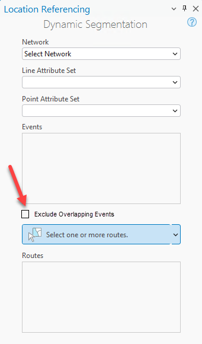
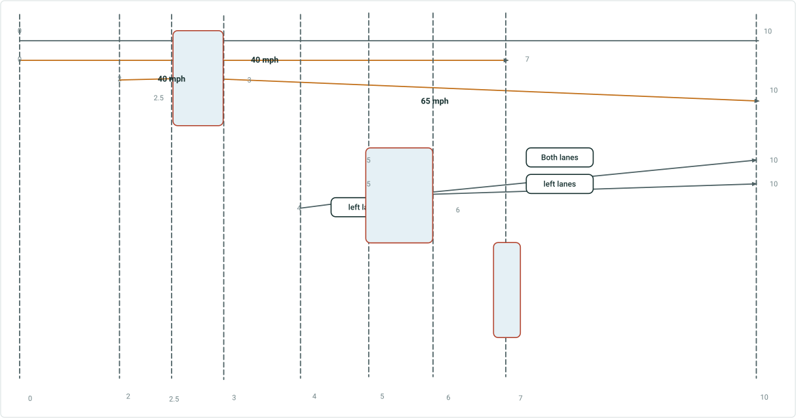
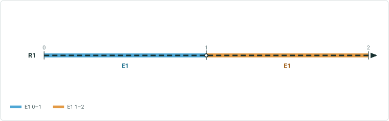

# Support Overlapping Events in DynSeg Tool

|   |   |
| --- | --- |
| **Kind** | User Story · Experience Builder |
| **Release** | — |
| **Product** | Roads & Highways · Pipeline Referencing |
| **Source** | [SupportOverlappingEvents_DynSeg.pptx](<https://esriis.sharepoint.com/sites/LocationReferencing/Shared%20Documents/General/SupportOverlappingEvents_DynSeg.pptx>) |
| **Edited** | 2024-11-18 22:50 by Claire Wang |
| **Extracted** | 2026-09-04 · lane `xmlstrip` |

<!-- metadata
```yaml
title: "Support Overlapping Events in DynSeg Tool"
source_file: "SupportOverlappingEvents_DynSeg.pptx"
source_url: "https://esriis.sharepoint.com/sites/LocationReferencing/Shared%20Documents/General/SupportOverlappingEvents_DynSeg.pptx"
doc_id: 289
doc_kind: "User Story"
surface: "Experience Builder"
doc_revision: ""
target_release: ""
pe: ""
dev: ""
author: "William Isley"
last_edited_by: "Claire Wang"
last_edited: "2024-11-18T22:50:10Z"
extracted: 2026-09-04
extraction_lane: xmlstrip
prompt_version: "v2.0.2"
keywords: ["overlapping events", "dynamic segmentation", "event attributes", "event editing", "experience builder", "line event", "point event"]
tools: ["Dynamic Segmentation"]
products: ["Roads & Highways", "Pipeline Referencing"]
issues: []
related: [{"doc":291,"file":"support-overlapping-events-in-experience-builder-dynamic-segmentation-table__doc291.md","s":8.17},{"doc":290,"file":"support-overlapping-events-in-query-attribute-set-and-overlay-events-gp-tool__doc290.md","s":7.254},{"doc":292,"file":"support-overlapping-events-in-experience-builder-straight-line-diagram__doc292.md","s":5.906},{"doc":394,"file":"dynamic-segmentation-table-consider-point-events-in-dynseg-table__doc394.md","s":5.089},{"doc":392,"file":"consider-point-events-in-query-attribute-set-and-overlay-events__doc392.md","s":3.261}]
```
-->

## Summary

This document describes a user story for enhancing the Dynamic Segmentation (DynSeg) tool to support overlapping events from the same event layer. It details acceptance criteria, functionality for including or excluding overlapping events, examples of event attribute handling, testing scenarios, automation needs, and documentation updates.

## Related documents

<!-- related:begin -->
- [Support Overlapping Events in Experience Builder Dynamic Segmentation Table](<https://esriis.sharepoint.com/sites/lrsworkspace/LRS Doc Index/User Stories/support-overlapping-events-in-experience-builder-dynamic-segmentation-table__doc291.md>) — similar text 0.78 · 3 title words · 4 filename words · same kind/surface/folder <!-- rel:291 -->
- [Support Overlapping Events in Query Attribute Set and Overlay Events GP Tool](<https://esriis.sharepoint.com/sites/lrsworkspace/LRS Doc Index/User Stories/support-overlapping-events-in-query-attribute-set-and-overlay-events-gp-tool__doc290.md>) — similar text 0.70 · 4 title words · 3 filename words · same kind/folder <!-- rel:290 -->
- [Support Overlapping Events in Experience Builder Straight Line Diagram](<https://esriis.sharepoint.com/sites/lrsworkspace/LRS Doc Index/User Stories/support-overlapping-events-in-experience-builder-straight-line-diagram__doc292.md>) — similar text 0.29 · 3 title words · 3 filename words · same kind/surface/folder <!-- rel:292 -->
- [Dynamic Segmentation Table: Consider Point Events in DynSeg Table](<https://esriis.sharepoint.com/sites/lrsworkspace/LRS Doc Index/User Stories/dynamic-segmentation-table-consider-point-events-in-dynseg-table__doc394.md>) — similar text 0.25 · 2 title words · 4 filename words · same kind/folder <!-- rel:394 -->
- [Consider Point Events in Query Attribute Set and Overlay Events](<https://esriis.sharepoint.com/sites/lrsworkspace/LRS Doc Index/User Stories/consider-point-events-in-query-attribute-set-and-overlay-events__doc392.md>) — similar text 0.18 · 1 title word · 2 filename words · same kind/folder <!-- rel:392 -->
<!-- related:end -->

<!-- docs:begin -->
## Esri documentation

[Apply dynamic segmentation](https://doc.esri.com/en/arcgis-pro/latest/help/production/roads-highways/apply-dynamic-segmentation.html) · [Event editing using the attribute table](https://doc.esri.com/en/arcgis-pro/latest/help/production/roads-highways/event-editing-using-the-attribute-table.html)
<!-- docs:end -->

---

## Slide 1 — Support overlapping events in DynSeg tool

User Story

## Slide 2

User Story
As an LRS editor, I need the ability to dynamically segment overlapping events from the same event layer and retrieve information for each event, in order to support measure-and-event based editing for my data.

Persona
LRS Editor: This user is primarily responsible for making edits to the LRS. In LRS data, there could be overlapping events such as lane information for different lanes on the route, and point locations where crash often occurs. The LRS Editor needs to retrieve and edit information for all events in a dynamic segmentation no matter if any events overlap or not, so that data integrity is maintained in their editing activities.
Previously, when multiple events from the same event layer overlap, DynSeg only pull information from one of those events. We need to support multiple overlapping events in DynSeg.

## Slide 3 — Acceptance criteria


In DynSeg tool, add a checkbox “Exclude Overlapping Events” under Events. It has the same indentation as the “Events” title.

- This is an optional parameter. Default is unchecked and if so, the tool runs considering all overlapping events
- To run without overlapping events, check the box



## Slide 4 — Acceptance Criteria (Functionality)

When there is no overlapping event, no matter if the option is checked, the result will be the same
When there are overlapping events but they are excluded, do what we do today.
When overlapping events are included (see examples in the next 2 slide)

  - Segmentation is done considering all events, no matter whether they have the same attributes or not. E.g. from 0-2.5, all speed limit events are 40 mph, but segmentation occurs at 2 because there is one more speed limit event
  - In each segment, overlapping events attributes are returned as extra columns in the result table/result paragraphs in QAS. The number of the most event overlaps is the number of column sets. Each set is suffixed with _1, _2, _3 etc.
Continue to support line and point events (see examples in slide 6)

  - When an existing value is edited, we should be able to find the corresponding event, and pass the new value back to event table for this event only. Other Overlapping events should not be affected. Create event records like what we do today.
  - When a new value is entered into cells that were <Null>, create new events like what we do today (events are created for each measure segment and they do not merge even when they have the same attributes)

## Slide 5



3 sets for speed limit
3 sets for lanes
2 sets for friction

## Slide 6



Extra Columns
Keep unique rows by mapping corresponding event in columns. Each set is suffixed with _1 _2 _3 etc.


| From Measure | To Measure | Type | SpeedLimit_1 | SpeedLimit_2 | SpeedLimit_3 | LanesDirection_1 | LanesDirection_2 | LanesDirection_3 | Friction_1 | Friction_2 |
| --- | --- | --- | --- | --- | --- | --- | --- | --- | --- | --- |
| 0 | 2 | Line | 40 mph | null | null | null | null | null | null | null |
| 2 | 2.5 | Line | 40 mph | 40 mph | null | null | null | null | null | null |
| 2.5 | 3 | Line | 40 mph | 40 mph | 65 mph | null | null | null | null | null |
| 3 | 4 | Line | 40 mph | null | 65 mph | null | null | null | null | null |
| 4 | 5 | Line | 40 mph | null | 65 mph | left | null | null | null | null |
| 5 | 6 | Line | 40 mph | null | 65 mph | left | both | left | null | null |
| 6 | 7 | Line | 40 mph | null | 65 mph | null | both | left | null | null |
| 7 | 7 | Point | null | null | 65 mph | null | both | left | yes | yes |
| 7 | 10 | Line | null | null | 65 mph | null | both | left | null | null |

## Slide 7


| From Measure | To Measure | Type | SpeedLimit_1 | SpeedLimit_2 | SpeedLimit_3 | LanesDirection_1 | LanesDirection_2 | LanesDirection_3 | Friction_1 | Friction_2 |
| --- | --- | --- | --- | --- | --- | --- | --- | --- | --- | --- |
| 0 | 2 | Line | 40 mph | null | null | right (adding new) | right (adding new) | null | null | null |
| 2 | 2.5 | Line | 40 mph | 40 mph | null | null | right (adding new) | null | null | null |
| 2.5 | 3 | Line | 40 mph | 40 mph | 65 mph | null | null | null | null | null |
| 3 | 4 | Line | 40 mph | null | 65 mph | null | null | null | null | null |
| 4 | 5 | Line | 40 mph | null | 65 mph | left | null | null | null | null |
| 5 | 6 | Line | 40 mph | null | 55 mph (changing existing) | Right (changing existing) | both | left | null | null |
| 6 | 7 | Line | 40 mph | null | 65 mph | null | both | left | null | null |
| 7 | 7 | Point | null | null | 65 mph | null | both | left | yes | yes |
| 7 | 10 | Line | null | null | 65 mph | null | both | left | null | null |

Merge coincident events is off

## Slide 8


Merge coincident events is on

| From Measure | To Measure | Type | SpeedLimit_1 | SpeedLimit_2 | SpeedLimit_3 | LanesDirection_1 | LanesDirection_2 | LanesDirection_3 | Friction_1 | Friction_2 |
| --- | --- | --- | --- | --- | --- | --- | --- | --- | --- | --- |
| 0 | 2 | Line | 40 mph | null | null | right (adding new) | right (adding new) | null | null | null |
| 2 | 2.5 | Line | 40 mph | 40 mph | null | null | right (adding new) | null | null | null |
| 2.5 | 3 | Line | 40 mph | 40 mph | 65 mph | null | null | null | null | null |
| 3 | 4 | Line | 40 mph | null | 65 mph | null | null | null | null | null |
| 4 | 5 | Line | 40 mph | null | 65 mph | left | null | null | null | null |
| 5 | 6 | Line | 40 mph | null | 55 mph (changing existing) | Right (changing existing) | both | left | null | null |
| 6 | 7 | Line | 40 mph | null | 65 mph | null | both | left | null | null |
| 7 | 7 | Point | null | null | 65 mph | null | both | left | yes | yes |
| 7 | 10 | Line | null | null | 65 mph | null | both | left | null | null |

## Slide 9 — Testing

Test with RH and APR data
Test with and without overlapping events. When there are overlapping events, test excluding including them.
Test editing event attributes in DynSeg result table
Test when multiple event layers have overlapping events
Test with overlapping events covering different portions of the route
Test with a single route and multiple routes selected
Test with point and line events – spanning and non-spanning
Test routes with complex shapes
Test time slices
Test 508 and i18n
Test light and dark theme

## Slide 10 — Automation

There is no existing automation. Create UI automation for excluding/including overlapping events.

## Slide 11 — Documentation

Add language to existing DynSeg topic about overlapping events support.
Include graphic examples.

## Slide 12 — Assignment

Story Points:
Dev:
PE:
