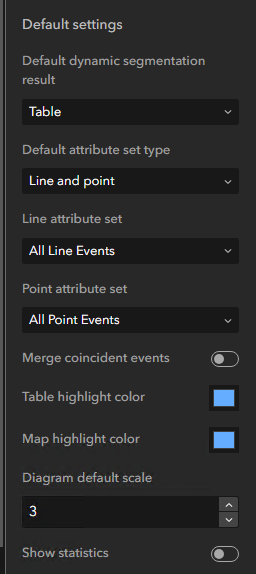
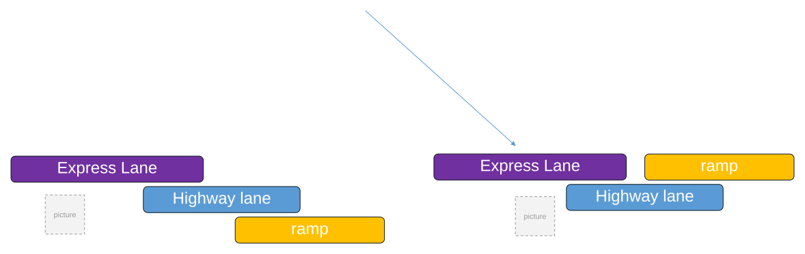
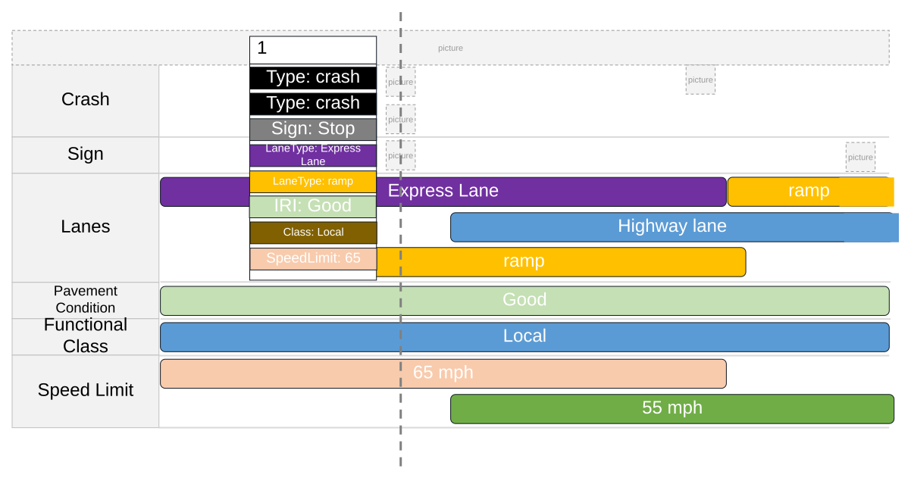

# Support Overlapping Events in Experience Builder Straight Line Diagram

| Field | Value |
| --- | --- |
| **Doc** | 292 · User Story · Experience Builder |
| **Product** | Roads & Highways · Pipeline Referencing |
| **Release** | — |
| **Issues** | — |
| **Source** | [SupportOverlappingEvents_ExBSLD.pptx](<https://esriis.sharepoint.com/sites/LocationReferencing/Shared%20Documents/General/SupportOverlappingEvents_ExBSLD.pptx>) |
| **People** | author William Isley · PE — · dev — |
| **Edited** | 2024-11-18 21:35 by Claire Wang |
| **Extracted** | 2026-09-04 · lane xmlstrip · format 3.0 · prompt v2.0.2 |
| **Keywords** | overlapping events · dynamic segmentation · straight line diagram · event editing · experience builder · event pop up · event attributes |
| **Tools** | Dynamic Segmentation |

## Summary

This document describes a user story for enabling dynamic segmentation and editing of overlapping events within the Experience Builder Straight Line Diagram (SLD). It covers configuration options, acceptance criteria for event display and editing, testing scenarios, automation considerations, and documentation updates related to overlapping events support.

## Related documents

<!-- related:begin -->
- [Support Overlapping Events in Experience Builder Dynamic Segmentation Table](<https://esriis.sharepoint.com/sites/lrsworkspace/LRS Doc Index/User Stories/support-overlapping-events-in-exb-dynseg-table.md>) — similar text 0.40 · 5 title words · 3 filename words · same kind/surface/folder <!-- rel:291 s=7.018 -->
- [Support Overlapping Events in DynSeg Tool](<https://esriis.sharepoint.com/sites/lrsworkspace/LRS Doc Index/User Stories/support-overlapping-events-in-dynseg-tool.md>) — similar text 0.29 · 3 title words · 3 filename words · same kind/surface/folder <!-- rel:289 s=5.906 -->
- [Support Overlapping Events in Query Attribute Set and Overlay Events GP Tool](<https://esriis.sharepoint.com/sites/lrsworkspace/LRS Doc Index/User Stories/support-overlapping-events-in-query-attribute-set.md>) — similar text 0.27 · 3 title words · 3 filename words · same kind/folder <!-- rel:290 s=5.252 -->
- [Experience Builder Straight Line Diagram Event Attributes on Hover/Click](<https://esriis.sharepoint.com/sites/lrsworkspace/LRS Doc Index/User Stories/exb-sld-event-attributes-on-hover-click.md>) — similar text 0.22 · 5 title words · same kind/surface/folder <!-- rel:348 s=5.227 -->
- [Experience Builder Straight Line Diagram Symbology and Display Field](<https://esriis.sharepoint.com/sites/lrsworkspace/LRS Doc Index/User Stories/exb-sld-symbology-and-display-field.md>) — similar text 0.21 · 5 title words · same kind/surface/folder <!-- rel:349 s=4.89 -->
<!-- related:end -->

<!-- docs:begin -->
## Esri documentation

[Apply dynamic segmentation](https://doc.esri.com/en/arcgis-pro/latest/help/production/roads-highways/apply-dynamic-segmentation.html) · [Event editing using the attribute table](https://doc.esri.com/en/arcgis-pro/latest/help/production/roads-highways/event-editing-using-the-attribute-table.html)
<!-- docs:end -->

---

## Story
### Support overlapping events in ExB SLD <!-- slide 1 -->
User Story

## Acceptance Criteria
<!-- slide 2 -->
User Story
As an event editor, I need the ability to dynamically segment overlapping events from the same event layer and retrieve information for each event in a straight line diagram, in order to support measure-and-event based editing for my data.

Persona
Event Editor: These users are responsible for making edits to route characteristics and assets.  Typically located in different business units/departments than the LRS route editors, these users have varied GIS experience, but a high level of knowledge about the characteristics they maintain (safety, pavement, crashes, etc.). One workflow editors will utilize is to navigate and view the results of dynamic segmentation of LRS events in SLD and then edit the attributes. In LRS data, there could be overlapping events such as lane information for different lanes on the route, and point locations where crash often occurs. We supported dynamically segmenting overlapping events in Pro with editing capability and we want to support it within Experience Builder.

### Configuration <!-- slide 3 -->
In DynSeg configuration, add a toggle “Exclude Overlapping Events” above Merge coincident events.

- Default is off and if so, the tool runs considering all overlapping events
- To run without overlapping events, toggle it on
- Both table and SLD honor this configuration. Table is covered in another user story

### Acceptance Criteria (SLD Functionality 1) <!-- slide 4 -->
- When there is no overlapping event, no matter if the option is checked, the result will be the same
- When there are overlapping events but they are not included, do what we do today.
- When overlapping events are included (see examples in slide 7), we should also return all event silvers in SLD
  - Stack additional silvers within the same event row (aka no grey gridline separation)
    - Verify silvers are arranged using the least space
  - All silvers show display field value
  - Each event silver continues to use their corresponding symbology if the event layer has different symbology for multiple values

[figure: Express Lane · Highway lane · ramp]

### Acceptance Criteria (SLD Functionality 2) <!-- slide 5 -->
- Continue to support line and point events
- Continue to support Event Editing Pop-up.
  - It should already work without or with little code change since what it does is displaying information for the clicked event silver
  - When a value is edited, we should be able to find the corresponding event and pass the new value back to event table for this event only
  - Verify statistics are calculated using overlapping events no matter if overlapping events show in SLD or not
- Continue to support hover
  - Hovering over an event silver should already work without or with little code change
  - When clicking a measure on measure bar, show the Measure and all the Display Field attributes for that cross section (both point and line events) and stack overlapping events in their own color (see example next slide)

<!-- slide 6 -->
LaneType: Express Lane

[figure: Crash · Sign · Lanes · Speed Limit · Pavement Condition · Functional Class · Express Lane · ramp · Highway lane · Good · Local · 65 mph · 55 mph · 1 · Type: crash · Sign: Stop · LaneType : ramp · IRI: Good · Class: Local · SpeedLimit : 65]

## Testing
<!-- slide 7 -->
- Test with RH and APR data
- Test with and without overlapping events. When there are overlapping events, test with and without including them
- Test editing event attributes in event pop up
- Test hovering experiences
- Test clicking experiences
- Test the navigation buttons and verify all events are shown well
- Test when multiple event layers have overlapping events
- Test with overlapping events covering different portions of the route
- Test different search ranges
- Test with overlapping point and line events – spanning and non-spanning
- Test routes with complex shapes

## Automation
<!-- slide 8 -->
- Existing automation might break. If so, update them by setting to Exclude.
- Add new automation cases where overlapping events are included. Overall, there should be cases for including and excluding overlapping events.

## Documentation
<!-- slide 9 -->
Add language to existing DynSeg widget topic about overlapping events support.

## Assignment
<!-- slide 10 -->
Story Points:
Dev:
PE:
