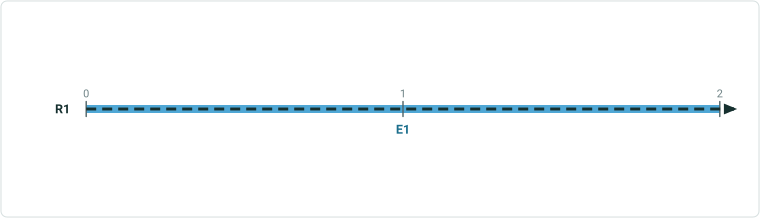
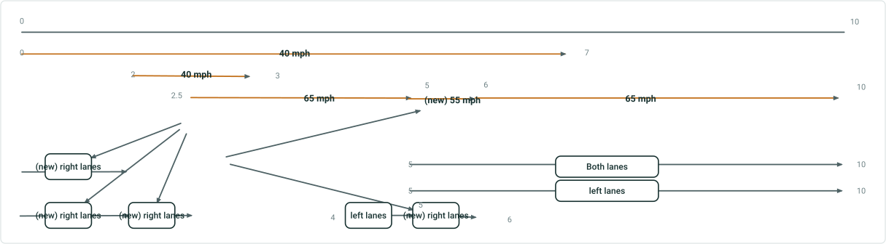
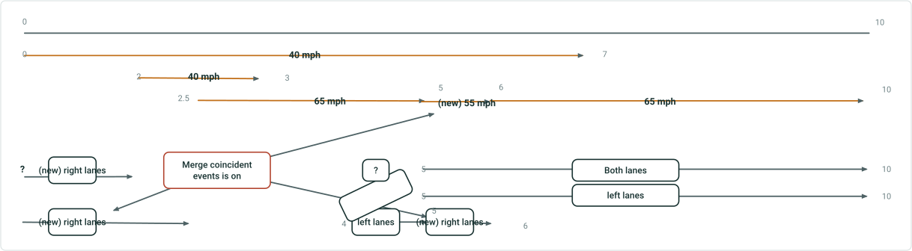

# Support Overlapping Events in Experience Builder Dynamic Segmentation Table

|   |   |
| --- | --- |
| **Kind** | User Story · Experience Builder |
| **Release** | — |
| **Product** | Roads & Highways · Pipeline Referencing |
| **Source** | [SupportOverlappingEvents_ExBDynSeg.pptx](<https://esriis.sharepoint.com/sites/LocationReferencing/Shared%20Documents/General/SupportOverlappingEvents_ExBDynSeg.pptx>) |
| **Edited** | 2024-11-18 22:50 by Claire Wang |
| **Extracted** | 2026-09-04 · lane `xmlstrip` |

<!-- metadata
```yaml
title: "Support Overlapping Events in Experience Builder Dynamic Segmentation Table"
source_file: "SupportOverlappingEvents_ExBDynSeg.pptx"
source_url: "https://esriis.sharepoint.com/sites/LocationReferencing/Shared%20Documents/General/SupportOverlappingEvents_ExBDynSeg.pptx"
doc_id: 291
doc_kind: "User Story"
surface: "Experience Builder"
doc_revision: ""
target_release: ""
pe: ""
dev: ""
author: "William Isley"
last_edited_by: "Claire Wang"
last_edited: "2024-11-18T22:50:05Z"
extracted: 2026-09-04
extraction_lane: xmlstrip
prompt_version: "v2.0.2"
keywords: ["overlapping events", "dynamic segmentation", "event editing", "experience builder", "event attributes", "merge coincident events", "event table"]
tools: ["Dynamic Segmentation"]
products: ["Roads & Highways", "Pipeline Referencing"]
issues: []
related: [{"doc":289,"file":"support-overlapping-events-in-dynseg-tool__doc289.md","s":8.17},{"doc":292,"file":"support-overlapping-events-in-experience-builder-straight-line-diagram__doc292.md","s":7.018},{"doc":290,"file":"support-overlapping-events-in-query-attribute-set-and-overlay-events-gp-tool__doc290.md","s":6.557},{"doc":394,"file":"dynamic-segmentation-table-consider-point-events-in-dynseg-table__doc394.md","s":5.29},{"doc":362,"file":"experience-builder-dynamic-segmentation-widget__doc362.md","s":4.557}]
```
-->

## Summary

This document describes a user story for enabling dynamic segmentation of overlapping events within the Experience Builder dynamic segmentation table. It covers configuration options, acceptance criteria for table functionality including handling overlapping events, editing behavior, and testing scenarios. The document also addresses automation impacts and documentation updates related to supporting overlapping events.

## Related documents

<!-- related:begin -->
- [Support Overlapping Events in DynSeg Tool](<https://esriis.sharepoint.com/sites/lrsworkspace/LRS Doc Index/User Stories/support-overlapping-events-in-dynseg-tool__doc289.md>) — similar text 0.78 · 3 title words · 4 filename words · same kind/surface/folder <!-- rel:289 -->
- [Support Overlapping Events in Experience Builder Straight Line Diagram](<https://esriis.sharepoint.com/sites/lrsworkspace/LRS Doc Index/User Stories/support-overlapping-events-in-experience-builder-straight-line-diagram__doc292.md>) — similar text 0.40 · 5 title words · 3 filename words · same kind/surface/folder <!-- rel:292 -->
- [Support Overlapping Events in Query Attribute Set and Overlay Events GP Tool](<https://esriis.sharepoint.com/sites/lrsworkspace/LRS Doc Index/User Stories/support-overlapping-events-in-query-attribute-set-and-overlay-events-gp-tool__doc290.md>) — similar text 0.61 · 3 title words · 3 filename words · same kind/folder <!-- rel:290 -->
- [Dynamic Segmentation Table: Consider Point Events in DynSeg Table](<https://esriis.sharepoint.com/sites/lrsworkspace/LRS Doc Index/User Stories/dynamic-segmentation-table-consider-point-events-in-dynseg-table__doc394.md>) — similar text 0.21 · 4 title words · 3 filename words · same kind/folder <!-- rel:394 -->
- [Experience Builder Dynamic Segmentation widget](<https://esriis.sharepoint.com/sites/lrsworkspace/LRS Doc Index/User Stories/experience-builder-dynamic-segmentation-widget__doc362.md>) — similar text 0.20 · 4 title words · same kind/surface/folder <!-- rel:362 -->
<!-- related:end -->

<!-- docs:begin -->
## Esri documentation

[Apply dynamic segmentation](https://doc.esri.com/en/arcgis-pro/latest/help/production/roads-highways/apply-dynamic-segmentation.html) · [Event editing using the attribute table](https://doc.esri.com/en/arcgis-pro/latest/help/production/roads-highways/event-editing-using-the-attribute-table.html)
<!-- docs:end -->

---

## Slide 1 — Support overlapping events in ExB DynSeg table

User Story

## Slide 2

User Story
As an event editor, I need the ability to dynamically segment overlapping events from the same event layer and retrieve information for each event, in order to support measure-and-event based editing for my data.

Persona
Event Editor: These users are responsible for making edits to route characteristics and assets.  Typically located in different business units/departments than the LRS route editors, these users have varied GIS experience, but a high level of knowledge about the characteristics they maintain (safety, pavement, crashes, etc.). One workflow editors will utilize is to view the results of dynamic segmentation of LRS events and then edit the attributes in the table. In LRS data, there could be overlapping events such as lane information for different lanes on the route, and point locations where crash often occurs. We supported dynamically segmenting overlapping events in Pro with editing capability and we want to support it within Experience Builder.

## Slide 3 — Configuration

In DynSeg configuration, add a toggle “Exclude Overlapping Events” above Merge coincident events.

- Default is off and if so, the tool runs considering all overlapping events
- To run without overlapping events, toggle it on
- Both table and SLD honor this configuration. SLD is covered in another user story


## Slide 4 — Acceptance Criteria (Table Functionality)

When there is no overlapping event, no matter if the option is on or off, the result will be the same
When there are overlapping events but they are excluded, do what we do today.
When overlapping events are included (see examples in the next 2 slide), we should return the same results as Pro

  - Segmentation is done considering all events, no matter whether they have the same attributes or not. E.g. from 0-2.5, all speed limit events are 40 mph, but segmentation occurs at 2 because there is one more speed limit event
  - In each segment, overlapping events attributes are returned as extra columns in the result table/result paragraphs in QAS. The number of the most event overlaps is the number of column sets. Each set is suffixed with _1, _2, _3 etc.
Continue to support line and point events (see examples in slide 6 & 7)

  - When an existing value is edited, we should be able to find the corresponding event, and pass the new value back to event table for this event only. Other Overlapping events should not be affected. Create event records like what we do today.
  - When a new value is entered into cells that were <Null>, create new events like what we do today (events are created for each measure segment separately if merge coincident events is off; if merge coincident events is on, they merge with identical attributes)
Continue to support merge coincident events, that means, overlapping events can be merged if their attributes are identical after editing

## Slide 5


3 sets for speed limit
3 sets for lanes
2 sets for friction

## Slide 6


Extra Columns
Keep unique rows by mapping corresponding event in columns. Each set is suffixed with _1 _2 _3 etc.



| From Measure | To Measure | Type | SpeedLimit_1 | SpeedLimit_2 | SpeedLimit_3 | LanesDirection_1 | LanesDirection_2 | LanesDirection_3 | Friction_1 | Friction_2 |
| --- | --- | --- | --- | --- | --- | --- | --- | --- | --- | --- |
| 0 | 2 | Line | 40 mph | null | null | null | null | null | null | null |
| 2 | 2.5 | Line | 40 mph | 40 mph | null | null | null | null | null | null |
| 2.5 | 3 | Line | 40 mph | 40 mph | 65 mph | null | null | null | null | null |
| 3 | 4 | Line | 40 mph | null | 65 mph | null | null | null | null | null |
| 4 | 5 | Line | 40 mph | null | 65 mph | left | null | null | null | null |
| 5 | 6 | Line | 40 mph | null | 65 mph | left | both | left | null | null |
| 6 | 7 | Line | 40 mph | null | 65 mph | null | both | left | null | null |
| 7 | 7 | Point | null | null | 65 mph | null | both | left | yes | yes |
| 7 | 10 | Line | null | null | 65 mph | null | both | left | null | null |

## Slide 7



| From Measure | To Measure | Type | SpeedLimit_1 | SpeedLimit_2 | SpeedLimit_3 | LanesDirection_1 | LanesDirection_2 | LanesDirection_3 | Friction_1 | Friction_2 |
| --- | --- | --- | --- | --- | --- | --- | --- | --- | --- | --- |
| 0 | 2 | Line | 40 mph | null | null | right (adding new) | right (adding new) | null | null | null |
| 2 | 2.5 | Line | 40 mph | 40 mph | null | null | right (adding new) | null | null | null |
| 2.5 | 3 | Line | 40 mph | 40 mph | 65 mph | null | null | null | null | null |
| 3 | 4 | Line | 40 mph | null | 65 mph | null | null | null | null | null |
| 4 | 5 | Line | 40 mph | null | 65 mph | left | null | null | null | null |
| 5 | 6 | Line | 40 mph | null | 55 mph (changing existing) | Right (changing existing) | both | left | null | null |
| 6 | 7 | Line | 40 mph | null | 65 mph | null | both | left | null | null |
| 7 | 7 | Point | null | null | 65 mph | null | both | left | yes | yes |
| 7 | 10 | Line | null | null | 65 mph | null | both | left | null | null |

Merge coincident events is off

## Slide 8



Merge coincident events is on

| From Measure | To Measure | Type | SpeedLimit_1 | SpeedLimit_2 | SpeedLimit_3 | LanesDirection_1 | LanesDirection_2 | LanesDirection_3 | Friction_1 | Friction_2 |
| --- | --- | --- | --- | --- | --- | --- | --- | --- | --- | --- |
| 0 | 2 | Line | 40 mph | null | null | right (adding new) | right (adding new) | null | null | null |
| 2 | 2.5 | Line | 40 mph | 40 mph | null | null | right (adding new) | null | null | null |
| 2.5 | 3 | Line | 40 mph | 40 mph | 65 mph | null | null | null | null | null |
| 3 | 4 | Line | 40 mph | null | 65 mph | null | null | null | null | null |
| 4 | 5 | Line | 40 mph | null | 65 mph | left | null | null | null | null |
| 5 | 6 | Line | 40 mph | null | 55 mph (changing existing) | Right (changing existing) | both | left | null | null |
| 6 | 7 | Line | 40 mph | null | 65 mph | null | both | left | null | null |
| 7 | 7 | Point | null | null | 65 mph | null | both | left | yes | yes |
| 7 | 10 | Line | null | null | 65 mph | null | both | left | null | null |

## Slide 9 — Testing

Test with RH and APR data
Test with and without overlapping events. When there are overlapping events, test excluding and including them
Test editing event attributes in DynSeg result table

  - Test Field Calculator, zoom to selected, layers on/off (verify that toggling the layer and field visibility does not re-dynseg the table), export, and discard edits options
  - Test events with coded value domains, range domain, contingent values, and attribute rules
  - Test merge coincident option
Test when multiple event layers have overlapping events
Test with overlapping events covering different portions of the route
Test different search ranges
Test with point and line events – spanning and non-spanning
Test routes with complex shapes

## Slide 10 — Automation

Existing automation might break. If so, update them by setting to Exclude.
Add new automation cases where overlapping events are included. Overall, there should be cases for including and excluding overlapping events.

## Slide 11 — Documentation

Add language to existing DynSeg widget topic about overlapping events support.

## Slide 12 — Assignment

Story Points:
Dev:
PE:
