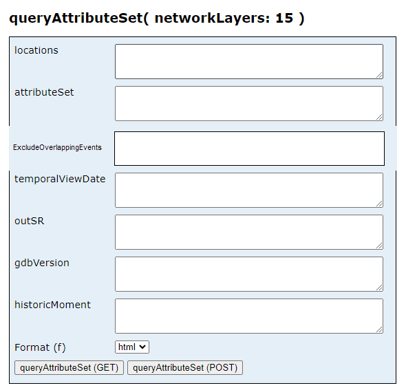
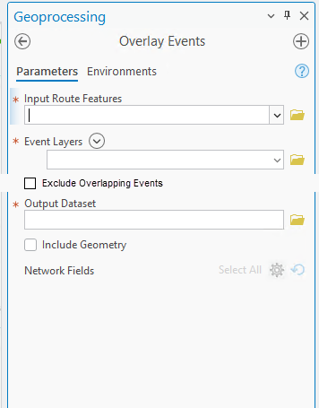
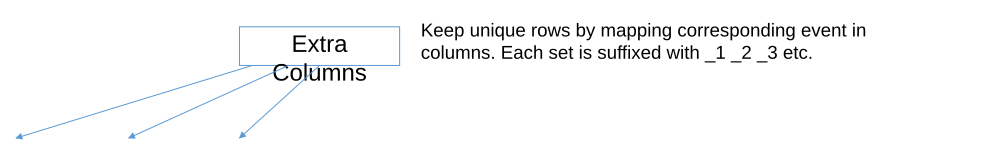

# Support Overlapping Events in Query Attribute Set and Overlay Events GP Tool

| Field | Value |
| --- | --- |
| **Doc** | 290 · User Story · Pro |
| **Product** | Roads & Highways · Pipeline Referencing · Utility Network |
| **Release** | — |
| **Issues** | — |
| **Source** | [SupportOverlappingEvents_QAS_GP.pptx](<https://esriis.sharepoint.com/sites/LocationReferencing/Shared%20Documents/General/SupportOverlappingEvents_QAS_GP.pptx>) |
| **People** | author William Isley · PE — · dev — |
| **Edited** | 2024-11-18 21:32 by Claire Wang |
| **Extracted** | 2026-09-04 · lane xmlstrip · format 3.0 · prompt v2.0.2 |
| **Keywords** | overlapping events · dynamic segmentation · query attribute set · overlay events · event attributes · event reporting · linear referencing |
| **Tools** | Query Attribute Set · Overlay Events |

## Summary

This document describes a user story for enabling support of overlapping events in the Query Attribute Set REST endpoint and the Overlay Events geoprocessing tool. It details acceptance criteria for UI and functionality, testing scenarios, automation considerations, and documentation updates related to handling overlapping events in linear referencing system data. The goal is to allow retrieval and reporting of multiple overlapping events from the same event layer to maintain data integrity.

## Related documents

<!-- related:begin -->
- [Support Overlapping Events in DynSeg Tool](<https://esriis.sharepoint.com/sites/lrsworkspace/LRS Doc Index/User Stories/support-overlapping-events-in-dynseg-tool.md>) — similar text 0.70 · 4 title words · 3 filename words · same kind/folder <!-- rel:289 s=7.254 -->
- [Support Overlapping Events in Experience Builder Dynamic Segmentation Table](<https://esriis.sharepoint.com/sites/lrsworkspace/LRS Doc Index/User Stories/support-overlapping-events-in-exb-dynseg-table.md>) — similar text 0.61 · 3 title words · 3 filename words · same kind/folder <!-- rel:291 s=6.557 -->
- [Consider Point Events in Query Attribute Set and Overlay Events](<https://esriis.sharepoint.com/sites/lrsworkspace/LRS Doc Index/User Stories/consider-point-events-in-query-attribute-set-and-overlay.md>) — similar text 0.20 · 5 title words · 2 filename words · same kind/surface/folder <!-- rel:392 s=5.977 -->
- [Update Address Range Information in Overlay Events and Query Attribute Sets](<https://esriis.sharepoint.com/sites/lrsworkspace/LRS Doc Index/User Stories/5537-update-address-range-information-in-overlay-events-and-query.md>) — similar text 0.22 · 4 title words · 3 filename words · same kind/surface/folder <!-- rel:344 s=5.975 -->
- [REST/GP: Support the centerline feature class like an event in Query Attribute Set/Overlay Events](<https://esriis.sharepoint.com/sites/lrsworkspace/LRS Doc Index/User Stories/rest-gp-support-the-centerline-feature-class-like-an-event.md>) — similar text 0.22 · 6 title words · 1 filename word · same kind/surface/folder <!-- rel:475 s=5.629 -->
<!-- related:end -->

<!-- docs:begin -->
## Esri documentation

[Apply dynamic segmentation](https://doc.esri.com/en/arcgis-pro/latest/help/production/roads-highways/apply-dynamic-segmentation.html) · [Event editing using the attribute table](https://doc.esri.com/en/arcgis-pro/latest/help/production/roads-highways/event-editing-using-the-attribute-table.html) · [Multiple linear referencing methods](https://doc.esri.com/en/arcgis-pro/latest/help/production/location-referencing-pipelines/multiple-linear-referencing-methods.html)

_No page matched:_ [Query Attribute Set](https://www.google.com/search?q=%22Query%20Attribute%20Set%22+site%3Adoc.esri.com) · [Overlay Events](https://www.google.com/search?q=%22Overlay%20Events%22+site%3Adoc.esri.com)
<!-- docs:end -->

---

## Story
### Support overlapping events in Query Attribute Set and Overlay Events GP tool <!-- slide 1 -->
User Story

## Acceptance Criteria
<!-- slide 2 -->
User Story
As an LRS editor, I need the ability to dynamically segment overlapping events from the same event layer and retrieve information for each event, in order to support measure-and-event based reporting for my data.

Persona
LRS Editor: This user is responsible for generating reports for event data and making edits to the LRS. In LRS data, there could be overlapping events such as lane information for different lanes on the route, and point locations where crash often occurs. The LRS Editor needs to retrieve information for all events in a dynamic segmentation no matter if any events overlap or not, so that data integrity is maintained in their reporting and the following editing activities.
Previously, when multiple events from the same event layer overlap, Query Attribute Set and Overlay Events GP tool only pull information from one of those events. We need to support multiple overlapping events in these tools.

### Acceptance criteria (UI) <!-- slide 3 -->
In Query Attribute Set REST endpoint, add a parameter “ExcludeOverlappingEvents” under attributeSet for the users to choose to exclude overlapping events or not.

- This is an optional parameter. Default is empty and if so, the tool runs considering all overlapping events that exist on temporalViewDate
- To run without overlapping events, put in True
In Overlay Events GP tool, add a checkbox “Exclude Overlapping Events” under Event Layers. It has the same indentation as the “Event Layers” title.

- This is an optional parameter. Default is unchecked and if so, the tool runs considering all overlapping events that exist in map time
- To run without overlapping events, check the box
- Software Engineer determines the parameter name and values in python

### Acceptance Criteria (Functionality) <!-- slide 4 -->
- When there is no overlapping event, no matter if the option is checked, the result will be the same
- When there are overlapping events but they are excluded, do what we do today.
- When overlapping events are included (see examples in the next 2 slide)
  - Segmentation is done considering all events, no matter whether they have the same attributes or not. E.g. from 0-2.5, all speed limit events are 40 mph, but segmentation occurs at 2 because there is one more speed limit event
  - In each segment, overlapping events attributes are returned as extra columns in the result table/result paragraphs in QAS. The number of the most event overlaps is the number of column sets. Each set is suffixed with _1, _2, _3 etc.
- Continue to support line and point events, UN/Address centerlines and centerline directions, and Address centerline block range splitting
- For the GP tool, if result table’s columns exceed db limitation, do not generate any output but show an error message ---- REST no limitation?

<!-- slide 5 -->
3 sets for speed limit
3 sets for lanes
2 sets for friction

[figure: 0 · 10 · 7 · 2 · 3 · 2.5 · 40 mph · 65 mph · 5 · 4 · 6 · Both lanes · left lanes]

### Extra Columns <!-- slide 6 -->
| From Measure | To Measure | Type | SpeedLimit_1 | SpeedLimit_2 | SpeedLimit_3 | LanesDirection_1 | LanesDirection_2 | LanesDirection_3 | Friction_1 | Friction_2 |
| --- | --- | --- | --- | --- | --- | --- | --- | --- | --- | --- |
| 0 | 2 | Line | 40 mph | null | null | null | null | null | null | null |
| 2 | 2.5 | Line | 40 mph | 40 mph | null | null | null | null | null | null |
| 2.5 | 3 | Line | 40 mph | 40 mph | 65 mph | null | null | null | null | null |
| 3 | 4 | Line | 40 mph | null | 65 mph | null | null | null | null | null |
| 4 | 5 | Line | 40 mph | null | 65 mph | left | null | null | null | null |
| 5 | 6 | Line | 40 mph | null | 65 mph | left | both | left | null | null |
| 6 | 7 | Line | 40 mph | null | 65 mph | null | both | left | null | null |
| 7 | 7 | Point | null | null | 65 mph | null | both | left | yes | yes |
| 7 | 10 | Line | null | null | 65 mph | null | both | left | null | null |

Keep unique rows by mapping corresponding event in columns. Each set is suffixed with _1 _2 _3 etc.

## Testing
<!-- slide 7 -->
- Test with fgdb, egdb and fs
  - Overlay Events: fgdb, egdb and fs
  - QAS: fs
- Test with RH, APRUN, and Address data
  - For Address data, test with and without centerline. When centerline is included, verify the results honor centerline direction
  - For Address data, test with the centerline/event layer with address block fields being an input, and verify the address number splits correctly
- Test with and without overlapping events. When there are overlapping events, test excluding and including them.
- Test when multiple event layers have overlapping events
- Test with overlapping events covering different portions of the route
- Test with a single route and multiple routes selected
- Test with point and line events
- Test routes with complex shapes
- Test time slices
- For Overlay Events, test running in python
- Test 508 and i18n
- Test light and dark theme in Pro for Overlay Events

## Automation
<!-- slide 8 -->
- Existing automation might break. If so, update them by setting to Exclude.
- Add new automation cases where overlapping events are included. Overall, there should be cases for including and excluding overlapping events.
  - SOAPUI: QueryAttributeSet_REST – default data and Address data
  - APR Python test:
OverlayEvents – default data and Address data
OverlayEvents_Complex (optional)

## Documentation
<!-- slide 9 -->
Add language to existing GP and REST topics about overlapping events support. In addition to the main context, also add to/update GP python examples and REST url examples
No graphic is needed unless we want to put some in What’s New

## Assignment
<!-- slide 10 -->
Story Points:
Dev:
PE:
