# Support Reassign: Transfer to a New Line Method in ArcGIS Pro

|   |   |
| --- | --- |
| **Kind** | User Story · Pro |
| **Release** | — |
| **Product** | Roads & Highways · Pipeline Referencing |
| **Source** | [ReassignUI_TransferToNewLine.pptx](<https://esriis.sharepoint.com/sites/LocationReferencing/Shared%20Documents/General/ReassignUI_TransferToNewLine.pptx>) |
| **Edited** | 2023-04-05 23:24 by Claire Wang |
| **Extracted** | 2026-09-04 · lane `xmlstrip` |

<!-- metadata
```yaml
title: "Support Reassign: Transfer to a New Line Method in ArcGIS Pro"
source_file: "ReassignUI_TransferToNewLine.pptx"
source_url: "https://esriis.sharepoint.com/sites/LocationReferencing/Shared%20Documents/General/ReassignUI_TransferToNewLine.pptx"
doc_id: 585
doc_kind: "User Story"
surface: "Pro"
doc_revision: ""
target_release: ""
pe: ""
dev: ""
author: "William Isley"
last_edited_by: "Claire Wang"
last_edited: "2023-04-05T23:24:38Z"
extracted: 2026-09-04
extraction_lane: xmlstrip
prompt_version: "v2.0.2"
keywords: ["route reassignment", "line network", "route attributes", "calibration points", "partial route", "entire route", "route transfer"]
tools: ["Reassign Tool", "Route Eyedropper"]
products: ["Roads & Highways", "Pipeline Referencing"]
issues: []
related: [{"doc":583,"file":"support-reassign-transfer-as-new-route-s-to-adjacent-line-method-in-arcgis-pro__doc583.md","s":11.901},{"doc":586,"file":"reassign-ui-change-to-dynamically-support-existing-reassign-methods-pro__doc586.md","s":5.556},{"doc":533,"file":"reassign-route-transfer-to-another-line-method-support-move-event-behavior-test__doc533.md","s":5.066},{"doc":572,"file":"support-event-behaviors-for-new-reassign-method-transfer-to-another-line__doc572.md","s":5.032},{"doc":594,"file":"reassign-to-a-new-or-existing-line-with-original-route-id-name-maintained-on__doc594.md","s":4.775}]
```
-->

## Summary

This document describes a user story and detailed design for a new method in ArcGIS Pro to reassign routes in a line network to a new line while maintaining original RouteID and Route Name combinations. It covers the user interface, expected behaviors, testing scenarios, and automation plans for transferring routes, including partial and entire routes, with options for transferring calibration points and handling route attributes. The method ensures routes are not merged during reassignment and supports validation and error handling for route names and measures.

## Related documents

<!-- related:begin -->
- [Support Reassign: Transfer as New Route(s) to Adjacent Line Method in ArcGIS Pro](<https://esriis.sharepoint.com/sites/lrsworkspace/LRS Doc Index/User Stories/support-reassign-transfer-as-new-route-s-to-adjacent-line-method-in-arcgis-pro__doc583.md>) — similar text 0.88 · 6 title words · 3 filename words · same kind/surface/folder <!-- rel:583 -->
- [Reassign UI Change to Dynamically Support Existing Reassign Methods - Pro](<https://esriis.sharepoint.com/sites/lrsworkspace/LRS%20Doc%20Index/User%20Stories/reassign-ui-change-to-dynamically-support-existing-reassign-methods-pro__doc586.md>) — similar text 0.50 · 3 title words · 1 filename word · same kind/surface/folder <!-- rel:586 -->
- [Reassign Route Transfer to Another Line Method: Support Move Event Behavior Test Plan](<https://esriis.sharepoint.com/sites/lrsworkspace/LRS Doc Index/Test Plans/reassign-route-transfer-to-another-line-method-support-move-event-behavior-test__doc533.md>) — similar text 0.23 · 5 title words · 2 filename words · same surface <!-- rel:533 -->
- [Support Event Behaviors for New Reassign Method: Transfer to another line](<https://esriis.sharepoint.com/sites/lrsworkspace/LRS Doc Index/User Stories/support-event-behaviors-for-new-reassign-method-transfer-to-another-line__doc572.md>) — similar text 0.22 · 5 title words · 1 filename word · same kind/folder <!-- rel:572 -->
- [Reassign to a New or Existing Line with Original Route ID/Name Maintained on the Target Line - REST](<https://esriis.sharepoint.com/sites/lrsworkspace/LRS%20Doc%20Index/User%20Stories/reassign-to-a-new-or-existing-line-with-original-route-id-name-maintained-on__doc594.md>) — similar text 0.49 · 2 title words · 1 filename word · same kind/folder <!-- rel:594 -->
<!-- related:end -->

<!-- docs:begin -->
## Esri documentation

[Route reassignment](https://doc.esri.com/en/arcgis-pro/latest/help/production/roads-highways/reassign-routes.html)

_No page matched:_ [Reassign Tool](https://www.google.com/search?q=%22Reassign%20Tool%22+site%3Adoc.esri.com) · [Route Eyedropper](https://www.google.com/search?q=%22Route%20Eyedropper%22+site%3Adoc.esri.com)
<!-- docs:end -->

---

## Slide 1 — Support Reassign: Transfer to a new line Method in Pro

User Story

## Slide 2 — Transfer to a new line Context: Buckeye Energy

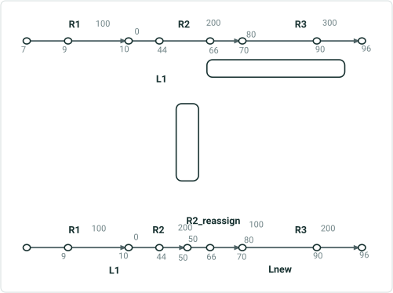

| Line Name | Route Name | Line Order | From Date | ToDate | FromM | ToM |
| --- | --- | --- | --- | --- | --- | --- |
| L1 | R1 | 100 | 1/1/2000 | null | 7 | 10 |
| L1 | R2 | 200 | 1/1/2000 | null | 0 | 70 |
| L1 | R3 | 300 | 1/1/2000 | null | 80 | 96 |

| Line Name | Route Name | Line Order | From Date | ToDate | FromM | ToM |
| --- | --- | --- | --- | --- | --- | --- |
| L1 | R1 | 100 | 1/1/2000 | null | 7 | 10 |
| L1 | R2 | 200 | 1/1/2000 | 1/1/2005 | 0 | 70 |
| L1 | R3 | 300 | 1/1/2000 | 1/1/2005 | 80 | 96 |
| L1 | R2 | 200 | 1/1/2005 | null | 0 | 50 |
| Lnew | R2_reassign | 100 | 1/1/2005 | null | 50 | 70 |
| Lnew | R3 | 200 | 1/1/2005 | null | 80 | 96 |

## Slide 3 — User Story

As a pipeline editor, I need the ability to reassign routes in a line network to a new line with original RouteID-Route Name combo maintained, so that I can maintain the original attribution for the route as well as the updated version after reassignment.

Persona
LRS Editor: This user is responsible for making edits to the LRS.  The edits they need to make come in from field crews/contractors in a variety of formats (shapefiles, engineering drawing, fgdbs).  The LRS Editor is responsible for making the route edits based on these documents. Pipeline companies use the line as an administrative unit for a group of pipes that are under the same administrator/operator. A pipe needs to be moved to a different line from time to time due to a variety of factors including ownership change, jurisdiction boundary change, other classification change, or more accurate analysis and management.  In these scenarios, the RouteID-Route Name combo would stay the same, only the line name would change.

## Slide 4 — Reassign Methods in Pro – Tool pane


- Transfer to another line is added to the method dropdown
- This is a method for Line network only
- It must support reassigning: a partial route, a single entire route, multiple entire routes, any combination of entire routes and up to two partial routes, and an entire line - to a new line.
- Provide a hover for this method in the dropdown that when users hover over a method name, the hover shows additional text and graphics to illustrate the method (Dev and PE design the text and graphics)
Once this method is chosen, Target section changes to show a Line name box only
The target line name can be a non-existing line name in all time or an adjacent line. For this user story, line name should be a non-existing line name in all time

- Allow original Route ID/Name combination to exist on different lines in non-overlapping time slices using the new capability in REST
  - Unlike existing Reassign methods, routes are never merged as a result of reassignment in this method
- The retired time slice for source route(s) should have the to date populated but have no other line information changed. If route id and name are maintained, when the user queries the route, they should find the route existed on two different lines but not at the same time.
- If Transfer Calibration Points is checked, all calibration points are transferred to target routes. If not, only the first and last calibration points for each route are transferred (for complex shapes, follow the same requirement of keeping calibration points), and calibration points other than the required calibration points are deleted.
*Event behavior is a separate user story

Tree diagram and graphics are attached at the end.

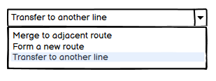 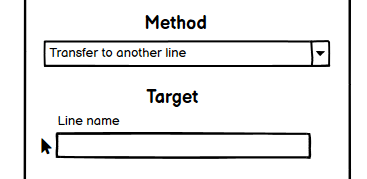

## Slide 5 — Reassign Methods in Pro – Tool pane

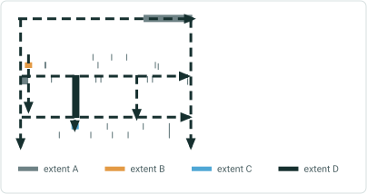

The 3rd pane has 2 tables for target route(s):

  - The first table contains the most important information regarding the reassigned routes: route name, from measure, and to measure. These fields are editable for all target routes
    - routes are never merged in this method
    - By default, all entire routes being reassigned keep their original route name and route id; all partial routes get a “_reassign” attached to original route name and a new route id
    - All routes’ From measure defaults to 0 and To measure is calculated from 0
  - The second table contains extra attributes for the routes and user can choose to edit the editable fields.
    - Target line name shows up in this table but it is not editable (grey out/disable)
    - By default, all these attributes inherit source route attributes.
  - If there are 1+ target routes, switch buttons appear above the tables for users to switch target routes, and an “Apply values to all routes” checkbox is added below the table (mimic Realign). Checking this box will apply all Non-LRS attributes in the second table to all target routes
    - If this box is checked, all other routes will get the same attributes from the current table
    - Changing any attribute value for one route while this box is check will change the attributes for all other routes
    - If some routes must have different attributes, user has to uncheck this box after using this checkbox to apply uniform attributes, and manually adds/edits/deletes these particular attributes
Tool pane shows a scrollbar when contents exceed pane length
Make sure reassignment results are correct in terms of route attributes, line orders, and measures.

- The note in the 2nd pane is: The route(s) will be retired on source line and transferred to target line without being merged.

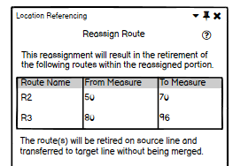

## Slide 6


LineB
Apply values to all routes

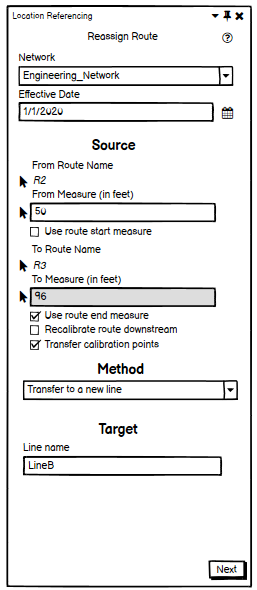 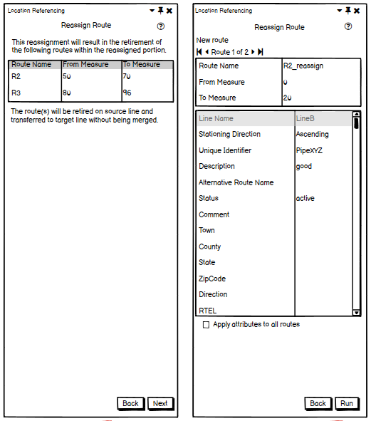 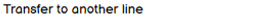 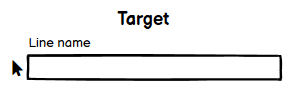

## Slide 7 — Testing

Test on APR data with Feature Services (do 1-2 tests on fgdb/dc sde)
Test in both projected and unprojected data
Test PoM

- Test associated options (when applicable: transfer calibration points; recalibrate source route; change target route name; change target route measures)
- Test on a variety of route geometries (simple, gapped, loop, lollipop, alpha, branch, vertical)
- Test with partial routes, entire routes, and combinations
- Test routes that cover beginning-end, beginning-middle, and middle-end of a line
Verify LRS attributes are not editable in the 2nd table in the 3rd pane. The unavailability is indicated (e.g. fields gray out)
Verify Non-LRS attributes are editable in the 3rd pane, if there is any, and these attributes are applied to target route(s)’ new time slice
Negative cases – also validate error messages

- If user puts in non-adjacent existing line name, return error
- For entire route, if user provides Route Name that belongs to other route than source route, return error
  - Whether time slices overlap or not does not matter. If route name of another existing route (not retired) is put in, it will error out because a route can’t stay on multiple lines at the same time. If a retired route name is put it, even though time slices don’t overlap, it will still error out because it’s a “reassignment to retired route” case, which is not allowed.
  - In a word, target route name must be source route name or brand new route name.
- For partial route, if user provides any existing Route Name, return error
- If user provides invalid measures in the 3rd pane (refer to existing requirements on measures) to any route, return error and indicate erroneous route(s)
- If user puts in a target line that can create “Line in a line” scenario for non-PoM, return error (this can be done reassigning middle-middle)


## Slide 8 — Testing – Route Eyedropper tool

- Test in Feature Service only.
- Test in APR
- Test in either projected or unprojected data
- Verify the Eyedropper tool appears in the 3rd pane. Refer to Eyedropper Tool for Routes User story and mimic a few cases from the Test Plan
  - Eyedropper tool only appears/enables when 1. a partial route is reassigned because the target partial route has to have a non-existing routeID/name and 2. user changes the default original route name to a new, valid route name for entire route (dev determines if eyedropper pops up in this case or enables from a greyed-out state). If user changes the new route name back to original route name, eyedropper tool disappears/disables.
  - Eyedropper and Copy all values checkbox can overwrite each other. The one comes last wins.
- Test with a network that contains non-LRS attributes with subtypes, coded value domains, range domains and contingent values
- Test with a network that contains non-LRS attributes with attribute rules – calculation , constraint and validation

### Notes

Projected and unprojected?

## Slide 9 — Automation

Create UI automation

## Slide 10 — Documentation

Add new sections to APR and RH. The structure should align with existing Reassign methods (fixing existing methods is covered in a separate user story)

  - Document the flow, associate options, and expected results for this method. E.g. What method and options lead to routes being kept intact vs. routes being merged
  - Add tool UI screenshots
  - Mention hover

## Slide 11 — Assignment

Story Points:
Dev:
PE:

## Slide 12

Method is Transfer to another line
Transfer CP
Yes
No
No Recal Target Routes Option
- Method still have Recalibrate Source Routes Downstream Option
- Regardless of Rname/Lname being editable/edited or not, users can change target route’s non-LRS attributes. Changes are made to target route's new time slice only.
Both intermediate and end CPs are transferred
Rname (so as Rid) are kept intact in most cases
Rname (so as Rid) can be changed when users choose to

Only end CPs are transferred
Rname (so as Rid) are kept intact in most cases
Rname (so as Rid) can be changed when users choose to

## Slide 13


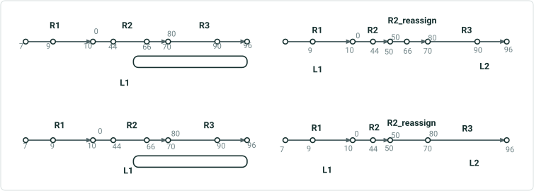

|  | Recal Target | Trans CP | Result | Before | After |
| --- | --- | --- | --- | --- | --- |
| Transfer to another line (when a brand new line name is entered) | N/A (parameter does no matter to results) | Yes | Do not merge . Rid and Rname kept intact (can be changed in attribute table). All CPs are transferred. |  |  |
|  | N/A (parameter does no matter to results) | No | Do not merge . Rid and Rname kept intact (can be changed in attribute table). Only required CPs are transferred. |  |  |

 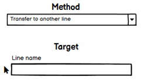
