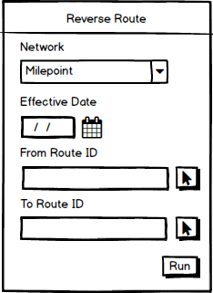

# Support Reverse Route in Pro

| Field | Value |
| --- | --- |
| **Doc** | 743 · User Story · Pro |
| **Product** | Roads & Highways · Pipeline Referencing · Utility Network |
| **Release** | — |
| **Issues** | — |
| **Source** | [SupportReverseRoutePro.pptx](<https://esriis.sharepoint.com/sites/LocationReferencing/Shared%20Documents/General/SupportReverseRoutePro.pptx>) |
| **People** | author William Isley · PE — · dev — |
| **Edited** | 2020-12-16 16:53 by Nathan Easley |
| **Extracted** | 2026-09-04 · lane xmlstrip · format 3.0 · prompt v2.0.2 |
| **Keywords** | reverse route · route calibration · route editing · lrs editor · route direction · event behavior |
| **Tools** | Reverse Route |

## Summary

This document describes a user story for adding a Reverse Route capability to the LRS editing activities in ArcGIS Pro. It details the need for reversing route calibration direction to align with design and engineering documents, the inputs required, and the expected behavior of the tool. Testing, automation, and documentation plans are also outlined.

## Related documents

<!-- related:begin -->
- [Support Reverse Route Event Behaviors](<https://esriis.sharepoint.com/sites/lrsworkspace/LRS Doc Index/User Stories/support-reverse-route-eb-rh-apr-un-2020-12.md>) — similar text 0.63 · 3 title words · 3 filename words · same kind/surface/folder <!-- rel:739 s=7.33 -->
- [Support Reverse Route Event Behaviors](<https://esriis.sharepoint.com/sites/lrsworkspace/LRS Doc Index/User Stories/support-reverse-route-eb-rh-apr-un-2021-03.md>) — similar text 0.61 · 3 title words · 3 filename words · same kind/surface/folder <!-- rel:728 s=6.89 -->
- [Support Reverse Route in REST](<https://esriis.sharepoint.com/sites/lrsworkspace/LRS Doc Index/User Stories/support-reverse-route-in-rest.md>) — similar text 0.62 · 3 title words · 3 filename words · same kind/folder <!-- rel:742 s=6.095 -->
- [Pro AI Assistant Reverse Route User Story](<https://esriis.sharepoint.com/sites/lrsworkspace/LRS%20Doc%20Index/User%20Stories/pro-ai-assistant-reverse-route.md>) — similar text 0.19 · 3 title words · 2 filename words · same kind/surface/folder <!-- rel:109 s=4.801 -->
- [Reverse Line Orders tool](<https://esriis.sharepoint.com/sites/lrsworkspace/LRS Doc Index/User Stories/reverse-line-orders-tool.md>) — similar text 0.31 · 1 title word · 1 filename word · same kind/surface/folder <!-- rel:576 s=3.686 -->
<!-- related:end -->

<!-- docs:begin -->
## Esri documentation

[Reverse routes](https://doc.esri.com/en/arcgis-pro/latest/help/production/roads-highways/reverse-routes.html) · [Event behavior](https://doc.esri.com/en/arcgis-pro/latest/help/production/roads-highways/what-is-event-behavior.html)
<!-- docs:end -->

---

## Story
### Support Reverse Route in Pro <!-- slide 1 -->
User Story

### User Story <!-- slide 2 -->
As an LRS editor, I need to be able to reverse routes, so that the direction of calibration for the routes matches what is expected from design and engineering documents within the GIS.

Persona
LRS Editor: This user is responsible for making edits to the LRS.  The edits they need to make come in from field crews/contractors in a variety of formats (shapefiles, engineering drawing, fgdbs).  The LRS Editor is responsible for making the route edits based on these document.  A scenario that can occur is that the calibration direction of a route in the LRS is in the wrong direction.  Sometimes the route was calibrated incorrectly when added to the LRS and other times another edit that needs to be made in the LRS, like a realignment, requires the route calibration direction to be reversed.  When this occurs, the user will need to be able to reverse the route direction followed by having event behaviors applied to the route.

## Acceptance Criteria
### Reverse Route Pro <!-- slide 3 -->
- Add Reverse Route to the editing activities on the LRS ribbon in Pro
- Work with graphics to create an icon
- The inputs for Reverse Route are as follows:
  - Network (only show those coming from LR/VMS enabled services; if there are none, then leave the drop down either empty or greyed out)
  - Effective Date
  - (From) Route ID
  - To Route ID (should on appear if the network selected supports lines)
- When a route is reversed, we should do the following:
  - Send the request via Reverse Route in LRS Apply Edits
  - Update the map via the result of the operation executing successfully
  - Follow the same pattern we do for the other LRS editing activities in Pro
- Use the ArcMap Reverse Route as a guide

## Testing
<!-- slide 4 -->
- Test in both line and non line networks (projected and unprojected data)
- Test with both Roads and Highways (focus on this) and Pipeline Referencing data (with the UN)
- Should work on the following route shapes: simple, gapped, complex (loop, lollipop, alpha, branch, barbell), vertical
- Use the same data and test cases as the Reverse Route REST user story

## Automation
<!-- slide 5 -->
Create automation via TestComplete for the Reverse Route UI in Pro

## Documentation
<!-- slide 6 -->
Reverse Route doc should be created from the Reverse Route REST user story

## Assignment
<!-- slide 7 -->
Story Points:
Dev:
PE:
