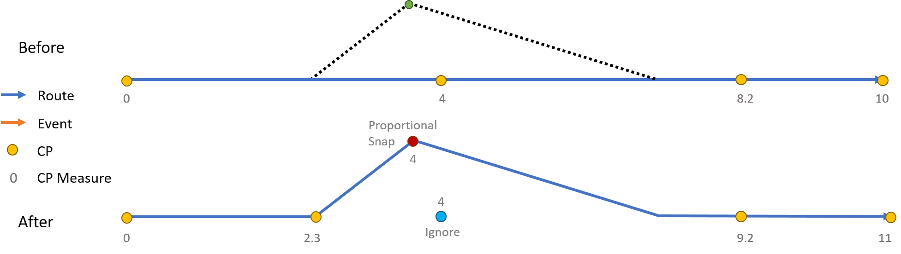
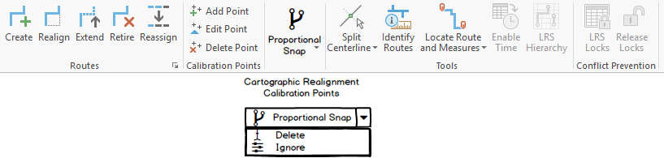

# Support Snap, Delete, and Ignore Options for Calibration Points in Cartographic Realignment

| Field | Value |
| --- | --- |
| **Doc** | 729 · User Story · Pro |
| **Product** | Roads & Highways · Pipeline Referencing |
| **Release** | — |
| **Issues** | — |
| **Source** | [SupportSnapDeleteIgnoreOptionsforCPsinCartoRealign.pptx](<https://esriis.sharepoint.com/sites/LocationReferencing/Shared%20Documents/General/SupportSnapDeleteIgnoreOptionsforCPsinCartoRealign.pptx>) |
| **People** | author William Isley · PE — · dev — |
| **Edited** | 2021-03-02 01:18 by Nathan Easley |
| **Extracted** | 2026-09-04 · lane xmlstrip · format 3.0 · prompt v2.0.2 |
| **Keywords** | calibration points · cartographic realignment · proportional snap · ignore option · delete option · location referencing · route editing |
| **Tools** | — |

## Summary

This document describes a user story for supporting three options—Proportional Snap, Delete, and Ignore—for handling calibration points impacted by cartographic realignment in linear referencing systems. It covers the need for a UI button in ArcGIS Pro and REST support, testing scenarios across different network types and route shapes, automation updates, and documentation additions. The Ignore option allows calibration points to remain at their original locations after realignment, supporting specific business rules for some departments of transportation.

## Related documents

<!-- related:begin -->
- [Support Snap to Vertex Option for Calibration Points Impacted by Cartographic Realignment](<https://esriis.sharepoint.com/sites/lrsworkspace/LRS Doc Index/User Stories/support-snap-to-vertex-option-for-cp-impacted.md>) — similar text 0.69 · 6 title words · 5 filename words · same kind/surface/folder <!-- rel:611 s=9.921 -->
- [Support updating measures option in cartographic realignment](<https://esriis.sharepoint.com/sites/lrsworkspace/LRS Doc Index/User Stories/support-updating-measures-option-in-cartographic-realignment.md>) — similar text 0.46 · 3 title words · 3 filename words · same kind/surface/folder <!-- rel:736 s=6.088 -->
- [Support honoring referents event behavior for cartographic realignment](<https://esriis.sharepoint.com/sites/lrsworkspace/LRS Doc Index/User Stories/support-honoring-referents-eb-for-cartographic-realignment.md>) — similar text 0.41 · 3 title words · 3 filename words · same kind/surface/folder <!-- rel:737 s=5.78 -->
- [Support Event Behaviors on Vertical Route Shapes in Cartographic Realignment](<https://esriis.sharepoint.com/sites/lrsworkspace/LRS Doc Index/User Stories/support-eb-on-vertical-route-shapes-in-cartographic.md>) — similar text 0.27 · 3 title words · 2 filename words · same kind/surface/folder <!-- rel:762 s=5.027 -->
- [Support Event Behaviors on Complex Route Shapes in Cartographic Realignment](<https://esriis.sharepoint.com/sites/lrsworkspace/LRS Doc Index/User Stories/support-eb-on-complex-route-shapes-in-cartographic.md>) — similar text 0.26 · 3 title words · 2 filename words · same kind/surface/folder <!-- rel:838 s=4.824 -->
<!-- related:end -->

<!-- docs:begin -->
## Esri documentation

[Apply cartographic realignment](https://doc.esri.com/en/arcgis-pro/latest/help/production/roads-highways/apply-cartographic-realignment.html) · [Set Location Referencing options](https://doc.esri.com/en/arcgis-pro/latest/help/production/roads-highways/set-location-referencing-options.html)
<!-- docs:end -->

---

## Story
### Support proportional snap, delete, and ignore options for Calibration Points impacted by Cartographic Realignment <!-- slide 1 -->
User Story

### User Story <!-- slide 2 -->
As an LRS editor, I need the option for how calibration points on the edited portion react when a route has a cartographic realignment, so that my business rules for calibrating these routes can be preserved, and events are located where expected after behaviors are applied.

Persona
LRS Editor: This user is responsible for making edits to the LRS.  The edits they need to make come in from field crews/contractors in a variety of formats (shapefiles, engineering drawing, fgdbs).  The LRS Editor is responsible for making the route edits based on these documents.  A scenario that can occur in some DoTs is that they find the geometry of their existing routes in the LRS doesn’t match their location in real life.  A cartographic realignment would allow for this update to be made.  When they make this cartographic realignment, there can be calibration points in the cartorealigned section that need to be updated as well.  Today we support the option to proportionally snap these calibration points on the updated route OR delete them.  There is a 3rd option we need to support, Ignore.  For some DoTs (Colorado and Ohio for example), they have very specific rules for how their CPs should be located.  To support them, we can ignore the CPs (leave them at the same location) and allow the users to move those CPs to another location after the cartographic realignment.  We need to support these options in a UI in Pro and through REST.

## Acceptance Criteria
### Support Ignore option for CPs in CartoRealign <!-- slide 3 -->
- Add a 3rd option for how CPs that are in the cartorealigned area of a Cartographic Realignment are handled.
- This option would be called Ignore.
- When selected, we will ignore any calibration points located on the cartorealigned area (they will be left where they were pre edit, which is going to be off the new location of the route), then complete the rest of the cartographic realignment (recalibrate route, add edit log record, etc.)

### Expose options for CPs in Carto Realignment <!-- slide 4 -->
- In Pro, we should create a button on the Location Referencing tab, with the three options (Proportional Snap, Delete, Ignore)
- See the UI mockup for details (dev will need to get graphics for the three options)
  - User should select the CP option they want
  - Whichever option is chosen will be what appears on the toolbar
  - When the user clicks the button or the arrow in the bottom right, we should expand  and show all 3 options
  - Put this tool in a separate section of the ribbon called Cartographic Realignment Calibration Points
  - Default is proportional snap
- When a user makes a cartographic realignment, whatever option is selected is what will be applied to any impacted calibration points in the cartographically realigned section
- When users make a cartographic realignment in REST (via the core applyEdits), we don’t have a way for them to inform the way the CPs should be handled so we should always proportional snap if the operation didn’t go through Pro

## Testing
<!-- slide 5 -->
- Test on CPs impacted by cartorealignments on centerlines with both line and non line networks (projected and unprojected data)
- Test with both Roads and Highways (focus on this) and Pipeline Referencing data
- Should work on the following route shapes: simple, gapped, complex (loop, lollipop, alpha, branch, barbell), vertical (test this for the new Ignore option)
- Check the existing cartographic realignment automation to ensure REST operations are still proportionally snapping
- Make sure cartographic realignments without any impacted CPs still work (automation should catch this)
- Verify correct records are added to the edit log
- Focus testing on verifying the CPs are handled correctly depending on the option selected
- Test only for services, no need to worry about direct connect

## Automation
<!-- slide 6 -->
Update existing ReadyAPI and UI automation.
Create new ReadyAPI and UI automation for Delete and Ignore options (proportional snap should be covered by existing automation)

## Documentation
<!-- slide 7 -->
Add information about these options and how they are applied in a cartographic realignment (Pro ribbon with selection options) in https://pro.arcgis.com/en/pro-app/latest/help/production/location-referencing-pipelines/apply-cartographic-realignment.htm and https://pro.arcgis.com/en/pro-app/latest/help/production/roads-highways/apply-cartographic-realignment.htm

## Assignment
<!-- slide 8 -->
Story Points:
Dev:
PE:
