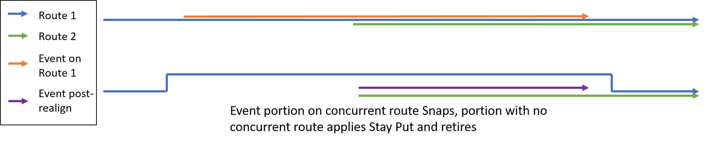
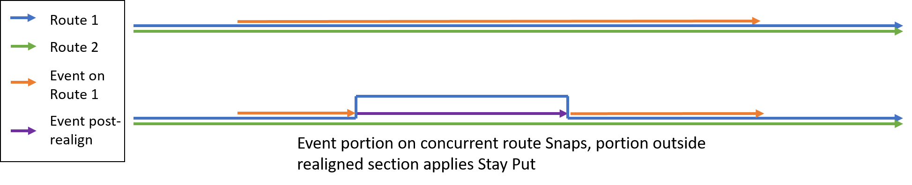

# Support Snap Event Behavior in Realign Route

|   |   |
| --- | --- |
| **Kind** | User Story · Pro |
| **Release** | — |
| **Product** | Roads & Highways · Pipeline Referencing |
| **Source** | [Support Snap Event Behavior in Realign Route.pptx](<https://esriis.sharepoint.com/sites/LocationReferencing/Shared%20Documents/General/Support%20Snap%20Event%20Behavior%20in%20Realign%20Route.pptx>) |
| **Edited** | 2021-03-04 23:47 by Nathan Easley |
| **Extracted** | 2026-09-04 · lane `xmlstrip` |

<!-- metadata
```yaml
title: "Support Snap Event Behavior in Realign Route"
source_file: "Support Snap Event Behavior in Realign Route.pptx"
source_url: "https://esriis.sharepoint.com/sites/LocationReferencing/Shared%20Documents/General/Support%20Snap%20Event%20Behavior%20in%20Realign%20Route.pptx"
doc_id: 730
doc_kind: "User Story"
surface: "Pro"
doc_revision: ""
target_release: ""
pe: ""
dev: ""
author: "William Isley"
last_edited_by: "Nathan Easley"
last_edited: "2021-03-04T23:47:24Z"
extracted: 2026-09-04
extraction_lane: xmlstrip
prompt_version: "v2.0.2"
keywords: ["snap event behavior", "realign route", "concurrent routes", "event spanning", "stay put", "route realignment", "lrs editor"]
tools: []
products: ["Roads & Highways", "Pipeline Referencing"]
issues: []
related: [{"doc":715,"file":"cover-event-behavior-in-realign-route-with-concurrencies__doc715.md","s":6.926},{"doc":725,"file":"cover-event-behavior-in-realign-route__doc725.md","s":6.535},{"doc":836,"file":"support-event-behaviors-on-complex-route-shapes-in-realign-route__doc836.md","s":6.034},{"doc":479,"file":"support-snap-event-behavior-in-retire-routes__doc479.md","s":5.655},{"doc":739,"file":"support-reverse-route-event-behaviors__doc739.md","s":5.318}]
```
-->

## Summary

Describes a user story for configuring snap behavior for LRS events during route realignment to maintain correct event locations on active routes. Details the snap behavior logic for concurrent routes and event spanning scenarios, testing requirements, automation plans, and documentation updates.

## Related documents

<!-- related:begin -->
- [Cover Event Behavior in Realign Route with Concurrencies](<https://esriis.sharepoint.com/sites/lrsworkspace/LRS Doc Index/User Stories/cover-event-behavior-in-realign-route-with-concurrencies__doc715.md>) — similar text 0.34 · 4 title words · 4 filename words · same kind/surface/folder <!-- rel:715 -->
- [Cover Event Behavior in Realign Route](<https://esriis.sharepoint.com/sites/lrsworkspace/LRS Doc Index/User Stories/cover-event-behavior-in-realign-route__doc725.md>) — similar text 0.36 · 4 title words · 4 filename words · same kind/surface/folder <!-- rel:725 -->
- [Support Event Behaviors on Complex Route Shapes in Realign Route](<https://esriis.sharepoint.com/sites/lrsworkspace/LRS Doc Index/User Stories/support-event-behaviors-on-complex-route-shapes-in-realign-route__doc836.md>) — similar text 0.25 · 4 title words · 4 filename words · same kind/surface/folder <!-- rel:836 -->
- [Support Snap Event Behavior in Retire Routes](<https://esriis.sharepoint.com/sites/lrsworkspace/LRS Doc Index/User Stories/support-snap-event-behavior-in-retire-routes__doc479.md>) — similar text 0.13 · 4 title words · 3 filename words · same kind/folder <!-- rel:479 -->
- [Support Reverse Route Event Behaviors](<https://esriis.sharepoint.com/sites/lrsworkspace/LRS Doc Index/User Stories/support-reverse-route-event-behaviors__doc739.md>) — similar text 0.24 · 3 title words · 3 filename words · same kind/surface/folder <!-- rel:739 -->
<!-- related:end -->

<!-- docs:begin -->
## Esri documentation

[Realign routes](https://doc.esri.com/en/arcgis-pro/latest/help/production/roads-highways/realign-routes.html)
<!-- docs:end -->

---

## Slide 1 — Support Snap event behavior in Realign Route

User Story

## Slide 2 — User Story

As a LRS editor, I want to be able to configure “snap” behavior for my LRS event when a route is realigned, so I can have events that don’t change location continue to be correctly located on an active route when their original route is retired at that location as part of the realignment.

Persona
LRS Editor: This user is responsible for making edits to the LRS.  The edits they need to make come in from field crews/contractors in a variety of formats (shapefiles, engineering drawing, fgdbs).  The LRS Editor is responsible for making the route edits based on these documents.  These editors have a need for a snap event behavior when they realign a route.  When there are concurrent routes at a location and a realignment results in the route with an event on it being removed from that location, the users want the event to stay at that location, so we snap it to the most dominant route remaining at that location.  In ArcMap, snap was supported in Realign Overlaps.  In Pro, we’re not going to differentiate between Realign and Realign Overlaps, so snap needs to be applied for Realign Route edits.

## Slide 3 — Snap behavior configuration

When snap behavior is configured for Realign Route and a route is realigned, we should apply snap behavior if there are concurrent routes remaining at the location of the event

  - Concurrent routes share a common centerline
  - Use the existing snap event behavior from Realign Overlaps in ArcMap for point and non spanning line events (the existing Snap behavior for Reassign Route in Pro will also be a good starting point to build on)
  - Note that when realign with abandonment occurs, reassign route behavior is applied to the abandoned portion
For events that span routes, we should apply the same principles

  - If the entire event is in the realigned portion and has concurrent routes to snap to, then snap
  - If the event is not completely in the realigned portion, split and apply snap where we can (apply Stay Put for the rest)
  - If the event only has part of the routes with concurrencies, split the event and snap where we can (apply Stay Put for the rest)
If there are not any concurrent routes remaining at the event location after the realignment, then we should apply Stay Put behavior in the same way we do today in ArcMap
See next slide for examples

## Slide 4


  

## Slide 5 — Testing

Test with two datasets: projected non line networks (RH) and unprojected line network (APR)
Should work on the following route shapes: simple, gapped, complex (loop, lollipop, alpha, branch, barbell), vertical
Test on all three event types (point, line, spanning)
Make sure to include the scenarios on the previous slide
Make sure to test with and without abandonment

## Slide 6 — Automation

Add new automated tests for snap for realign routes following the same pattern as other event behavior automation

## Slide 7 — Documentation

In https://pro.arcgis.com/en/pro-app/latest/help/production/roads-highways/event-behavior-for-route-realignment.htm (and the Pipeline Referencing topics as well), add graphics/descriptions for Snap in the similar way to Stay Put, Move, and Retire that are already in the topic

## Slide 8 — Assignment

Story Points:
Dev:
PE:
