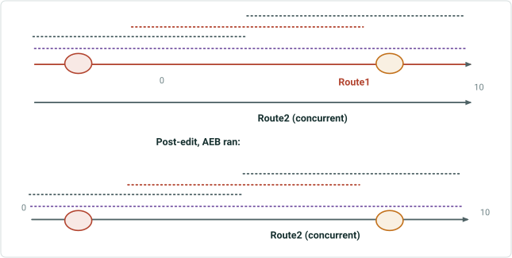
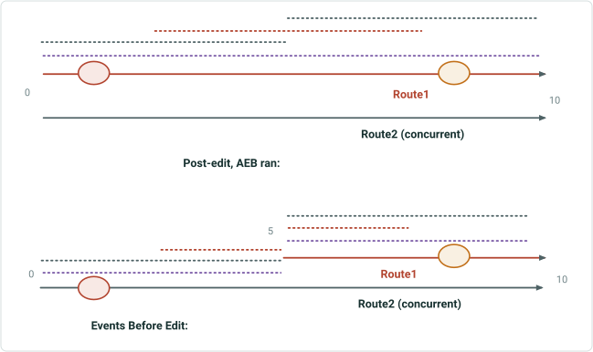
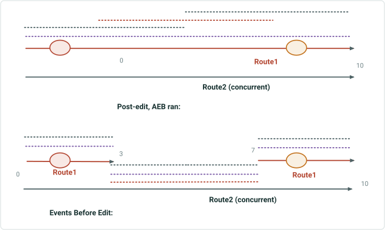
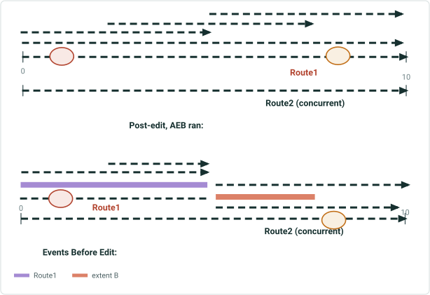
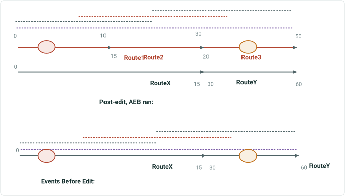
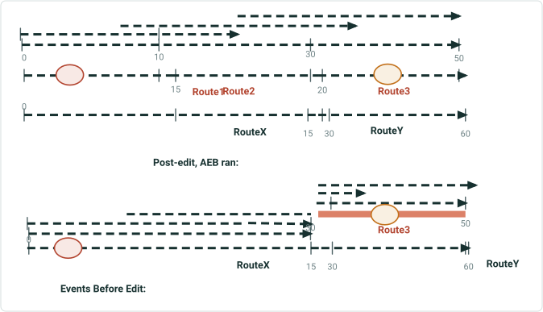
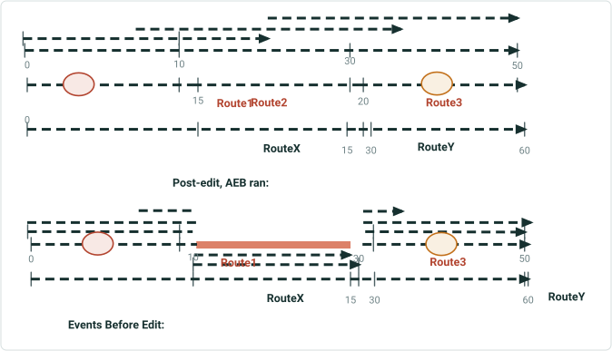
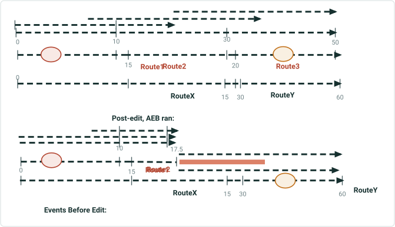
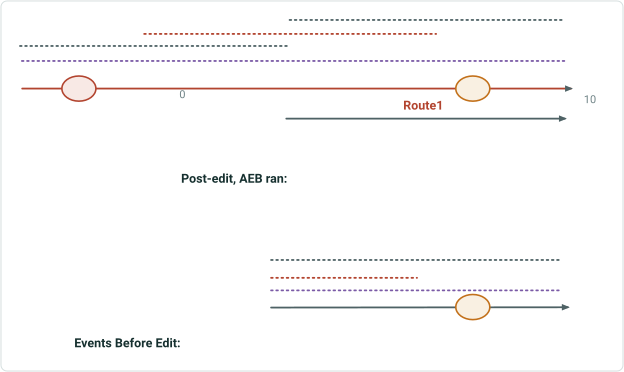

# Support Snap Event Behavior in Retire Routes

|   |   |
| --- | --- |
| **Kind** | User Story · Experience Builder |
| **Release** | — |
| **Product** | Roads & Highways · Pipeline Referencing |
| **Issue** | [ArcGISPro/ps-location-referencing#3780](https://devtopia.esri.com/ArcGISPro/ps-location-referencing/issues/3780) |
| **Source** | [3780-SupportSnapEBinRetireRoute_V5.pptx](<https://esriis.sharepoint.com/sites/LocationReferencing/Shared%20Documents/General/3780-SupportSnapEBinRetireRoute_V5.pptx>) |
| **Edited** | 2023-10-24 21:05 by Mac Christmas |
| **Extracted** | 2026-09-04 · lane `xmlstrip` |

<!-- metadata
```yaml
title: "Support Snap Event Behavior in Retire Routes"
source_file: "3780-SupportSnapEBinRetireRoute_V5.pptx"
source_url: "https://esriis.sharepoint.com/sites/LocationReferencing/Shared%20Documents/General/3780-SupportSnapEBinRetireRoute_V5.pptx"
doc_id: 478
doc_kind: "User Story"
surface: "Experience Builder"
doc_revision: "V5"
target_release: ""
pe: ""
dev: ""
author: "Mac Christmas"
last_edited_by: "Mac Christmas"
last_edited: "2023-10-24T21:05:13Z"
extracted: 2026-09-04
extraction_lane: xmlstrip
prompt_version: "v2.0.2"
keywords: ["snap event behavior", "retire route", "event snapping", "concurrent route", "route retirement", "event behavior", "experience builder"]
tools: []
products: ["Roads & Highways", "Pipeline Referencing"]
issues: ["ArcGISPro/ps-location-referencing#3780"]
related: [{"doc":479,"file":"support-snap-event-behavior-in-retire-routes__doc479.md","s":1011.437},{"doc":454,"file":"retire-routes-snap-event-behavior-test-plan__doc454.md","s":1007.294},{"doc":730,"file":"support-snap-event-behavior-in-realign-route__doc730.md","s":5.235},{"doc":527,"file":"transfer-to-another-line-support-snap-event-behavior-test-plan__doc527.md","s":3.607},{"doc":572,"file":"support-event-behaviors-for-new-reassign-method-transfer-to-another-line__doc572.md","s":3.535}]
```
-->

## Summary

User story describing the need for Snap Event Behavior (Snap EB) in Retire Routes functionality to allow events to snap to concurrent or abandoned routes when retiring a route, maintaining geographic location and updating measures. Includes acceptance criteria, example scenarios with event and route data tables, testing notes, automation plans, and documentation updates.

## Related documents

<!-- related:begin -->
- [Support Snap Event Behavior in Retire Routes](<https://esriis.sharepoint.com/sites/lrsworkspace/LRS Doc Index/User Stories/support-snap-event-behavior-in-retire-routes__doc479.md>) — shared issue ArcGISPro/ps-location-referencing#3780 · similar text 0.94 · 6 title words · 5 filename words · same kind/surface/folder <!-- rel:479 -->
- [Retire Routes: Snap Event Behavior Test Plan](<https://esriis.sharepoint.com/sites/lrsworkspace/LRS Doc Index/Test Plans/retire-routes-snap-event-behavior-test-plan__doc454.md>) — shared issue ArcGISPro/ps-location-referencing#3780 · similar text 0.72 · 5 title words · 2 filename words · same surface <!-- rel:454 -->
- [Support Snap Event Behavior in Realign Route](<https://esriis.sharepoint.com/sites/lrsworkspace/LRS Doc Index/User Stories/support-snap-event-behavior-in-realign-route__doc730.md>) — similar text 0.13 · 4 title words · 3 filename words · same kind/folder <!-- rel:730 -->
- [Transfer to Another Line – Support Snap Event Behavior Test Plan](<https://esriis.sharepoint.com/sites/lrsworkspace/LRS Doc Index/Test Plans/transfer-to-another-line-support-snap-event-behavior-test-plan__doc527.md>) — similar text 0.07 · 4 title words · 1 filename word · same surface <!-- rel:527 -->
- [Support Event Behaviors for New Reassign Method: Transfer to another line](<https://esriis.sharepoint.com/sites/lrsworkspace/LRS Doc Index/User Stories/support-event-behaviors-for-new-reassign-method-transfer-to-another-line__doc572.md>) — similar text 0.13 · 2 title words · same kind/surface/folder <!-- rel:572 -->
<!-- related:end -->

<!-- docs:begin -->
## Esri documentation

[Event editing using the attribute table](https://doc.esri.com/en/arcgis-pro/latest/help/production/roads-highways/event-editing-using-the-attribute-table.html) · [Retire routes](https://doc.esri.com/en/arcgis-pro/latest/help/production/roads-highways/retire-routes.html) · [Event behavior](https://doc.esri.com/en/arcgis-pro/latest/help/production/roads-highways/what-is-event-behavior.html)

_No page matched:_ [experience builder](https://www.google.com/search?q=%22experience%20builder%22+site%3Adoc.esri.com)
<!-- docs:end -->

---

## Slide 1 — Support Snap Event Behavior in Retire Routes

User Story

## Slide 2 — User Story

As an LRS Editor, I need the ability for my events to snap to a concurrent or abandoned route when I retire a route, so that I don’t have to recreate the event characteristics in the area manually.
Persona
LRS Editor: This user is responsible for making edits to the LRS.  The edits they need to make come in from field crews/contractors in a variety of formats (shapefiles, engineering drawings, FGDBs, etc.).  The LRS Editor, moving into ArcGIS Pro, expects the Snap EB to be present for Retire Routes to ensure events snap to concurrent routes when retiring and they may be holding off migrating to Pro for this reason.

## Slide 3 — Acceptance Criteria

Need to add Snap event behavior to Retire Routes, following ArcMap functionality

  - Snap maintains geographic location, but updates measures
  - Events will snap to a concurrent route when a concurrent route exists
  - If no concurrent route exists, then the events will perform Stay Put
    - Line events that cross a retirement section of parent route will be split
  - Upstream events will have no action
  - Downstream events, when recalibrate downstream is checked, will honor whatever event behavior is configured for calibrate downstream
    - When recalibrate downstream is not checked, the downstream events will have no change

## Slide 4



| RouteID | FromDate | ToDate |
| --- | --- | --- |
| Route1 | 1/1/2000 | NULL |
| Route2 | 1/1/2000 | NULL |

| RouteID | FromDate | ToDate |
| --- | --- | --- |
| Route1 | 1/1/2000 | 1/1/2005 |
| Route2 | 1/1/2000 | NULL |

| Event Layer | EventID | RouteID | From Date | To Date | From Measure | To Measure |
| --- | --- | --- | --- | --- | --- | --- |
| Point | Pt1 | Route1 | 1/1/2000 | NULL | 2 | N/A |
| Point | Pt2 | Route1 | 1/1/2000 | NULL | 8 | N/A |
| Line | Line1 | Route1 | 1/1/2000 | NULL | 0 | 10 |
| Line | Line2 | Route1 | 1/1/2000 | NULL | 0 | 5 |
| Line | Line3 | Route1 | 1/1/2000 | NULL | 3 | 7 |
| Line | Line4 | Route1 | 1/1/2000 | NULL | 5 | 10 |

| Event Layer | EventID | RouteID | From Date | To Date | From Measure | To Measure |
| --- | --- | --- | --- | --- | --- | --- |
| Point | Pt1 | Route1 | 1/1/2000 | 1/1/2005 | 2 | N/A |
| Point | Pt2 | Route1 | 1/1/2000 | 1/1/2005 | 8 | N/A |
| Line | Line1 | Route1 | 1/1/2000 | 1/1/2005 | 0 | 10 |
| Line | Line2 | Route1 | 1/1/2000 | 1/1/2005 | 0 | 5 |
| Line | Line3 | Route1 | 1/1/2000 | 1/1/2005 | 3 | 7 |
| Line | Line4 | Route1 | 1/1/2000 | 1/1/2005 | 5 | 10 |
| Point | Pt1 | Route2 | 1/1/2005 | NULL | 2 | N/A |
| Point | Pt2 | Route2 | 1/1/2005 | NULL | 8 | N/A |
| Line | Line1 | Route2 | 1/1/2005 | NULL | 0 | 10 |
| Line | Line2 | Route2 | 1/1/2005 | NULL | 0 | 5 |
| Line | Line3 | Route2 | 1/1/2005 | NULL | 3 | 7 |
| Line | Line4 | Route2 | 1/1/2005 | NULL | 5 | 10 |

Nonline Network, Retire Whole Route

## Slide 5



| RouteID | FromDate | ToDate |
| --- | --- | --- |
| Route1 | 1/1/2000 | NULL |
| Route2 | 1/1/2000 | NULL |

| RouteID | FromDate | ToDate |
| --- | --- | --- |
| Route1 | 1/1/2000 | 1/1/2005 |
| Route1 | 1/1/2005 | NULL |
| Route2 | 1/1/2000 | NULL |

| Event Layer | EventID | RouteID | From Date | To Date | From Measure | To Measure |
| --- | --- | --- | --- | --- | --- | --- |
| Point | Pt1 | Route1 | 1/1/2000 | NULL | 2 | N/A |
| Point | Pt2 | Route1 | 1/1/2000 | NULL | 8 | N/A |
| Line | Line1 | Route1 | 1/1/2000 | NULL | 0 | 10 |
| Line | Line2 | Route1 | 1/1/2000 | NULL | 0 | 5 |
| Line | Line3 | Route1 | 1/1/2000 | NULL | 3 | 7 |
| Line | Line4 | Route1 | 1/1/2000 | NULL | 5 | 10 |

| Event Layer | EventID | RouteID | From Date | To Date | From Measure | To Measure |
| --- | --- | --- | --- | --- | --- | --- |
| Point | Pt1 | Route1 | 1/1/2000 | 1/1/2005 | 2 | N/A |
| Point | Pt2 | Route1 | 1/1/2000 | NULL | 8 | N/A |
| Line | Line1 | Route1 | 1/1/2000 | 1/1/2005 | 0 | 10 |
| Line | Line2 | Route1 | 1/1/2000 | 1/1/2005 | 0 | 5 |
| Line | Line3 | Route1 | 1/1/2000 | 1/1/2005 | 3 | 7 |
| Line | Line4 | Route1 | 1/1/2000 | NULL | 5 | 10 |
| Point | Pt1 | Route2 | 1/1/2005 | NULL | 2 | N/A |
| Line | Line1 | Route2 | 1/1/2005 | NULL | 0 | 5 |
| Line | Line1 | Route1 | 1/1/2005 | NULL | 5 | 10 |
| Line | Line2 | Route2 | 1/1/2005 | NULL | 0 | 5 |
| Line | Line3 | Route2 | 1/1/2005 | NULL | 3 | 5 |
| Line | Line3 | Route1 | 1/1/2005 | NULL | 5 | 7 |

Nonline Network, Retire first half of route

## Slide 6



| RouteID | FromDate | ToDate |
| --- | --- | --- |
| Route1 | 1/1/2000 | NULL |
| Route2 | 1/1/2000 | NULL |

| RouteID | FromDate | ToDate |
| --- | --- | --- |
| Route1 | 1/1/2000 | 1/1/2005 |
| Route1 | 1/1/2005 | NULL |
| Route2 | 1/1/2000 | NULL |

| Event Layer | EventID | RouteID | From Date | To Date | From Measure | To Measure |
| --- | --- | --- | --- | --- | --- | --- |
| Point | Pt1 | Route1 | 1/1/2000 | NULL | 2 | N/A |
| Point | Pt2 | Route1 | 1/1/2000 | NULL | 8 | N/A |
| Line | Line1 | Route1 | 1/1/2000 | NULL | 0 | 10 |
| Line | Line2 | Route1 | 1/1/2000 | NULL | 0 | 5 |
| Line | Line3 | Route1 | 1/1/2000 | NULL | 3 | 7 |
| Line | Line4 | Route1 | 1/1/2000 | NULL | 5 | 10 |

Nonline Network, Retire middle of Route

| Event Layer | EventID | RouteID | From Date | To Date | From Measure | To Measure |
| --- | --- | --- | --- | --- | --- | --- |
| Point | Pt1 | Route1 | 1/1/2000 | NULL | 2 | N/A |
| Point | Pt2 | Route1 | 1/1/2000 | NULL | 8 | N/A |
| Line | Line1 | Route1 | 1/1/2000 | 1/1/2005 | 0 | 10 |
| Line | Line2 | Route1 | 1/1/2000 | 1/1/2005 | 0 | 5 |
| Line | Line3 | Route1 | 1/1/2000 | 1/1/2005 | 3 | 7 |
| Line | Line4 | Route1 | 1/1/2000 | 1/1/2005 | 5 | 10 |
| Line | Line1 | Route1 | 1/1/2005 | NULL | 0 | 3 |
| Line | Line1 | Route2 | 1/1/2005 | NULL | 3 | 7 |
| Line | Line1 | Route1 | 1/1/2005 | NULL | 7 | 10 |
| Line | Line2 | Route1 | 1/1/2005 | NULL | 0 | 3 |
| Line | Line2 | Route2 | 1/1/2005 | NULL | 3 | 5 |
| Line | Line3 | Route2 | 1/1/2005 | NULL | 3 | 7 |
| Line | Line4 | Route2 | 1/1/2005 | NULL | 5 | 7 |
| Line | Line4 | Route1 | 1/1/2005 | NULL | 7 | 10 |

## Slide 7



| RouteID | FromDate | ToDate |
| --- | --- | --- |
| Route1 | 1/1/2000 | NULL |
| Route2 | 1/1/2000 | NULL |

| RouteID | FromDate | ToDate |
| --- | --- | --- |
| Route1 | 1/1/2000 | 1/1/2005 |
| Route1 | 1/1/2005 | NULL |
| Route2 | 1/1/2000 | NULL |

| Event Layer | EventID | RouteID | From Date | To Date | From Measure | To Measure |
| --- | --- | --- | --- | --- | --- | --- |
| Point | Pt1 | Route1 | 1/1/2000 | NULL | 2 | N/A |
| Point | Pt2 | Route1 | 1/1/2000 | NULL | 8 | N/A |
| Line | Line1 | Route1 | 1/1/2000 | NULL | 0 | 10 |
| Line | Line2 | Route1 | 1/1/2000 | NULL | 0 | 5 |
| Line | Line3 | Route1 | 1/1/2000 | NULL | 3 | 7 |
| Line | Line4 | Route1 | 1/1/2000 | NULL | 5 | 10 |

| Event Layer | EventID | RouteID | From Date | To Date | From Measure | To Measure |
| --- | --- | --- | --- | --- | --- | --- |
| Point | Pt1 | Route1 | 1/1/2000 | NULL | 2 | N/A |
| Point | Pt2 | Route1 | 1/1/2000 | 1/1/2005 | 8 | N/A |
| Line | Line1 | Route1 | 1/1/2000 | 1/1/2005 | 0 | 10 |
| Line | Line2 | Route1 | 1/1/2000 | NULL | 0 | 5 |
| Line | Line3 | Route1 | 1/1/2000 | 1/1/2005 | 3 | 7 |
| Line | Line4 | Route1 | 1/1/2000 | 1/1/2005 | 5 | 10 |
| Point | Pt2 | Route2 | 1/1/2005 | NULL | 8 | N/A |
| Line | Line1 | Route1 | 1/1/2005 | NULL | 0 | 5 |
| Line | Line1 | Route2 | 1/1/2005 | NULL | 5 | 10 |
| Line | Line3 | Route1 | 1/1/2005 | NULL | 3 | 5 |
| Line | Line3 | Route2 | 1/1/2005 | NULL | 5 | 7 |
| Line | Line4 | Route1 | 1/1/2005 | NULL | 5 | 10 |

Nonline Network, Retire second half of Route

## Slide 8

Line Network, Retire all routes



| Line ID | Route ID | From Date | ToDate |
| --- | --- | --- | --- |
| Line1 | Route1 | 1/1/2000 | NULL |
| Line1 | Route2 | 1/1/2000 | NULL |
| Line1 | Route3 | 1/1/2000 | NULL |
| Line2 | RouteX | 1/1/2000 | NULL |
| Line2 | RouteY | 1/1/2000 | NULL |

| Line ID | RouteID | From Date | ToDate |
| --- | --- | --- | --- |
| Line1 | Route1 | 1/1/2000 | 1/1/2005 |
| Line1 | Route2 | 1/1/2000 | 1/1/2005 |
| Line1 | Route3 | 1/1/2000 | 1/1/2005 |
| Line2 | RouteX | 1/1/2000 | NULL |
| Line2 | RouteY | 1/1/2000 | NULL |

| Event Layer | Event ID | From RouteID | To RouteID | From Date | To Date | From Measure | To Measure |
| --- | --- | --- | --- | --- | --- | --- | --- |
| Point | Pt1 | Route1 | N/A | 1/1/2000 | NULL | 2 | N/A |
| Point | Pt2 | Route3 | N/A | 1/1/2000 | NULL | 40 | N/A |
| Line | Line1 | Route1 | Route3 | 1/1/2000 | NULL | 0 | 50 |
| Line | Line2 | Route1 | Route2 | 1/1/2000 | NULL | 0 | 17.5 |
| Line | Line3 | Route1 | Route3 | 1/1/2000 | NULL | 7 | 30 |
| Line | Line4 | Route2 | Route3 | 1/1/2000 | NULL | 17.5 | 50 |

| Event Layer | Event ID | From RouteID | To RouteID | From Date | To Date | From Measure | To Measure |
| --- | --- | --- | --- | --- | --- | --- | --- |
| Point | Pt1 | Route1 | N/A | 1/1/2000 | 1/1/2005 | 2 | N/A |
| Point | Pt2 | Route3 | N/A | 1/1/2000 | 1/1/2005 | 40 | N/A |
| Line | Line1 | Route1 | Route3 | 1/1/2000 | 1/1/2005 | 0 | 50 |
| Line | Line2 | Route1 | Route2 | 1/1/2000 | 1/1/2005 | 0 | 17.5 |
| Line | Line3 | Route1 | Route3 | 1/1/2000 | 1/1/2005 | 7 | 30 |
| Line | Line4 | Route2 | Route3 | 1/1/2000 | 1/1/2005 | 17.5 | 50 |
| Point | Pt1 | RouteX | N/A | 1/1/2005 | NULL | 2 | N/A |
| Point | Pt2 | RouteY | N/A | 1/1/2005 | NULL | 45 | N/A |
| Line | Line1 | RouteX | RouteY | 1/1/2005 | NULL | 0 | 60 |
| Line | Line2 | RouteX | RouteX | 1/1/2005 | NULL | 0 | 12.5 |
| Line | Line3 | RouteX | RouteY | 1/1/2005 | NULL | 7 | 35 |
| Line | Line4 | RouteX | RouteY | 1/1/2005 | NULL | 12.5 | 60 |

## Slide 9

Line Network, Retire first half of routes

| Line ID | Route ID | From Date | ToDate |
| --- | --- | --- | --- |
| Line1 | Route1 | 1/1/2000 | NULL |
| Line1 | Route2 | 1/1/2000 | NULL |
| Line1 | Route3 | 1/1/2000 | NULL |
| Line2 | RouteX | 1/1/2000 | NULL |
| Line2 | RouteY | 1/1/2000 | NULL |



| Line ID | RouteID | From Date | ToDate |
| --- | --- | --- | --- |
| Line1 | Route1 | 1/1/2000 | 1/1/2005 |
| Line1 | Route2 | 1/1/2000 | 1/1/2005 |
| Line1 | Route3 | 1/1/2000 | 1/1/2005 |
| Line1 | Route3 | 1/1/2005 | NULL |
| Line2 | RouteX | 1/1/2000 | NULL |
| Line2 | RouteY | 1/1/2000 | NULL |

| Event Layer | Event ID | From RouteID | To RouteID | From Date | To Date | From Measure | To Measure |
| --- | --- | --- | --- | --- | --- | --- | --- |
| Point | Pt1 | Route1 | N/A | 1/1/2000 | NULL | 2 | N/A |
| Point | Pt2 | Route3 | N/A | 1/1/2000 | NULL | 40 | N/A |
| Line | Line1 | Route1 | Route3 | 1/1/2000 | NULL | 0 | 50 |
| Line | Line2 | Route1 | Route2 | 1/1/2000 | NULL | 0 | 17.5 |
| Line | Line3 | Route1 | Route3 | 1/1/2000 | NULL | 7 | 30 |
| Line | Line4 | Route2 | Route3 | 1/1/2000 | NULL | 17.5 | 50 |

| Event Layer | Event ID | From RouteID | To RouteID | From Date | To Date | From Measure | To Measure |
| --- | --- | --- | --- | --- | --- | --- | --- |
| Point | Pt1 | Route1 | N/A | 1/1/2000 | 1/1/2005 | 2 | N/A |
| Point | Pt2 | Route3 | N/A | 1/1/2000 | NULL | 40 | N/A |
| Line | Line1 | Route1 | Route3 | 1/1/2000 | 1/1/2005 | 0 | 50 |
| Line | Line2 | Route1 | Route2 | 1/1/2000 | 1/1/2005 | 0 | 17.5 |
| Line | Line3 | Route1 | Route3 | 1/1/2000 | 1/1/2005 | 7 | 30 |
| Line | Line4 | Route2 | Route3 | 1/1/2000 | 1/1/2005 | 17.5 | 50 |
| Point | Pt1 | RouteX | N/A | 1/1/2005 | NULL | 2 | N/A |
| Line | Line1 | RouteX | RouteX | 1/1/2005 | NULL | 0 | 15 |
| Line | Line1 | Route3 | Route3 | 1/1/2005 | NULL | 30 | 50 |
| Line | Line2 | RouteX | RouteX | 1/1/2005 | NULL | 0 | 12.5 |
| Line | Line3 | RouteX | RouteX | 1/1/2005 | NULL | 7 | 15 |
| Line | Line3 | Route3 | Route3 | 1/1/2005 | NULL | 30 | 35 |
| Line | Line4 | RouteX | RouteX | 1/1/2005 | NULL | 12.5 | 15 |
| Line | Line4 | Route3 | Route3 | 1/1/2005 | NULL | 30 | 50 |

## Slide 10

Line Network, Retire middle route

| Line ID | Route ID | From Date | ToDate |
| --- | --- | --- | --- |
| Line1 | Route1 | 1/1/2000 | NULL |
| Line1 | Route2 | 1/1/2000 | NULL |
| Line1 | Route3 | 1/1/2000 | NULL |
| Line2 | RouteX | 1/1/2000 | NULL |
| Line2 | RouteY | 1/1/2000 | NULL |



| Line ID | RouteID | From Date | ToDate |
| --- | --- | --- | --- |
| Line1 | Route1 | 1/1/2000 | NULL |
| Line1 | Route2 | 1/1/2000 | 1/1/2005 |
| Line1 | Route3 | 1/1/2000 | 1/1/2005 |
| Line1 | Route3 | 1/1/2005 | NULL |
| Line2 | RouteX | 1/1/2000 | NULL |
| Line2 | RouteY | 1/1/2000 | NULL |

| Event Layer | Event ID | From RouteID | To RouteID | From Date | To Date | From Measure | To Measure |
| --- | --- | --- | --- | --- | --- | --- | --- |
| Point | Pt1 | Route1 | N/A | 1/1/2000 | NULL | 2 | N/A |
| Point | Pt2 | Route3 | N/A | 1/1/2000 | NULL | 40 | N/A |
| Line | Line1 | Route1 | Route3 | 1/1/2000 | NULL | 0 | 50 |
| Line | Line2 | Route1 | Route2 | 1/1/2000 | NULL | 0 | 17.5 |
| Line | Line3 | Route1 | Route3 | 1/1/2000 | NULL | 7 | 30 |
| Line | Line4 | Route2 | Route3 | 1/1/2000 | NULL | 17.5 | 50 |

| Event Layer | Event ID | From RouteID | To RouteID | From Date | To Date | From Measure | To Measure |
| --- | --- | --- | --- | --- | --- | --- | --- |
| Point | Pt1 | Route1 | N/A | 1/1/2000 | NULL | 2 | N/A |
| Point | Pt2 | Route3 | N/A | 1/1/2000 | NULL | 40 | N/A |
| Line | Line1 | Route1 | Route3 | 1/1/2000 | 1/1/2005 | 0 | 50 |
| Line | Line2 | Route1 | Route2 | 1/1/2000 | 1/1/2005 | 0 | 17.5 |
| Line | Line3 | Route1 | Route3 | 1/1/2000 | 1/1/2005 | 7 | 30 |
| Line | Line4 | Route2 | Route3 | 1/1/2000 | 1/1/2005 | 17.5 | 50 |
| Line | Line1 | Route1 | Route1 | 1/1/2005 | NULL | 0 | 10 |
| Line | Line1 | RouteX | RouteX | 1/1/2005 | NULL | 10 | 15 |
| Line | Line1 | Route3 | Route3 | 1/1/2005 | NULL | 30 | 50 |
| Line | Line2 | Route1 | Route1 | 1/1/2005 | NULL | 0 | 10 |
| Line | Line2 | RouteX | RouteX | 1/1/2005 | NULL | 10 | 12.5 |
| Line | Line3 | Route1 | Route1 | 1/1/2005 | NULL | 7 | 10 |
| Line | Line3 | RouteX | RouteX | 1/1/2005 | NULL | 10 | 15 |
| Line | Line3 | Route3 | Route3 | 1/1/2005 | NULL | 30 | 35 |
| Line | Line4 | RouteX | RouteX | 1/1/2005 | NULL | 12.5 | 15 |
| Line | Line4 | Route3 | Route3 | 1/1/2005 | NULL | 30 | 60 |

## Slide 11

Line Network, Retire last half of routes

| Line ID | Route ID | From Date | ToDate |
| --- | --- | --- | --- |
| Line1 | Route1 | 1/1/2000 | NULL |
| Line1 | Route2 | 1/1/2000 | NULL |
| Line1 | Route3 | 1/1/2000 | NULL |
| Line2 | RouteX | 1/1/2000 | NULL |
| Line2 | RouteY | 1/1/2000 | NULL |



| Line ID | RouteID | From Date | ToDate |
| --- | --- | --- | --- |
| Line1 | Route1 | 1/1/2000 | 1/1/2005 |
| Line1 | Route2 | 1/1/2000 | 1/1/2005 |
| Line1 | Route3 | 1/1/2000 | 1/1/2005 |
| Line1 | Route1 | 1/1/2000 | NULL |
| Line1 | Route2 | 1/1/2000 | NULL |
| Line2 | RouteX | 1/1/2000 | NULL |
| Line2 | RouteY | 1/1/2000 | NULL |

| Event Layer | Event ID | From RouteID | To RouteID | From Date | To Date | From Measure | To Measure |
| --- | --- | --- | --- | --- | --- | --- | --- |
| Point | Pt1 | Route1 | N/A | 1/1/2000 | NULL | 2 | N/A |
| Point | Pt2 | Route3 | N/A | 1/1/2000 | NULL | 40 | N/A |
| Line | Line1 | Route1 | Route3 | 1/1/2000 | NULL | 0 | 50 |
| Line | Line2 | Route1 | Route2 | 1/1/2000 | NULL | 0 | 17.5 |
| Line | Line3 | Route1 | Route3 | 1/1/2000 | NULL | 7 | 30 |
| Line | Line4 | Route2 | Route3 | 1/1/2000 | NULL | 17.5 | 50 |

| Event Layer | Event ID | From RouteID | To RouteID | From Date | To Date | From Measure | To Measure |
| --- | --- | --- | --- | --- | --- | --- | --- |
| Point | Pt1 | Route1 | N/A | 1/1/2000 | NULL | 2 | N/A |
| Point | Pt2 | Route3 | N/A | 1/1/2000 | 1/1/2005 | 40 | N/A |
| Line | Line1 | Route1 | Route3 | 1/1/2000 | 1/1/2005 | 0 | 50 |
| Line | Line2 | Route1 | Route2 | 1/1/2000 | NULL | 0 | 17.5 |
| Line | Line3 | Route1 | Route3 | 1/1/2000 | 1/1/2005 | 7 | 30 |
| Line | Line4 | Route2 | Route3 | 1/1/2000 | 1/1/2005 | 17.5 | 50 |
| Point | Pt2 | RouteY | N/A | 1/1/2005 | NULL | 45 | N/A |
| Line | Line1 | Route1 | Route2 | 1/1/2005 | NULL | 0 | 17.5 |
| Line | Line1 | RouteX | RouteY | 1/1/2005 | NULL | 12.5 | 60 |
| Line | Line3 | Route1 | Route2 | 1/1/2005 | NULL | 7 | 17.5 |
| Line | Line3 | RouteX | RouteY | 1/1/2005 | NULL | 12.5 | 35 |
| Line | Line4 | RouteX | RouteY | 1/1/2005 | NULL | 12.5 | 60 |

## Slide 12

Nonline Network, Retire whole route, partial concurrency:

| RouteID | FromDate | ToDate |
| --- | --- | --- |
| Route1 | 1/1/2000 | NULL |
| Route2 | 1/1/2000 | NULL |

| RouteID | FromDate | ToDate |
| --- | --- | --- |
| Route1 | 1/1/2000 | 1/1/2005 |
| Route2 | 1/1/2000 | NULL |

Route2 ( partially concurrent)



| Event Layer | EventID | RouteID | From Date | To Date | From Measure | To Measure |
| --- | --- | --- | --- | --- | --- | --- |
| Point | Pt1 | Route1 | 1/1/2000 | NULL | 2 | N/A |
| Point | Pt2 | Route1 | 1/1/2000 | NULL | 8 | N/A |
| Line | Line1 | Route1 | 1/1/2000 | NULL | 0 | 10 |
| Line | Line2 | Route1 | 1/1/2000 | NULL | 0 | 5 |
| Line | Line3 | Route1 | 1/1/2000 | NULL | 3 | 7 |
| Line | Line4 | Route1 | 1/1/2000 | NULL | 5 | 10 |

| Event Layer | EventID | RouteID | From Date | To Date | From Measure | To Measure |
| --- | --- | --- | --- | --- | --- | --- |
| Point | Pt1 | Route1 | 1/1/2000 | 1/1/2005 | 2 | N/A |
| Point | Pt2 | Route1 | 1/1/2000 | 1/1/2005 | 8 | N/A |
| Line | Line1 | Route1 | 1/1/2000 | 1/1/2005 | 0 | 10 |
| Line | Line2 | Route1 | 1/1/2000 | 1/1/2005 | 0 | 5 |
| Line | Line3 | Route1 | 1/1/2000 | 1/1/2005 | 3 | 7 |
| Line | Line4 | Route1 | 1/1/2000 | 1/1/2005 | 5 | 10 |
| Point | Pt2 | Route2 | 1/1/2005 | NULL | 8 | N/A |
| Line | Line1 | Route2 | 1/1/2005 | NULL | 5 | 10 |
| Line | Line3 | Route2 | 1/1/2005 | NULL | 5 | 7 |
| Line | Line4 | Route2 | 1/1/2005 | NULL | 5 | 10 |

Route2 ( partially concurrent)

## Slide 13 — Testing

Test with RH and APR datasets
Test in FGDB, EGDB, and FS
Retire whole, partial, middle, and multiple routes with events that have Snap EB configured

  - The events will Snap or Stay Put dependent on whether a concurrent route is found
Test with multiple concurrent routes to ensure route dominance rules are honored

## Slide 14 — Automation

Create REST automation for Snap EB in Retire Routes

## Slide 15 — Documentation

Update the Event Behavior for Route Retirement doc, adding info for Snap EB in Retire Routes

  - Add graphics, tables, and verbiage
  - See ArcMap doc for info that may help in writing the doc

## Slide 16 — Assignment

Story Points:
Dev:
PE:
