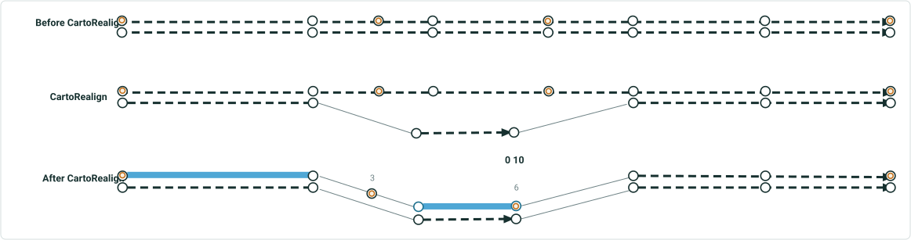

# Support Snap to Vertex Option for Calibration Points Impacted by Cartographic Realignment

|   |   |
| --- | --- |
| **Kind** | User Story · Pro |
| **Release** | — |
| **Product** | Roads & Highways · Pipeline Referencing |
| **Source** | [SupportSnapToVertexOptionCPsinCartoRealign.pptx](<https://esriis.sharepoint.com/sites/LocationReferencing/Shared%20Documents/General/SupportSnapToVertexOptionCPsinCartoRealign.pptx>) |
| **Edited** | 2023-02-16 17:29 by Nathan Easley |
| **Extracted** | 2026-09-04 · lane `xmlstrip` |

<!-- metadata
```yaml
title: "Support Snap to Vertex Option for Calibration Points Impacted by Cartographic Realignment"
source_file: "SupportSnapToVertexOptionCPsinCartoRealign.pptx"
source_url: "https://esriis.sharepoint.com/sites/LocationReferencing/Shared%20Documents/General/SupportSnapToVertexOptionCPsinCartoRealign.pptx"
doc_id: 611
doc_kind: "User Story"
surface: "Pro"
doc_revision: ""
target_release: ""
pe: ""
dev: ""
author: "William Isley"
last_edited_by: "Nathan Easley"
last_edited: "2023-02-16T17:29:29Z"
extracted: 2026-09-04
extraction_lane: xmlstrip
prompt_version: "v2.0.2"
keywords: ["calibration points", "cartographic realignment", "snap to vertex", "route editing", "pipeline referencing", "linear referencing"]
tools: []
products: ["Roads & Highways", "Pipeline Referencing"]
issues: []
related: [{"doc":729,"file":"support-snap-delete-and-ignore-options-for-calibration-points-in-cartographic__doc729.md","s":9.921},{"doc":736,"file":"support-updating-measures-option-in-cartographic-realignment__doc736.md","s":6.485},{"doc":737,"file":"support-honoring-referents-event-behavior-for-cartographic-realignment__doc737.md","s":5.557},{"doc":838,"file":"support-event-behaviors-on-complex-route-shapes-in-cartographic-realignment__doc838.md","s":4.863},{"doc":762,"file":"support-event-behaviors-on-vertical-route-shapes-in-cartographic-realignment__doc762.md","s":4.837}]
```
-->

## Summary

Describes a user story for adding a Snap to Vertex option for calibration points affected by cartographic realignment in linear referencing systems. It details the need for this option to preserve business rules and event locations after route edits. Testing, automation, and documentation updates are planned to support this new option.

## Related documents

<!-- related:begin -->
- [Support Snap, Delete, and Ignore Options for Calibration Points in Cartographic Realignment](<https://esriis.sharepoint.com/sites/lrsworkspace/LRS Doc Index/User Stories/support-snap-delete-and-ignore-options-for-calibration-points-in-cartographic__doc729.md>) — similar text 0.69 · 6 title words · 5 filename words · same kind/surface/folder <!-- rel:729 -->
- [Support updating measures option in cartographic realignment](<https://esriis.sharepoint.com/sites/lrsworkspace/LRS Doc Index/User Stories/support-updating-measures-option-in-cartographic-realignment__doc736.md>) — similar text 0.46 · 4 title words · 3 filename words · same kind/surface/folder <!-- rel:736 -->
- [Support honoring referents event behavior for cartographic realignment](<https://esriis.sharepoint.com/sites/lrsworkspace/LRS Doc Index/User Stories/support-honoring-referents-event-behavior-for-cartographic-realignment__doc737.md>) — similar text 0.39 · 3 title words · 3 filename words · same kind/surface/folder <!-- rel:737 -->
- [Support Event Behaviors on Complex Route Shapes in Cartographic Realignment](<https://esriis.sharepoint.com/sites/lrsworkspace/LRS Doc Index/User Stories/support-event-behaviors-on-complex-route-shapes-in-cartographic-realignment__doc838.md>) — similar text 0.27 · 3 title words · 2 filename words · same kind/surface/folder <!-- rel:838 -->
- [Support Event Behaviors on Vertical Route Shapes in Cartographic Realignment](<https://esriis.sharepoint.com/sites/lrsworkspace/LRS Doc Index/User Stories/support-event-behaviors-on-vertical-route-shapes-in-cartographic-realignment__doc762.md>) — similar text 0.26 · 3 title words · 2 filename words · same kind/surface/folder <!-- rel:762 -->
<!-- related:end -->

<!-- docs:begin -->
## Esri documentation

[Apply cartographic realignment](https://doc.esri.com/en/arcgis-pro/latest/help/production/roads-highways/apply-cartographic-realignment.html) · [3D in Pipeline Referencing](https://doc.esri.com/en/arcgis-pro/latest/help/production/location-referencing-pipelines/3d-in-pipeline-referencing.html) · [Multiple linear referencing methods](https://doc.esri.com/en/arcgis-pro/latest/help/production/location-referencing-pipelines/multiple-linear-referencing-methods.html)
<!-- docs:end -->

---

## Slide 1 — Support snap to vertex option for calibration points impacted by Cartographic Realignment

User Story

## Slide 2 — User Story

As an LRS editor, I need the option for how calibration points on the edited portion react when a route has a cartographic realignment, so that my business rules for calibrating these routes can be preserved, and events are located where expected after behaviors are applied.

Persona
LRS Editor: This user is responsible for making edits to the LRS.  The edits they need to make come in from field crews/contractors in a variety of formats (shapefiles, engineering drawing, fgdbs).  The LRS Editor is responsible for making the route edits based on these documents.  A scenario that can occur in some DoTs is that they find the geometry of their existing routes in the LRS doesn’t match their location in real life.  A cartographic realignment would allow for this update to be made.  When they make this cartographic realignment, there can be calibration points in the cartorealigned section that need to be updated as well.  Today we support 3 options: ignore, proportional snap, and delete.  Pipeline Operators would like a 4th option, snap to vertex.  This would ensure the calibration point remains on the same vertex after the cartographic realignment that it was found on before the cartographic realignment.

## Slide 3 — Support Snap to Vertex option




Add a 4th option for how CPs that are in the cartorealigned area of a Cartographic Realignment are handled.
This option would be called Snap to Vertex.
When selected, any calibration points in the impacted area of the cartographic realignment would remain on the same vertex that they were found on before the edit
If the vertex doesn’t exist on the centerline (but does on the route because the CP was added via our tools), maintain the vertex at the new location on the route and move the calibration point to its new location
The rest of cartographic realignment (recalibrating route, etc.) should remain the same
If the vertex is deleted or doesn’t exist at the location where the CP is, default back to proportional snap
Should this option only be available if measure doesn’t change?

0			           3                                                         6					    10

0			           3                                                         6					    10

## Slide 4 — Testing

Test scenarios where the CPs are at locations with and without corresponding vertices on the centerline
Test on both line and non line networks (projected and unprojected data)
Test with both Pipeline Referencing (focus on this) and Roads and Highways data
Should work on the following route shapes: simple, gapped, complex (loop, lollipop, alpha, branch, barbell), vertical (test this for the new Ignore option)
Check the existing cartographic realignment automation to ensure REST operations are still proportionally snapping, snapping, ignoring
Make sure cartographic realignments without any impacted CPs still work (automation should catch this)
Verify correct records are added to the edit log
Focus testing on verifying the CPs are handled correctly depending on the option selected
Test only for services, no need to worry about direct connect

## Slide 5 — Automation

Update existing ReadyAPI and UI automation.
Create new UI automation for this Snap to Vertex option

## Slide 6 — Documentation

Add information about this option and how it’s applied in a cartographic realignment (Pro ribbon with selection options) in https://pro.arcgis.com/en/pro-app/latest/help/production/location-referencing-pipelines/apply-cartographic-realignment.htm and https://pro.arcgis.com/en/pro-app/latest/help/production/roads-highways/apply-cartographic-realignment.htm

## Slide 7 — Assignment

Story Points:
Dev:
PE:
