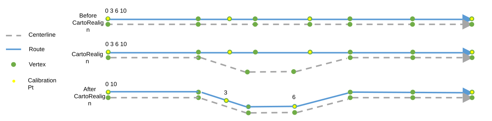

# Support Snap to Vertex Option for Calibration Points Impacted by Cartographic Realignment

| Field | Value |
| --- | --- |
| **Doc** | 611 · User Story · Pro |
| **Product** | Roads & Highways · Pipeline Referencing |
| **Release** | — |
| **Issues** | — |
| **Source** | [SupportSnapToVertexOptionCPsinCartoRealign.pptx](<https://esriis.sharepoint.com/sites/LocationReferencing/Shared%20Documents/General/SupportSnapToVertexOptionCPsinCartoRealign.pptx>) |
| **People** | author William Isley · PE — · dev — |
| **Edited** | 2023-02-16 17:29 by Nathan Easley |
| **Extracted** | 2026-09-04 · lane xmlstrip · format 3.0 · prompt v2.0.2 |
| **Keywords** | calibration points · cartographic realignment · snap to vertex · route editing · pipeline referencing · linear referencing |
| **Tools** | — |

## Summary

Describes a user story for adding a Snap to Vertex option for calibration points affected by cartographic realignment in linear referencing systems. It details the need for this option to preserve business rules and event locations after route edits. Testing, automation, and documentation updates are planned to support this new option.

## Related documents

<!-- related:begin -->
- [Support Snap, Delete, and Ignore Options for Calibration Points in Cartographic Realignment](<https://esriis.sharepoint.com/sites/lrsworkspace/LRS Doc Index/User Stories/support-snap-delete-and-ignore-options-for-cp.md>) — similar text 0.69 · 6 title words · 5 filename words · same kind/surface/folder <!-- rel:729 s=9.921 -->
- [Support updating measures option in cartographic realignment](<https://esriis.sharepoint.com/sites/lrsworkspace/LRS Doc Index/User Stories/support-updating-measures-option-in-cartographic-realignment.md>) — similar text 0.46 · 4 title words · 3 filename words · same kind/surface/folder <!-- rel:736 s=6.485 -->
- [Support honoring referents event behavior for cartographic realignment](<https://esriis.sharepoint.com/sites/lrsworkspace/LRS Doc Index/User Stories/support-honoring-referents-eb-for-cartographic-realignment.md>) — similar text 0.39 · 3 title words · 3 filename words · same kind/surface/folder <!-- rel:737 s=5.557 -->
- [Support Event Behaviors on Complex Route Shapes in Cartographic Realignment](<https://esriis.sharepoint.com/sites/lrsworkspace/LRS Doc Index/User Stories/support-eb-on-complex-route-shapes-in-cartographic.md>) — similar text 0.27 · 3 title words · 2 filename words · same kind/surface/folder <!-- rel:838 s=4.863 -->
- [Support Event Behaviors on Vertical Route Shapes in Cartographic Realignment](<https://esriis.sharepoint.com/sites/lrsworkspace/LRS Doc Index/User Stories/support-eb-on-vertical-route-shapes-in-cartographic.md>) — similar text 0.26 · 3 title words · 2 filename words · same kind/surface/folder <!-- rel:762 s=4.837 -->
<!-- related:end -->

<!-- docs:begin -->
## Esri documentation

[Apply cartographic realignment](https://doc.esri.com/en/arcgis-pro/latest/help/production/roads-highways/apply-cartographic-realignment.html) · [3D in Pipeline Referencing](https://doc.esri.com/en/arcgis-pro/latest/help/production/location-referencing-pipelines/3d-in-pipeline-referencing.html) · [Multiple linear referencing methods](https://doc.esri.com/en/arcgis-pro/latest/help/production/location-referencing-pipelines/multiple-linear-referencing-methods.html)
<!-- docs:end -->

---

## Story
### Support snap to vertex option for calibration points impacted by Cartographic Realignment <!-- slide 1 -->
User Story

### User Story <!-- slide 2 -->
As an LRS editor, I need the option for how calibration points on the edited portion react when a route has a cartographic realignment, so that my business rules for calibrating these routes can be preserved, and events are located where expected after behaviors are applied.

Persona
LRS Editor: This user is responsible for making edits to the LRS.  The edits they need to make come in from field crews/contractors in a variety of formats (shapefiles, engineering drawing, fgdbs).  The LRS Editor is responsible for making the route edits based on these documents.  A scenario that can occur in some DoTs is that they find the geometry of their existing routes in the LRS doesn’t match their location in real life.  A cartographic realignment would allow for this update to be made.  When they make this cartographic realignment, there can be calibration points in the cartorealigned section that need to be updated as well.  Today we support 3 options: ignore, proportional snap, and delete.  Pipeline Operators would like a 4th option, snap to vertex.  This would ensure the calibration point remains on the same vertex after the cartographic realignment that it was found on before the cartographic realignment.

## Acceptance Criteria
### Support Snap to Vertex option <!-- slide 3 -->
- Add a 4th option for how CPs that are in the cartorealigned area of a Cartographic Realignment are handled.
- This option would be called Snap to Vertex.
- When selected, any calibration points in the impacted area of the cartographic realignment would remain on the same vertex that they were found on before the edit
- If the vertex doesn’t exist on the centerline (but does on the route because the CP was added via our tools), maintain the vertex at the new location on the route and move the calibration point to its new location
- The rest of cartographic realignment (recalibrating route, etc.) should remain the same
- If the vertex is deleted or doesn’t exist at the location where the CP is, default back to proportional snap
- Should this option only be available if measure doesn’t change?

0			           3                                                         6					    10

0			           3                                                         6					    10

[figure: 0 10 · 3 · 6 · Centerline · Route · Vertex · Calibration Pt · Before CartoRealign · CartoRealign · After CartoRealign]

[connections: (ellipse 34) — (ellipse 35) · (ellipse 33) — (ellipse 34) · (ellipse 110) — (ellipse 111) · (ellipse 115) — (ellipse 116)]

## Testing
<!-- slide 4 -->
- Test scenarios where the CPs are at locations with and without corresponding vertices on the centerline
- Test on both line and non line networks (projected and unprojected data)
- Test with both Pipeline Referencing (focus on this) and Roads and Highways data
- Should work on the following route shapes: simple, gapped, complex (loop, lollipop, alpha, branch, barbell), vertical (test this for the new Ignore option)
- Check the existing cartographic realignment automation to ensure REST operations are still proportionally snapping, snapping, ignoring
- Make sure cartographic realignments without any impacted CPs still work (automation should catch this)
- Verify correct records are added to the edit log
- Focus testing on verifying the CPs are handled correctly depending on the option selected
- Test only for services, no need to worry about direct connect

## Automation
<!-- slide 5 -->
Update existing ReadyAPI and UI automation.
Create new UI automation for this Snap to Vertex option

## Documentation
<!-- slide 6 -->
Add information about this option and how it’s applied in a cartographic realignment (Pro ribbon with selection options) in https://pro.arcgis.com/en/pro-app/latest/help/production/location-referencing-pipelines/apply-cartographic-realignment.htm and https://pro.arcgis.com/en/pro-app/latest/help/production/roads-highways/apply-cartographic-realignment.htm

## Assignment
<!-- slide 7 -->
Story Points:
Dev:
PE:
