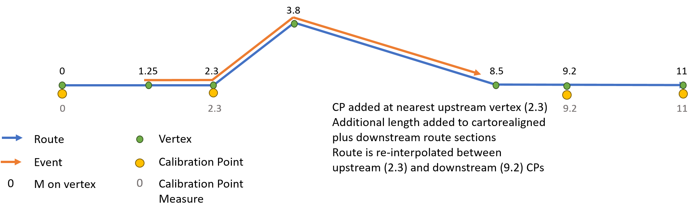
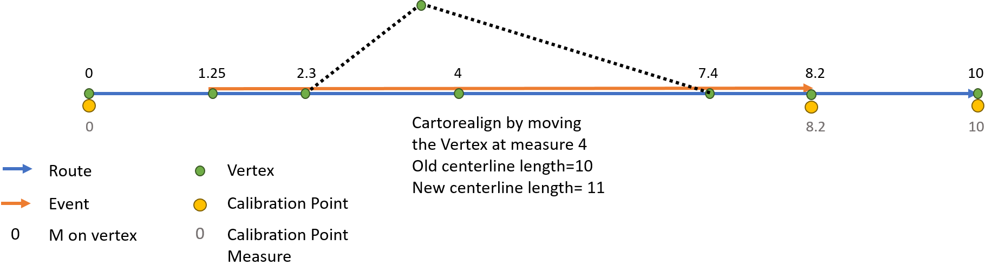

# Support updating measures option in cartographic realignment

|   |   |
| --- | --- |
| **Kind** | User Story · Pro |
| **Release** | — |
| **Product** | Roads & Highways · Pipeline Referencing |
| **Source** | [SupportUpdateMeasuresinCartoRealign.pptx](<https://esriis.sharepoint.com/sites/LocationReferencing/Shared%20Documents/General/SupportUpdateMeasuresinCartoRealign.pptx>) |
| **Edited** | 2021-01-26 22:33 by Nathan Easley |
| **Extracted** | 2026-09-04 · lane `xmlstrip` |

<!-- metadata
```yaml
title: "Support updating measures option in cartographic realignment"
source_file: "SupportUpdateMeasuresinCartoRealign.pptx"
source_url: "https://esriis.sharepoint.com/sites/LocationReferencing/Shared%20Documents/General/SupportUpdateMeasuresinCartoRealign.pptx"
doc_id: 736
doc_kind: "User Story"
surface: "Pro"
doc_revision: ""
target_release: ""
pe: ""
dev: ""
author: "William Isley"
last_edited_by: "Nathan Easley"
last_edited: "2021-01-26T22:33:51Z"
extracted: 2026-09-04
extraction_lane: xmlstrip
prompt_version: "v2.0.2"
keywords: ["cartographic realignment", "route measures", "calibration point", "centerline", "network calibration", "route length", "recalibration"]
tools: ["Modify Network Calibration Rules"]
products: ["Roads & Highways", "Pipeline Referencing"]
issues: []
related: [{"doc":611,"file":"support-snap-to-vertex-option-for-calibration-points-impacted-by-cartographic__doc611.md","s":6.485},{"doc":729,"file":"support-snap-delete-and-ignore-options-for-calibration-points-in-cartographic__doc729.md","s":6.088},{"doc":737,"file":"support-honoring-referents-event-behavior-for-cartographic-realignment__doc737.md","s":5.92},{"doc":762,"file":"support-event-behaviors-on-vertical-route-shapes-in-cartographic-realignment__doc762.md","s":4.951},{"doc":838,"file":"support-event-behaviors-on-complex-route-shapes-in-cartographic-realignment__doc838.md","s":4.845}]
```
-->

## Summary

Describes a user story for updating route measures when route length changes due to cartographic realignment. Details the addition of a new parameter in the Modify Network Calibration Rules tool to enable recalibration of route measures based on shape length changes. Includes testing scenarios and documentation updates related to this functionality.

## Related documents

<!-- related:begin -->
- [Support Snap to Vertex Option for Calibration Points Impacted by Cartographic Realignment](<https://esriis.sharepoint.com/sites/lrsworkspace/LRS Doc Index/User Stories/support-snap-to-vertex-option-for-calibration-points-impacted-by-cartographic__doc611.md>) — similar text 0.46 · 4 title words · 3 filename words · same kind/surface/folder <!-- rel:611 -->
- [Support Snap, Delete, and Ignore Options for Calibration Points in Cartographic Realignment](<https://esriis.sharepoint.com/sites/lrsworkspace/LRS Doc Index/User Stories/support-snap-delete-and-ignore-options-for-calibration-points-in-cartographic__doc729.md>) — similar text 0.46 · 3 title words · 3 filename words · same kind/surface/folder <!-- rel:729 -->
- [Support honoring referents event behavior for cartographic realignment](<https://esriis.sharepoint.com/sites/lrsworkspace/LRS Doc Index/User Stories/support-honoring-referents-event-behavior-for-cartographic-realignment__doc737.md>) — similar text 0.51 · 3 title words · 3 filename words · same kind/surface/folder <!-- rel:737 -->
- [Support Event Behaviors on Vertical Route Shapes in Cartographic Realignment](<https://esriis.sharepoint.com/sites/lrsworkspace/LRS Doc Index/User Stories/support-event-behaviors-on-vertical-route-shapes-in-cartographic-realignment__doc762.md>) — similar text 0.26 · 3 title words · 2 filename words · same kind/surface/folder <!-- rel:762 -->
- [Support Event Behaviors on Complex Route Shapes in Cartographic Realignment](<https://esriis.sharepoint.com/sites/lrsworkspace/LRS Doc Index/User Stories/support-event-behaviors-on-complex-route-shapes-in-cartographic-realignment__doc838.md>) — similar text 0.27 · 3 title words · 2 filename words · same kind/surface/folder <!-- rel:838 -->
<!-- related:end -->

<!-- docs:begin -->
## Esri documentation

[Apply cartographic realignment](https://doc.esri.com/en/arcgis-pro/latest/help/production/roads-highways/apply-cartographic-realignment.html)

_No page matched:_ [Modify Network Calibration Rules](https://www.google.com/search?q=%22Modify%20Network%20Calibration%20Rules%22+site%3Adoc.esri.com)
<!-- docs:end -->

---

## Slide 1 — Support updating measures option in cartographic realignment

User Story

## Slide 2 — User Story

As an LRS editor, I need to have routes get measures updated when the length of the route is changed via cartographic realignment, so that the mileage for the route continues to be accurate when I utilize this data for reporting and other analysis operations.

Persona
LRS Editor: This user is responsible for making edits to the LRS.  The edits they need to make come in from field crews/contractors in a variety of formats (shapefiles, engineering drawing, fgdbs).  The LRS Editor is responsible for making the route edits based on these documents.  A scenario that can occur in some DoTs is that they find the geometry of their existing routes in the LRS doesn’t match their location in real life.  A cartographic realignment would allow for this update to be made.  For some DoTs, the geometric length of their routes (via centerlines) is the driver for the measures that are placed on the routes (as opposed to having predetermined measures from driving the road and counting the mileage like some other DoTs have).  When a cartographic realignment is completed and the length of the centerline is changed, the users need the change in length to be reflected on the measure on the route(s) that were impacted by the centerline change since the geometric length of their polylines is the method they use to calibrate their network.

## Slide 3 — Update Measure in Cartographic Realignment

In the “Modify Network Calibration Rules” geoprocessing tool, add a new parameter called “Recalibrate route measures based on shape length change in cartographic realignment” (this parameter is where we will expose the configuration option that was in the ArcMap Create LRS Network wizard)
This option should already be stored in our metadata as it existed in ArcMap
The parameter should be a drop down with three options (Enabled, Disabled, As-Is)
Disabled is the default
When this parameter is enabled, we should continue to store that in the metadata and update the measures for a route(s) that are impacted when a centerline has a cartographic realignment
In the LRS Network Properties, add this parameter to the Fields and Network properties section.
For existing ArcMap users that migrate/upgrade to Pro, we should ensure the correct behaviors continue to be configured after running Modify LRS to add the controller dataset.

## Slide 4 — Update Measure in Cartographic Realignment

When a cartographic realignment takes place that results in the length of the centerline changing, we should do the following:

  - Determine the nearest upstream vertex on the route that was not impacted by the cartographic realignment, and place a calibration point at that location to lock in the measure
  - Add the delta in measure change to the downstream calibration points from the cartorealigned section
  - Reinterpolate the measures between the newly added CP upstream of the cartorealigned section and the next downstream CP from the cartorealigned section (which could be in the middle or end of the route)
  - Continue to write a cartographic realignment record into the edit log like we do today, but also write a calibration record into the edit log as well for the change in calibration
  - Note that for now, we’ll delete any CPs in the cartorealigned section as we need to address those scenarios in a different user story
Use the existing experience in ArcMap as a guide

## Slide 5

Before
After

 

## Slide 6 — Testing

Test cartorealignments on centerlines with both line and non line networks (projected and unprojected data)
Test with both Roads and Highways (focus on this) and Pipeline Referencing data
Should work on the following route shapes: simple, gapped, complex (loop, lollipop, alpha, branch, barbell), vertical
Make sure to verify with a dataset created in ArcMap and migrated/updated in Pro to ensure the correct behaviors continue to be configured
Verify correct records are added to the edit log
Verify method of cartorealignment where measures don’t change didn’t regress (via automation)

## Slide 7 — Automation

Create automation in both ReadyAPI and TestComplete for these scenarios

## Slide 8 — Documentation

Add information about this method and how it would impact a cartographic realignment in https://pro.arcgis.com/en/pro-app/latest/help/production/location-referencing-pipelines/apply-cartographic-realignment.htm and https://pro.arcgis.com/en/pro-app/latest/help/production/roads-highways/apply-cartographic-realignment.htm
Add the new parameter and information about the two methods in the usage notes for https://pro.arcgis.com/en/pro-app/latest/tool-reference/location-referencing/modify-network-calibration-rules.htm

## Slide 9 — Assignment

Story Points:
Dev:
PE:
