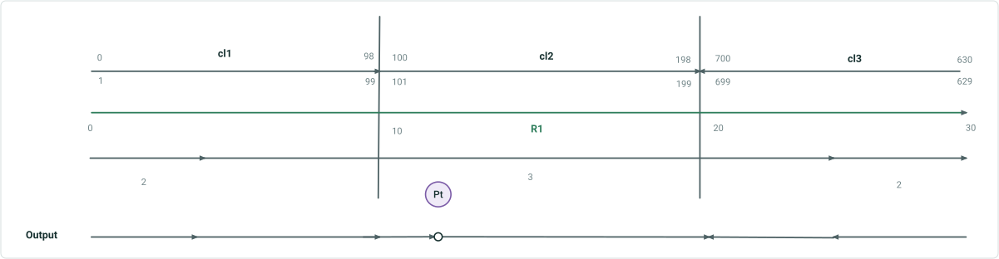

# Update Address Range Information in Overlay Events and Query Attribute Sets

|   |   |
| --- | --- |
| **Kind** | User Story · Pro |
| **Release** | — |
| **Issue** | [ArcGISPro/ps-location-referencing#5537](https://devtopia.esri.com/ArcGISPro/ps-location-referencing/issues/5537) |
| **Source** | [SupportAddressRangeInOverlayEventsQAS.pptx](<https://esriis.sharepoint.com/sites/LocationReferencing/Shared%20Documents/General/SupportAddressRangeInOverlayEventsQAS.pptx>) |
| **Edited** | 2024-07-24 22:21 by Claire Wang |
| **Extracted** | 2026-09-04 · lane `xmlstrip` |

<!-- metadata
```yaml
title: "Update Address Range Information in Overlay Events and Query Attribute Sets"
source_file: "SupportAddressRangeInOverlayEventsQAS.pptx"
source_url: "https://esriis.sharepoint.com/sites/LocationReferencing/Shared%20Documents/General/SupportAddressRangeInOverlayEventsQAS.pptx"
doc_id: 344
doc_kind: "User Story"
surface: "Pro"
doc_revision: ""
target_release: ""
pe: ""
dev: ""
author: "Praveen Kumar"
last_edited_by: "Claire Wang"
last_edited: "2024-07-24T22:21:07Z"
extracted: 2026-09-04
extraction_lane: xmlstrip
prompt_version: "v2.0.2"
keywords: ["address range", "dynamic segmentation", "overlay events", "query attribute sets", "address centerline", "block range", "point event", "line event"]
tools: ["Overlay Events GP tool", "Query Attribute Sets"]
products: []
issues: ["ArcGISPro/ps-location-referencing#5537"]
related: [{"doc":320,"file":"update-address-range-information-as-part-of-segmentation-in-overlay-events__doc320.md","s":1007.044},{"doc":294,"file":"update-address-range-via-address-points-in-overlay-events-and-query-attribute__doc294.md","s":9.425},{"doc":290,"file":"support-overlapping-events-in-query-attribute-set-and-overlay-events-gp-tool__doc290.md","s":5.975},{"doc":392,"file":"consider-point-events-in-query-attribute-set-and-overlay-events__doc392.md","s":5.844},{"doc":436,"file":"rest-gp-consider-centerline-direction-in-query-attribute-set-overlay-events__doc436.md","s":5.358}]
```
-->

## Summary

This user story describes the need for the Overlay Events geoprocessing tool and Query Attribute Sets to update address range information proportionally during dynamic segmentation when an addressing data layer with block range fields is included. It covers support for both point and line events and ensures accurate address block number information is maintained for downstream systems such as e911.

## Related documents

<!-- related:begin -->
- [Update Address Range Information as Part of Segmentation in Overlay Events & Query Attribute Sets – Test Plan](<https://esriis.sharepoint.com/sites/lrsworkspace/LRS Doc Index/Test Plans/update-address-range-information-as-part-of-segmentation-in-overlay-events__doc320.md>) — shared issue ArcGISPro/ps-location-referencing#5537 · similar text 0.45 · 6 title words · 2 filename words · same surface <!-- rel:320 -->
- [Update Address Range via Address Points in Overlay Events and Query Attribute Sets](<https://esriis.sharepoint.com/sites/lrsworkspace/LRS%20Doc%20Index/User%20Stories/update-address-range-via-address-points-in-overlay-events-and-query-attribute__doc294.md>) — similar text 0.81 · 6 title words · 4 filename words · same kind/surface/folder <!-- rel:294 -->
- [Support Overlapping Events in Query Attribute Set and Overlay Events GP Tool](<https://esriis.sharepoint.com/sites/lrsworkspace/LRS Doc Index/User Stories/support-overlapping-events-in-query-attribute-set-and-overlay-events-gp-tool__doc290.md>) — similar text 0.22 · 4 title words · 3 filename words · same kind/surface/folder <!-- rel:290 -->
- [Consider Point Events in Query Attribute Set and Overlay Events](<https://esriis.sharepoint.com/sites/lrsworkspace/LRS Doc Index/User Stories/consider-point-events-in-query-attribute-set-and-overlay-events__doc392.md>) — similar text 0.23 · 4 title words · 3 filename words · same kind/surface/folder <!-- rel:392 -->
- [REST/GP: Consider Centerline Direction in Query Attribute Set/Overlay Events](<https://esriis.sharepoint.com/sites/lrsworkspace/LRS Doc Index/User Stories/rest-gp-consider-centerline-direction-in-query-attribute-set-overlay-events__doc436.md>) — similar text 0.20 · 4 title words · 2 filename words · same kind/surface/folder <!-- rel:436 -->
<!-- related:end -->

<!-- docs:begin -->
## Esri documentation

[Apply dynamic segmentation](https://doc.esri.com/en/arcgis-pro/latest/help/production/location-referencing-pipelines/apply-dynamic-segmentation.html)

_No page matched:_ [Overlay Events GP tool](https://www.google.com/search?q=%22Overlay%20Events%20GP%20tool%22+site%3Adoc.esri.com) · [Query Attribute Sets](https://www.google.com/search?q=%22Query%20Attribute%20Sets%22+site%3Adoc.esri.com)
<!-- docs:end -->

---

## Slide 1 — Update Address Range information as part of the segmentation in Overlay Events & Query Attribute Sets

User Story
https://devtopia.esri.com/ArcGISPro/ps-location-referencing/issues/5537

## Slide 2 — User Story

As an LRS analyst, I need the Overlay Events GP tool and Query Attribute Sets to update address range information as they are segmented when an Addressing data layer with block range fields is included in the dynamic segmentation, so that I receive accurate address block number information at events break points, and feed this data into additional systems such as e911.

Persona
LRS Analyst: These users are responsible for doing analysis on LRS data throughout their organization. They might be part of LRS groups or other groups but are typically skilled in doing analysis on multiple datasets
Currently, the tools simply show the left/right-from/to site addresses for each record in the address layer. However, these users need to see block range information update when the records split inside a dynamic segmentation. This ensures the data is validated when it’s fed into additional systems such as e911.

## Slide 3 — An example Here, the layer with block range fields is the Address Centerline. But it can also be an event layer or



| CL ID | Left From | Left To | Parity Left | Right From | Right To | Parity Right | Jurisdiction | RID | From M | To M | # Lanes | Sign Type |
| --- | --- | --- | --- | --- | --- | --- | --- | --- | --- | --- | --- | --- |
| 1 | 0 | 98 | Even | 1 | 99 | Odd | Clark | R1 | 0 | 4 | 2 | null |
| 1 | 0 | 98 | Even | 1 | 99 | Odd | Clark | R1 | 4 | 10 | 3 | null |
| 2 | 100 | 198 | Even | 101 | 199 | Odd | Clark | R1 | 10 | 12 | 3 | null |
| 2 | 100 | 198 | Even | 101 | 199 | Odd | Clark | R1 | 12 | 12 | 3 | Stop |
| 2 | 100 | 198 | Even | 101 | 199 | Odd | Clark | R1 | 12 | 20 | 3 | null |
| 3 | 629 | 699 | Odd | 630 | 700 | Even | Adam | R1 | 25 | 20 | 3 | null |
| 3 | 629 | 699 | Odd | 630 | 700 | Even | Adam | R1 | 30 | 25 | 2 | null |

- Address block range does not split at event location.
- Users want these range numbers to break proportionally using the same logic in the attribute rule in ADM solution for splitting address centerline
  - (e.g. range is 100-200 and splits in the middle, the result would be 100-150 and 151-200)

## Slide 4 — An example Here, the layer with block range fields is the Address Centerline. But it can also be an event layer or


| CL ID | Left From | Left To | Parity Left | Right From | Right To | Parity Right | Jurisdiction | RID | From M | To M | # Lanes | Sign Type |
| --- | --- | --- | --- | --- | --- | --- | --- | --- | --- | --- | --- | --- |
| 1 | 0 | 38 | Even | 1 | 39 | Odd | Clark | R1 | 0 | 4 | 2 | null |
| 1 | 40 | 98 | Even | 41 | 99 | Odd | Clark | R1 | 4 | 10 | 3 | null |
| 2 | 100 | 120 | Even | 101 | 121 | Odd | Clark | R1 | 10 | 12 | 3 | null |
| 2 | null | null | Even | null | null | Odd | Clark | R1 | 12 | 12 | 3 | Stop |
| 2 | 122 | 198 | Even | 123 | 199 | Odd | Clark | R1 | 12 | 20 | 3 | null |
| 3 | 629 | 665 | Odd | 630 | 666 | Even | Adam | R1 | 25 | 20 | 3 | null |
| 3 | 667 | 699 | Odd | 668 | 700 | Even | Adam | R1 | 30 | 25 | 2 | null |

- Address block range breaks proportionally using the same logic in the attribute rule in ADM solution for splitting address centerline
- For Point event, populate nulls for the 4 Address Range fields that are dynamic, and keep populating other field values (e.g. jurisdiction and parity) that are static along the centerline

## Slide 5 — Acceptance Criteria

- In the Query Attribute Set REST endpoint and Overlay Events GP tool, when the Address layer that is is part of ADM-LR configuration and have block range fields is an input, we need to update the range fields for each segment in the output
  - The Address Layer can be an LRS centerline, network, or an event layer, depending what is configured in Configure Address Feature Classes GP tool
- Support both point and line events for segmenting the Address layer
  - Line Events - Use the same logic in the existing attribute rule in ADM solution that splits address centerline proportionally (e.g. range is 100-200 and a segment breaks at the middle of this address layer, the result would be 100-150 and 151-200)
    - Only do this for the 4 Address Range fields (Left From; Left To; Right From; Right To)
  - Point Events - Populate null for the 4 Address Range fields that are dynamic. Keep populating other field values (e.g. jurisdiction and parity) that are static along the centerline
- If the address layer is LRS centerline, continue to honor centerline direction in the output

## Slide 6 — Testing

Test with fs, fgdb, and direct connect egdb
Test with the address layer with block range fields that is configured as the LRS Centerline, LRS network, as well as an LRS event Test with point and line events
Test with events that result in a break in the middle of the address layer as well as ending at an endpoint
Test centerline(s) being the same and opposite direction of route
Test a few cases with complex routes
Sanity check if an event layer has block range fields but it’s not configured as part of ADM-LR, the block range fields do not update

## Slide 7 — Automation

This will break existing automation. PE needs to fix existing automation and add more cases that existing automation does not cover.
Applies to both endpoint and gp tool automation

## Slide 8 — Documentation

Add language to the existing REST API and GP topic: when configured with addressing, the layer’s block range fields values reflect the segmentation locations

## Slide 9 — Story Points

Story Points:
Dev:
PE:
