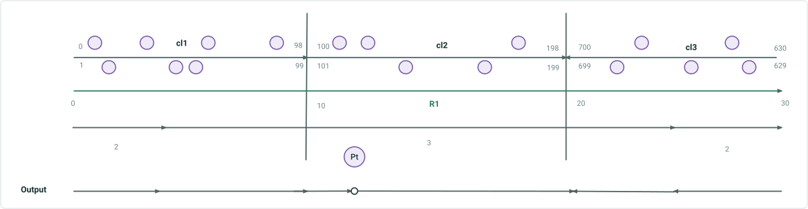

# Update Address Range via Address Points in Overlay Events and Query Attribute Sets

|   |   |
| --- | --- |
| **Kind** | User Story · Pro |
| **Release** | — |
| **Source** | [UpdateAddressRangeviaAddressPointinOverlayEventsQAS.pptx](<https://esriis.sharepoint.com/sites/LocationReferencing/Shared%20Documents/General/UpdateAddressRangeviaAddressPointinOverlayEventsQAS.pptx>) |
| **Edited** | 2024-10-29 23:19 by Nathan Easley |
| **Extracted** | 2026-09-04 · lane `xmlstrip` |

<!-- metadata
```yaml
title: "Update Address Range via Address Points in Overlay Events and Query Attribute Sets"
source_file: "UpdateAddressRangeviaAddressPointinOverlayEventsQAS.pptx"
source_url: "https://esriis.sharepoint.com/sites/LocationReferencing/Shared%20Documents/General/UpdateAddressRangeviaAddressPointinOverlayEventsQAS.pptx"
doc_id: 294
doc_kind: "User Story"
surface: "Pro"
doc_revision: ""
target_release: ""
pe: ""
dev: ""
author: "Praveen Kumar"
last_edited_by: "Nathan Easley"
last_edited: "2024-10-29T23:19:39Z"
extracted: 2026-09-04
extraction_lane: xmlstrip
prompt_version: "v2.0.2"
keywords: ["address range", "address points", "overlay events", "query attribute sets", "dynamic segmentation", "address block range", "interpolation", "line event", "point event"]
tools: ["Overlay Events", "Query Attribute Sets"]
products: []
issues: []
related: [{"doc":344,"file":"update-address-range-information-in-overlay-events-and-query-attribute-sets__doc344.md","s":10.639},{"doc":257,"file":"overlay-events-queryattributeset-update-address-range-info-via-address-points__doc257.md","s":6.808},{"doc":320,"file":"update-address-range-information-as-part-of-segmentation-in-overlay-events__doc320.md","s":5.922},{"doc":290,"file":"support-overlapping-events-in-query-attribute-set-and-overlay-events-gp-tool__doc290.md","s":5.407},{"doc":392,"file":"consider-point-events-in-query-attribute-set-and-overlay-events__doc392.md","s":5.376}]
```
-->

## Summary

User story describing the need for the Overlay Events geoprocessing tool and Query Attribute Sets REST endpoint to update address range information based on nearest address points when an Addressing data layer with block range fields is included in dynamic segmentation. It includes acceptance criteria for updating range fields using interpolation of nearest upstream and downstream address points, support for point and line events, and honoring centerline direction. Testing and documentation update requirements are also outlined.

## Related documents

<!-- related:begin -->
- [Update Address Range Information in Overlay Events and Query Attribute Sets](<https://esriis.sharepoint.com/sites/lrsworkspace/LRS Doc Index/User Stories/update-address-range-information-in-overlay-events-and-query-attribute-sets__doc344.md>) — similar text 0.81 · 6 title words · 4 filename words · same kind/surface/folder <!-- rel:344 -->
- [Overlay Events/queryAttributeSet: Update Address Range info via Address Points](<https://esriis.sharepoint.com/sites/lrsworkspace/LRS Doc Index/Test Plans/overlay-events-queryattributeset-update-address-range-info-via-address-points__doc257.md>) — similar text 0.28 · 5 title words · 2 filename words · same surface <!-- rel:257 -->
- [Update Address Range Information as Part of Segmentation in Overlay Events & Query Attribute Sets – Test Plan](<https://esriis.sharepoint.com/sites/lrsworkspace/LRS Doc Index/Test Plans/update-address-range-information-as-part-of-segmentation-in-overlay-events__doc320.md>) — similar text 0.41 · 6 title words · 2 filename words · same surface <!-- rel:320 -->
- [Support Overlapping Events in Query Attribute Set and Overlay Events GP Tool](<https://esriis.sharepoint.com/sites/lrsworkspace/LRS Doc Index/User Stories/support-overlapping-events-in-query-attribute-set-and-overlay-events-gp-tool__doc290.md>) — similar text 0.23 · 4 title words · 2 filename words · same kind/surface/folder <!-- rel:290 -->
- [Consider Point Events in Query Attribute Set and Overlay Events](<https://esriis.sharepoint.com/sites/lrsworkspace/LRS Doc Index/User Stories/consider-point-events-in-query-attribute-set-and-overlay-events__doc392.md>) — similar text 0.23 · 4 title words · 2 filename words · same kind/surface/folder <!-- rel:392 -->
<!-- related:end -->

<!-- docs:begin -->
## Esri documentation

[View site address point properties](https://doc.esri.com/en/arcgis-pro/latest/help/production/roads-highways/view-site-address-point-properties.html) · [Apply dynamic segmentation](https://doc.esri.com/en/arcgis-pro/latest/help/production/location-referencing-pipelines/apply-dynamic-segmentation.html)

_No page matched:_ [Overlay Events](https://www.google.com/search?q=%22Overlay%20Events%22+site%3Adoc.esri.com) · [Query Attribute Sets](https://www.google.com/search?q=%22Query%20Attribute%20Sets%22+site%3Adoc.esri.com)
<!-- docs:end -->

---

## Slide 1 — Update Address Range information via Address Points in Overlay Events & Query Attribute Sets

User Story

## Slide 2 — User Story

As an LRS analyst, I need the Overlay Events GP tool and Query Attribute Sets to update address range information based on the nearest address points when an Addressing data layer with block range fields is included in the dynamic segmentation, so that I receive accurate address block number information at events break points and feed this data into downstream systems such as e911.
Persona
LRS Analyst: These users are responsible for doing analysis on LRS data throughout their organization. They might be part of LRS groups or other groups but are typically skilled in doing analysis on multiple datasets.
Currently, the tools will update the address range information in the output of Overlay Events/Query Attribute Sets based on the proportion along the centerline where the split takes place.  Some of our early adopters have requested that when the centerline splits, the address range information in that output being updated based on the nearest upstream/downstream address points.

## Slide 3 — Acceptance Criteria

- In the Query Attribute Set REST endpoint and Overlay Events GP tool, when the Address layer that is is part of ADM-LR configuration and have block range fields is an input, we need to update the range fields for each segment in the output based on an interpolation of the nearest upstream and downstream address points associated with that centerline
  - The Address Layer can be an LRS centerline, network, or an event layer, depending what is configured in Configure Address Feature Classes GP tool
- Add an optional parameter to both the GP tool and REST endpoint called Address Block Split Type.
  - The parameter should be optional and only appear in the Pro GP UI if the layer configured as the Address Block Range layer is included in the dynamic segmentation
  - Valid values are proportional and nearest address point.  Proportional is the default.
- Support both point and line events for segmenting the Address layer
  - Line Events – When the centerline is broken based on changes to line events, the range should be updated based on an interpolation of the nearest upstream and downstream address points on the centerline (e.g. range is 100-200 and a segment breaks equally between address points 160 and 164, the result would be 100-162 and 162-200)
    - Only do this for the 4 Address Range fields (Left From; Left To; Right From; Right To)
  - Point Events - Populate null for the 4 Address Range fields that are dynamic. Keep populating other field values (e.g. jurisdiction and parity) that are static along the centerline
- If the address layer is LRS centerline, continue to honor centerline direction in the output

## Slide 4 — An example Here, the layer with block range fields is the Address Centerline. But it can also be an event layer or



| CL ID | Left From | Left To | Parity Left | Right From | Right To | Parity Right | Jurisdiction | RID | From M | To M | # Lanes | Sign Type |
| --- | --- | --- | --- | --- | --- | --- | --- | --- | --- | --- | --- | --- |
| 1 | 0 | 40 | Even | 1 | 41 | Odd | Clark | R1 | 0 | 4 | 2 | null |
| 1 | 42 | 98 | Even | 43 | 99 | Odd | Clark | R1 | 4 | 10 | 3 | null |
| 2 | 100 | 120 | Even | 101 | 121 | Odd | Clark | R1 | 10 | 12 | 3 | null |
| 2 | null | null | Even | null | null | Odd | Clark | R1 | 12 | 12 | 3 | Stop |
| 2 | 122 | 198 | Even | 123 | 199 | Odd | Clark | R1 | 12 | 20 | 3 | null |
| 3 | 629 | 655 | Odd | 630 | 656 | Even | Adam | R1 | 25 | 20 | 3 | null |
| 3 | 657 | 699 | Odd | 658 | 700 | Even | Adam | R1 | 30 | 25 | 2 | null |

- Address block range breaks and are updated based on the nearest upstream and downstream address points
- For Point event, populate nulls for the 4 Address Range fields that are dynamic, and keep populating other field values (e.g. jurisdiction and parity) that are static along the centerline

11                             43     47			                  145                                167                                                           681                               649                     637
8                       38                          66                             92                         112        126                                                                   186                                                       660                                      642

## Slide 5 — Testing

Test with fs, fgdb, and direct connect egdb
Test with the address layer with block range fields that is configured as the LRS Centerline, LRS network, as well as an LRS event
Test with point and line events
Test with events that result in a break in the middle of the address layer as well as ending at an endpoint
Test centerline(s) being the same and opposite direction of route
Test a few cases with complex routes
Sanity check if an event layer has block range fields but it’s not configured as part of ADM-LR, the block range fields do not update

## Slide 6 — Automation

This will break existing automation. PE needs to fix existing automation and add more cases that existing automation does not cover.
Applies to both endpoint and GP tool automation

## Slide 7 — Documentation

Update language to the existing REST API and GP topic to discuss the two types of updates to block ranges that can occur and the new parameter
Add to the existing example graphic in the existing Address document in the Pro documentation to show both options and example outcomes

## Slide 8 — Story Points

Story Points:
Dev:
PE:
