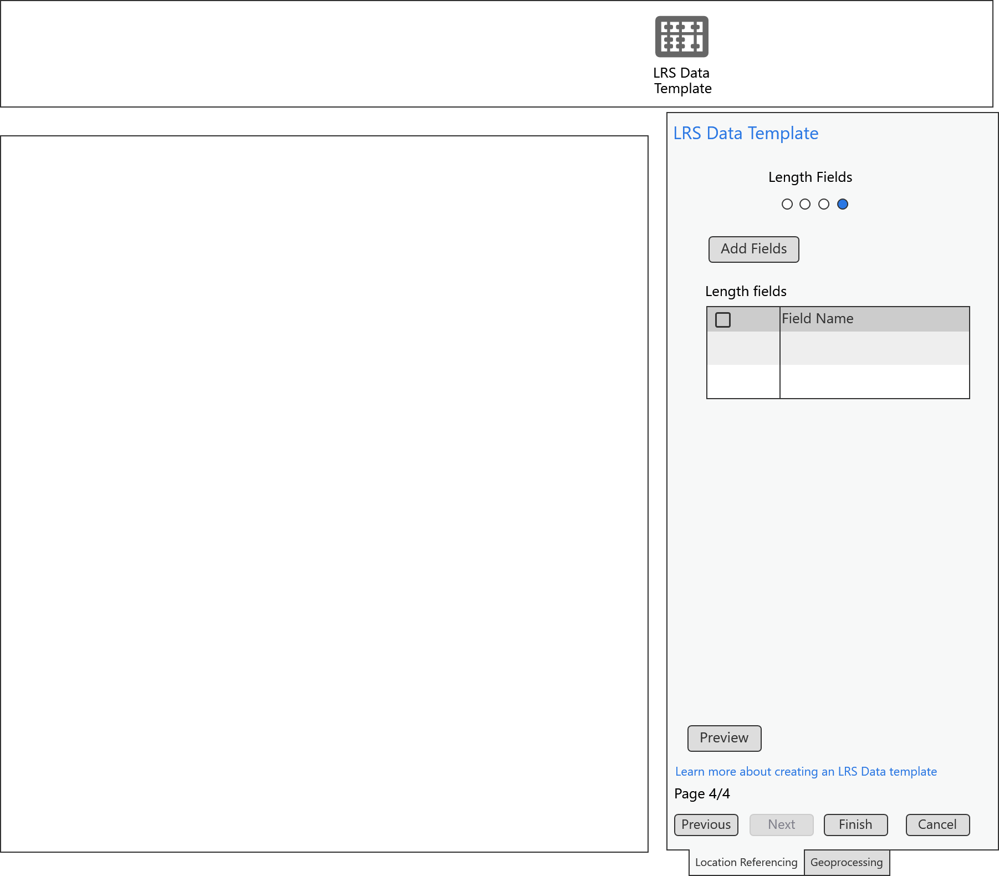
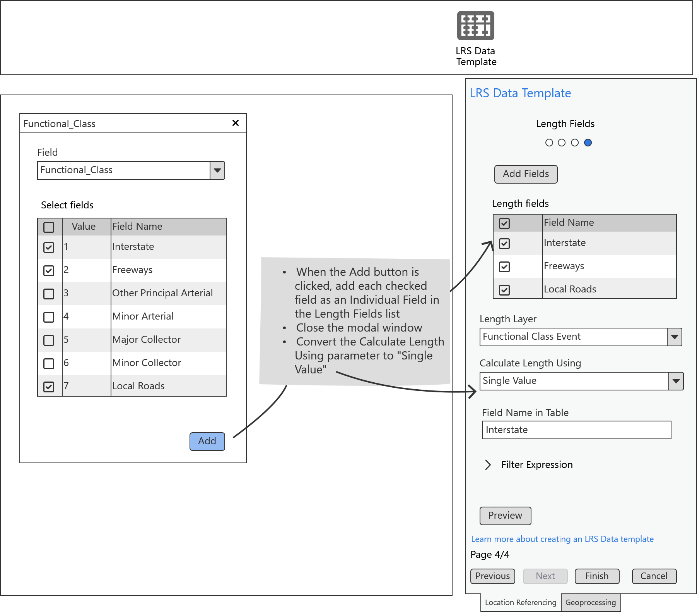

# User Story for LRS Data Product Template with Multiple Length Fields

|   |   |
| --- | --- |
| **Kind** | User Story · Pro |
| **Release** | — |
| **Source** | [Report_Canvas6_Length_UniqueValues.pptx](<https://esriis.sharepoint.com/sites/LocationReferencing/Shared%20Documents/General/Report_Canvas6_Length_UniqueValues.pptx>) |
| **Edited** | 2024-08-01 20:21 by unknown |
| **Extracted** | 2026-09-04 · lane `xmlstrip` |

<!-- metadata
```yaml
title: "User Story for LRS Data Product Template with Multiple Length Fields"
source_file: "Report_Canvas6_Length_UniqueValues.pptx"
source_url: "https://esriis.sharepoint.com/sites/LocationReferencing/Shared%20Documents/General/Report_Canvas6_Length_UniqueValues.pptx"
doc_id: 342
doc_kind: "User Story"
surface: "Pro"
doc_revision: ""
target_release: ""
pe: ""
dev: ""
author: "Rahul Rakshit"
last_edited_by: ""
last_edited: "2024-08-01T20:21:23Z"
extracted: 2026-09-04
extraction_lane: xmlstrip
prompt_version: "v2.0.2"
keywords: ["data product", "length field", "template", "json", "unique values", "lrs data template", "gis analyst"]
tools: ["Generate LRS Data Product"]
products: []
issues: []
related: [{"doc":343,"file":"user-story-for-lrs-data-product-template-with-length-range-values__doc343.md","s":8.219},{"doc":356,"file":"lr-data-products-support-multiple-summary-fields__doc356.md","s":6.356},{"doc":357,"file":"generate-lrs-data-product-support-summary-and-length-fields__doc357.md","s":4.969},{"doc":322,"file":"support-length-fields-using-unique-values-in-lrs-data-template-wizard-test-plan__doc322.md","s":4.576},{"doc":374,"file":"lr-reporting-create-a-template-tool-user-story__doc374.md","s":4.521}]
```
-->

## Summary

This document describes a user story for GIS Analysts to create a reusable LRS data product template that supports adding multiple length fields using a single operation. It outlines the workflow for using the LRS Data Template wizard, including field selection and saving configuration in a JSON file with a limit on unique values. Testing considerations include theme compatibility and compliance, and the document also references documentation, automation, and estimation aspects.

## Related documents

<!-- related:begin -->
- [User Story for LRS Data Product Template with Length Range Values](<https://esriis.sharepoint.com/sites/lrsworkspace/LRS Doc Index/User Stories/user-story-for-lrs-data-product-template-with-length-range-values__doc343.md>) — similar text 0.60 · 2 title words · 4 filename words · same kind/surface/folder <!-- rel:343 -->
- [LR Data Products: Support multiple summary fields](<https://esriis.sharepoint.com/sites/lrsworkspace/LRS Doc Index/User Stories/lr-data-products-support-multiple-summary-fields__doc356.md>) — similar text 0.48 · 2 title words · 2 filename words · same kind/surface/folder <!-- rel:356 -->
- [Generate LRS Data Product Support Summary and Length Fields](<https://esriis.sharepoint.com/sites/lrsworkspace/LRS%20Doc%20Index/User%20Stories/generate-lrs-data-product-support-summary-and-length-fields__doc357.md>) — similar text 0.30 · 3 title words · 1 filename word · same kind/surface/folder <!-- rel:357 -->
- [Support length fields using unique values in LRS Data Template wizard – Test Plan](<https://esriis.sharepoint.com/sites/lrsworkspace/LRS Doc Index/Test Plans/support-length-fields-using-unique-values-in-lrs-data-template-wizard-test-plan__doc322.md>) — similar text 0.14 · 2 title words · 2 filename words · same surface <!-- rel:322 -->
- [LR Reporting: Create a template tool User Story](<https://esriis.sharepoint.com/sites/lrsworkspace/LRS Doc Index/User Stories/lr-reporting-create-a-template-tool-user-story__doc374.md>) — similar text 0.31 · 1 filename word · same kind/surface/folder <!-- rel:374 -->
<!-- related:end -->

<!-- docs:begin -->
## Esri documentation

[LRS data products](https://doc.esri.com/en/arcgis-pro/latest/help/production/roads-highways/lrs-data-products.html) · [Create a template for an LRS length data product](https://doc.esri.com/en/arcgis-pro/latest/help/production/roads-highways/create-a-template-for-an-lrs-length-data-product.html)

_No page matched:_ [Generate LRS Data Product](https://www.google.com/search?q=%22Generate%20LRS%20Data%20Product%22+site%3Adoc.esri.com)
<!-- docs:end -->

---

## Slide 1

User Story
As a GIS Analyst, I need the ability to create a reusable LRS data product template that can be used by the Generate LRS Data Product geoprocessing tool. It’d be very helpful if I can add multiple length fields to the template using a single operation.
Persona
GIS Analyst: These users know how to work with ArcGIS Pro. They will design a reusable data template based on an existing paper or digital report. Their duty will be to ensure that the Data Product’s constituents closely mirror those of its predecessors.
They may also create a new templates as needed by their agency.
Workflow

- The user opens the LRS Data Template wizard
- The LRS Data Template pane opens in the right
- The type of data product is selected
- The name, network and description are provided
- A  summary field is chosen
- Length fields are chosen

LR Data Products: Support length fields using unique values
style.visibilitystyle.visibility

## Slide 2

User Story: Details
Note: These symbols        are only for explaining the workflow. Do not create them in the UI.
Workflow

- Click on the add fields button

This is how the pane looks upon first run.

 

## Slide 3

User Story: Workflow Details

       

## Slide 4

User Story: Workflow Details



## Slide 5

User Story

- Save the info on each length field in the Json file upon clicking the Finish button.
- Do not allow more than 20 unique values in the list. In case more than 20 unique values exist, provide a message “This field exceeds the limit of 20 unique values. Only 20 unique values will be used.”


## Slide 6

Testing

- Test with dark and light theme
- 508 and i18n compliance
- Test with different type of length layers such as line events and networks.

## Slide 7

Documentation

## Slide 8

Automation

## Slide 9

Estimate
