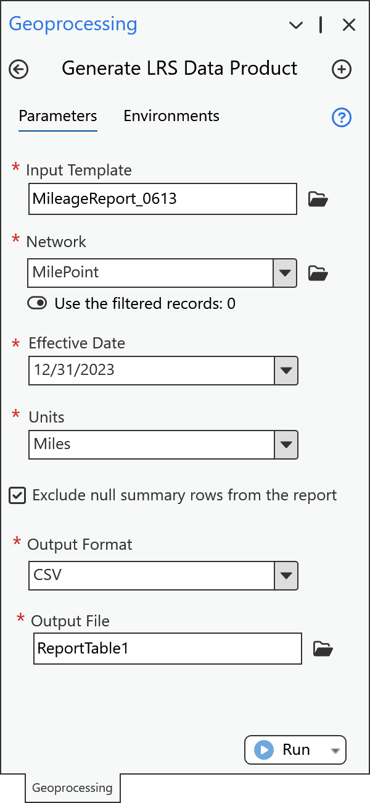
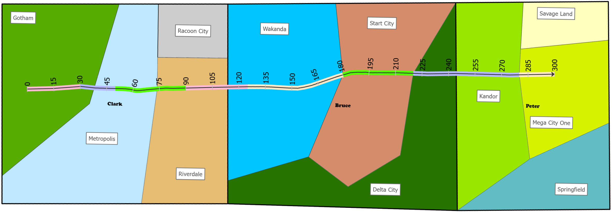
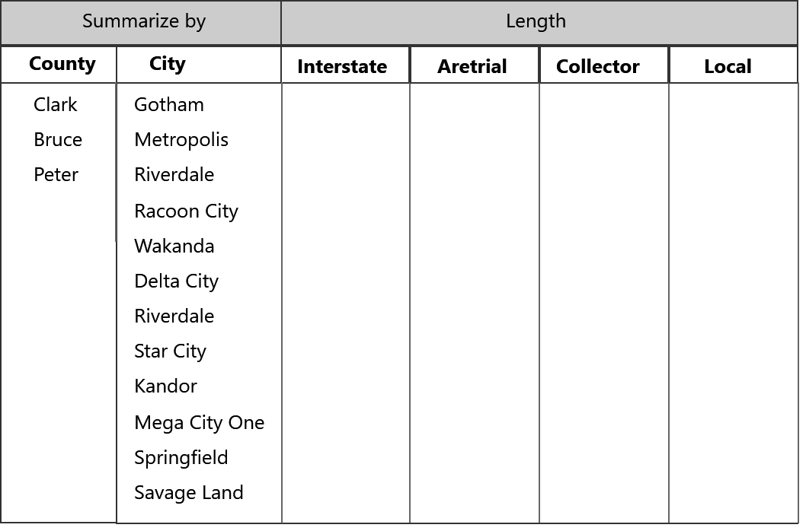
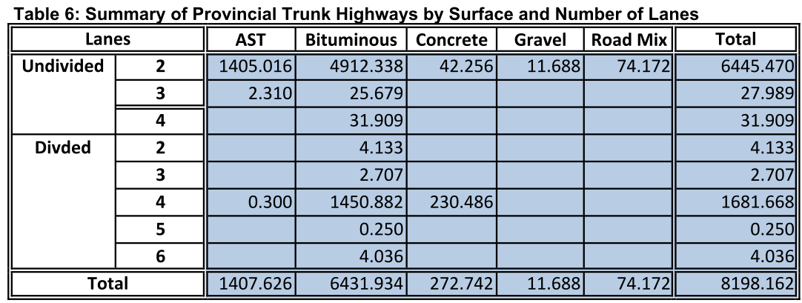
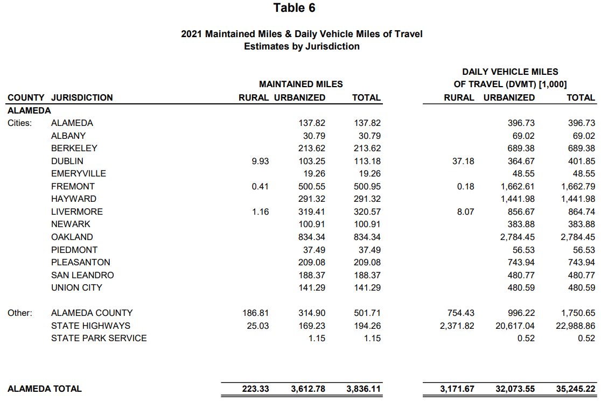
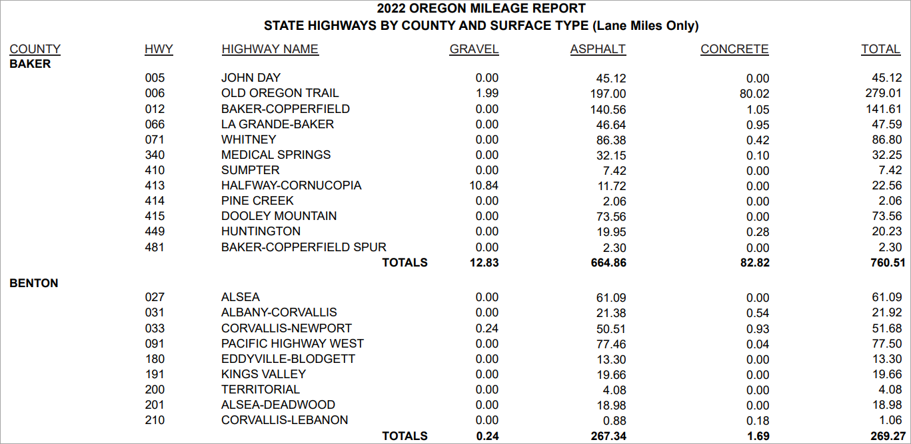
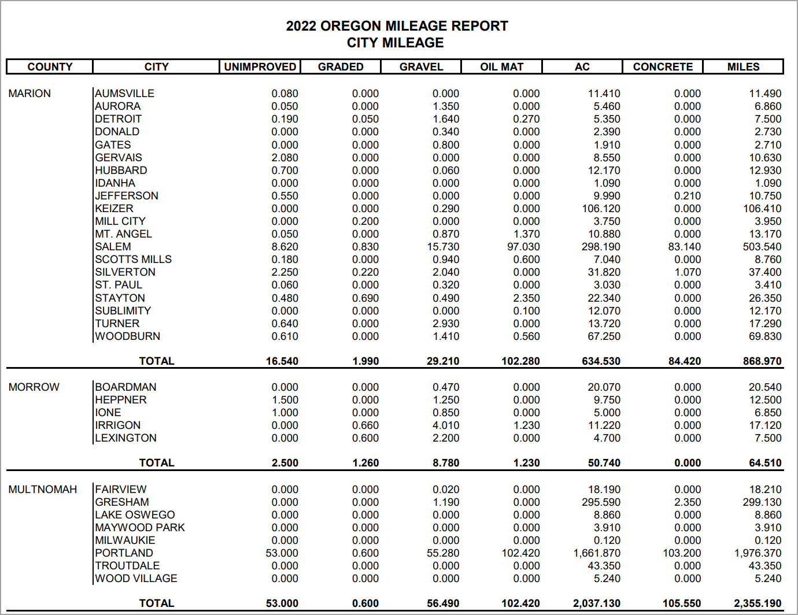
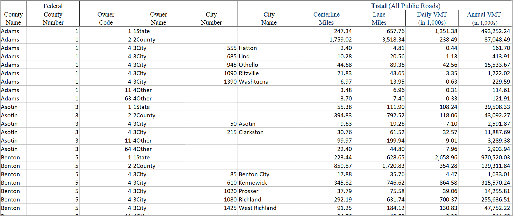

# User Story: Support Multiple Summary Fields in Generate LRS Data Product

|   |   |
| --- | --- |
| **Kind** | User Story · Pro |
| **Release** | — |
| **Source** | [GenerateLRDP_GP5_Support_MultipleSummary_V1.pptx](<https://esriis.sharepoint.com/sites/LocationReferencing/Shared%20Documents/General/GenerateLRDP_GP5_Support_MultipleSummary_V1.pptx>) |
| **Edited** | 2024-07-10 16:23 by Rahul Rakshit |
| **Extracted** | 2026-09-04 · lane `xmlstrip` |

<!-- metadata
```yaml
title: "User Story: Support Multiple Summary Fields in Generate LRS Data Product"
source_file: "GenerateLRDP_GP5_Support_MultipleSummary_V1.pptx"
source_url: "https://esriis.sharepoint.com/sites/LocationReferencing/Shared%20Documents/General/GenerateLRDP_GP5_Support_MultipleSummary_V1.pptx"
doc_id: 353
doc_kind: "User Story"
surface: "Pro"
doc_revision: "V1"
target_release: ""
pe: ""
dev: ""
author: "Rahul Rakshit"
last_edited_by: "Rahul Rakshit"
last_edited: "2024-07-10T16:23:38Z"
extracted: 2026-09-04
extraction_lane: xmlstrip
prompt_version: "v2.0.2"
keywords: ["data product", "summary fields", "length product", "geoprocessing", "template", "route", "event"]
tools: ["Generate LRS Data Products"]
products: []
issues: []
related: [{"doc":357,"file":"generate-lrs-data-product-support-summary-and-length__doc357.md","s":8.879},{"doc":356,"file":"lr-data-products-support-multiple-summary-fields__doc356.md","s":6.394},{"doc":107,"file":"generate-lrs-data-product-and-linear-referenced-length-summary-enhancement__doc107.md","s":4.667},{"doc":342,"file":"user-story-for-lrs-data-product-template-with-multiple-length-fields__doc342.md","s":4.294},{"doc":232,"file":"support-table-output-with-the-length-product-template-test-plan__doc232.md","s":3.515}]
```
-->

## Summary

This document describes a user story for GIS Analysts to use multiple summary fields in the Generate LRS Data Products geoprocessing tool. It includes examples of nested summary fields for length data products and outlines testing and automation considerations.

## Related documents

<!-- related:begin -->
- [Generate LRS Data Product Support Summary and Length](<https://esriis.sharepoint.com/sites/lrsworkspace/LRS%20Doc%20Index/User%20Stories/generate-lrs-data-product-support-summary-and-length__doc357.md>) — similar text 0.36 · 4 title words · 4 filename words · same kind/surface/folder <!-- rel:357 -->
- [LR Data Products: Support multiple summary fields](<https://esriis.sharepoint.com/sites/lrsworkspace/LRS Doc Index/User Stories/lr-data-products-support-multiple-summary-fields__doc356.md>) — similar text 0.39 · 4 title words · 2 filename words · same kind/surface/folder <!-- rel:356 -->
- [Generate LRS Data Product and Linear Referenced Length Summary Enhancement](<https://esriis.sharepoint.com/sites/lrsworkspace/LRS Doc Index/User Stories/generate-lrs-data-product-and-linear-referenced-length-summary-enhancement__doc107.md>) — similar text 0.16 · 3 title words · 1 filename word · same kind/surface/folder <!-- rel:107 -->
- [User Story for LRS Data Product Template with Multiple Length Fields](<https://esriis.sharepoint.com/sites/lrsworkspace/LRS%20Doc%20Index/User%20Stories/user-story-for-lrs-data-product-template-with-multiple-length-fields__doc342.md>) — similar text 0.34 · 3 title words · same kind/surface/folder <!-- rel:342 -->
- [Support table output with the length product template – Test Plan](<https://esriis.sharepoint.com/sites/lrsworkspace/LRS Doc Index/Test Plans/support-table-output-with-the-length-product-template-test-plan__doc232.md>) — similar text 0.18 · 2 title words · same surface/folder <!-- rel:232 -->
<!-- related:end -->

<!-- docs:begin -->
## Esri documentation

[LRS data products](https://doc.esri.com/en/arcgis-pro/latest/help/production/roads-highways/lrs-data-products.html) · [Create a template for an LRS length data product](https://doc.esri.com/en/arcgis-pro/latest/help/production/roads-highways/create-a-template-for-an-lrs-length-data-product.html)

_No page matched:_ [Generate LRS Data Products](https://www.google.com/search?q=%22Generate%20LRS%20Data%20Products%22+site%3Adoc.esri.com)
<!-- docs:end -->

---

## Slide 1

User Story
As a GIS Analyst, I need the ability to use the LRS Data Product template that can be used by the Generate LRS Data Products geoprocessing tool. It’d be very helpful if I can use multiple the summary fields from the template to produce the data product.
Persona
GIS Analyst: These users know how to work with ArcGIS Pro. They will design a reusable data template based on an existing paper or digital report. Their duty will be to ensure that the Data Product’s constituents closely mirror those of its predecessors.
Generate LR Data Product:
Support multiple summary fields from the template
style.visibility

## Slide 2

User Story

  - Support using multiple summary fields to create a length data product using the Generate LRS product geoprocessing tool.
  - The summary fields are nested based on level. In the example here, the base level is Route type (Level3) which are summarized by City (Level 2) which are summarized by County (Level1).
  - Length is calculated as a ∑ of (To measure – From Measure) for each event (Functional Class Type) segment present for the selected routes.
Template
CSV from GP Tool
Data

    

## Slide 3

Another Example
Multiple Summary and length fields in the Length Product

   

## Slide 4

Example



## Slide 5

Example



## Slide 6

Example



## Slide 7

Example



## Slide 8

Example



## Slide 9

Testing

- Recreate the provided examples in CSV format (when possible)
- Ask Rahul for more examples
- Test with and without route selection
- Use a template with no event data required
- Polygons, Events and Networks as summary layers
- Line and non-line networks
- Test the PY version

## Slide 10

Documentation

## Slide 11

Automation
