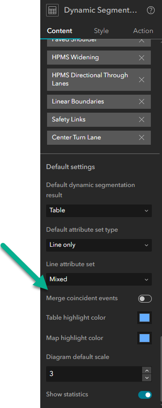
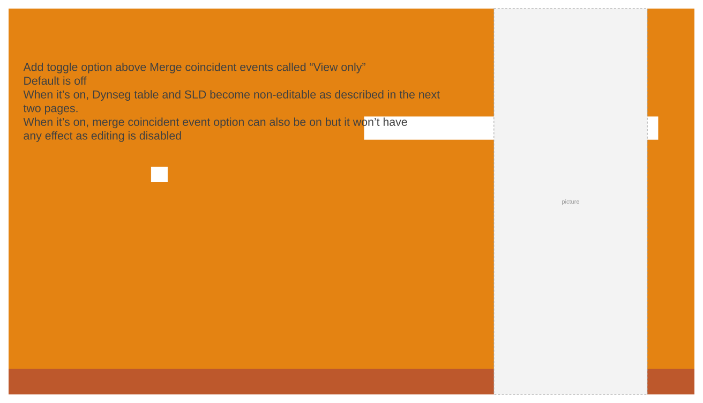
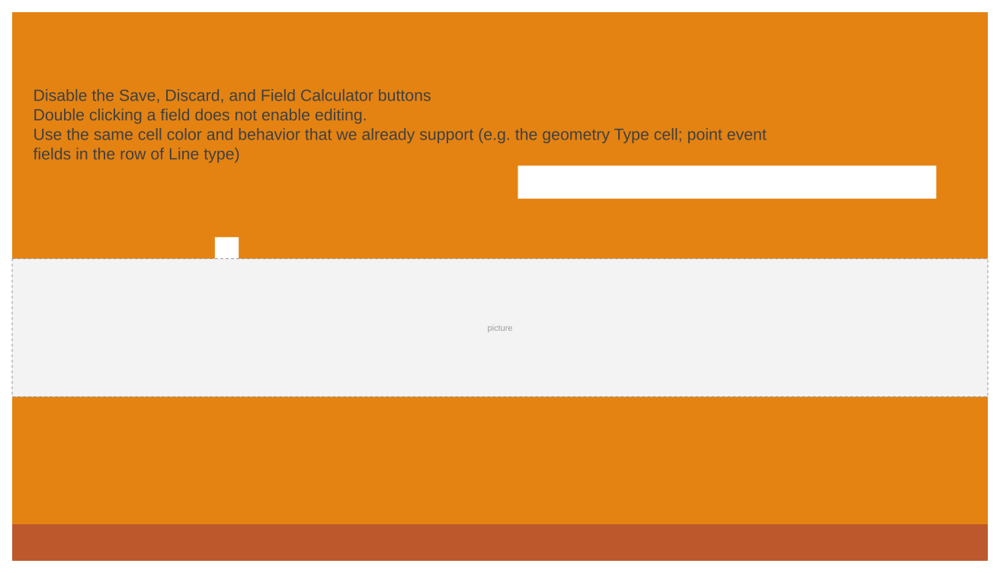
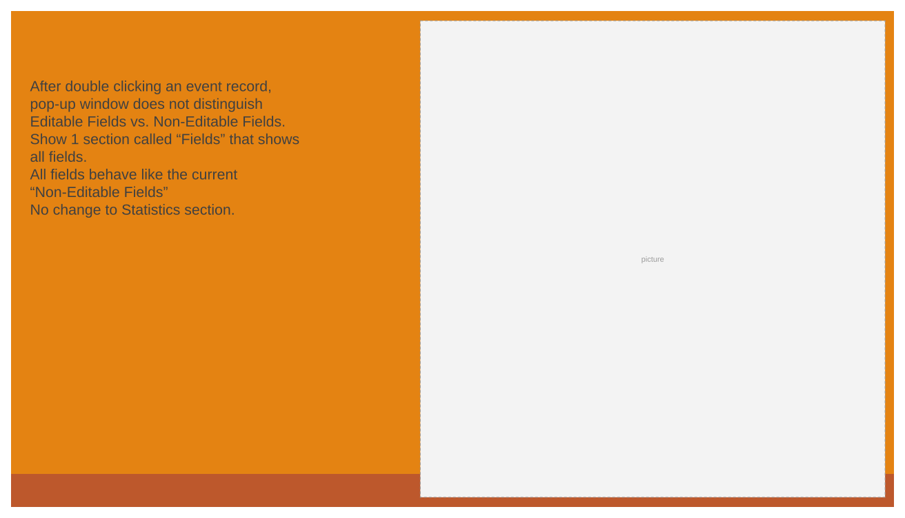
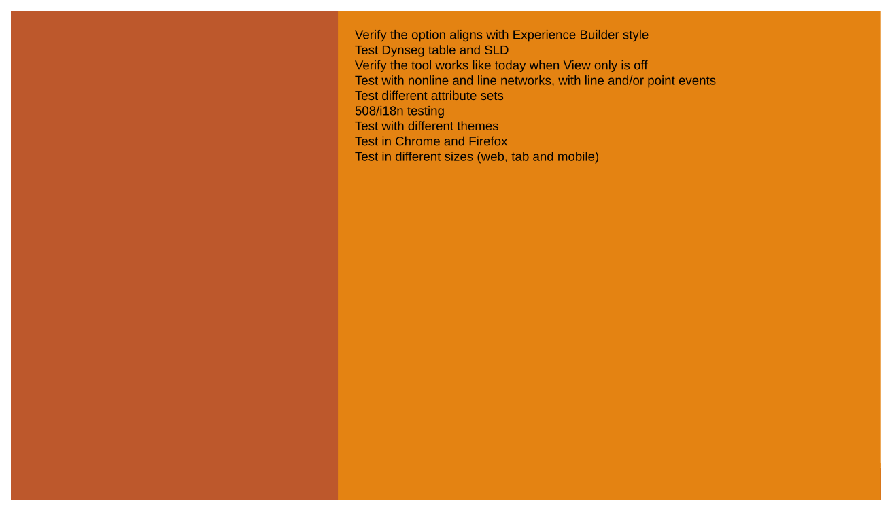
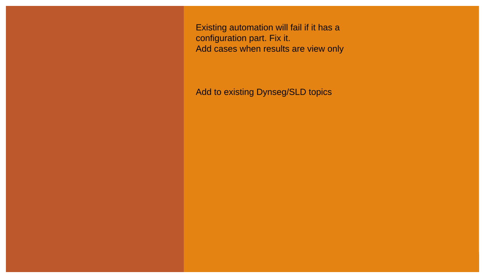
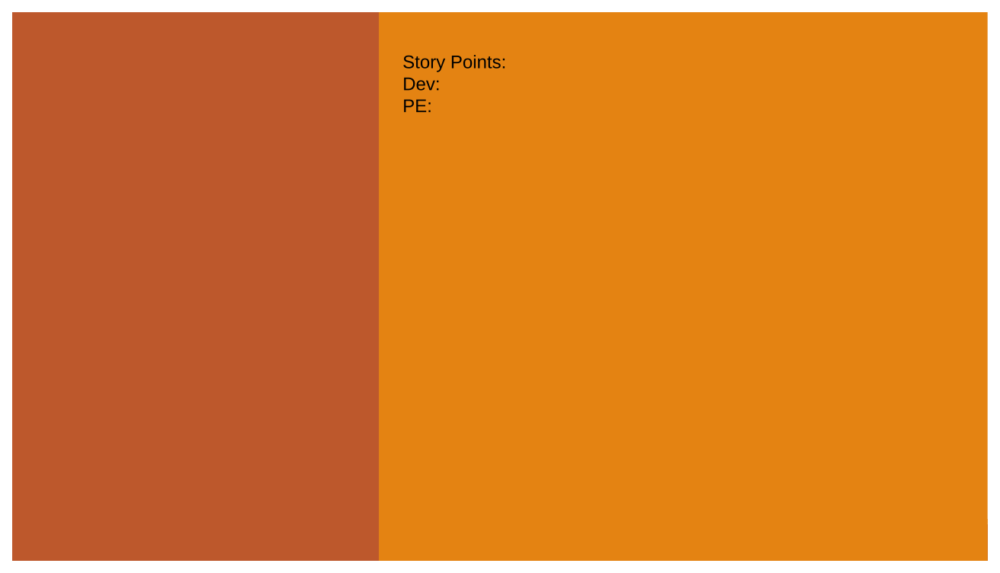

# View only DynSeg and SLD User Story

| Field | Value |
| --- | --- |
| **Doc** | 189 · User Story · Experience Builder |
| **Product** | — |
| **Release** | — |
| **Issues** | — |
| **Source** | [UneditableDynSegSLD.pptx](<https://esriis.sharepoint.com/sites/LocationReferencing/Shared%20Documents/General/UneditableDynSegSLD.pptx>) |
| **People** | author Praveen Kumar · PE — · dev — |
| **Edited** | 2025-04-17 15:43 by Claire Wang |
| **Extracted** | 2026-09-04 · lane xmlstrip · format 3.0 · prompt v2.0.2 |
| **Keywords** | dynamic segmentation · straight line diagram · view only · event editing · experience builder · configuration · user story |
| **Tools** | DynSeg · Straight Line Diagram |

## Summary

Describes a user story for configuring a view only option in the DynSeg/SLD widget to restrict editing of LRS event results to authorized editors. Covers configuration details, expected widget behavior when view only is enabled, and testing requirements across different networks, attribute sets, and platforms.

## Related documents

<!-- related:begin -->
- [View-only (non editable) DynSeg / SLD in Experience Builder – test plan](<https://esriis.sharepoint.com/sites/lrsworkspace/LRS Doc Index/Test Plans/20071-view-only-non-editable-dynseg-sld-in-exb.md>) — similar text 0.47 · 4 title words · 2 filename words · same surface <!-- rel:161 s=6.139 -->
- [Include Intersections in Straight Line Diagram (SLD) User Story](<https://esriis.sharepoint.com/sites/lrsworkspace/LRS%20Doc%20Index/User%20Stories/include-intersections-in-sld-sld.md>) — similar text 0.30 · 1 title word · 1 filename word · same kind/surface/folder <!-- rel:183 s=4.142 -->
- [Include Site Addresses Layer in Straight Line Diagram](<https://esriis.sharepoint.com/sites/lrsworkspace/LRS Doc Index/User Stories/include-site-addresses-layer-in-sld.md>) — similar text 0.31 · 1 filename word · same kind/surface/folder <!-- rel:181 s=3.568 -->
- [Include Centerlines in Straight Line Diagram](<https://esriis.sharepoint.com/sites/lrsworkspace/LRS Doc Index/User Stories/include-centerlines-in-sld.md>) — similar text 0.32 · 1 filename word · same kind/surface/folder <!-- rel:182 s=3.502 -->
- [Experience Builder SLD Interaction with Map](<https://esriis.sharepoint.com/sites/lrsworkspace/LRS Doc Index/User Stories/exb-sld-interaction-with-map.md>) — similar text 0.15 · 1 title word · 1 filename word · same kind/surface/folder <!-- rel:191 s=3.484 -->
<!-- related:end -->

<!-- docs:begin -->
## Esri documentation

[Apply dynamic segmentation](https://doc.esri.com/en/arcgis-pro/latest/help/production/location-referencing-pipelines/apply-dynamic-segmentation.html) · [Event editing using the attribute table](https://doc.esri.com/en/arcgis-pro/latest/help/production/location-referencing-pipelines/event-editing-using-the-attribute-table.html)

_No page matched:_ [DynSeg](https://www.google.com/search?q=%22DynSeg%22+site%3Adoc.esri.com) · [Straight Line Diagram](https://www.google.com/search?q=%22Straight%20Line%20Diagram%22+site%3Adoc.esri.com)
<!-- docs:end -->

---

## Story
### View only DynSeg and SLD <!-- slide 1 -->
User Story

### User Story <!-- slide 2 -->
As a data administrator, I need the ability to configure editability of the results in DynSeg/SLD widget, so that only LRS event editors can edit those results.
Persona
Data administrator: They create experiences and configure widgets for users in their organization. Those users include event editors, contributors that edit only non-LRS data, QA/QC engineers and viewers, located in different business units/departments than the LRS route editors.

Data admins need to be able to configure a “view only” option in DynSeg/SLD widget, so DynSeg/SLD results are still available for viewing but not editing in the experiences created for those users without LRS editing responsibilities.
Sample workflow:

- A contributor does not have permission to edit LRS data but they retrieve information from SLD results to help update non-LRS data

## Acceptance Criteria
### Configuration <!-- slide 3 -->
- Add toggle option above Merge coincident events called “View only”
  - Default is off
  - When it’s on, Dynseg table and SLD become non-editable as described in the next two pages.
  - When it’s on, merge coincident event option can also be on but it won’t have any effect as editing is disabled

### DynSeg table <!-- slide 4 -->
- Disable the Save, Discard, and Field Calculator buttons
- Double clicking a field does not enable editing.
  - Use the same cell color and behavior that we already support (e.g. the geometry Type cell; point event fields in the row of Line type)

### SLD <!-- slide 5 -->
- After double clicking an event record, pop-up window does not distinguish Editable Fields vs. Non-Editable Fields.
- Show 1 section called “Fields” that shows all fields.
- All fields behave like the current “Non-Editable Fields”
- No change to Statistics section.

## Testing
<!-- slide 6 -->
- Verify the option aligns with Experience Builder style
- Test Dynseg table and SLD
- Verify the tool works like today when View only is off
- Test with nonline and line networks, with line and/or point events
- Test different attribute sets
- 508/i18n testing
- Test with different themes
- Test in Chrome and Firefox
- Test in different sizes (web, tab and mobile)

## Automation
### Automation Documentation <!-- slide 7 -->
Existing automation will fail if it has a configuration part. Fix it.
Add cases when results are view only
Add to existing Dynseg/SLD topics

## Assignment
<!-- slide 8 -->
Story Points:
Dev:
PE:

