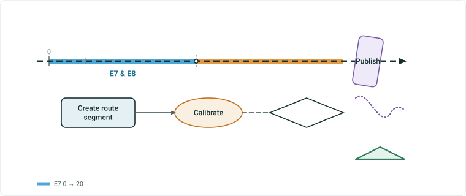

# Route Split Cases

| Field | Value |
| --- | --- |
| **Doc** | 7 · Test Plan · Pro |
| **Product** | Roads & Highways |
| **Release** | — |
| **Issues** | — |
| **Source** | [split.pptx](<https://x/split.pptx>) |
| **People** | author K. Roper · PE — · dev — |
| **Edited** | 2026-08-12 17:03 by K. Roper |
| **Extracted** | 2026-08-13 · lane xmlstrip · format 3.0 · prompt v2.0 |
| **Keywords** | — |
| **Tools** | — |

## Summary

Summary text.

## Case 9 — Loop - Split measure: 20 <!-- slide 3 -->

Case body.

| Event ID | E7 |
| --- | --- |
| Route ID | R7 |
| Split Measure | 20 |

| Sibling Col | zzz |
| --- | --- |
| Sibling Row | 1 |

Steps:

| Step | Action |
| --- | --- |
| step 1 | do the thing |
| step 2 | do the thing |
| step 3 | do the thing |
| step 4 | do the thing |
| step 5 | do the thing |
| step 6 | do the thing |
| step 7 | do the thing |
| step 8 | do the thing |
| step 9 | do the thing |
| step 10 | do the thing |
| step 11 | do the thing |
| step 12 | do the thing |
| step 13 | do the thing |
| step 14 | do the thing |

## Case 10 — other <!-- slide 4 -->

| Other Case | x |
| --- | --- |
| r | 1 |
